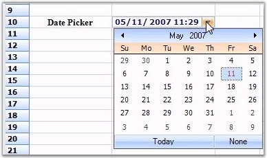

::: {style="DISPLAY: none"}
{#d2h_url_template}{#d2h_package_url style="WIDTH: 0px; DISPLAY: none; HEIGHT: 0px"}
:::

::: {.d2h_secondary_topic style="PADDING-BOTTOM: 10pt; MARGIN: 0pt; PADDING-LEFT: 0pt; PADDING-RIGHT: 0pt; PADDING-TOP: 0pt"}
##### Date Time Picker {#date-time-picker style="tab-stops: 0pt"}

[]{style="FONT-FAMILY: 'Trebuchet MS','sans-serif'; COLOR: #15428b; FONT-SIZE: 9pt"} 

The Date Time Picker cell type can be embedded into a cell as a drop-down container, where the date and time picker will be added in the drop-down. The cell value of the corresponding cell has to be specified as date value. Various formats of the date and time can be provided in the **Format** style property.

 

The following code examples illustrate how to set the cell type to DateTimePicker.

[]{style="FONT-FAMILY: 'Trebuchet MS','sans-serif'; COLOR: #15428b; FONT-SIZE: 9pt"} 

1.   Using C#

[]{style="FONT-FAMILY: 'Trebuchet MS','sans-serif'; COLOR: #15428b; FONT-SIZE: 9pt"} 

+-------------------------------------------------------------------------------------------------------------------------------------------------------------------------------------------------------+
| **[\[C#\]]{style="FONT-FAMILY: 'Courier New'; COLOR: black"}**                                                                                                                                        |
|                                                                                                                                                                                                       |
| []{style="FONT-FAMILY: 'Courier New'; COLOR: black"}                                                                                                                                                  |
|                                                                                                                                                                                                       |
| [RegisterCellModel]{style="FONT-FAMILY: 'Courier New'; COLOR: #2b91af"}[.GridCellType(gridControl1, [CustomCellTypes]{style="COLOR: #2b91af"}.DateTimePicker);]{style="FONT-FAMILY: 'Courier New'"}   |
|                                                                                                                                                                                                       |
| [this]{style="FONT-FAMILY: 'Courier New'; COLOR: blue"}[.gridControl1\[4, 2\].CellType = [CustomCellTypes]{style="COLOR: #2b91af"}.DateTimePicker.ToString();]{style="FONT-FAMILY: 'Courier New'"}    |
|                                                                                                                                                                                                       |
| [this]{style="FONT-FAMILY: 'Courier New'; COLOR: blue"}[.gridControl1\[4, 2\].CellValueType = [typeof]{style="COLOR: blue"}([DateTime]{style="COLOR: #2b91af"});]{style="FONT-FAMILY: 'Courier New'"} |
|                                                                                                                                                                                                       |
| [this]{style="FONT-FAMILY: 'Courier New'; COLOR: blue"}[.gridControl1\[4, 2\].CellValue = [DateTime]{style="COLOR: #2b91af"}.Now;]{style="FONT-FAMILY: 'Courier New'"}                                |
|                                                                                                                                                                                                       |
| [this]{style="FONT-FAMILY: 'Courier New'; COLOR: blue"}[.gridControl1\[4, 2\].Format = [\"MM/dd/yyyy hh:mm\"]{style="COLOR: #a31515"};]{style="FONT-FAMILY: 'Courier New'"}                           |
+-------------------------------------------------------------------------------------------------------------------------------------------------------------------------------------------------------+

[]{style="FONT-FAMILY: 'Trebuchet MS','sans-serif'; COLOR: #15428b; FONT-SIZE: 9pt"} 

2.   Using VB.NET

[]{style="FONT-FAMILY: 'Trebuchet MS','sans-serif'; COLOR: #15428b; FONT-SIZE: 9pt"} 

+-------------------------------------------------------------------------------------------------------------------------------------------------------------------------+
| **[\[VB.NET\]]{style="FONT-FAMILY: 'Courier New'; COLOR: black"}**                                                                                                      |
|                                                                                                                                                                         |
| []{style="FONT-FAMILY: 'Courier New'; COLOR: black"}                                                                                                                    |
|                                                                                                                                                                         |
| [RegisterCellModel.GridCellType([Me]{style="COLOR: blue"}.gridControl1, CustomCellTypes.DateTimePicker)]{style="FONT-FAMILY: 'Courier New'"}                            |
|                                                                                                                                                                         |
| [Me]{style="FONT-FAMILY: 'Courier New'; COLOR: blue"}[.gridControl1(4, 2).CellType = CustomCellTypes.DateTimePicker.ToString()]{style="FONT-FAMILY: 'Courier New'"}     |
|                                                                                                                                                                         |
| [Me]{style="FONT-FAMILY: 'Courier New'; COLOR: blue"}[.gridControl1(4, 2).CellValueType = [GetType]{style="COLOR: blue"}(DateTime)]{style="FONT-FAMILY: 'Courier New'"} |
|                                                                                                                                                                         |
| [Me]{style="FONT-FAMILY: 'Courier New'; COLOR: blue"}[.gridControl1(4, 2).CellValue = DateTime.Now]{style="FONT-FAMILY: 'Courier New'"}                                 |
|                                                                                                                                                                         |
| [Me]{style="FONT-FAMILY: 'Courier New'; COLOR: blue"}[.gridControl1(4, 2).Format = [\"MM/dd/yyyy hh:mm\"]{style="COLOR: #a31515"}]{style="FONT-FAMILY: 'Courier New'"}  |
+-------------------------------------------------------------------------------------------------------------------------------------------------------------------------+

[]{style="FONT-FAMILY: 'Trebuchet MS','sans-serif'; COLOR: #15428b; FONT-SIZE: 9pt"} 

{border="0"}

[]{style="FONT-FAMILY: 'Trebuchet MS','sans-serif'; COLOR: #15428b; FONT-SIZE: 9pt"} 

*[Figure ]{style="FONT-SIZE: 9pt"}[108]{style="FONT-SIZE: 9pt"}[: Date Time Picker Cell]{style="FONT-SIZE: 9pt"}*

 

[]{#p97}[                                                                     ]{style="FONT-FAMILY: 'Trebuchet MS','sans-serif'; COLOR: #15428b; FONT-SIZE: 9pt"}

[]{style="FONT-FAMILY: 'Trebuchet MS','sans-serif'; COLOR: #15428b; FONT-SIZE: 9pt"} 

[]{#related-topics}
:::
