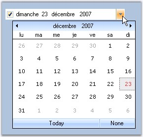

::: {style="DISPLAY: none"}
{#d2h_url_template}{#d2h_package_url style="WIDTH: 0px; DISPLAY: none; HEIGHT: 0px"}
:::

::: {.d2h_secondary_topic style="PADDING-BOTTOM: 10pt; MARGIN: 0pt; PADDING-LEFT: 0pt; PADDING-RIGHT: 0pt; PADDING-TOP: 0pt"}
#### DateTimePickerAdv {#datetimepickeradv style="tab-stops: 0pt"}

[]{style="COLOR: #15428b"} 

DateTimePickerAdv is an advanced DateTimePicker control. It provides an easy way to implement a culture-based DateTimePicker in an application. It has support for a string to be displayed when the user doesn\'t want a specific date selected. It also supports dropping down a custom window and interacts with its controls if a user chooses to implement the IDateTimePickerAdvCalendar interface. The control comes variety of visual style including Office2007 styles.

[]{style="COLOR: #15428b"} 

{border="0"}

**[]{style="COLOR: black"}** 

Figure 248: DateTimePickerAdv with Globalization Support

**[]{style="COLOR: #15428b"}** 

See Also

[]{style="COLOR: #15428b"} 

More:

[ ]{#related-topics}

[{border="0" align="absMiddle"}Features](ms-xhelp:///?Id=95e2ae8b-b984-4104-b2d1-9bc049f8806a){style="TEXT-DECORATION: none"}

[{border="0" align="absMiddle"}Creating DateTimePickerAdv](ms-xhelp:///?Id=b566e412-f007-4208-b504-9cd707d68984){style="TEXT-DECORATION: none"}

[{border="0" align="absMiddle"}Concepts and Features](ms-xhelp:///?Id=a25eb20d-60e4-4413-bb2c-537b1f86d3c7){style="TEXT-DECORATION: none"}

[{border="0" align="absMiddle"}DateTimePicker Events](ms-xhelp:///?Id=0af413f6-ddf5-4fc4-967f-366c890119f7){style="TEXT-DECORATION: none"}

[{border="0" align="absMiddle"}Frequently Asked Questions](ms-xhelp:///?Id=0a270ad0-27c1-4a10-b41f-c4a188dcb966){style="TEXT-DECORATION: none"}
:::
