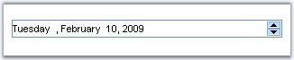

::: {style="DISPLAY: none"}
{#d2h_url_template}{#d2h_package_url style="WIDTH: 0px; DISPLAY: none; HEIGHT: 0px"}
:::

::: {.d2h_secondary_topic style="PADDING-BOTTOM: 10pt; MARGIN: 0pt; PADDING-LEFT: 0pt; PADDING-RIGHT: 0pt; PADDING-TOP: 0pt"}
#### DateTimeTextBox {#datetimetextbox style="tab-stops: 0pt"}

 

The DateTimeTextBox is a control that displays date and time values within the textbox.

 

{border="0"}

Figure 41: DateTimeTextBox

 

Features

 

[·      ]{style="FONT-FAMILY: Symbol"}Supports client-side validation of key strokes.

[·      ]{style="FONT-FAMILY: Symbol"}Supports setting minimum and maximum values.

[·      ]{style="FONT-FAMILY: Symbol"}Uses globalization features of .NET platform to provide locale-specific formatting.

[]{#p49} 

More:

[ ]{#related-topics}

[{border="0" align="absMiddle"}Creating DateTimeTextBox](ms-xhelp:///?Id=dde16f31-4492-4b29-beb9-b56e278b5884){style="TEXT-DECORATION: none"}

[{border="0" align="absMiddle"}Concepts and Features](ms-xhelp:///?Id=197d19a6-6079-4789-a677-6b728fa82ee9){style="TEXT-DECORATION: none"}

[{border="0" align="absMiddle"}Events](ms-xhelp:///?Id=9531ebbf-15fb-4819-bceb-1690ba6a72b4){style="TEXT-DECORATION: none"}
:::
