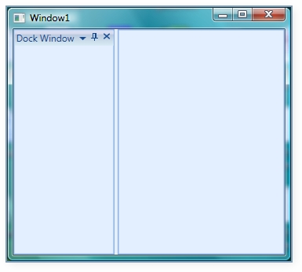
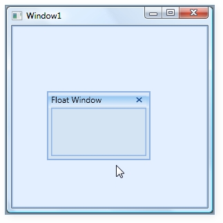
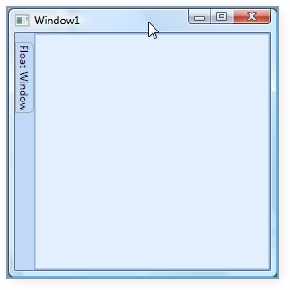
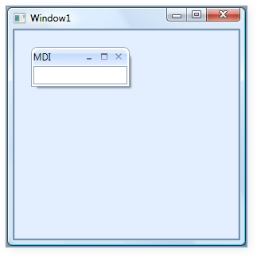
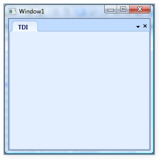

::: {style="DISPLAY: none"}
{#d2h_url_template}{#d2h_package_url style="WIDTH: 0px; DISPLAY: none; HEIGHT: 0px"}
:::

::: {.d2h_secondary_topic style="PADDING-BOTTOM: 10pt; MARGIN: 0pt; PADDING-LEFT: 0pt; PADDING-RIGHT: 0pt; PADDING-TOP: 0pt"}
##### Dealing with States {#dealing-with-states style="tab-stops: 0pt"}

States of child is nothing but a different appearance of the **DockingManager** children.  **State Property** in **DockingManage**r is used to set various states to the child element such as Docking, Floating, Auto Hide, Hidden.

Dock State:

Dock State is a state which represents the child as **Dock Window** as shown below:

 

+--------------------------------------------------------------------------------------------------------------------------------------------------------------------------------------------------------------------------------------------------------------------------------------------------------------------------------------------------------------------------------------------------------------------------------------------------------------------------------------------------------------------------------------------------------------------------------------------------------------------------------------------------------------------------------------------------------------------------------------------------------------------------------------------------------------------------------------------------------------------+
| **[\[XAML\]]{style="FONT-FAMILY: 'Times New Roman','serif'; FONT-SIZE: 12pt"}**                                                                                                                                                                                                                                                                                                                                                                                                                                                                                                                                                                                                                                                                                                                                                                                    |
|                                                                                                                                                                                                                                                                                                                                                                                                                                                                                                                                                                                                                                                                                                                                                                                                                                                                    |
| [\<]{style="FONT-FAMILY: 'Courier New'; COLOR: blue"}[syncfusion]{style="FONT-FAMILY: 'Courier New'; COLOR: #a31515"}[:]{style="FONT-FAMILY: 'Courier New'; COLOR: blue"}**[DockingManager]{style="FONT-FAMILY: 'Courier New'; COLOR: #a31515"}**[\>]{style="FONT-FAMILY: 'Courier New'; COLOR: blue"}                                                                                                                                                                                                                                                                                                                                                                                                                                                                                                                                                             |
|                                                                                                                                                                                                                                                                                                                                                                                                                                                                                                                                                                                                                                                                                                                                                                                                                                                                    |
| [\<]{style="FONT-FAMILY: 'Courier New'; COLOR: blue"}[Grid]{style="FONT-FAMILY: 'Courier New'; COLOR: #a31515"}[ Name]{style="FONT-FAMILY: 'Courier New'; COLOR: red"}[=\"grid1\"]{style="FONT-FAMILY: 'Courier New'; COLOR: blue"}[ syncfusion]{style="FONT-FAMILY: 'Courier New'; COLOR: red"}[:]{style="FONT-FAMILY: 'Courier New'; COLOR: blue"}**[DockingManager]{style="FONT-FAMILY: 'Courier New'; COLOR: red"}**[.State]{style="FONT-FAMILY: 'Courier New'; COLOR: red"}[=\"Dock\"]{style="FONT-FAMILY: 'Courier New'; COLOR: blue"}[   syncfusion]{style="FONT-FAMILY: 'Courier New'; COLOR: red"}[:]{style="FONT-FAMILY: 'Courier New'; COLOR: blue"}**[DockingManager]{style="FONT-FAMILY: 'Courier New'; COLOR: red"}**[.Header]{style="FONT-FAMILY: 'Courier New'; COLOR: red"}[=\"Dock Window\"/\>]{style="FONT-FAMILY: 'Courier New'; COLOR: blue"} |
|                                                                                                                                                                                                                                                                                                                                                                                                                                                                                                                                                                                                                                                                                                                                                                                                                                                                    |
| [\</]{style="FONT-FAMILY: 'Courier New'; COLOR: blue"}[syncfusion]{style="FONT-FAMILY: 'Courier New'; COLOR: #a31515"}[:]{style="FONT-FAMILY: 'Courier New'; COLOR: blue"}**[DockingManager]{style="FONT-FAMILY: 'Courier New'; COLOR: #a31515"}**[\>]{style="FONT-FAMILY: 'Courier New'; COLOR: blue"}                                                                                                                                                                                                                                                                                                                                                                                                                                                                                                                                                            |
+--------------------------------------------------------------------------------------------------------------------------------------------------------------------------------------------------------------------------------------------------------------------------------------------------------------------------------------------------------------------------------------------------------------------------------------------------------------------------------------------------------------------------------------------------------------------------------------------------------------------------------------------------------------------------------------------------------------------------------------------------------------------------------------------------------------------------------------------------------------------+

[]{style="FONT-FAMILY: 'Times New Roman','serif'; FONT-SIZE: 12pt"} 

+-----------------------------------------------------------------------------------------------------------------------------------------------------------------------------------------------------------------------------------------------+
| **[\[C#\]]{style="FONT-FAMILY: 'Times New Roman','serif'; FONT-SIZE: 12pt"}**                                                                                                                                                                 |
|                                                                                                                                                                                                                                               |
| **[DockingManager]{style="FONT-FAMILY: 'Courier New'; COLOR: #2b91af"}**[.SetHeader(grid1,[\"Dock Window\"]{style="COLOR: #a31515"});]{style="FONT-FAMILY: 'Courier New'"}[]{style="FONT-FAMILY: 'Times New Roman','serif'; FONT-SIZE: 12pt"} |
|                                                                                                                                                                                                                                               |
| **[DockingManager]{style="FONT-FAMILY: 'Courier New'; COLOR: #2b91af"}**[.SetState(grid1, [DockState]{style="COLOR: #2b91af"}.Dock);]{style="FONT-FAMILY: 'Courier New'"}[]{style="FONT-FAMILY: 'Times New Roman','serif'; FONT-SIZE: 12pt"}  |
+-----------------------------------------------------------------------------------------------------------------------------------------------------------------------------------------------------------------------------------------------+

 

{border="0"}

Figure 308: Illustrating DockState of child

[]{style="FONT-FAMILY: 'Times New Roman','serif'; FONT-SIZE: 12pt"} 

Float State:

Float State displays the child in FloatWindow as shown below:

+-----------------------------------------------------------------------------------------------------------------------------------------------------------------------------------------------------------------------------------------------------------------------------------------------------------------------------------------------------------------------------------------------------------------------------------------------------------------------------------------------------------------------------------------------------------------------------------------------------------+
| **[\[XAML\]]{style="FONT-FAMILY: 'Times New Roman','serif'; FONT-SIZE: 12pt"}**                                                                                                                                                                                                                                                                                                                                                                                                                                                                                                                           |
|                                                                                                                                                                                                                                                                                                                                                                                                                                                                                                                                                                                                           |
| [\<]{style="FONT-FAMILY: 'Courier New'; COLOR: blue"}[syncfusion]{style="FONT-FAMILY: 'Courier New'; COLOR: #a31515"}[:]{style="FONT-FAMILY: 'Courier New'; COLOR: blue"}**[DockingManager]{style="FONT-FAMILY: 'Courier New'; COLOR: #a31515"}**[\>]{style="FONT-FAMILY: 'Courier New'; COLOR: blue"}                                                                                                                                                                                                                                                                                                    |
|                                                                                                                                                                                                                                                                                                                                                                                                                                                                                                                                                                                                           |
| [   ]{style="FONT-FAMILY: 'Courier New'; COLOR: #a31515"}[\<]{style="FONT-FAMILY: 'Courier New'; COLOR: blue"}[Grid]{style="FONT-FAMILY: 'Courier New'; COLOR: #a31515"}[ Name]{style="FONT-FAMILY: 'Courier New'; COLOR: red"}[=\"grid1\"]{style="FONT-FAMILY: 'Courier New'; COLOR: blue"}[ syncfusion]{style="FONT-FAMILY: 'Courier New'; COLOR: red"}[:]{style="FONT-FAMILY: 'Courier New'; COLOR: blue"}**[DockingManager]{style="FONT-FAMILY: 'Courier New'; COLOR: red"}**[.State]{style="FONT-FAMILY: 'Courier New'; COLOR: red"}[=\"Float\"/\>]{style="FONT-FAMILY: 'Courier New'; COLOR: blue"} |
|                                                                                                                                                                                                                                                                                                                                                                                                                                                                                                                                                                                                           |
| [\</]{style="FONT-FAMILY: 'Courier New'; COLOR: blue"}[syncfusion]{style="FONT-FAMILY: 'Courier New'; COLOR: #a31515"}[:]{style="FONT-FAMILY: 'Courier New'; COLOR: blue"}**[DockingManager]{style="FONT-FAMILY: 'Courier New'; COLOR: #a31515"}**[\>]{style="FONT-FAMILY: 'Courier New'; COLOR: blue"}                                                                                                                                                                                                                                                                                                   |
+-----------------------------------------------------------------------------------------------------------------------------------------------------------------------------------------------------------------------------------------------------------------------------------------------------------------------------------------------------------------------------------------------------------------------------------------------------------------------------------------------------------------------------------------------------------------------------------------------------------+

[]{style="FONT-FAMILY: 'Times New Roman','serif'; FONT-SIZE: 12pt"} 

+-----------------------------------------------------------------------------------------------------------------------------------------------------------------------------------------------------------------------------------------------+
| **[\[C#\]]{style="FONT-FAMILY: 'Times New Roman','serif'; FONT-SIZE: 12pt"}**                                                                                                                                                                 |
|                                                                                                                                                                                                                                               |
| **[DockingManager]{style="FONT-FAMILY: 'Courier New'; COLOR: #2b91af"}**[.SetState(grid1, [DockState]{style="COLOR: #2b91af"}.Float);]{style="FONT-FAMILY: 'Courier New'"}[]{style="FONT-FAMILY: 'Times New Roman','serif'; FONT-SIZE: 12pt"} |
+-----------------------------------------------------------------------------------------------------------------------------------------------------------------------------------------------------------------------------------------------+

[]{style="FONT-FAMILY: 'Times New Roman','serif'; FONT-SIZE: 12pt"} 

[]{style="FONT-FAMILY: 'Times New Roman','serif'; FONT-SIZE: 12pt"} 

{border="0"}

Figure 309:Illustrating Float State[]{style="FONT-FAMILY: 'Times New Roman','serif'; FONT-SIZE: 12pt"}

[]{style="FONT-FAMILY: 'Times New Roman','serif'; FONT-SIZE: 12pt"} 

Auto Hidden State:

Auto hidden state hides the children in one of the side panels available with the **DockingManager**.

+----------------------------------------------------------------------------------------------------------------------------------------------------------------------------------------------------------------------------------------------------------------------------------------------------------------------------------------------------------------------------------------------------------------------------------------------------------------------------------------------------------------------------------------------------------------------------------------------------------------+
| **[\[XAML\]]{style="FONT-FAMILY: 'Times New Roman','serif'; FONT-SIZE: 12pt"}**                                                                                                                                                                                                                                                                                                                                                                                                                                                                                                                                |
|                                                                                                                                                                                                                                                                                                                                                                                                                                                                                                                                                                                                                |
| [\<]{style="FONT-FAMILY: 'Courier New'; COLOR: blue"}[syncfusion]{style="FONT-FAMILY: 'Courier New'; COLOR: #a31515"}[:]{style="FONT-FAMILY: 'Courier New'; COLOR: blue"}**[DockingManager]{style="FONT-FAMILY: 'Courier New'; COLOR: #a31515"}**[\>]{style="FONT-FAMILY: 'Courier New'; COLOR: blue"}                                                                                                                                                                                                                                                                                                         |
|                                                                                                                                                                                                                                                                                                                                                                                                                                                                                                                                                                                                                |
| [   ]{style="FONT-FAMILY: 'Courier New'; COLOR: #a31515"}[\<]{style="FONT-FAMILY: 'Courier New'; COLOR: blue"}[Grid]{style="FONT-FAMILY: 'Courier New'; COLOR: #a31515"}[ Name]{style="FONT-FAMILY: 'Courier New'; COLOR: red"}[=\"grid1\"]{style="FONT-FAMILY: 'Courier New'; COLOR: blue"}[ syncfusion]{style="FONT-FAMILY: 'Courier New'; COLOR: red"}[:]{style="FONT-FAMILY: 'Courier New'; COLOR: blue"}**[DockingManager]{style="FONT-FAMILY: 'Courier New'; COLOR: red"}**[.State]{style="FONT-FAMILY: 'Courier New'; COLOR: red"}[=\"AutoHidden\"/\>]{style="FONT-FAMILY: 'Courier New'; COLOR: blue"} |
|                                                                                                                                                                                                                                                                                                                                                                                                                                                                                                                                                                                                                |
| [\</]{style="FONT-FAMILY: 'Courier New'; COLOR: blue"}[syncfusion]{style="FONT-FAMILY: 'Courier New'; COLOR: #a31515"}[:]{style="FONT-FAMILY: 'Courier New'; COLOR: blue"}**[DockingManager]{style="FONT-FAMILY: 'Courier New'; COLOR: #a31515"}**[\>]{style="FONT-FAMILY: 'Courier New'; COLOR: blue"}                                                                                                                                                                                                                                                                                                        |
+----------------------------------------------------------------------------------------------------------------------------------------------------------------------------------------------------------------------------------------------------------------------------------------------------------------------------------------------------------------------------------------------------------------------------------------------------------------------------------------------------------------------------------------------------------------------------------------------------------------+

[]{style="FONT-FAMILY: 'Times New Roman','serif'; FONT-SIZE: 12pt"} 

+----------------------------------------------------------------------------------------------------------------------------------------------------------------------------------------------------------------------------------------------------+
| **[\[C#\]]{style="FONT-FAMILY: 'Times New Roman','serif'; FONT-SIZE: 12pt"}**                                                                                                                                                                      |
|                                                                                                                                                                                                                                                    |
| **[DockingManager]{style="FONT-FAMILY: 'Courier New'; COLOR: #2b91af"}**[.SetState(grid1, [DockState]{style="COLOR: #2b91af"}.AutoHidden);]{style="FONT-FAMILY: 'Courier New'"}[]{style="FONT-FAMILY: 'Times New Roman','serif'; FONT-SIZE: 12pt"} |
+----------------------------------------------------------------------------------------------------------------------------------------------------------------------------------------------------------------------------------------------------+

[]{style="FONT-FAMILY: 'Times New Roman','serif'; FONT-SIZE: 12pt"} 

{border="0"}

Figure 310: Illustrates AutoHidden State[]{style="FONT-FAMILY: 'Times New Roman','serif'; FONT-SIZE: 12pt"}

 

###### []{#_Document_State_Child}3.14.5.1.1.1        Document State Child {#document-state-child style="tab-stops: 0pt"}

 

The Document state is the child's children, which can be displayed as a Tabbed document or (Multiple Document Interface) MDI.

Document State Child can be of two types.

 

[·      ]{style="FONT-FAMILY: Symbol"}TDI (Tabbed Document Interface)

[·      ]{style="FONT-FAMILY: Symbol"}MDI (Multiple Document Interface)

 

You can create MDI Documents by specifying **ContainerMode** to MDI as a child state,and as Document , as shown below.

+--------------------------------------------------------------------------------------------------------------------------------------------------------------------------------------------------------------------------------------------------------------------------------------------------------------------------------------------------------------------------------------------------------------------------------------------------------------------------------------------------------------------------------------------------------------------------------------------------------------------------------------------------------------------------------------------------------------------------------------------------------------------------------------------------------------------------------------------------------------+
| **[\[XAML\]]{style="FONT-FAMILY: 'Times New Roman','serif'; FONT-SIZE: 12pt"}**                                                                                                                                                                                                                                                                                                                                                                                                                                                                                                                                                                                                                                                                                                                                                                              |
|                                                                                                                                                                                                                                                                                                                                                                                                                                                                                                                                                                                                                                                                                                                                                                                                                                                              |
| [\<]{style="FONT-FAMILY: 'Courier New'; COLOR: blue"}[syncfusion]{style="FONT-FAMILY: 'Courier New'; COLOR: #a31515"}[:]{style="FONT-FAMILY: 'Courier New'; COLOR: blue"}**[DockingManager]{style="FONT-FAMILY: 'Courier New'; COLOR: #a31515"}**[ UseDocumentContainer]{style="FONT-FAMILY: 'Courier New'; COLOR: red"}[=\"True\"]{style="FONT-FAMILY: 'Courier New'; COLOR: blue"}[ ContainerMode]{style="FONT-FAMILY: 'Courier New'; COLOR: red"}[=\"MDI\"\>]{style="FONT-FAMILY: 'Courier New'; COLOR: blue"}                                                                                                                                                                                                                                                                                                                                            |
|                                                                                                                                                                                                                                                                                                                                                                                                                                                                                                                                                                                                                                                                                                                                                                                                                                                              |
| []{style="FONT-FAMILY: 'Courier New'; COLOR: #a31515"}                                                                                                                                                                                                                                                                                                                                                                                                                                                                                                                                                                                                                                                                                                                                                                                                       |
|                                                                                                                                                                                                                                                                                                                                                                                                                                                                                                                                                                                                                                                                                                                                                                                                                                                              |
| [\<]{style="FONT-FAMILY: 'Courier New'; COLOR: blue"}[Grid]{style="FONT-FAMILY: 'Courier New'; COLOR: #a31515"}[ Name]{style="FONT-FAMILY: 'Courier New'; COLOR: red"}[=\"grid1\"]{style="FONT-FAMILY: 'Courier New'; COLOR: blue"}[ syncfusion]{style="FONT-FAMILY: 'Courier New'; COLOR: red"}[:]{style="FONT-FAMILY: 'Courier New'; COLOR: blue"}**[DockingManager]{style="FONT-FAMILY: 'Courier New'; COLOR: red"}**[.State]{style="FONT-FAMILY: 'Courier New'; COLOR: red"}[=\"Document\"]{style="FONT-FAMILY: 'Courier New'; COLOR: blue"}[ syncfusion]{style="FONT-FAMILY: 'Courier New'; COLOR: red"}[:]{style="FONT-FAMILY: 'Courier New'; COLOR: blue"}**[DockingManager]{style="FONT-FAMILY: 'Courier New'; COLOR: red"}**[.Header]{style="FONT-FAMILY: 'Courier New'; COLOR: red"}[=\"MDI\"/\>]{style="FONT-FAMILY: 'Courier New'; COLOR: blue"} |
|                                                                                                                                                                                                                                                                                                                                                                                                                                                                                                                                                                                                                                                                                                                                                                                                                                                              |
| []{style="FONT-FAMILY: 'Courier New'; COLOR: blue"}                                                                                                                                                                                                                                                                                                                                                                                                                                                                                                                                                                                                                                                                                                                                                                                                          |
|                                                                                                                                                                                                                                                                                                                                                                                                                                                                                                                                                                                                                                                                                                                                                                                                                                                              |
| [\</]{style="FONT-FAMILY: 'Courier New'; COLOR: blue"}[syncfusion]{style="FONT-FAMILY: 'Courier New'; COLOR: #a31515"}[:]{style="FONT-FAMILY: 'Courier New'; COLOR: blue"}**[DockingManager]{style="FONT-FAMILY: 'Courier New'; COLOR: #a31515"}**[\>]{style="FONT-FAMILY: 'Courier New'; COLOR: blue"}                                                                                                                                                                                                                                                                                                                                                                                                                                                                                                                                                      |
+--------------------------------------------------------------------------------------------------------------------------------------------------------------------------------------------------------------------------------------------------------------------------------------------------------------------------------------------------------------------------------------------------------------------------------------------------------------------------------------------------------------------------------------------------------------------------------------------------------------------------------------------------------------------------------------------------------------------------------------------------------------------------------------------------------------------------------------------------------------+

[]{style="FONT-FAMILY: 'Times New Roman','serif'; FONT-SIZE: 12pt"} 

+---------------------------------------------------------------------------------------------------------------------------------------------------------------------------------------------------+
| **[\[C#\]]{style="FONT-FAMILY: 'Times New Roman','serif'; FONT-SIZE: 12pt"}[ ]{style="FONT-FAMILY: 'Courier New'"}**                                                                              |
|                                                                                                                                                                                                   |
| []{style="FONT-FAMILY: 'Courier New'"}                                                                                                                                                            |
|                                                                                                                                                                                                   |
| **[DockingManager]{style="FONT-FAMILY: 'Courier New'; COLOR: #2b91af"}**[ manager=[new]{style="COLOR: blue"} **[DockingManager]{style="COLOR: #2b91af"}**();]{style="FONT-FAMILY: 'Courier New'"} |
|                                                                                                                                                                                                   |
| [manager.UseDocumentContainer = [true]{style="COLOR: blue"};]{style="FONT-FAMILY: 'Courier New'"}                                                                                                 |
|                                                                                                                                                                                                   |
| [manager.ContainerMode = [DocumentContainerMode]{style="COLOR: #2b91af"}.MDI;]{style="FONT-FAMILY: 'Courier New'"}                                                                                |
|                                                                                                                                                                                                   |
| [Grid]{style="FONT-FAMILY: 'Courier New'; COLOR: #2b91af"}[ child=[new]{style="COLOR: blue"} [Grid]{style="COLOR: #2b91af"}();]{style="FONT-FAMILY: 'Courier New'"}                               |
|                                                                                                                                                                                                   |
| **[DockingManager]{style="FONT-FAMILY: 'Courier New'; COLOR: #2b91af"}**[.SetHeader(child, [\"MDI\"]{style="COLOR: #a31515"});]{style="FONT-FAMILY: 'Courier New'"}                               |
|                                                                                                                                                                                                   |
| **[DockingManager]{style="FONT-FAMILY: 'Courier New'; COLOR: #2b91af"}**[.SetState(child,[DockState]{style="COLOR: #2b91af"}.Document);]{style="FONT-FAMILY: 'Courier New'"}                      |
|                                                                                                                                                                                                   |
| [manager.Children.Add(child);]{style="FONT-FAMILY: 'Courier New'"}                                                                                                                                |
+---------------------------------------------------------------------------------------------------------------------------------------------------------------------------------------------------+

[]{style="FONT-FAMILY: 'Times New Roman','serif'; FONT-SIZE: 12pt"} 

{border="0"}

Figure 311: MDI Mode

 

Similarly you can create a TDI Document by specifying **ContainerMode** as TDI and child state as document.

+--------------------------------------------------------------------------------------------------------------------------------------------------------------------------------------------------------------------------------------------------------------------------------------------------------------------------------------------------------------------------------------------------------------------------------------------------------------------------------------------------------------------------------------------------------------------------------------------------------------------------------------------------------------------------------------------------------------------------------------------------------------------------------------------------------------------------------------------------------------+
| **[\[XAML\]]{style="FONT-FAMILY: 'Times New Roman','serif'; FONT-SIZE: 12pt"}**                                                                                                                                                                                                                                                                                                                                                                                                                                                                                                                                                                                                                                                                                                                                                                              |
|                                                                                                                                                                                                                                                                                                                                                                                                                                                                                                                                                                                                                                                                                                                                                                                                                                                              |
| [\<]{style="FONT-FAMILY: 'Courier New'; COLOR: blue"}[syncfusion]{style="FONT-FAMILY: 'Courier New'; COLOR: #a31515"}[:]{style="FONT-FAMILY: 'Courier New'; COLOR: blue"}**[DockingManager]{style="FONT-FAMILY: 'Courier New'; COLOR: #a31515"}**[ UseDocumentContainer]{style="FONT-FAMILY: 'Courier New'; COLOR: red"}[=\"True\"]{style="FONT-FAMILY: 'Courier New'; COLOR: blue"}[ ContainerMode]{style="FONT-FAMILY: 'Courier New'; COLOR: red"}[=\"TDI\"\>]{style="FONT-FAMILY: 'Courier New'; COLOR: blue"}                                                                                                                                                                                                                                                                                                                                            |
|                                                                                                                                                                                                                                                                                                                                                                                                                                                                                                                                                                                                                                                                                                                                                                                                                                                              |
| []{style="FONT-FAMILY: 'Courier New'; COLOR: #a31515"}                                                                                                                                                                                                                                                                                                                                                                                                                                                                                                                                                                                                                                                                                                                                                                                                       |
|                                                                                                                                                                                                                                                                                                                                                                                                                                                                                                                                                                                                                                                                                                                                                                                                                                                              |
| [\<]{style="FONT-FAMILY: 'Courier New'; COLOR: blue"}[Grid]{style="FONT-FAMILY: 'Courier New'; COLOR: #a31515"}[ Name]{style="FONT-FAMILY: 'Courier New'; COLOR: red"}[=\"grid1\"]{style="FONT-FAMILY: 'Courier New'; COLOR: blue"}[ syncfusion]{style="FONT-FAMILY: 'Courier New'; COLOR: red"}[:]{style="FONT-FAMILY: 'Courier New'; COLOR: blue"}**[DockingManager]{style="FONT-FAMILY: 'Courier New'; COLOR: red"}**[.State]{style="FONT-FAMILY: 'Courier New'; COLOR: red"}[=\"Document\"]{style="FONT-FAMILY: 'Courier New'; COLOR: blue"}[ syncfusion]{style="FONT-FAMILY: 'Courier New'; COLOR: red"}[:]{style="FONT-FAMILY: 'Courier New'; COLOR: blue"}**[DockingManager]{style="FONT-FAMILY: 'Courier New'; COLOR: red"}**[.Header]{style="FONT-FAMILY: 'Courier New'; COLOR: red"}[=\"TDI\"/\>]{style="FONT-FAMILY: 'Courier New'; COLOR: blue"} |
|                                                                                                                                                                                                                                                                                                                                                                                                                                                                                                                                                                                                                                                                                                                                                                                                                                                              |
| []{style="FONT-FAMILY: 'Courier New'; COLOR: blue"}                                                                                                                                                                                                                                                                                                                                                                                                                                                                                                                                                                                                                                                                                                                                                                                                          |
|                                                                                                                                                                                                                                                                                                                                                                                                                                                                                                                                                                                                                                                                                                                                                                                                                                                              |
| [\</]{style="FONT-FAMILY: 'Courier New'; COLOR: blue"}[syncfusion]{style="FONT-FAMILY: 'Courier New'; COLOR: #a31515"}[:]{style="FONT-FAMILY: 'Courier New'; COLOR: blue"}**[DockingManager]{style="FONT-FAMILY: 'Courier New'; COLOR: #a31515"}**[\>]{style="FONT-FAMILY: 'Courier New'; COLOR: blue"}                                                                                                                                                                                                                                                                                                                                                                                                                                                                                                                                                      |
+--------------------------------------------------------------------------------------------------------------------------------------------------------------------------------------------------------------------------------------------------------------------------------------------------------------------------------------------------------------------------------------------------------------------------------------------------------------------------------------------------------------------------------------------------------------------------------------------------------------------------------------------------------------------------------------------------------------------------------------------------------------------------------------------------------------------------------------------------------------+

[]{style="FONT-FAMILY: 'Times New Roman','serif'; FONT-SIZE: 12pt"} 

+---------------------------------------------------------------------------------------------------------------------------------------------------------------------------------------------------+
| **[\[C#\]]{style="FONT-FAMILY: 'Times New Roman','serif'; FONT-SIZE: 12pt"}[ ]{style="FONT-FAMILY: 'Courier New'"}**                                                                              |
|                                                                                                                                                                                                   |
| []{style="FONT-FAMILY: 'Courier New'"}                                                                                                                                                            |
|                                                                                                                                                                                                   |
| **[DockingManager]{style="FONT-FAMILY: 'Courier New'; COLOR: #2b91af"}**[ manager=[new]{style="COLOR: blue"} **[DockingManager]{style="COLOR: #2b91af"}**();]{style="FONT-FAMILY: 'Courier New'"} |
|                                                                                                                                                                                                   |
| [manager.UseDocumentContainer = [true]{style="COLOR: blue"};]{style="FONT-FAMILY: 'Courier New'"}                                                                                                 |
|                                                                                                                                                                                                   |
| [manager.ContainerMode = [DocumentContainerMode]{style="COLOR: #2b91af"}.TDI;]{style="FONT-FAMILY: 'Courier New'"}                                                                                |
|                                                                                                                                                                                                   |
| [Grid]{style="FONT-FAMILY: 'Courier New'; COLOR: #2b91af"}[ child=[new]{style="COLOR: blue"} [Grid]{style="COLOR: #2b91af"}();]{style="FONT-FAMILY: 'Courier New'"}                               |
|                                                                                                                                                                                                   |
| **[DockingManager]{style="FONT-FAMILY: 'Courier New'; COLOR: #2b91af"}**[.SetHeader(child, [\"TDI\"]{style="COLOR: #a31515"});]{style="FONT-FAMILY: 'Courier New'"}                               |
|                                                                                                                                                                                                   |
| **[DockingManager]{style="FONT-FAMILY: 'Courier New'; COLOR: #2b91af"}**[.SetState(child,[DockState]{style="COLOR: #2b91af"}.Document);]{style="FONT-FAMILY: 'Courier New'"}                      |
|                                                                                                                                                                                                   |
| [manager.Children.Add(child);]{style="FONT-FAMILY: 'Courier New'"}                                                                                                                                |
+---------------------------------------------------------------------------------------------------------------------------------------------------------------------------------------------------+

 

{border="0"}

Figure 312: TDI Mode

 

Refer Also:

[[How to Create Docking Manager]{.UGHyperlink}](ms-xhelp:///?Id=51b9277d-a660-4a79-8206-03cd1d569b74)[?]{.UGHyperlink}

[[]{style="TEXT-DECORATION: none"}]{.UGHyperlink} 

[]{#related-topics}
:::
