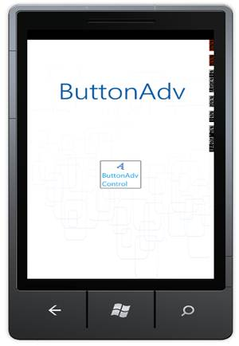
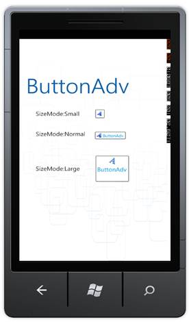
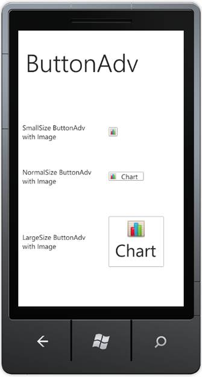

::: {style="DISPLAY: none"}
{#d2h_url_template}{#d2h_package_url style="WIDTH: 0px; DISPLAY: none; HEIGHT: 0px"}
:::

::: {.d2h_secondary_topic style="PADDING-BOTTOM: 10pt; MARGIN: 0pt; PADDING-LEFT: 0pt; PADDING-RIGHT: 0pt; PADDING-TOP: 0pt"}
##### Declaring ButtonAdv {#declaring-buttonadv style="tab-stops: 0pt"}

To include the ButtonAdv control in an application, the following Assembly should be reffered:

[·      ]{style="FONT-FAMILY: Symbol"}Assembly: Syncfusion.Shared.Phone

 

The following Namespace should be reffered in the application page:

[·      ]{style="FONT-FAMILY: Symbol"}Namespace: Syncfusion.Phone.Tools.Controls

###### 4.4.1.2.1    Setting Label {#setting-label style="tab-stops: 0pt"}

The Label property represents the Text content of the ButtonAdv control.

The following code illustrates the declaration of ButtonAdv control using XAML[:]{style="FONT-FAMILY: 'Calibri','sans-serif'"}

+---------------------------------------------------------------------------------------------------------------------------------------------------------------------------------------------------------------------------------------------------------------------------------------------------------------------------------------------------------------------------------------------------------------+
| **[\[XAML\]]{style="FONT-FAMILY: 'Courier New'"}**[]{style="FONT-FAMILY: 'Courier New'; COLOR: blue"}                                                                                                                                                                                                                                                                                                         |
|                                                                                                                                                                                                                                                                                                                                                                                                               |
| []{style="FONT-FAMILY: 'Courier New'; COLOR: blue"}                                                                                                                                                                                                                                                                                                                                                           |
|                                                                                                                                                                                                                                                                                                                                                                                                               |
| [\<]{style="FONT-FAMILY: 'Courier New'; COLOR: blue"}[sync]{style="FONT-FAMILY: 'Courier New'; COLOR: #a31515"}[:]{style="FONT-FAMILY: 'Courier New'; COLOR: blue"}[ButtonAdv]{style="FONT-FAMILY: 'Courier New'; COLOR: #a31515"}[ Label]{style="FONT-FAMILY: 'Courier New'; COLOR: red"}[=\"ButtonAdv\"/\>]{style="FONT-FAMILY: 'Courier New'; COLOR: blue"}[]{style="FONT-FAMILY: 'Calibri','sans-serif'"} |
+---------------------------------------------------------------------------------------------------------------------------------------------------------------------------------------------------------------------------------------------------------------------------------------------------------------------------------------------------------------------------------------------------------------+

[]{style="FONT-FAMILY: 'Calibri','sans-serif'"} 

The ButtonAdv control can be created using C# as follows:

+---------------------------------------------------------------------------------------------------------------------------------------------------------------------------------+
| **[\[C#\][]{style="COLOR: #2b91af"}]{style="FONT-FAMILY: 'Courier New'"}**                                                                                                      |
|                                                                                                                                                                                 |
| []{style="FONT-FAMILY: 'Courier New'; COLOR: #2b91af"}                                                                                                                          |
|                                                                                                                                                                                 |
| [ButtonAdv]{style="FONT-FAMILY: 'Courier New'; COLOR: #2b91af"}[ button = [new]{style="COLOR: blue"} [ButtonAdv]{style="COLOR: #2b91af"}()]{style="FONT-FAMILY: 'Courier New'"} |
|                                                                                                                                                                                 |
| [button.Label = [\"ButtonAdv\"]{style="COLOR: #a31515"};]{style="FONT-FAMILY: 'Courier New'"}[]{style="FONT-FAMILY: 'Calibri','sans-serif'"}                                    |
+---------------------------------------------------------------------------------------------------------------------------------------------------------------------------------+

[]{style="FONT-FAMILY: 'Calibri','sans-serif'"} 

The following screenshot shows the ButtonAdv control placed in Windows Phone Application page:

*{border="0"}*

Figure 33: A typical ButtonAdv Control

 

###### []{#_Setting_Size_Mode_4}4.4.1.2.2    Setting Size Mode {#setting-size-mode style="tab-stops: 0pt"}

The Size Mode of the ButtonAdv control can be easily changed using the SizeMode property. The SizeMode property contains following values:

[·      ]{style="FONT-FAMILY: Symbol"}Small

[·      ]{style="FONT-FAMILY: Symbol"}Normal

[·      ]{style="FONT-FAMILY: Symbol"}Large

 

The following code sets SizeMode to "Small":

 

+---------------------------------------------------------------------------------------------------------------------------------------------------------------------------------------------------------------------------------------------------------------------------------------------------------------------------------------------------------------------------------------------------------------------------------------------------------------------------------------------------------------------------------------+
| **[\[XAML\]]{style="FONT-FAMILY: 'Courier New'"}**[]{style="FONT-FAMILY: 'Courier New'; COLOR: blue"}                                                                                                                                                                                                                                                                                                                                                                                                                                 |
|                                                                                                                                                                                                                                                                                                                                                                                                                                                                                                                                       |
| []{style="FONT-FAMILY: 'Courier New'; COLOR: blue"}                                                                                                                                                                                                                                                                                                                                                                                                                                                                                   |
|                                                                                                                                                                                                                                                                                                                                                                                                                                                                                                                                       |
| [\<]{style="FONT-FAMILY: 'Courier New'; COLOR: blue"}[sync]{style="FONT-FAMILY: 'Courier New'; COLOR: #a31515"}[:]{style="FONT-FAMILY: 'Courier New'; COLOR: blue"}[ButtonAdv]{style="FONT-FAMILY: 'Courier New'; COLOR: #a31515"}[ SizeMode]{style="FONT-FAMILY: 'Courier New'; COLOR: red"}[=\"Small\"]{style="FONT-FAMILY: 'Courier New'; COLOR: blue"}[ Label]{style="FONT-FAMILY: 'Courier New'; COLOR: red"}[=\"ButtonAdv\"/\>]{style="FONT-FAMILY: 'Courier New'; COLOR: blue"}[]{style="FONT-FAMILY: 'Calibri','sans-serif'"} |
+---------------------------------------------------------------------------------------------------------------------------------------------------------------------------------------------------------------------------------------------------------------------------------------------------------------------------------------------------------------------------------------------------------------------------------------------------------------------------------------------------------------------------------------+

[]{style="FONT-FAMILY: 'Calibri','sans-serif'"} 

+---------------------------------------------------------------------------------------------------------------------------------------------------------------------------------+
| **[\[C#\]]{style="FONT-FAMILY: 'Courier New'"}**[]{style="FONT-FAMILY: 'Courier New'; COLOR: #2b91af"}                                                                          |
|                                                                                                                                                                                 |
| []{style="FONT-FAMILY: 'Courier New'; COLOR: #2b91af"}                                                                                                                          |
|                                                                                                                                                                                 |
| [ButtonAdv]{style="FONT-FAMILY: 'Courier New'; COLOR: #2b91af"}[ button = [new]{style="COLOR: blue"} [ButtonAdv]{style="COLOR: #2b91af"}()]{style="FONT-FAMILY: 'Courier New'"} |
|                                                                                                                                                                                 |
| [button.Label = [\"ButtonAdv\"]{style="COLOR: #a31515"};]{style="FONT-FAMILY: 'Courier New'"}                                                                                   |
|                                                                                                                                                                                 |
| [button.SizeMode = SizeMode.Small;]{style="FONT-FAMILY: 'Courier New'"}[]{style="FONT-FAMILY: 'Calibri','sans-serif'"}                                                          |
+---------------------------------------------------------------------------------------------------------------------------------------------------------------------------------+

 

The following code sets SizeMode to "Normal":

+------------------------------------------------------------------------------------------------------------------------------------------------------------------------------------------------------------------------------------------------------------------------------------------------------------------------------------------------------------------------------------------------------------------------------------------------------------------------------------------------------------------------------------------+
| **[\[XAML\]]{style="FONT-FAMILY: 'Courier New'"}**[]{style="FONT-FAMILY: 'Courier New'; COLOR: blue"}                                                                                                                                                                                                                                                                                                                                                                                                                                    |
|                                                                                                                                                                                                                                                                                                                                                                                                                                                                                                                                          |
| []{style="FONT-FAMILY: 'Courier New'; COLOR: blue"}                                                                                                                                                                                                                                                                                                                                                                                                                                                                                      |
|                                                                                                                                                                                                                                                                                                                                                                                                                                                                                                                                          |
| [\<]{style="FONT-FAMILY: 'Courier New'; COLOR: blue"}[sync]{style="FONT-FAMILY: 'Courier New'; COLOR: #a31515"}[:]{style="FONT-FAMILY: 'Courier New'; COLOR: blue"}[ButtonAdv]{style="FONT-FAMILY: 'Courier New'; COLOR: #a31515"}[ SizeMode]{style="FONT-FAMILY: 'Courier New'; COLOR: red"}[=\"Normal\"]{style="FONT-FAMILY: 'Courier New'; COLOR: blue"}[ Label]{style="FONT-FAMILY: 'Courier New'; COLOR: red"}[=\"Hello World\"/\>]{style="FONT-FAMILY: 'Courier New'; COLOR: blue"}[]{style="FONT-FAMILY: 'Calibri','sans-serif'"} |
+------------------------------------------------------------------------------------------------------------------------------------------------------------------------------------------------------------------------------------------------------------------------------------------------------------------------------------------------------------------------------------------------------------------------------------------------------------------------------------------------------------------------------------------+

*[]{style="FONT-FAMILY: 'Calibri','sans-serif'"}* 

+---------------------------------------------------------------------------------------------------------------------------------------------------------------------------------+
| **[\[C#\][]{style="COLOR: #2b91af"}]{style="FONT-FAMILY: 'Courier New'"}**                                                                                                      |
|                                                                                                                                                                                 |
| []{style="FONT-FAMILY: 'Courier New'; COLOR: #2b91af"}                                                                                                                          |
|                                                                                                                                                                                 |
| [ButtonAdv]{style="FONT-FAMILY: 'Courier New'; COLOR: #2b91af"}[ button = [new]{style="COLOR: blue"} [ButtonAdv]{style="COLOR: #2b91af"}()]{style="FONT-FAMILY: 'Courier New'"} |
|                                                                                                                                                                                 |
| [button.Label = [\"ButtonAdv\"]{style="COLOR: #a31515"};]{style="FONT-FAMILY: 'Courier New'"}                                                                                   |
|                                                                                                                                                                                 |
| [button.SizeMode = SizeMode.Normal;]{style="FONT-FAMILY: 'Courier New'"}[]{style="FONT-FAMILY: 'Calibri','sans-serif'"}                                                         |
+---------------------------------------------------------------------------------------------------------------------------------------------------------------------------------+

 

The following sets SizeMode to "Large":

 

+---------------------------------------------------------------------------------------------------------------------------------------------------------------------------------------------------------------------------------------------------------------------------------------------------------------------------------------------------------------------------------------------------------------------------------------------------------------------------------------------------------------------------------------+
| **[\[XAML\]]{style="FONT-FAMILY: 'Courier New'"}**[]{style="FONT-FAMILY: 'Courier New'; COLOR: blue"}                                                                                                                                                                                                                                                                                                                                                                                                                                 |
|                                                                                                                                                                                                                                                                                                                                                                                                                                                                                                                                       |
| []{style="FONT-FAMILY: 'Courier New'; COLOR: blue"}                                                                                                                                                                                                                                                                                                                                                                                                                                                                                   |
|                                                                                                                                                                                                                                                                                                                                                                                                                                                                                                                                       |
| [\<]{style="FONT-FAMILY: 'Courier New'; COLOR: blue"}[sync]{style="FONT-FAMILY: 'Courier New'; COLOR: #a31515"}[:]{style="FONT-FAMILY: 'Courier New'; COLOR: blue"}[ButtonAdv]{style="FONT-FAMILY: 'Courier New'; COLOR: #a31515"}[ SizeMode]{style="FONT-FAMILY: 'Courier New'; COLOR: red"}[=\"Large\"]{style="FONT-FAMILY: 'Courier New'; COLOR: blue"}[ Label]{style="FONT-FAMILY: 'Courier New'; COLOR: red"}[=\"ButtonAdv\"/\>]{style="FONT-FAMILY: 'Courier New'; COLOR: blue"}[]{style="FONT-FAMILY: 'Calibri','sans-serif'"} |
+---------------------------------------------------------------------------------------------------------------------------------------------------------------------------------------------------------------------------------------------------------------------------------------------------------------------------------------------------------------------------------------------------------------------------------------------------------------------------------------------------------------------------------------+

*[]{style="FONT-FAMILY: 'Calibri','sans-serif'"}* 

+---------------------------------------------------------------------------------------------------------------------------------------------------------------------------------+
| **[\[C#\]]{style="FONT-FAMILY: 'Courier New'"}**[]{style="FONT-FAMILY: 'Courier New'; COLOR: #2b91af"}                                                                          |
|                                                                                                                                                                                 |
| []{style="FONT-FAMILY: 'Courier New'; COLOR: #2b91af"}                                                                                                                          |
|                                                                                                                                                                                 |
| [ButtonAdv]{style="FONT-FAMILY: 'Courier New'; COLOR: #2b91af"}[ button = [new]{style="COLOR: blue"} [ButtonAdv]{style="COLOR: #2b91af"}()]{style="FONT-FAMILY: 'Courier New'"} |
|                                                                                                                                                                                 |
| [button.Label = [\"ButtonAdv\"]{style="COLOR: #a31515"};]{style="FONT-FAMILY: 'Courier New'"}                                                                                   |
|                                                                                                                                                                                 |
| [button.SizeMode = SizeMode.Large;]{style="FONT-FAMILY: 'Courier New'"}[]{style="FONT-FAMILY: 'Calibri','sans-serif'"}                                                          |
+---------------------------------------------------------------------------------------------------------------------------------------------------------------------------------+

*[]{style="FONT-FAMILY: 'Calibri','sans-serif'"}* 

The following screen shot refers to the ButtonAdv control in different SizeModes:

*{border="0"}*

Figure 34: ButtonAdv controls with various SizeModes

###### 4.4.1.2.3    Setting Image {#setting-image style="tab-stops: 0pt"}

The Image displayed in the control can be set to any of the following properties:

[·      ]{style="FONT-FAMILY: Symbol"}SmallIcon --When the SizeMode is Normal or Small

[·      ]{style="FONT-FAMILY: Symbol"}LargeIcon --When the SizeMode is Large

 

The SmallIcon property can be set as follows when "SizeMode" is "Small":

 

+----------------------------------------------------------------------------------------------------------------------------------------------------------------------------------------------------------------------------------------------------------------------------------------------------------------------------------------------------------------------------------------------------------------------------------------------------------------------------------------------------------------------------------------------------------------------------------------------------------------------------------------------------------------+
| **[\[XAML\][]{style="COLOR: blue"}]{style="FONT-FAMILY: 'Courier New'"}**                                                                                                                                                                                                                                                                                                                                                                                                                                                                                                                                                                                      |
|                                                                                                                                                                                                                                                                                                                                                                                                                                                                                                                                                                                                                                                                |
| []{style="FONT-FAMILY: 'Courier New'; COLOR: blue"}                                                                                                                                                                                                                                                                                                                                                                                                                                                                                                                                                                                                            |
|                                                                                                                                                                                                                                                                                                                                                                                                                                                                                                                                                                                                                                                                |
| [\<]{style="FONT-FAMILY: 'Courier New'; COLOR: blue"}[sync]{style="FONT-FAMILY: 'Courier New'; COLOR: #a31515"}[:]{style="FONT-FAMILY: 'Courier New'; COLOR: blue"}[ButtonAdv]{style="FONT-FAMILY: 'Courier New'; COLOR: #a31515"}[ SizeMode]{style="FONT-FAMILY: 'Courier New'; COLOR: red"}[=\"Small\"]{style="FONT-FAMILY: 'Courier New'; COLOR: blue"}[ Label]{style="FONT-FAMILY: 'Courier New'; COLOR: red"}[=\"Chart\" ]{style="FONT-FAMILY: 'Courier New'; COLOR: blue"}[SmallIcon]{style="FONT-FAMILY: 'Courier New'; COLOR: red"}[=\"chart.png\"/\>]{style="FONT-FAMILY: 'Courier New'; COLOR: blue"}[]{style="FONT-FAMILY: 'Calibri','sans-serif'"} |
+----------------------------------------------------------------------------------------------------------------------------------------------------------------------------------------------------------------------------------------------------------------------------------------------------------------------------------------------------------------------------------------------------------------------------------------------------------------------------------------------------------------------------------------------------------------------------------------------------------------------------------------------------------------+

[]{style="FONT-FAMILY: 'Calibri','sans-serif'"} 

+------------------------------------------------------------------------------------------------------------------------------------------------------------------------------------------------------------------------------------------------------------------------------+
| **[\[C#\]]{style="FONT-FAMILY: 'Courier New'"}**[]{style="FONT-FAMILY: 'Courier New'; COLOR: #2b91af"}                                                                                                                                                                       |
|                                                                                                                                                                                                                                                                              |
| []{style="FONT-FAMILY: 'Courier New'; COLOR: #2b91af"}                                                                                                                                                                                                                       |
|                                                                                                                                                                                                                                                                              |
| [ButtonAdv]{style="FONT-FAMILY: 'Courier New'; COLOR: #2b91af"}[ button = [new]{style="COLOR: blue"} [ButtonAdv]{style="COLOR: #2b91af"}()]{style="FONT-FAMILY: 'Courier New'"}                                                                                              |
|                                                                                                                                                                                                                                                                              |
| [button.Label = [\"Chart\"]{style="COLOR: #a31515"};]{style="FONT-FAMILY: 'Courier New'"}                                                                                                                                                                                    |
|                                                                                                                                                                                                                                                                              |
| [button.SizeMode = SizeMode.Small;]{style="FONT-FAMILY: 'Courier New'"}                                                                                                                                                                                                      |
|                                                                                                                                                                                                                                                                              |
| [button.SmallIcon = [new]{style="COLOR: blue"} [BitmapImage]{style="COLOR: #2b91af"}([new]{style="COLOR: blue"} [Uri]{style="COLOR: #2b91af"}([\"chart.png\"]{style="COLOR: #a31515"}));]{style="FONT-FAMILY: 'Courier New'"}[]{style="FONT-FAMILY: 'Calibri','sans-serif'"} |
+------------------------------------------------------------------------------------------------------------------------------------------------------------------------------------------------------------------------------------------------------------------------------+

 

The SmallIcon property can be set as follows when "SizeMode" is "Normal":

+-----------------------------------------------------------------------------------------------------------------------------------------------------------------------------------------------------------------------------------------------------------------------------------------------------------------------------------------------------------------------------------------------------------------------------------------------------------------------------------------------------------------------------------------------------------------------------------------------------------------------------------------------------------------+
| **[\[XAML\][]{style="COLOR: blue"}]{style="FONT-FAMILY: 'Courier New'"}**                                                                                                                                                                                                                                                                                                                                                                                                                                                                                                                                                                                       |
|                                                                                                                                                                                                                                                                                                                                                                                                                                                                                                                                                                                                                                                                 |
| []{style="FONT-FAMILY: 'Courier New'; COLOR: blue"}                                                                                                                                                                                                                                                                                                                                                                                                                                                                                                                                                                                                             |
|                                                                                                                                                                                                                                                                                                                                                                                                                                                                                                                                                                                                                                                                 |
| [\<]{style="FONT-FAMILY: 'Courier New'; COLOR: blue"}[sync]{style="FONT-FAMILY: 'Courier New'; COLOR: #a31515"}[:]{style="FONT-FAMILY: 'Courier New'; COLOR: blue"}[ButtonAdv]{style="FONT-FAMILY: 'Courier New'; COLOR: #a31515"}[ SizeMode]{style="FONT-FAMILY: 'Courier New'; COLOR: red"}[=\"Normal\" ]{style="FONT-FAMILY: 'Courier New'; COLOR: blue"}[SmallIcon]{style="FONT-FAMILY: 'Courier New'; COLOR: red"}[=\"chart.png\"]{style="FONT-FAMILY: 'Courier New'; COLOR: blue"}[ Label]{style="FONT-FAMILY: 'Courier New'; COLOR: red"}[=\"Chart\"/\>]{style="FONT-FAMILY: 'Courier New'; COLOR: blue"}[]{style="FONT-FAMILY: 'Calibri','sans-serif'"} |
+-----------------------------------------------------------------------------------------------------------------------------------------------------------------------------------------------------------------------------------------------------------------------------------------------------------------------------------------------------------------------------------------------------------------------------------------------------------------------------------------------------------------------------------------------------------------------------------------------------------------------------------------------------------------+

[]{style="FONT-FAMILY: 'Calibri','sans-serif'"} 

+------------------------------------------------------------------------------------------------------------------------------------------------------------------------------------------------------------------------------------------------------------------------------+
| **[\[C#\]]{style="FONT-FAMILY: 'Courier New'"}**[]{style="FONT-FAMILY: 'Courier New'; COLOR: #2b91af"}                                                                                                                                                                       |
|                                                                                                                                                                                                                                                                              |
| []{style="FONT-FAMILY: 'Courier New'; COLOR: #2b91af"}                                                                                                                                                                                                                       |
|                                                                                                                                                                                                                                                                              |
| [ButtonAdv]{style="FONT-FAMILY: 'Courier New'; COLOR: #2b91af"}[ button = [new]{style="COLOR: blue"} [ButtonAdv]{style="COLOR: #2b91af"}()]{style="FONT-FAMILY: 'Courier New'"}                                                                                              |
|                                                                                                                                                                                                                                                                              |
| [button.Label = [\"Chart\"]{style="COLOR: #a31515"};]{style="FONT-FAMILY: 'Courier New'"}                                                                                                                                                                                    |
|                                                                                                                                                                                                                                                                              |
| [button.SizeMode = SizeMode.Normal;]{style="FONT-FAMILY: 'Courier New'"}                                                                                                                                                                                                     |
|                                                                                                                                                                                                                                                                              |
| [button.SmallIcon = [new]{style="COLOR: blue"} [BitmapImage]{style="COLOR: #2b91af"}([new]{style="COLOR: blue"} [Uri]{style="COLOR: #2b91af"}([\"chart.png\"]{style="COLOR: #a31515"}));]{style="FONT-FAMILY: 'Courier New'"}[]{style="FONT-FAMILY: 'Calibri','sans-serif'"} |
+------------------------------------------------------------------------------------------------------------------------------------------------------------------------------------------------------------------------------------------------------------------------------+

 

The LargeIcon property can be set as follows:

+----------------------------------------------------------------------------------------------------------------------------------------------------------------------------------------------------------------------------------------------------------------------------------------------------------------------------------------------------------------------------------------------------------------------------------------------------------------------------------------------------------------------------------------------------------------------------------------------------------------------------------------------------------------+
| **[\[XAML\]]{style="FONT-FAMILY: 'Courier New'"}**[]{style="FONT-FAMILY: 'Courier New'; COLOR: blue"}                                                                                                                                                                                                                                                                                                                                                                                                                                                                                                                                                          |
|                                                                                                                                                                                                                                                                                                                                                                                                                                                                                                                                                                                                                                                                |
| []{style="FONT-FAMILY: 'Courier New'; COLOR: blue"}                                                                                                                                                                                                                                                                                                                                                                                                                                                                                                                                                                                                            |
|                                                                                                                                                                                                                                                                                                                                                                                                                                                                                                                                                                                                                                                                |
| [\<]{style="FONT-FAMILY: 'Courier New'; COLOR: blue"}[sync]{style="FONT-FAMILY: 'Courier New'; COLOR: #a31515"}[:]{style="FONT-FAMILY: 'Courier New'; COLOR: blue"}[ButtonAdv]{style="FONT-FAMILY: 'Courier New'; COLOR: #a31515"}[ SizeMode]{style="FONT-FAMILY: 'Courier New'; COLOR: red"}[=\"Large\" ]{style="FONT-FAMILY: 'Courier New'; COLOR: blue"}[LargeIcon]{style="FONT-FAMILY: 'Courier New'; COLOR: red"}[=\"chart.png\"]{style="FONT-FAMILY: 'Courier New'; COLOR: blue"}[ Label]{style="FONT-FAMILY: 'Courier New'; COLOR: red"}[=\"Chart\"/\>]{style="FONT-FAMILY: 'Courier New'; COLOR: blue"}[]{style="FONT-FAMILY: 'Calibri','sans-serif'"} |
+----------------------------------------------------------------------------------------------------------------------------------------------------------------------------------------------------------------------------------------------------------------------------------------------------------------------------------------------------------------------------------------------------------------------------------------------------------------------------------------------------------------------------------------------------------------------------------------------------------------------------------------------------------------+

[]{style="FONT-FAMILY: 'Calibri','sans-serif'"} 

+------------------------------------------------------------------------------------------------------------------------------------------------------------------------------------------------------------------------------------------------------------------------------+
| **[\[C#\]]{style="FONT-FAMILY: 'Courier New'"}**[]{style="FONT-FAMILY: 'Courier New'; COLOR: #2b91af"}                                                                                                                                                                       |
|                                                                                                                                                                                                                                                                              |
| []{style="FONT-FAMILY: 'Courier New'; COLOR: #2b91af"}                                                                                                                                                                                                                       |
|                                                                                                                                                                                                                                                                              |
| [ButtonAdv]{style="FONT-FAMILY: 'Courier New'; COLOR: #2b91af"}[ button = [new]{style="COLOR: blue"} [ButtonAdv]{style="COLOR: #2b91af"}()]{style="FONT-FAMILY: 'Courier New'"}                                                                                              |
|                                                                                                                                                                                                                                                                              |
| [button.Label = [\"Chart\"]{style="COLOR: #a31515"};]{style="FONT-FAMILY: 'Courier New'"}                                                                                                                                                                                    |
|                                                                                                                                                                                                                                                                              |
| [button.SizeMode = SizeMode.Large;]{style="FONT-FAMILY: 'Courier New'"}                                                                                                                                                                                                      |
|                                                                                                                                                                                                                                                                              |
| [button.SmallIcon = [new]{style="COLOR: blue"} [BitmapImage]{style="COLOR: #2b91af"}([new]{style="COLOR: blue"} [Uri]{style="COLOR: #2b91af"}([\"chart.png\"]{style="COLOR: #a31515"}));]{style="FONT-FAMILY: 'Courier New'"}[]{style="FONT-FAMILY: 'Calibri','sans-serif'"} |
+------------------------------------------------------------------------------------------------------------------------------------------------------------------------------------------------------------------------------------------------------------------------------+

The following screenshot shows the different SizeModes in ButtonAdv control:

{border="0"}

Figure 35: ButtonAdv Control with Image

[]{#related-topics}
:::
