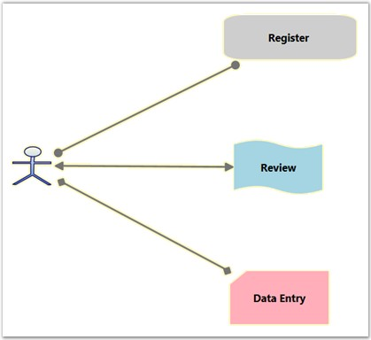

::: {style="DISPLAY: none"}
{#d2h_url_template}{#d2h_package_url style="WIDTH: 0px; DISPLAY: none; HEIGHT: 0px"}
:::

::::: {#nsbanner .d2h_main_nsbanner style="BORDER-BOTTOM: #999999 1px solid; POSITION: relative; PADDING-BOTTOM: 0px; BACKGROUND-COLOR: transparent; PADDING-LEFT: 0px; PADDING-RIGHT: 0px; DISPLAY: none; BORDER-TOP: #999999 1px solid; PADDING-TOP: 0px; LEFT: 0px"}
:::: {#TitleRow .d2h_main_titlerow style="PADDING-BOTTOM: 4px; BACKGROUND-COLOR: transparent; PADDING-LEFT: 22px; WIDTH: 100%; PADDING-RIGHT: 10px; DISPLAY: none; PADDING-TOP: 4px"}
::: {#ienav .d2h_main_ienav style="DISPLAY: none"}
{#D2HPrevious .D2HPreviousEnabled}  {#D2HNext .D2HNextEnabled}
:::
::::
:::::

:::: {#nstext .d2h_main_nstext style="PADDING-BOTTOM: 10px; BACKGROUND-COLOR: transparent; PADDING-LEFT: 22px; PADDING-RIGHT: 10px; HEIGHT: 100%; OVERFLOW: auto; PADDING-TOP: 5px" hasuserbackground="true" valign="bottom"}
::: {#d2h_breadcrumbs .d2h_breadcrumbs}
[Essential Studio User Guide Documentation](ms-xhelp:///?Id=12457748-09e3-4d74-a240-8e049cedf030){.d2h_breadcrumbsNormal}[ \> ]{.d2h_breadcrumbsLinkSeparator}[User Interface Edition](ms-xhelp:///?Id=c29296b7-531c-413b-a0ec-488ca1f7f669){.d2h_breadcrumbsNormal}[ \> ]{.d2h_breadcrumbsLinkSeparator}[Essential Silverlight](ms-xhelp:///?Id=66221bd1-ba2e-43c2-94a7-618f50e01d24){.d2h_breadcrumbsNormal}[ \> ]{.d2h_breadcrumbsLinkSeparator}[Essential Diagram]{.d2h_breadcrumbsContentsOnly}[ \> ]{.d2h_breadcrumbsLinkSeparator}[Concepts and Features](ms-xhelp:///?Id=d592a058-dcc0-44a4-994e-e7901da8db52){.d2h_breadcrumbsNormal}[ \> ]{.d2h_breadcrumbsLinkSeparator}[Line Connectors](ms-xhelp:///?Id=c0725ce8-38f1-496a-8a8e-c6602250e6b6){.d2h_breadcrumbsNormal}
:::

### Decorator Shapes {#decorator-shapes style="tab-stops: 0pt"}

[]{style="FONT-FAMILY: 'Trebuchet MS','sans-serif'; COLOR: #15428b; FONT-SIZE: 9pt"} 

Head and tail decorator shape properties provide an option to add arrows and to customize these arrows. End point decorators can be provided for all types of connectors. There are a number of shapes available for head and tail decorators.

 

Properties\
\

+--------------------+-----------------------------------------------------------------------+----------------------+------------------------+---------------------------------------------------+
| Property           | Description                                                           | Type of the property | Value it accepts       | Any other dependencies/ sub properties associated |
+====================+=======================================================================+======================+========================+===================================================+
| HeadDecoratorShape | Gets or sets the head decorator shape of the connection.              | CLR Property         | DecoratorShape.None    | No                                                |
|                    |                                                                       |                      |                        |                                                   |
|                    | Four values namely None, Arrow , Diamond and Circle can be specified. |                      | DecoratorShape.Arrow   |                                                   |
|                    |                                                                       |                      |                        |                                                   |
|                    | Default value: HeadDecoratorShape.None                                |                      | DecoratorShape.Diamond |                                                   |
|                    |                                                                       |                      |                        |                                                   |
|                    |                                                                       |                      | DecoratorShape.Circle  |                                                   |
+--------------------+-----------------------------------------------------------------------+----------------------+------------------------+---------------------------------------------------+
| TailDecoratorShape | Gets or sets the head decorator shape of the connection.              | CLR Property         | DecoratorShape.None    | No                                                |
|                    |                                                                       |                      |                        |                                                   |
|                    | Four values namely None, Arrow , Diamond and Circle can be specified. |                      | DecoratorShape.Arrow   |                                                   |
|                    |                                                                       |                      |                        |                                                   |
|                    | Default value: TailDecoratorShape.Arrow                               |                      | DecoratorShape.Diamond |                                                   |
|                    |                                                                       |                      |                        |                                                   |
|                    |                                                                       |                      | DecoratorShape.Circle  |                                                   |
+--------------------+-----------------------------------------------------------------------+----------------------+------------------------+---------------------------------------------------+
| HeadDecoratorStyle | Provides customization option for the head decorator shape.           | CLR Property         | DecoratorStyle         | No                                                |
+--------------------+-----------------------------------------------------------------------+----------------------+------------------------+---------------------------------------------------+
| TailDecoratorStyle | Provides customization option for the tail decorator shape.           | CLR Property         | DecoratorStyle         | No                                                |
+--------------------+-----------------------------------------------------------------------+----------------------+------------------------+---------------------------------------------------+

 

[]{style="FONT-FAMILY: 'Trebuchet MS','sans-serif'; COLOR: #15428b; FONT-SIZE: 9pt"} 

Arrow settings can be changed using HeadDecoratorShape and TailDecoratorShape properties. Both head and tail decorators consist of the same set of properties that allow one to customize the settings as required.

[]{style="FONT-FAMILY: 'Trebuchet MS','sans-serif'; COLOR: #15428b; FONT-SIZE: 9pt"} 

Types of decorator shapes

[]{style="FONT-FAMILY: 'Trebuchet MS','sans-serif'; COLOR: #15428b; FONT-SIZE: 9pt"} 

[·      ]{style="FONT-FAMILY: Symbol"}Arrow

[·      ]{style="FONT-FAMILY: Symbol"}Diamond

[·      ]{style="FONT-FAMILY: Symbol"}Circle

**[]{style="FONT-FAMILY: 'Trebuchet MS','sans-serif'; COLOR: #15428b; FONT-SIZE: 9pt"}** 

The following code shows the setting of these properties.

[]{style="FONT-FAMILY: 'Trebuchet MS','sans-serif'; COLOR: #15428b; FONT-SIZE: 9pt"} 

+--------------------------------------------------------------------------------------------------------------------------------------------------------------------------------------+
| **[\[C#\]]{style="FONT-FAMILY: 'Courier New'; COLOR: black"}**                                                                                                                       |
|                                                                                                                                                                                      |
| []{style="FONT-FAMILY: 'Courier New'"}                                                                                                                                               |
|                                                                                                                                                                                      |
| [LineConnector]{style="FONT-FAMILY: 'Courier New'; COLOR: #2b91af"}[ l1 = [new]{style="COLOR: blue"} [LineConnector]{style="COLOR: #2b91af"}();]{style="FONT-FAMILY: 'Courier New'"} |
|                                                                                                                                                                                      |
| [l1.HeadNode = n1;]{style="FONT-FAMILY: 'Courier New'"}                                                                                                                              |
|                                                                                                                                                                                      |
| [l1.TailNode = n2;]{style="FONT-FAMILY: 'Courier New'"}                                                                                                                              |
|                                                                                                                                                                                      |
| [l1.ConnectorType = [ConnectorType]{style="COLOR: #2b91af"}.Bezier;]{style="FONT-FAMILY: 'Courier New'"}                                                                             |
|                                                                                                                                                                                      |
| [l1.HeadDecoratorShape = [DecoratorShape]{style="COLOR: #2b91af"}.Diamond;]{style="FONT-FAMILY: 'Courier New'"}                                                                      |
|                                                                                                                                                                                      |
| [l1.TailDecoratorShape = [DecoratorShape]{style="COLOR: #2b91af"}.Circle;]{style="FONT-FAMILY: 'Courier New'"}                                                                       |
|                                                                                                                                                                                      |
| [diagramModel.Connections.Add(l1); ]{style="FONT-FAMILY: 'Courier New'"}                                                                                                             |
+--------------------------------------------------------------------------------------------------------------------------------------------------------------------------------------+

[]{style="FONT-FAMILY: 'Trebuchet MS','sans-serif'; COLOR: #15428b; FONT-SIZE: 9pt"} 

+------------------------------------------------------------------------------------------------------------------------------------------------------------------------------------------------+
| **[\[VB\]]{style="FONT-FAMILY: 'Courier New'; COLOR: black"}**                                                                                                                                 |
|                                                                                                                                                                                                |
| []{style="FONT-FAMILY: 'Courier New'"}                                                                                                                                                         |
|                                                                                                                                                                                                |
| [Dim]{style="FONT-FAMILY: 'Courier New'; COLOR: blue"}[ l1 [As]{style="COLOR: blue"} [New]{style="COLOR: blue"} [LineConnector]{style="COLOR: #2b91af"}()]{style="FONT-FAMILY: 'Courier New'"} |
|                                                                                                                                                                                                |
| [l1.HeadNode = n1]{style="FONT-FAMILY: 'Courier New'"}                                                                                                                                         |
|                                                                                                                                                                                                |
| [l1.TailNode = n2]{style="FONT-FAMILY: 'Courier New'"}                                                                                                                                         |
|                                                                                                                                                                                                |
| [l1.ConnectorType = ConnectorType.Bezier]{style="FONT-FAMILY: 'Courier New'"}                                                                                                                  |
|                                                                                                                                                                                                |
| [l1.HeadDecoratorShape = DecoratorShape.Diamond]{style="FONT-FAMILY: 'Courier New'"}                                                                                                           |
|                                                                                                                                                                                                |
| [l1.TailDecoratorShape = DecoratorShape.Circle]{style="FONT-FAMILY: 'Courier New'"}                                                                                                            |
|                                                                                                                                                                                                |
| [diagramModel.Connections.Add(l1)]{style="FONT-FAMILY: 'Courier New'"}[]{style="FONT-FAMILY: 'Courier New'"}                                                                                   |
+------------------------------------------------------------------------------------------------------------------------------------------------------------------------------------------------+

[]{style="FONT-FAMILY: 'Trebuchet MS','sans-serif'; COLOR: #15428b; FONT-SIZE: 9pt"} 

{border="0"}

Figure 65: Decorator Shapes**[]{style="FONT-STYLE: normal; FONT-FAMILY: 'Trebuchet MS','sans-serif'; COLOR: #15428b"}**

 

[]{#p42} 

[]{#related-topics}
::::
