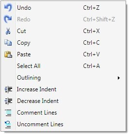
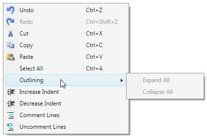

::: {style="DISPLAY: none"}
{#d2h_url_template}{#d2h_package_url style="WIDTH: 0px; DISPLAY: none; HEIGHT: 0px"}
:::

::::: {#nsbanner .d2h_main_nsbanner style="BORDER-BOTTOM: #999999 1px solid; POSITION: relative; PADDING-BOTTOM: 0px; BACKGROUND-COLOR: transparent; PADDING-LEFT: 0px; PADDING-RIGHT: 0px; DISPLAY: none; BORDER-TOP: #999999 1px solid; PADDING-TOP: 0px; LEFT: 0px"}
:::: {#TitleRow .d2h_main_titlerow style="PADDING-BOTTOM: 4px; BACKGROUND-COLOR: transparent; PADDING-LEFT: 22px; WIDTH: 100%; PADDING-RIGHT: 10px; DISPLAY: none; PADDING-TOP: 4px"}
::: {#ienav .d2h_main_ienav style="DISPLAY: none"}
{#D2HPrevious .D2HPreviousEnabled}  {#D2HNext .D2HNextEnabled}
:::
::::
:::::

::::: {#nstext .d2h_main_nstext style="PADDING-BOTTOM: 10px; BACKGROUND-COLOR: transparent; PADDING-LEFT: 22px; PADDING-RIGHT: 10px; HEIGHT: 100%; OVERFLOW: auto; PADDING-TOP: 5px" hasuserbackground="true" valign="bottom"}
::: {#d2h_breadcrumbs .d2h_breadcrumbs}
[Essential Studio User Guide Documentation](ms-xhelp:///?Id=12457748-09e3-4d74-a240-8e049cedf030){.d2h_breadcrumbsNormal}[ \> ]{.d2h_breadcrumbsLinkSeparator}[User Interface Edition](ms-xhelp:///?Id=c29296b7-531c-413b-a0ec-488ca1f7f669){.d2h_breadcrumbsNormal}[ \> ]{.d2h_breadcrumbsLinkSeparator}[Essential WPF](ms-xhelp:///?Id=7f4f82c5-151c-4262-94d0-75c4626c77bc){.d2h_breadcrumbsNormal}[ \> ]{.d2h_breadcrumbsLinkSeparator}[Essential Edit]{.d2h_breadcrumbsContentsOnly}[ \> ]{.d2h_breadcrumbsLinkSeparator}[Concepts and Features](ms-xhelp:///?Id=f61feb80-1940-4b18-ab36-1ab89df8b52a){.d2h_breadcrumbsNormal}[ \> ]{.d2h_breadcrumbsLinkSeparator}[Basic Editing](ms-xhelp:///?Id=bd0f1475-d3d2-40f8-9e8e-4001f1f7c6fa){.d2h_breadcrumbsNormal}
:::

### Default Context Menu {#default-context-menu style="tab-stops: 0pt"}

ShowDefaultContextMenu

EditControl has a built-in context menu which enables the users to easily perform common text editing operations. The default context menu can be enabled/ disabled using **ShowDefaultContextMenu** property. By default, this property is set to **true**.

 

Set the[ ]{style="FONT-FAMILY: 'Calibri','sans-serif'"}**ShowDefaultContextMenu** property of EditControl, by using the following code.

[]{style="FONT-FAMILY: 'Trebuchet MS','sans-serif'; COLOR: #15428b; FONT-SIZE: 9pt"} 

+----------------------------------------------------------------------------------------------------------------------------------------------------------------------------------------------------------------------------------------------------------------------------------------------------------------------------------------------------------------------------------------------------------------------------------------------------------------------------------------------------------------------------------------------------------------------------------------------------------------------+
| **[\[XAML\]]{style="FONT-FAMILY: 'Courier New'"}**                                                                                                                                                                                                                                                                                                                                                                                                                                                                                                                                                                   |
|                                                                                                                                                                                                                                                                                                                                                                                                                                                                                                                                                                                                                      |
| [\<]{style="FONT-FAMILY: 'Courier New'; COLOR: blue"}[syncfusion]{style="FONT-FAMILY: 'Courier New'; COLOR: #a31515"}[:]{style="FONT-FAMILY: 'Courier New'; COLOR: blue"}[EditControl]{style="FONT-FAMILY: 'Courier New'; COLOR: #a31515"}[ x]{style="FONT-FAMILY: 'Courier New'; COLOR: red"}[:]{style="FONT-FAMILY: 'Courier New'; COLOR: blue"}[Name]{style="FONT-FAMILY: 'Courier New'; COLOR: red"}[=\"editControl1\"]{style="FONT-FAMILY: 'Courier New'; COLOR: blue"}[ ShowDefaultContextMenu]{style="FONT-FAMILY: 'Courier New'; COLOR: red"}[=\"True\"/\>]{style="FONT-FAMILY: 'Courier New'; COLOR: blue"} |
+----------------------------------------------------------------------------------------------------------------------------------------------------------------------------------------------------------------------------------------------------------------------------------------------------------------------------------------------------------------------------------------------------------------------------------------------------------------------------------------------------------------------------------------------------------------------------------------------------------------------+

[]{style="FONT-FAMILY: 'Segoe UI','sans-serif'; COLOR: blue; FONT-SIZE: 9pt"} 

[]{style="FONT-FAMILY: 'Trebuchet MS','sans-serif'; COLOR: #15428b; FONT-SIZE: 9pt"} 

+----------------------------------------------------------------------------------------------------------+
| **[\[C#\]]{style="FONT-FAMILY: 'Courier New'"}**                                                         |
|                                                                                                          |
| [editControl1.ShowDefaultContextMenu = [true]{style="COLOR: blue"};]{style="FONT-FAMILY: 'Courier New'"} |
+----------------------------------------------------------------------------------------------------------+

[]{style="FONT-FAMILY: 'Segoe UI','sans-serif'; COLOR: blue; FONT-SIZE: 9pt"} 

[]{style="FONT-FAMILY: 'Calibri','sans-serif'; FONT-SIZE: 9pt"} 

**[]{style="FONT-FAMILY: 'Calibri','sans-serif'; FONT-SIZE: 9pt"}** 

{border="0"}

Figure 14: EditControl's Default ContextMenu

[]{style="FONT-FAMILY: 'Calibri','sans-serif'"} 

{border="0"}

Figure 15: EditControl's Default ContextMenu with Outlining Menu Expanded

***[]{style="FONT-FAMILY: 'Trebuchet MS','sans-serif'; COLOR: #15428b; FONT-SIZE: 9pt"}*** 

Functionalities supported by EditControl's ContextMenu

EditControl's built-in context menu supports the following functionalities[.]{style="FONT-FAMILY: 'Calibri','sans-serif'"}

[]{style="FONT-FAMILY: 'Calibri','sans-serif'"} 

Table 8: EditControl's built-in context menu support

::: {align="center"}
  ---------------------------- -----------------------------------------------------------------------------------------------------------------------------------------------------------------------------
  Command                      Usage
  Undo                         Revert the previous action performed in the EditControl
  Redo                         Performs the action again that was reverted using Undo command
  Cut                          Cut the selected text
  Copy                         Copy the selected text
  Paste                        Paste the text in the clipboard in the current cursor location.
  Select All                   Selects all the text in the EditControl
  Outlining -\> Expand All     Expands all the collapsed blocks in the text. This functionality is supported only when the **EnableOutlining** is set to true and the language supports outlining.
  Outlining -\> Collapse All   Hides all the blocks in the EditControl's text. This functionality is supported only when the **EnableOutlining** is set to true and the language supports outlining.
  Increase Indent              Appends a series of empty characters (tab) in front of the first valid character in the line. This command can be performed on an individual line or selected lines.
  Decrease Indent              Removes a series of empty characters (tab) if any, in front of the first valid character in the line. This command can be performed on an individual line or selected lines
  Comment Lines                It detects the supported comment Lexem from the Language configuration of EditControl's current language and appends it to individual or multiple selected lines.
  Uncomment Line               Removes the comment from the individual or selected lines.
  ---------------------------- -----------------------------------------------------------------------------------------------------------------------------------------------------------------------------
:::

[]{#p22} 

[]{#related-topics}
:::::
