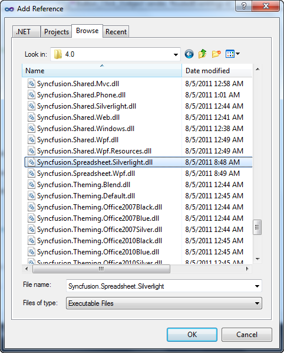

::: {style="DISPLAY: none"}
{#d2h_url_template}{#d2h_package_url style="WIDTH: 0px; DISPLAY: none; HEIGHT: 0px"}
:::

::::: {#nsbanner .d2h_main_nsbanner style="BORDER-BOTTOM: #999999 1px solid; POSITION: relative; PADDING-BOTTOM: 0px; BACKGROUND-COLOR: transparent; PADDING-LEFT: 0px; PADDING-RIGHT: 0px; DISPLAY: none; BORDER-TOP: #999999 1px solid; PADDING-TOP: 0px; LEFT: 0px"}
:::: {#TitleRow .d2h_main_titlerow style="PADDING-BOTTOM: 4px; BACKGROUND-COLOR: transparent; PADDING-LEFT: 22px; WIDTH: 100%; PADDING-RIGHT: 10px; DISPLAY: none; PADDING-TOP: 4px"}
::: {#ienav .d2h_main_ienav style="DISPLAY: none"}
{#D2HPrevious .D2HPreviousEnabled}  {#D2HNext .D2HNextEnabled}
:::
::::
:::::

:::: {#nstext .d2h_main_nstext style="PADDING-BOTTOM: 10px; BACKGROUND-COLOR: transparent; PADDING-LEFT: 22px; PADDING-RIGHT: 10px; HEIGHT: 100%; OVERFLOW: auto; PADDING-TOP: 5px" hasuserbackground="true" valign="bottom"}
::: {#d2h_breadcrumbs .d2h_breadcrumbs}
[Essential Studio User Guide Documentation](ms-xhelp:///?Id=12457748-09e3-4d74-a240-8e049cedf030){.d2h_breadcrumbsNormal}[ \> ]{.d2h_breadcrumbsLinkSeparator}[User Interface Edition](ms-xhelp:///?Id=c29296b7-531c-413b-a0ec-488ca1f7f669){.d2h_breadcrumbsNormal}[ \> ]{.d2h_breadcrumbsLinkSeparator}[Essential Silverlight](ms-xhelp:///?Id=66221bd1-ba2e-43c2-94a7-618f50e01d24){.d2h_breadcrumbsNormal}[ \> ]{.d2h_breadcrumbsLinkSeparator}[Essential Spreadsheet]{.d2h_breadcrumbsContentsOnly}[ \> ]{.d2h_breadcrumbsLinkSeparator}[Installation and Deployment](ms-xhelp:///?Id=7e79c449-00ce-4d20-965a-2ff42ba987ea){.d2h_breadcrumbsNormal}[ \> ]{.d2h_breadcrumbsLinkSeparator}[Deployment Procedures](ms-xhelp:///?Id=0974a33e-2f64-4cd4-9961-8d963308f002){.d2h_breadcrumbsNormal}
:::

### Default Deployment Pattern {#default-deployment-pattern style="tab-stops: 0pt"}

The steps involved to deploy the Spreadsheet control for Silverlight from GAC are as follows:

 

1.   Open Visual Studio.

2.   On Solution **Explorer**, right-click on **References** folder and select **Add** **Reference.**

 

{border="0"}

Figure 4: Add Reference

 

3.   The **Add Reference** window will open.

 

{border="0"}[]{style="COLOR: black"}

Figure 5: Add Reference Window[]{style="COLOR: black"}

[]{style="COLOR: black"} 

4.   Select the **.NET** tab. A list of assemblies available in GAC will be displayed.

5.   Select the following assemblies:

Syncfusion.Spreadsheet.Silverlight.dll

Syncfusion.Grid.Silverlight.dll

Syncfusion.GridCommon.Silverlight.dll

Syncfusion.Linq.Silverlight.dll

Syncfusion.Shared.Silverlight.dll

Syncfusion.Tools.Silverlight.dll

Syncfusion.Ribbon.Silverlight.dll

Syncfusion.Compression.Silverlight.dll

Syncfusion.XlsIO.Silverlight.dll

Syncfusion.Theming.Office2010Blue.dll

 

6.   Click **OK**.

[]{#related-topics}
::::
