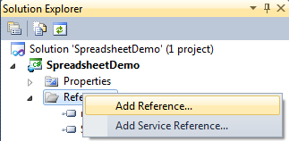
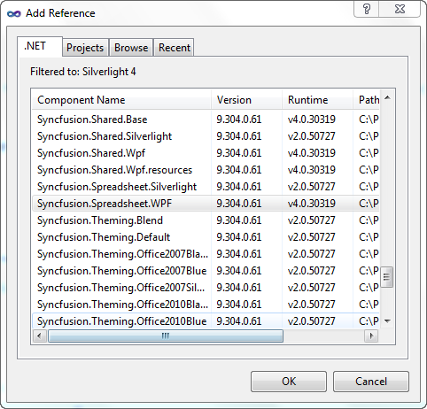

::: {style="DISPLAY: none"}
{#d2h_url_template}{#d2h_package_url style="WIDTH: 0px; DISPLAY: none; HEIGHT: 0px"}
:::

::::: {#nsbanner .d2h_main_nsbanner style="BORDER-BOTTOM: #999999 1px solid; POSITION: relative; PADDING-BOTTOM: 0px; BACKGROUND-COLOR: transparent; PADDING-LEFT: 0px; PADDING-RIGHT: 0px; DISPLAY: none; BORDER-TOP: #999999 1px solid; PADDING-TOP: 0px; LEFT: 0px"}
:::: {#TitleRow .d2h_main_titlerow style="PADDING-BOTTOM: 4px; BACKGROUND-COLOR: transparent; PADDING-LEFT: 22px; WIDTH: 100%; PADDING-RIGHT: 10px; DISPLAY: none; PADDING-TOP: 4px"}
::: {#ienav .d2h_main_ienav style="DISPLAY: none"}
{#D2HPrevious .D2HPreviousEnabled}  {#D2HNext .D2HNextEnabled}
:::
::::
:::::

::::: {#nstext .d2h_main_nstext style="PADDING-BOTTOM: 10px; BACKGROUND-COLOR: transparent; PADDING-LEFT: 22px; PADDING-RIGHT: 10px; HEIGHT: 100%; OVERFLOW: auto; PADDING-TOP: 5px" hasuserbackground="true" valign="bottom"}
::: {#d2h_breadcrumbs .d2h_breadcrumbs}
[Essential Studio User Guide Documentation](ms-xhelp:///?Id=12457748-09e3-4d74-a240-8e049cedf030){.d2h_breadcrumbsNormal}[ \> ]{.d2h_breadcrumbsLinkSeparator}[User Interface Edition](ms-xhelp:///?Id=c29296b7-531c-413b-a0ec-488ca1f7f669){.d2h_breadcrumbsNormal}[ \> ]{.d2h_breadcrumbsLinkSeparator}[Essential WPF](ms-xhelp:///?Id=7f4f82c5-151c-4262-94d0-75c4626c77bc){.d2h_breadcrumbsNormal}[ \> ]{.d2h_breadcrumbsLinkSeparator}[Essential Spreadsheet]{.d2h_breadcrumbsContentsOnly}[ \> ]{.d2h_breadcrumbsLinkSeparator}[Installation and Deployment](ms-xhelp:///?Id=a621d2d4-dd6d-4124-8641-25e517036714){.d2h_breadcrumbsNormal}[ \> ]{.d2h_breadcrumbsLinkSeparator}[Deployment Procedures](ms-xhelp:///?Id=9ba6ca38-138b-447e-8a28-1a4dc24d9108){.d2h_breadcrumbsNormal}
:::

### Default Deployment Pattern {#default-deployment-pattern style="TEXT-ALIGN: justify; tab-stops: 0pt"}

The steps involved to deploy the Spreadsheet control for WPF from GAC are as follows:

1.   Open **Visual Studio**.

2.   On the **Solution Explorer**, right-click on the **References** folder and select **Add Reference**.

 

{border="0"}

Figure 4: Add Reference

 

3.   The **Add Reference** window will open.

 

 

{border="0"}

Figure 5:[ Add Reference window]{style="FONT-STYLE: normal"}

*[]{style="FONT-SIZE: 9pt"}* 

4.   Select the **.NET** tab. A list of assemblies available in GAC will be displayed.

5.   Select the following assemblies:

[·      ]{style="FONT-FAMILY: Symbol"}Syncfusion.Core.dll

[·      ]{style="FONT-FAMILY: Symbol"}Syncfusion.Spreadsheet.WPf.dll

[·      ]{style="FONT-FAMILY: Symbol"}Syncfusion.Grid.WPf.dll

[·      ]{style="FONT-FAMILY: Symbol"}Syncfusion.GridCommon.WPf.dll

[·      ]{style="FONT-FAMILY: Symbol"}Syncfusion.Linq.Base.dll

[·      ]{style="FONT-FAMILY: Symbol"}Syncfusion.Tools.Wpf.dll

[·      ]{style="FONT-FAMILY: Symbol"}Syncfusion.Shared.Wpf.dll

[·      ]{style="FONT-FAMILY: Symbol"}Syncfusion.Compression.Base.dll

[·      ]{style="FONT-FAMILY: Symbol"}Syncfusion.XlsIO.Base.dll

 

6.   Click **OK**.

::: {style="BORDER-BOTTOM: windowtext 1pt solid; BORDER-LEFT: medium none; PADDING-BOTTOM: 1pt; MARGIN-TOP: 9pt; PADDING-LEFT: 0pt; PADDING-RIGHT: 0pt; MARGIN-BOTTOM: 9pt; BORDER-TOP: windowtext 1pt solid; BORDER-RIGHT: medium none; PADDING-TOP: 1pt"}
{border="0"}Note: For the .NET client profile application you have to add the Syncfusion.Spreadsheet.Wpf.ClientProfile.dll instead of Syncfusion.Spreadsheet.WPf.dll.
:::

[]{#related-topics}
:::::
