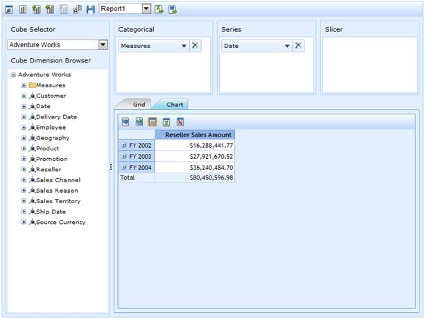

::: {style="DISPLAY: none"}
{#d2h_url_template}{#d2h_package_url style="WIDTH: 0px; DISPLAY: none; HEIGHT: 0px"}
:::

::::: {#nsbanner .d2h_main_nsbanner style="BORDER-BOTTOM: #999999 1px solid; POSITION: relative; PADDING-BOTTOM: 0px; BACKGROUND-COLOR: transparent; PADDING-LEFT: 0px; PADDING-RIGHT: 0px; DISPLAY: none; BORDER-TOP: #999999 1px solid; PADDING-TOP: 0px; LEFT: 0px"}
:::: {#TitleRow .d2h_main_titlerow style="PADDING-BOTTOM: 4px; BACKGROUND-COLOR: transparent; PADDING-LEFT: 22px; WIDTH: 100%; PADDING-RIGHT: 10px; DISPLAY: none; PADDING-TOP: 4px"}
::: {#ienav .d2h_main_ienav style="DISPLAY: none"}
{#D2HPrevious .D2HPreviousEnabled}  {#D2HNext .D2HNextEnabled}
:::
::::
:::::

::::: {#nstext .d2h_main_nstext style="PADDING-BOTTOM: 10px; BACKGROUND-COLOR: transparent; PADDING-LEFT: 22px; PADDING-RIGHT: 10px; HEIGHT: 100%; OVERFLOW: auto; PADDING-TOP: 5px" hasuserbackground="true" valign="bottom"}
::: {#d2h_breadcrumbs .d2h_breadcrumbs}
[Essential Studio User Guide Documentation](ms-xhelp:///?Id=12457748-09e3-4d74-a240-8e049cedf030){.d2h_breadcrumbsNormal}[ \> ]{.d2h_breadcrumbsLinkSeparator}[Business Intelligence Edition](ms-xhelp:///?Id=fdf33dd8-62b2-47b9-ad7b-fc50e590bca5){.d2h_breadcrumbsNormal}[ \> ]{.d2h_breadcrumbsLinkSeparator}[Essential BI ASP.NET](ms-xhelp:///?Id=99c6694e-59c3-4c59-abb5-ce9ce9a948bc){.d2h_breadcrumbsNormal}[ \> ]{.d2h_breadcrumbsLinkSeparator}[Essential BI Client]{.d2h_breadcrumbsContentsOnly}[ \> ]{.d2h_breadcrumbsLinkSeparator}[Concepts and Features](ms-xhelp:///?Id=01073408-6fb5-4943-a653-da9fd3358a53){.d2h_breadcrumbsNormal}
:::

## Default View {#default-view style="tab-stops: 0pt"}

ChartView

 

Loads the OLAP Client by setting the OLAP Chart as a default control to view. The following code snippet will illustrate how to load the control setting OLAP Chart as a default control.

 

 

+---------------------------------------------------------------------------------------------+
| **[\[C#\]]{style="FONT-FAMILY: 'Courier New'"}**                                            |
|                                                                                             |
| [this.OlapClient1.DefaultView = DefaultView.ChartView;]{style="FONT-FAMILY: 'Courier New'"} |
+---------------------------------------------------------------------------------------------+

 

+------------------------------------------------------------------------------------------+
| **[\[VB\]]{style="FONT-FAMILY: 'Courier New'"}**                                         |
|                                                                                          |
| [Me.OlapClient1.DefaultView = DefaultView.ChartView]{style="FONT-FAMILY: 'Courier New'"} |
+------------------------------------------------------------------------------------------+

 

{border="0"}

 

Figure 48: ChartView

GridView

Loads the OLAP Client by setting the OLAP Grid as a default control to view. The following code snippet will illustrate how to load the control setting OLAP Grid as a default control.

 

+--------------------------------------------------------------------------------------------+
| **[\[C#\]]{style="FONT-FAMILY: 'Courier New'"}**                                           |
|                                                                                            |
| [this.OlapClient1.DefaultView = DefaultView.GridView;]{style="FONT-FAMILY: 'Courier New'"} |
+--------------------------------------------------------------------------------------------+

 

+------------------------------------------------------------------------------------------+
| **[\[VB\]]{style="FONT-FAMILY: 'Courier New'"}**                                         |
|                                                                                          |
| [Me.OlapClient1.DefaultView = DefaultView. GridView]{style="FONT-FAMILY: 'Courier New'"} |
+------------------------------------------------------------------------------------------+

 

{border="0"}

 

Figure 49: Grid View

 

Table 21: DefaultView Property

 

::: {align="center"}
  ------------- ------------------------------------------------------------------------------------------------------------------------------- ------------- ---------------------------------------------------- ---------------------------------------------------------
  Property      Description                                                                                                                     Type          [Data type]{style="COLOR: black; FONT-SIZE: 12pt"}   [Reference link]{style="COLOR: black; FONT-SIZE: 12pt"}
  DefaultView   This option would allow user to set the control to view on OLAP Client load. The default control may be either chart or grid.   Server side   enum                                                 \-
  ------------- ------------------------------------------------------------------------------------------------------------------------------- ------------- ---------------------------------------------------- ---------------------------------------------------------
:::

 

Sample Link

A sample demo is available at the following link:

**..\\Syncfusion\\EssentialStudio\\\<Version Number\>\\BI\\Web\\OlapClient.Web\\Samples\\3.5\\OlapClient\\ DefaultViewDemo**

[]{#related-topics}
:::::
