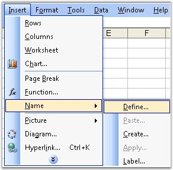
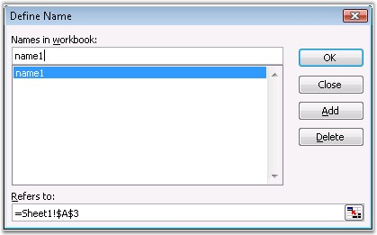
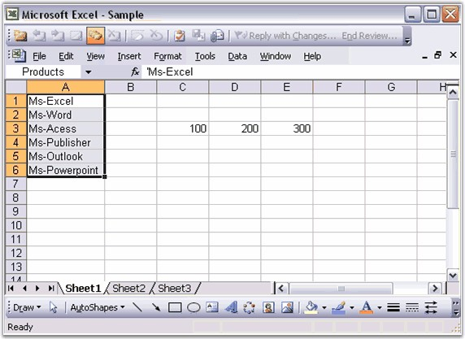

::: {style="DISPLAY: none"}
{#d2h_url_template}{#d2h_package_url style="WIDTH: 0px; DISPLAY: none; HEIGHT: 0px"}
:::

::::: {#nsbanner .d2h_main_nsbanner style="BORDER-BOTTOM: #999999 1px solid; POSITION: relative; PADDING-BOTTOM: 0px; BACKGROUND-COLOR: transparent; PADDING-LEFT: 0px; PADDING-RIGHT: 0px; DISPLAY: none; BORDER-TOP: #999999 1px solid; PADDING-TOP: 0px; LEFT: 0px"}
:::: {#TitleRow .d2h_main_titlerow style="PADDING-BOTTOM: 4px; BACKGROUND-COLOR: transparent; PADDING-LEFT: 22px; WIDTH: 100%; PADDING-RIGHT: 10px; DISPLAY: none; PADDING-TOP: 4px"}
::: {#ienav .d2h_main_ienav style="DISPLAY: none"}
{#D2HPrevious .D2HPreviousEnabled}  {#D2HNext .D2HNextEnabled}
:::
::::
:::::

::::: {#nstext .d2h_main_nstext style="PADDING-BOTTOM: 10px; BACKGROUND-COLOR: transparent; PADDING-LEFT: 22px; PADDING-RIGHT: 10px; HEIGHT: 100%; OVERFLOW: auto; PADDING-TOP: 5px" hasuserbackground="true" valign="bottom"}
::: {#d2h_breadcrumbs .d2h_breadcrumbs}
[Essential Studio User Guide Documentation](ms-xhelp:///?Id=12457748-09e3-4d74-a240-8e049cedf030){.d2h_breadcrumbsNormal}[ \> ]{.d2h_breadcrumbsLinkSeparator}[Reporting Edition](ms-xhelp:///?Id=027aa5b6-6676-4f93-ad23-c20e8c45792e){.d2h_breadcrumbsNormal}[ \> ]{.d2h_breadcrumbsLinkSeparator}[Essential XlsIO](ms-xhelp:///?Id=b01a1b50-1d7d-40c0-bc83-af67e57c9005){.d2h_breadcrumbsNormal}[ \> ]{.d2h_breadcrumbsLinkSeparator}[Concepts and Features](ms-xhelp:///?Id=21b26556-5905-4ad9-90b4-40320db25faf){.d2h_breadcrumbsNormal}[ \> ]{.d2h_breadcrumbsLinkSeparator}[Formulas](ms-xhelp:///?Id=c863333a-35ff-470d-abbc-279e765c84b1){.d2h_breadcrumbsNormal}
:::

### Defined Names {#defined-names style="tab-stops: 0pt"}

 

**Named Ranges** is a powerful feature in Excel, which makes it possible to assign a name to a group of cells. XlsIO has APIs for inserting new named ranges into workbooks, and also to read existing named ranges. Named Ranges are mainly used in formulae.

 

It enables users with better readability, and at a glance we can predict what it is, and what we\'re adding up with the meaningful range names.

 

To create named ranges, open **Insert menu**, point to **Name** and select **Define**. Names are created at workbook-level, by default, but you can create a sheet-level name, by entering the sheet name followed by an exclamation mark (!), followed by the name of the range. For instance, to create a named range \"x\" on Sheet1, open **Insert menu**, point to **Name**, select **Define**, and enter the name as \'Sheet1!x\'.

 

{border="0"}

Figure 123: Inserting Defined Names using Insert Menu[]{style="FONT-FAMILY: 'Trebuchet MS','sans-serif'; COLOR: #15428b"}

[]{style="FONT-FAMILY: 'Trebuchet MS','sans-serif'; COLOR: #15428b; FONT-SIZE: 9pt"} 

***[]{style="FONT-FAMILY: 'Trebuchet MS','sans-serif'; COLOR: #15428b; FONT-SIZE: 9pt"}*** 

[]{style="FONT-FAMILY: 'Trebuchet MS','sans-serif'; COLOR: #15428b; FONT-SIZE: 9pt"} 

{border="0"}

Figure 124: Define Name Dialog Box[]{style="FONT-FAMILY: 'Trebuchet MS','sans-serif'; COLOR: #15428b"}

***[]{style="FONT-FAMILY: 'Trebuchet MS','sans-serif'; COLOR: #15428b; FONT-SIZE: 9pt"}*** 

You can create named ranges in spreadsheets through XlsIO with the **IName** interface. Range for the name is specified through **RefersToRange** property, from which you can access the Range text and other information. This can be specified for workbooks and worksheets.

 

Following code example illustrates how to create named ranges and use it in formulas.

 

+-------------------------------------------------------------------------------------------------------------------------------------------------------------------+
| **[\[C#\]]{style="FONT-FAMILY: 'Courier New'"}**                                                                                                                  |
|                                                                                                                                                                   |
| **[]{style="FONT-FAMILY: 'Courier New'"}**                                                                                                                        |
|                                                                                                                                                                   |
| [// The first worksheet object in the worksheets collection is accessed.]{style="FONT-FAMILY: 'Courier New'; COLOR: green"}                                       |
|                                                                                                                                                                   |
| [IWorksheet]{style="FONT-FAMILY: 'Courier New'; COLOR: #2b91af"}[ sheet = workbook.Worksheets\[0\];]{style="FONT-FAMILY: 'Courier New'"}                          |
|                                                                                                                                                                   |
| []{style="FONT-FAMILY: 'Courier New'"}                                                                                                                            |
|                                                                                                                                                                   |
| [// Defining the Range and using it in the Formula.]{style="FONT-FAMILY: 'Courier New'; COLOR: green"}                                                            |
|                                                                                                                                                                   |
| [IName]{style="FONT-FAMILY: 'Courier New'; COLOR: #2b91af"}[ lname1 = workbook.Names.Add([\"One\"]{style="COLOR: #a31515"});]{style="FONT-FAMILY: 'Courier New'"} |
|                                                                                                                                                                   |
| [lname1.RefersToRange = sheet.Range\[[\"C3\"]{style="COLOR: #a31515"}\];]{style="FONT-FAMILY: 'Courier New'"}                                                     |
|                                                                                                                                                                   |
| []{style="FONT-FAMILY: 'Courier New'"}                                                                                                                            |
|                                                                                                                                                                   |
| [IName]{style="FONT-FAMILY: 'Courier New'; COLOR: #2b91af"}[ lname2 = workbook.Names.Add([\"Two\"]{style="COLOR: #a31515"});]{style="FONT-FAMILY: 'Courier New'"} |
|                                                                                                                                                                   |
| [lname2.RefersToRange = sheet.Range\[[\"D3\"]{style="COLOR: #a31515"}\];]{style="FONT-FAMILY: 'Courier New'"}                                                     |
|                                                                                                                                                                   |
| []{style="FONT-FAMILY: 'Courier New'"}                                                                                                                            |
|                                                                                                                                                                   |
| [// Formula using Defined Names.]{style="FONT-FAMILY: 'Courier New'; COLOR: green"}                                                                               |
|                                                                                                                                                                   |
| [sheet.Range\[[\"E3\"]{style="COLOR: #a31515"}\].Formula = [\"=SUM(One,Two)\"]{style="COLOR: #a31515"};]{style="FONT-FAMILY: 'Courier New'"}                      |
+-------------------------------------------------------------------------------------------------------------------------------------------------------------------+

[]{style="FONT-FAMILY: 'Trebuchet MS','sans-serif'; COLOR: #15428b; FONT-SIZE: 9pt"} 

+--------------------------------------------------------------------------------------------------------------------------------------------------------------------------------------------+
| **[\[VB.NET\]]{style="FONT-FAMILY: 'Courier New'"}**                                                                                                                                       |
|                                                                                                                                                                                            |
| **[]{style="FONT-FAMILY: 'Courier New'"}**                                                                                                                                                 |
|                                                                                                                                                                                            |
| [\' The first worksheet object in the worksheets collection is accessed.]{style="FONT-FAMILY: 'Courier New'; COLOR: green"}                                                                |
|                                                                                                                                                                                            |
| [Dim]{style="FONT-FAMILY: 'Courier New'; COLOR: blue"}[ sheet [As]{style="COLOR: blue"} IWorksheet = workbook.Worksheets(0)]{style="FONT-FAMILY: 'Courier New'"}                           |
|                                                                                                                                                                                            |
| []{style="FONT-FAMILY: 'Courier New'"}                                                                                                                                                     |
|                                                                                                                                                                                            |
| [\' Defining the Range and using it in the Formula.]{style="FONT-FAMILY: 'Courier New'; COLOR: green"}                                                                                     |
|                                                                                                                                                                                            |
| [Dim]{style="FONT-FAMILY: 'Courier New'; COLOR: blue"}[ lname1 [As]{style="COLOR: blue"} IName = workbook.Names.Add([\"One\"]{style="COLOR: maroon"})]{style="FONT-FAMILY: 'Courier New'"} |
|                                                                                                                                                                                            |
| [lname1.RefersToRange = sheet.Range([\"C3\"]{style="COLOR: maroon"})]{style="FONT-FAMILY: 'Courier New'"}                                                                                  |
|                                                                                                                                                                                            |
| []{style="FONT-FAMILY: 'Courier New'"}                                                                                                                                                     |
|                                                                                                                                                                                            |
| [Dim]{style="FONT-FAMILY: 'Courier New'; COLOR: blue"}[ lname2 [As]{style="COLOR: blue"} IName = workbook.Names.Add([\"Two\"]{style="COLOR: maroon"})]{style="FONT-FAMILY: 'Courier New'"} |
|                                                                                                                                                                                            |
| [lname2.RefersToRange = sheet.Range([\"D3\"]{style="COLOR: maroon"})]{style="FONT-FAMILY: 'Courier New'"}                                                                                  |
|                                                                                                                                                                                            |
| []{style="FONT-FAMILY: 'Courier New'"}                                                                                                                                                     |
|                                                                                                                                                                                            |
| [\' Formula using Defined Names.]{style="FONT-FAMILY: 'Courier New'; COLOR: green"}                                                                                                        |
|                                                                                                                                                                                            |
| [sheet.Range([\"E3\"]{style="COLOR: maroon"}).Formula = [\"=SUM(One,Two)\"]{style="COLOR: maroon"}]{style="FONT-FAMILY: 'Courier New'"}                                                    |
+--------------------------------------------------------------------------------------------------------------------------------------------------------------------------------------------+

[]{style="FONT-FAMILY: 'Trebuchet MS','sans-serif'; COLOR: #15428b; FONT-SIZE: 9pt"} 

{border="0"}

Figure 125: XlsIO with Named Ranges[]{style="FONT-FAMILY: 'Trebuchet MS','sans-serif'; COLOR: #15428b"}

 

Following code example illustrates how to get/set sheet-level named ranges.

 

+--------------------------------------------------------------------------------------------------------------------------------------------------------------------+
| **[\[C#\]]{style="FONT-FAMILY: 'Courier New'"}**                                                                                                                   |
|                                                                                                                                                                    |
| **[]{style="FONT-FAMILY: 'Courier New'"}**                                                                                                                         |
|                                                                                                                                                                    |
| [IWorksheet sheet = workbook.Worksheets\[0\];]{style="FONT-FAMILY: 'Courier New'"}                                                                                 |
|                                                                                                                                                                    |
| []{style="FONT-FAMILY: 'Courier New'"}                                                                                                                             |
|                                                                                                                                                                    |
| [// Add a name.]{style="FONT-FAMILY: 'Courier New'; COLOR: green"}                                                                                                 |
|                                                                                                                                                                    |
| [IName]{style="FONT-FAMILY: 'Courier New'; COLOR: #2b91af"}[ lname1 = sheet.Names.Add([\"CellName\"]{style="COLOR: maroon"});]{style="FONT-FAMILY: 'Courier New'"} |
|                                                                                                                                                                    |
| [lname1.RefersToRange = sheet.Range([\"C3\"]{style="COLOR: maroon"});]{style="FONT-FAMILY: 'Courier New'"}                                                         |
|                                                                                                                                                                    |
| []{style="FONT-FAMILY: 'Courier New'"}                                                                                                                             |
|                                                                                                                                                                    |
| [// Get name.]{style="FONT-FAMILY: 'Courier New'; COLOR: green"}                                                                                                   |
|                                                                                                                                                                    |
| [Console.Writeline(sheet.Names\[[\"CellName\"]{style="COLOR: maroon"}\].Value);]{style="FONT-FAMILY: 'Courier New'"}                                               |
+--------------------------------------------------------------------------------------------------------------------------------------------------------------------+

[]{style="FONT-FAMILY: 'Trebuchet MS','sans-serif'; COLOR: #15428b; FONT-SIZE: 9pt"} 

+----------------------------------------------------------------------------------------------------------------------------------------------------------------------------------------------+
| **[\[VB.NET\]]{style="FONT-FAMILY: 'Courier New'"}**                                                                                                                                         |
|                                                                                                                                                                                              |
| **[]{style="FONT-FAMILY: 'Courier New'"}**                                                                                                                                                   |
|                                                                                                                                                                                              |
| [Dim sheet As IWorksheet =  workbook.Worksheets(0) ]{style="FONT-FAMILY: 'Courier New'"}                                                                                                     |
|                                                                                                                                                                                              |
| []{style="FONT-FAMILY: 'Courier New'; COLOR: blue"}                                                                                                                                          |
|                                                                                                                                                                                              |
| [\' Add a name.]{style="FONT-FAMILY: 'Courier New'; COLOR: green"}                                                                                                                           |
|                                                                                                                                                                                              |
| [Dim]{style="FONT-FAMILY: 'Courier New'; COLOR: blue"}[ lname1 [As]{style="COLOR: blue"} IName = sheet.Names.Add([\"CellName\"]{style="COLOR: maroon"})]{style="FONT-FAMILY: 'Courier New'"} |
|                                                                                                                                                                                              |
| [lname1.RefersToRange = sheet.Range([\"C3\"]{style="COLOR: maroon"})]{style="FONT-FAMILY: 'Courier New'"}                                                                                    |
|                                                                                                                                                                                              |
| []{style="FONT-FAMILY: 'Courier New'"}                                                                                                                                                       |
|                                                                                                                                                                                              |
| [\' Get name.]{style="FONT-FAMILY: 'Courier New'; COLOR: green"}                                                                                                                             |
|                                                                                                                                                                                              |
| [Console.Writeline(sheet.Names(\"CellName\").Value)]{style="FONT-FAMILY: 'Courier New'"}                                                                                                     |
+----------------------------------------------------------------------------------------------------------------------------------------------------------------------------------------------+

 

You can get/read all the names from a worksheet or workbook just by enumerating the INames collection as follows.

 

+------------------------------------------------------------------------------------------------------------------------------------------------------------------+
| **[\[C#\]]{style="FONT-FAMILY: 'Courier New'"}**                                                                                                                 |
|                                                                                                                                                                  |
| **[]{style="FONT-FAMILY: 'Courier New'"}**                                                                                                                       |
|                                                                                                                                                                  |
| [for]{style="FONT-FAMILY: 'Courier New'; COLOR: blue"}[ ([int]{style="COLOR: blue"} i = 0; i \<= workbook.Names.Count; i++)]{style="FONT-FAMILY: 'Courier New'"} |
|                                                                                                                                                                  |
| [{]{style="FONT-FAMILY: 'Courier New'"}                                                                                                                          |
|                                                                                                                                                                  |
| [    [Console]{style="COLOR: teal"}.WriteLine(workbook.Names\[i\].Name.ToString());]{style="FONT-FAMILY: 'Courier New'"}                                         |
|                                                                                                                                                                  |
| [    [Console]{style="COLOR: teal"}.WriteLine(workbook.Names\[i\].RefersToRange.Address.ToString());]{style="FONT-FAMILY: 'Courier New'"}                        |
|                                                                                                                                                                  |
| [    [Console]{style="COLOR: teal"}.WriteLine(workbook.Names\[i\].Name.Value.ToString());]{style="FONT-FAMILY: 'Courier New'"}                                   |
|                                                                                                                                                                  |
| [}]{style="FONT-FAMILY: 'Courier New'"}                                                                                                                          |
+------------------------------------------------------------------------------------------------------------------------------------------------------------------+

[]{style="FONT-FAMILY: 'Trebuchet MS','sans-serif'; COLOR: #15428b; FONT-SIZE: 9pt"} 

+----------------------------------------------------------------------------------------------------------------------------------------------------------------------------------------+
| **[\[VB.NET\]]{style="FONT-FAMILY: 'Courier New'"}**                                                                                                                                   |
|                                                                                                                                                                                        |
| **[]{style="FONT-FAMILY: 'Courier New'"}**                                                                                                                                             |
|                                                                                                                                                                                        |
| [Dim]{style="FONT-FAMILY: 'Courier New'; COLOR: blue"}[ i [As]{style="COLOR: blue"} [Integer]{style="COLOR: blue"}]{style="FONT-FAMILY: 'Courier New'"}                                |
|                                                                                                                                                                                        |
| [For]{style="FONT-FAMILY: 'Courier New'; COLOR: blue"}[  i = 0 [To]{style="COLOR: blue"}  workbook.Names.Count [Step]{style="COLOR: blue"}  i + 1]{style="FONT-FAMILY: 'Courier New'"} |
|                                                                                                                                                                                        |
| [     Console.WriteLine(workbook.Names(i).Name.ToString())]{style="FONT-FAMILY: 'Courier New'"}                                                                                        |
|                                                                                                                                                                                        |
| [     Console.WriteLine(workbook.Names(i).RefersToRange.Address.ToString())]{style="FONT-FAMILY: 'Courier New'"}                                                                       |
|                                                                                                                                                                                        |
| [     Console.WriteLine(workbook.Names(i).Name.Value.ToString())]{style="FONT-FAMILY: 'Courier New'"}                                                                                  |
|                                                                                                                                                                                        |
| [Next]{style="FONT-FAMILY: 'Courier New'; COLOR: blue"}                                                                                                                                |
+----------------------------------------------------------------------------------------------------------------------------------------------------------------------------------------+

 

You can also delete a name in the workbook/worksheet by using the **Delete** method of IName. Note that deleting the cell, does not delete the name from the **Name** collection.

 

Following table lists the properties of **IName**.

 

::: {align="center"}
  Property        Description
  --------------- ---------------------------------------------------------------------------------------------------------------------------------------------------------------------------------------
  Index           Returns the index number of the Name object within the collection. This is a Read-Only property.
  IsLocal         Indicates whether name is local.
  Name            Returns or sets the name of the object. Read/Write String.
  NameLocal       Returns or sets the name of the object, in the language of the user. Read/Write String for Name.
  RefersToRange   Gets/sets the Range associated with the Name object.
  Value           For the Name object, a string containing the formula that the name is defined to is referred. The string is in A1-style notation in the language of the macro, without an equal sign.
  ValueR1C1       Gets named range Value in R1C1 style. This is a Read-Only property.
  Visible         Determines whether the object is visible. Read/Write Boolean.
  Scope           Returns the scope of the name range.
:::

 

**Scope of Named Range**

 

The scope of the named range can be accessed as follows.

[]{style="FONT-FAMILY: 'Times New Roman','serif'; FONT-SIZE: 12pt"} 

+---------------------------------------------------------------------------------------------------------------------------------------------------------------+
| **[\[C#\]]{style="FONT-FAMILY: 'Courier New'"}**                                                                                                              |
|                                                                                                                                                               |
| **[]{style="FONT-FAMILY: 'Courier New'"}**                                                                                                                    |
|                                                                                                                                                               |
| [IName]{style="FONT-FAMILY: 'Courier New'; COLOR: teal"}[ name = workbook.Names.Add([\"Name1\"]{style="COLOR: maroon"});]{style="FONT-FAMILY: 'Courier New'"} |
|                                                                                                                                                               |
| [name.RefersToRange = sheet.Range\[[\"A1\"]{style="COLOR: maroon"}\];]{style="FONT-FAMILY: 'Courier New'"}                                                    |
|                                                                                                                                                               |
| [Console]{style="FONT-FAMILY: 'Courier New'; COLOR: teal"}[.WriteLine(name.Scope);]{style="FONT-FAMILY: 'Courier New'"}                                       |
+---------------------------------------------------------------------------------------------------------------------------------------------------------------+

[]{style="FONT-FAMILY: 'Trebuchet MS','sans-serif'; COLOR: #15428b; FONT-SIZE: 9pt"} 

+--------------------------------------------------------------------------------------------------------------------------------------------------------------------------+
| **[\[VB.NET\]]{style="FONT-FAMILY: 'Courier New'"}**                                                                                                                     |
|                                                                                                                                                                          |
| []{style="FONT-FAMILY: 'Courier New'"}                                                                                                                                   |
|                                                                                                                                                                          |
| [Dim name As IName]{style="FONT-FAMILY: 'Courier New'; COLOR: #2b91af"}[  = workbook.Names.Add([\"Name1\"]{style="COLOR: #a31515"})]{style="FONT-FAMILY: 'Courier New'"} |
|                                                                                                                                                                          |
| [name.RefersToRange = sheet.Range([\"A1\"]{style="COLOR: #a31515"})]{style="FONT-FAMILY: 'Courier New'"}                                                                 |
|                                                                                                                                                                          |
| [Console]{style="FONT-FAMILY: 'Courier New'; COLOR: #2b91af"}[.WriteLine(name.Scope)]{style="FONT-FAMILY: 'Courier New'"}                                                |
+--------------------------------------------------------------------------------------------------------------------------------------------------------------------------+

 

[]{#related-topics}
:::::
