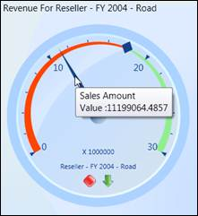
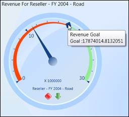

::: {style="DISPLAY: none"}
{#d2h_url_template} {#d2h_package_url style="WIDTH: 0px; DISPLAY: none; HEIGHT: 0px"}
:::

::::: {#nsbanner .d2h_main_nsbanner style="BORDER-BOTTOM: #999999 1px solid; POSITION: relative; PADDING-BOTTOM: 0px; BACKGROUND-COLOR: transparent; PADDING-LEFT: 0px; PADDING-RIGHT: 0px; DISPLAY: none; BORDER-TOP: #999999 1px solid; PADDING-TOP: 0px; LEFT: 0px"}
:::: {#TitleRow .d2h_main_titlerow style="PADDING-BOTTOM: 4px; BACKGROUND-COLOR: transparent; PADDING-LEFT: 22px; WIDTH: 100%; PADDING-RIGHT: 10px; DISPLAY: none; PADDING-TOP: 4px"}
::: {#ienav .d2h_main_ienav style="DISPLAY: none"}
{#D2HPrevious .D2HPreviousEnabled}  {#D2HNext .D2HNextEnabled}
:::
::::
:::::

:::: {#nstext .d2h_main_nstext style="PADDING-BOTTOM: 10px; BACKGROUND-COLOR: transparent; PADDING-LEFT: 22px; PADDING-RIGHT: 10px; HEIGHT: 100%; OVERFLOW: auto; PADDING-TOP: 5px" hasuserbackground="true" valign="bottom"}
::: {#d2h_breadcrumbs .d2h_breadcrumbs}
[Essential Studio User Guide Documentation](ms-xhelp:///?Id=12457748-09e3-4d74-a240-8e049cedf030){.d2h_breadcrumbsNormal} [ \> ]{.d2h_breadcrumbsLinkSeparator} [Business Intelligence Edition](ms-xhelp:///?Id=fdf33dd8-62b2-47b9-ad7b-fc50e590bca5){.d2h_breadcrumbsNormal} [ \> ]{.d2h_breadcrumbsLinkSeparator} [Essential BI WPF](ms-xhelp:///?Id=41e3d586-d922-4a01-8272-679fe4ae7343){.d2h_breadcrumbsNormal} [ \> ]{.d2h_breadcrumbsLinkSeparator} [Essential BI Gauge]{.d2h_breadcrumbsContentsOnly} [ \> ]{.d2h_breadcrumbsLinkSeparator} [Concepts and Features](ms-xhelp:///?Id=b21891c2-ee4b-41e6-a92d-29a3ab4cd8c5){.d2h_breadcrumbsNormal} [ \> ]{.d2h_breadcrumbsLinkSeparator} [Run Time Feature](ms-xhelp:///?Id=7590808a-066d-45b9-802e-b75dde70fbbd){.d2h_breadcrumbsNormal}
:::

### Define the types of tooltips available in Gauge control. {#define-the-types-of-tooltips-available-in-gauge-control. style="tab-stops: 0pt"}

The *OLAP Gauge* control can display the tooltip information when the mouse pointer is moved over the gauge pointer or marker.

[]{style="FONT-FAMILY: 'Trebuchet MS','sans-serif'; COLOR: #15428b; FONT-SIZE: 9pt"} 

Pointer ToolTip

[]{style="FONT-FAMILY: 'Trebuchet MS','sans-serif'; COLOR: #15428b; FONT-SIZE: 9pt"} 

The *OLAP Gauge* control for WPF provides value information when the mouse pointer is moved over the pointer. This is achieved by enabling the *ShowPointersTooltip* property of the gauge control. The following code example illustrates the setting of this property.

 

+---------------------------------------------------------------------------------------------------------------------------------------+
| [\[C#\]]{style="FONT-FAMILY: 'Courier New'"}                                                                                          |
|                                                                                                                                       |
| []{style="FONT-FAMILY: 'Courier New'"}                                                                                                |
|                                                                                                                                       |
| [this]{style="FONT-FAMILY: 'Courier New'; COLOR: blue"} [.olapGauge1.ShowPointersTooltip = true;]{style="FONT-FAMILY: 'Courier New'"} |
+---------------------------------------------------------------------------------------------------------------------------------------+

 

+------------------------------------------------------------------------------------------------------------------------------------+
| [\[VB\]]{style="FONT-FAMILY: 'Courier New'"}                                                                                       |
|                                                                                                                                    |
| []{style="FONT-FAMILY: 'Courier New'"}                                                                                             |
|                                                                                                                                    |
| [Me]{style="FONT-FAMILY: 'Courier New'; COLOR: blue"} [.olapGauge1.ShowPointersTooltip = True]{style="FONT-FAMILY: 'Courier New'"} |
+------------------------------------------------------------------------------------------------------------------------------------+

 

The following screen shot illustrates a pointer tooltip displayed for the OLAP Gauge.

[]{style="FONT-FAMILY: 'Trebuchet MS','sans-serif'; COLOR: #15428b; FONT-SIZE: 9pt"} 

{border="0"}

Figure 30: Pointer Tooltip

 

Marker ToolTip

[]{style="FONT-FAMILY: 'Trebuchet MS','sans-serif'; COLOR: #15428b; FONT-SIZE: 9pt"} 

The *OLAP Gauge* control for WPF provides goal information when the mouse pointer is moved over the marker. This is achieved by enabling the *ShowMarkersTooltip* property of the *Gauge* control. The following code example illustrates the setting of this property.

 

+-----------------------------------------------------------------------+
| \[C#\]                                                                |
|                                                                       |
|                                                                       |
|                                                                       |
| [this]{style="COLOR: blue"}.olapGauge1.ShowMarkersTooltip = true;     |
+-----------------------------------------------------------------------+

 

+-----------------------------------------------------------------------+
| \[VB\]                                                                |
|                                                                       |
|                                                                       |
|                                                                       |
| [Me]{style="COLOR: blue"}.olapGauge1.ShowMarkersTooltip = True        |
+-----------------------------------------------------------------------+

 

The following screen shot illustrates a marker tooltip displayed for the OLAP Gauge.

 

{border="0"}

Figure 31: Marker Tooltip

Sample Location

**[]{style="FONT-FAMILY: 'Trebuchet MS','sans-serif'; COLOR: #15428b; FONT-SIZE: 9pt"}**  

A sample demo is available at the following location:

**..\\Syncfusion\\EssentialStudio\\\<Version Number\>\\BI\\WPF\\OLAPGauge.WPF\\Samples\\Product ShowCase\\Product Showcase Demo\\**

 

 

 

[]{#related-topics}
::::
