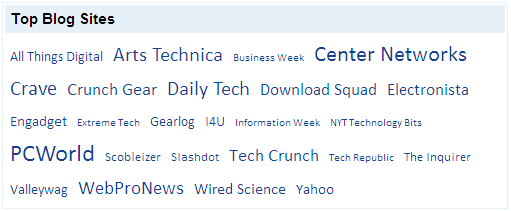

::: {style="DISPLAY: none"}
{#d2h_url_template}{#d2h_package_url style="WIDTH: 0px; DISPLAY: none; HEIGHT: 0px"}
:::

::: {.d2h_secondary_topic style="PADDING-BOTTOM: 10pt; MARGIN: 0pt; PADDING-LEFT: 0pt; PADDING-RIGHT: 0pt; PADDING-TOP: 0pt"}
#### Defining Dimensions {#defining-dimensions style="tab-stops: 0pt"}

The tag cloud control's height and width dimensions can be customized. 

**[]{style="FONT-FAMILY: 'Calibri','sans-serif'; FONT-SIZE: 12pt"}** 

**[Properties]{style="FONT-FAMILY: 'Calibri','sans-serif'; FONT-SIZE: 12pt"}**

**[]{style="FONT-FAMILY: 'Calibri','sans-serif'"}** 

 

  -------- --------------------------------------------- ------------------ ------------------ ------------
  Name     Description                                   Type of property   Value it accepts   Dependency
  Height   Sets the height of the tag cloud in pixels.   struct             Members of Unit    NA
  Width    Sets the width of the tag cloud in pixels.    struct             Members of Unit    NA
  -------- --------------------------------------------- ------------------ ------------------ ------------

 

*[[]{style="TEXT-DECORATION: none"}]{.underline}* 

Using Builder

The following steps explain how to set the dimensions of tag cloud through the builder.

 

1.   In the controller, pass the model to the view.

[]{style="FONT-FAMILY: 'Calibri','sans-serif'"} 

[]{style="FONT-FAMILY: 'Calibri','sans-serif'"} 

+------------------------------------------------------------------------------------------------------------------------------------------------+
| **[\[Controller\]]{style="FONT-FAMILY: 'Courier New'"}**                                                                                       |
|                                                                                                                                                |
| [public]{style="FONT-FAMILY: 'Courier New'; COLOR: blue"}[ [ActionResult]{style="COLOR: #2b91af"} Index()]{style="FONT-FAMILY: 'Courier New'"} |
|                                                                                                                                                |
| [        {]{style="FONT-FAMILY: 'Courier New'"}                                                                                                |
|                                                                                                                                                |
| [            [Northwind]{style="COLOR: #2b91af"} data = SqlCE;]{style="FONT-FAMILY: 'Courier New'"}                                            |
|                                                                                                                                                |
| [            [//Passing the model to the view.]{style="COLOR: green"}]{style="FONT-FAMILY: 'Courier New'"}                                     |
|                                                                                                                                                |
| [            [return]{style="COLOR: blue"} View(data.Blogs);]{style="FONT-FAMILY: 'Courier New'"}                                              |
|                                                                                                                                                |
| [  }   ]{style="FONT-FAMILY: 'Courier New'"}                                                                                                   |
|                                                                                                                                                |
| []{style="FONT-FAMILY: 'Courier New'"}                                                                                                         |
+------------------------------------------------------------------------------------------------------------------------------------------------+

[]{style="FONT-FAMILY: 'Courier New'"} 

2.   [Create a strongly typed view]{.UGHyperlink}[. ]{style="FONT-FAMILY: 'Calibri','sans-serif'"}

3.   In **View**, create a list of tag items and invoke the tag cloud helper with the control ID as the first argument followed by the **TagItems**, **Width**, and **Height** methods with the desired options as arguments.[]{style="FONT-FAMILY: Consolas; FONT-SIZE: 9.5pt"}

[]{style="FONT-FAMILY: Consolas; BACKGROUND: yellow; FONT-SIZE: 9.5pt"} 

+-------------------------------------------------------------------------------------------------------------------------------------------------------------------------------------------------------------------------------------------------------------------------------------------------------------------+
| **View\[ASPX\]**                                                                                                                                                                                                                                                                                                  |
|                                                                                                                                                                                                                                                                                                                   |
| [\<%]{style="FONT-FAMILY: 'Courier New'; BACKGROUND: yellow"}[List]{style="FONT-FAMILY: 'Courier New'; COLOR: #2b91af"}[\<[TagItems]{style="COLOR: #2b91af"}\> tagItems = [new]{style="COLOR: blue"} [List]{style="COLOR: #2b91af"}\<[TagItems]{style="COLOR: #2b91af"}\>();]{style="FONT-FAMILY: 'Courier New'"} |
|                                                                                                                                                                                                                                                                                                                   |
| [            [foreach]{style="COLOR: blue"} ([var]{style="COLOR: blue"} item [in]{style="COLOR: blue"} Model.OrderBy(p =\> p.Title))]{style="FONT-FAMILY: 'Courier New'"}                                                                                                                                         |
|                                                                                                                                                                                                                                                                                                                   |
| [            {]{style="FONT-FAMILY: 'Courier New'"}                                                                                                                                                                                                                                                               |
|                                                                                                                                                                                                                                                                                                                   |
| [          tagItems.Add([new]{style="COLOR: blue"} [TagItems]{style="COLOR: #2b91af"} { ]{style="FONT-FAMILY: 'Courier New'"}                                                                                                                                                                                     |
|                                                                                                                                                                                                                                                                                                                   |
| [TagName = item.Title, ]{style="FONT-FAMILY: 'Courier New'"}                                                                                                                                                                                                                                                      |
|                                                                                                                                                                                                                                                                                                                   |
| [Frequency = ([int]{style="COLOR: blue"})item.Rank, ]{style="FONT-FAMILY: 'Courier New'"}                                                                                                                                                                                                                         |
|                                                                                                                                                                                                                                                                                                                   |
| [NavigatetUrl = item.Website });]{style="FONT-FAMILY: 'Courier New'"}                                                                                                                                                                                                                                             |
|                                                                                                                                                                                                                                                                                                                   |
| [            } [%\>]{style="BACKGROUND: yellow"}]{style="FONT-FAMILY: 'Courier New'"}                                                                                                                                                                                                                             |
|                                                                                                                                                                                                                                                                                                                   |
| [      [\<%]{style="BACKGROUND: yellow"}[=]{style="COLOR: blue"}Html.Syncfusion().TagCloud([\"myTagCloud\"]{style="COLOR: #a31515"})]{style="FONT-FAMILY: 'Courier New'"}                                                                                                                                         |
|                                                                                                                                                                                                                                                                                                                   |
| [.TagItems(tagItems)]{style="FONT-FAMILY: 'Courier New'"}                                                                                                                                                                                                                                                         |
|                                                                                                                                                                                                                                                                                                                   |
| [.Title([\"Top Blog Sites\"]{style="COLOR: #a31515"})]{style="FONT-FAMILY: 'Courier New'"}                                                                                                                                                                                                                        |
|                                                                                                                                                                                                                                                                                                                   |
| [.**Width(500)**]{style="FONT-FAMILY: 'Courier New'"}                                                                                                                                                                                                                                                             |
|                                                                                                                                                                                                                                                                                                                   |
| **[.Height(201)]{style="FONT-FAMILY: 'Courier New'"}**[%\>]{style="FONT-FAMILY: 'Courier New'; BACKGROUND: yellow"}                                                                                                                                                                                               |
|                                                                                                                                                                                                                                                                                                                   |
| []{style="FONT-FAMILY: 'Courier New'; BACKGROUND: yellow"}                                                                                                                                                                                                                                                        |
+-------------------------------------------------------------------------------------------------------------------------------------------------------------------------------------------------------------------------------------------------------------------------------------------------------------------+

[]{style="FONT-FAMILY: Consolas; FONT-SIZE: 9.5pt"} 

[]{style="FONT-FAMILY: Consolas; BACKGROUND: yellow; FONT-SIZE: 9.5pt"} 

+----------------------------------------------------------------------------------------------------------------------------------------------------------------------------------------------------------------------------------------------------------------------------------------------------------------------------------------------------------+
| **View\[cshtml\]**                                                                                                                                                                                                                                                                                                                                       |
|                                                                                                                                                                                                                                                                                                                                                          |
|                                                                                                                                                                                                                                                                                                                                                          |
|                                                                                                                                                                                                                                                                                                                                                          |
| [\@{]{style="FONT-FAMILY: Consolas; BACKGROUND: yellow; FONT-SIZE: 9.5pt"}[List]{style="FONT-FAMILY: Consolas; COLOR: #2b91af; FONT-SIZE: 9.5pt"}[\<[TagItems]{style="COLOR: #2b91af"}\> tagItems = [new]{style="COLOR: blue"} [List]{style="COLOR: #2b91af"}\<[TagItems]{style="COLOR: #2b91af"}\>();]{style="FONT-FAMILY: Consolas; FONT-SIZE: 9.5pt"} |
|                                                                                                                                                                                                                                                                                                                                                          |
| [   foreach]{style="FONT-FAMILY: 'Courier New'; COLOR: blue"}[ ([var]{style="COLOR: blue"} item [in]{style="COLOR: blue"} Model.OrderBy(p =\> p.Title))]{style="FONT-FAMILY: 'Courier New'"}                                                                                                                                                             |
|                                                                                                                                                                                                                                                                                                                                                          |
| [      {]{style="FONT-FAMILY: 'Courier New'"}                                                                                                                                                                                                                                                                                                            |
|                                                                                                                                                                                                                                                                                                                                                          |
| [          tagItems.Add([new]{style="COLOR: blue"} [TagItems]{style="COLOR: #2b91af"} { ]{style="FONT-FAMILY: 'Courier New'"}                                                                                                                                                                                                                            |
|                                                                                                                                                                                                                                                                                                                                                          |
| [TagName = item.Title, ]{style="FONT-FAMILY: 'Courier New'"}                                                                                                                                                                                                                                                                                             |
|                                                                                                                                                                                                                                                                                                                                                          |
| [Frequency = ([int]{style="COLOR: blue"})item.Rank, ]{style="FONT-FAMILY: 'Courier New'"}                                                                                                                                                                                                                                                                |
|                                                                                                                                                                                                                                                                                                                                                          |
| [NavigatetUrl = item.Website });]{style="FONT-FAMILY: 'Courier New'"}                                                                                                                                                                                                                                                                                    |
|                                                                                                                                                                                                                                                                                                                                                          |
| [      }]{style="FONT-FAMILY: 'Courier New'"}[ [}]{style="BACKGROUND: yellow"}]{style="FONT-FAMILY: Consolas; FONT-SIZE: 9.5pt"}                                                                                                                                                                                                                         |
|                                                                                                                                                                                                                                                                                                                                                          |
| []{style="FONT-FAMILY: Consolas; BACKGROUND: yellow; FONT-SIZE: 9.5pt"}                                                                                                                                                                                                                                                                                  |
|                                                                                                                                                                                                                                                                                                                                                          |
| [      [\@{]{style="BACKGROUND: yellow"} Html.Syncfusion().TagCloud([\"myTagCloud\"]{style="COLOR: #a31515"})]{style="FONT-FAMILY: 'Courier New'"}                                                                                                                                                                                                       |
|                                                                                                                                                                                                                                                                                                                                                          |
| [.TagItems(tagItems)]{style="FONT-FAMILY: 'Courier New'"}                                                                                                                                                                                                                                                                                                |
|                                                                                                                                                                                                                                                                                                                                                          |
| [.Title([\"Top Blog Sites\"]{style="COLOR: #a31515"})]{style="FONT-FAMILY: 'Courier New'"}                                                                                                                                                                                                                                                               |
|                                                                                                                                                                                                                                                                                                                                                          |
| [.**Width(500)**]{style="FONT-FAMILY: 'Courier New'"}                                                                                                                                                                                                                                                                                                    |
|                                                                                                                                                                                                                                                                                                                                                          |
| **[.Height(201)]{style="FONT-FAMILY: 'Courier New'"}**[.Render();]{style="FONT-FAMILY: 'Courier New'"}[}]{style="FONT-FAMILY: 'Courier New'; BACKGROUND: yellow"}                                                                                                                                                                                        |
|                                                                                                                                                                                                                                                                                                                                                          |
| []{style="FONT-FAMILY: 'Courier New'; BACKGROUND: yellow"}                                                                                                                                                                                                                                                                                               |
+----------------------------------------------------------------------------------------------------------------------------------------------------------------------------------------------------------------------------------------------------------------------------------------------------------------------------------------------------------+

[]{style="FONT-FAMILY: Consolas; BACKGROUND: yellow; FONT-SIZE: 9.5pt"} 

4.   Build and run the application.**

*[[]{style="TEXT-DECORATION: none"}]{.underline}* 

Using Properties Model

The following steps explain how to set the dimensions of the tag cloud control through the properties model.

1.   In the controller, create an instance of **TagCloudModel** and define the **TagItems**, **Width**, and **Height** properties.**

2.   Pass the instance through the view-specific data to the view.**

*[[]{style="TEXT-DECORATION: none"}]{.underline}* 

*[[[]{style="TEXT-DECORATION: none"}]{style="FONT-FAMILY: 'Calibri','sans-serif'"}]{.underline}* 

+--------------------------------------------------------------------------------------------------------------------------------------------------------------------------------+
| **[\[Controller\]]{style="FONT-FAMILY: 'Courier New'"}**                                                                                                                       |
|                                                                                                                                                                                |
| [public]{style="FONT-FAMILY: 'Courier New'; COLOR: blue"}[ [ActionResult]{style="COLOR: #2b91af"} Index()]{style="FONT-FAMILY: 'Courier New'"}                                 |
|                                                                                                                                                                                |
| [        {]{style="FONT-FAMILY: 'Courier New'"}                                                                                                                                |
|                                                                                                                                                                                |
| [            [Northwind]{style="COLOR: #2b91af"} data = SqlCE;]{style="FONT-FAMILY: 'Courier New'"}                                                                            |
|                                                                                                                                                                                |
| [            [//Create an instance of TagCloudModel.]{style="COLOR: green"}]{style="FONT-FAMILY: 'Courier New'"}                                                               |
|                                                                                                                                                                                |
| [            [TagCloudModel]{style="COLOR: #2b91af"} myModel = [new]{style="COLOR: blue"} [TagCloudModel]{style="COLOR: #2b91af"}();]{style="FONT-FAMILY: 'Courier New'"}      |
|                                                                                                                                                                                |
| [            myModel.Title = [\"Top Tech Sites\"]{style="COLOR: #a31515"};]{style="FONT-FAMILY: 'Courier New'"}                                                                |
|                                                                                                                                                                                |
| [            **myModel.Width = 500;**]{style="FONT-FAMILY: 'Courier New'"}                                                                                                     |
|                                                                                                                                                                                |
| **[            myModel.Height = 201;]{style="FONT-FAMILY: 'Courier New'"}**                                                                                                    |
|                                                                                                                                                                                |
| [            ]{style="FONT-FAMILY: 'Courier New'"}                                                                                                                             |
|                                                                                                                                                                                |
| [            [//Create a list of tag items.]{style="COLOR: green"}]{style="FONT-FAMILY: 'Courier New'"}                                                                        |
|                                                                                                                                                                                |
| [            [foreach]{style="COLOR: blue"} ([var]{style="COLOR: blue"} item [in]{style="COLOR: blue"} data.Blogs.OrderBy(p =\> p.Title))]{style="FONT-FAMILY: 'Courier New'"} |
|                                                                                                                                                                                |
| [            {]{style="FONT-FAMILY: 'Courier New'"}                                                                                                                            |
|                                                                                                                                                                                |
| [                myModel.TagItems.Add([new]{style="COLOR: blue"} [TagItems]{style="COLOR: #2b91af"} { ]{style="FONT-FAMILY: 'Courier New'"}                                    |
|                                                                                                                                                                                |
| [TagName = item.Title, ]{style="FONT-FAMILY: 'Courier New'"}                                                                                                                   |
|                                                                                                                                                                                |
| [Frequency = ([int]{style="COLOR: blue"})item.Rank, ]{style="FONT-FAMILY: 'Courier New'"}                                                                                      |
|                                                                                                                                                                                |
| [NavigatetUrl = item.Website });]{style="FONT-FAMILY: 'Courier New'"}                                                                                                          |
|                                                                                                                                                                                |
| [            }]{style="FONT-FAMILY: 'Courier New'"}                                                                                                                            |
|                                                                                                                                                                                |
| []{style="FONT-FAMILY: 'Courier New'"}                                                                                                                                         |
|                                                                                                                                                                                |
| [            [//Pass the instance to the view through the view data.]{style="COLOR: green"}]{style="FONT-FAMILY: 'Courier New'"}                                               |
|                                                                                                                                                                                |
| [            ViewData\[[\"myTagCloud\"]{style="COLOR: #a31515"}\] = myModel;]{style="FONT-FAMILY: 'Courier New'"}                                                              |
|                                                                                                                                                                                |
| [            [return]{style="COLOR: blue"} View();]{style="FONT-FAMILY: 'Courier New'"}                                                                                        |
|                                                                                                                                                                                |
| [   }  ]{style="FONT-FAMILY: 'Courier New'"}                                                                                                                                   |
|                                                                                                                                                                                |
| **[]{style="FONT-FAMILY: 'Courier New'"}**                                                                                                                                     |
+--------------------------------------------------------------------------------------------------------------------------------------------------------------------------------+

***[[[]{style="TEXT-DECORATION: none"}]{style="FONT-FAMILY: 'Calibri','sans-serif'"}]{.underline}*** 

3.   In View, invoke the tag cloud helper with the view data key as the control ID.

[]{style="FONT-FAMILY: 'Calibri','sans-serif'"} 

+--------------------------------------------------------------------------------------------------------------------------------------------------------------------------------------------------------------------------------------------------------------+
| **View\[ASPX\]**                                                                                                                                                                                                                                             |
|                                                                                                                                                                                                                                                              |
| [\<%]{style="FONT-FAMILY: 'Courier New'; BACKGROUND: yellow"}[=]{style="FONT-FAMILY: 'Courier New'; COLOR: blue"}[Html.Syncfusion().TagCloud([\"myTagCloud\"]{style="COLOR: #a31515"})[%\>]{style="BACKGROUND: yellow"}]{style="FONT-FAMILY: 'Courier New'"} |
|                                                                                                                                                                                                                                                              |
| []{style="FONT-FAMILY: 'Courier New'"}                                                                                                                                                                                                                       |
+--------------------------------------------------------------------------------------------------------------------------------------------------------------------------------------------------------------------------------------------------------------+

[]{style="FONT-FAMILY: 'Calibri','sans-serif'"} 

+-------------------------------------------------------------------------------------------------------------------------------------------------------------------------------------------------------------------+
| **View\[cshtml\]**                                                                                                                                                                                                |
|                                                                                                                                                                                                                   |
| [\@{]{style="FONT-FAMILY: 'Courier New'; BACKGROUND: yellow"}[ Html.Syncfusion().TagCloud([\"myTagCloud\"]{style="COLOR: #a31515"}).Render();[}]{style="BACKGROUND: yellow"}]{style="FONT-FAMILY: 'Courier New'"} |
|                                                                                                                                                                                                                   |
| []{style="FONT-FAMILY: 'Courier New'"}                                                                                                                                                                            |
+-------------------------------------------------------------------------------------------------------------------------------------------------------------------------------------------------------------------+

[]{style="FONT-FAMILY: 'Calibri','sans-serif'"} 

[]{style="FONT-FAMILY: 'Calibri','sans-serif'"} 

[]{style="FONT-FAMILY: 'Calibri','sans-serif'"} 

4.   Build and run the application.

The following figure shows the output of the tag cloud with customized dimensions.

 

{border="0"}

Figure 273: Tag Cloud with Customized Dimensions

*[]{style="FONT-FAMILY: 'Calibri','sans-serif'"}* 

[]{#related-topics}
:::
