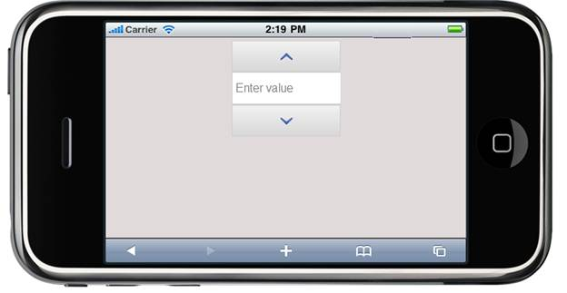

::: {style="DISPLAY: none"}
{#d2h_url_template} {#d2h_package_url style="WIDTH: 0px; DISPLAY: none; HEIGHT: 0px"}
:::

:::: {.d2h_secondary_topic style="PADDING-BOTTOM: 10pt; MARGIN: 0pt; PADDING-LEFT: 0pt; PADDING-RIGHT: 0pt; PADDING-TOP: 0pt"}
#### Defining Dimensions {#defining-dimensions style="tab-stops: 0pt"}

The Numeric text box control allows you to customize the dimensions allowing the textbox to apply any scenario.

[]{style="FONT-FAMILY: 'Calibri','sans-serif'; FONT-SIZE: 11pt; FONT-WEIGHT: normal"} 

Properties

  ------- -------------------------------------------------- ---------------------- ------------------ ------------
  Name    Description                                        Type of the property   Value it accepts   Dependency
  Width   Sets the width of the Numeric text box in pixels   Unit                   Numeric            NA
  ------- -------------------------------------------------- ---------------------- ------------------ ------------

 

Using Builder

The following steps, guides you in configuring the dimensions through the Builder:

1.   In View, invoke the Numeric textbox helper with the numeric ID as the first argument and enable the Width method with desired option as argument.

[[ []{style="TEXT-DECORATION: none"} ]{style="FONT-FAMILY: 'Calibri','sans-serif'"}]{.underline}  

+------------------------------------------------------------------------------------------------------------------------------------------------+
| **[\[ASPX\]]{style="FONT-FAMILY: 'Courier New'"}**                                                                                             |
|                                                                                                                                                |
| [  ]{style="FONT-FAMILY: 'Courier New'"} [\<%]{style="FONT-FAMILY: 'Courier New'; BACKGROUND: yellow"} [{]{style="FONT-FAMILY: 'Courier New'"} |
|                                                                                                                                                |
| [        Html.MobSyncfusion().NumericTextbox([\"WebsiteNumeric\"]{style="COLOR: #a31515"}).Width(100)]{style="FONT-FAMILY: 'Courier New'"}     |
|                                                                                                                                                |
| [                          .Render();]{style="FONT-FAMILY: 'Courier New'"}                                                                     |
|                                                                                                                                                |
| [                      }[%\>]{style="BACKGROUND: yellow"}]{style="FONT-FAMILY: 'Courier New'"}                                                 |
|                                                                                                                                                |
| **[\[Razor\]]{style="FONT-FAMILY: 'Courier New'"}**                                                                                            |
|                                                                                                                                                |
| [\@{]{style="FONT-FAMILY: 'Courier New'; BACKGROUND: yellow"} []{style="FONT-FAMILY: 'Courier New'"}                                           |
|                                                                                                                                                |
| [     Html.MobSyncfusion().NumericTextbox([\"WebsiteNumeric\"]{style="COLOR: #a31515"}).Width(100)]{style="FONT-FAMILY: 'Courier New'"}        |
|                                                                                                                                                |
| [                          .Render();]{style="FONT-FAMILY: 'Courier New'"}                                                                     |
|                                                                                                                                                |
| [                      [}]{style="BACKGROUND: yellow"}]{style="FONT-FAMILY: 'Courier New'"}                                                    |
|                                                                                                                                                |
| []{style="FONT-FAMILY: Consolas; BACKGROUND: yellow; FONT-SIZE: 9.5pt"}                                                                        |
+------------------------------------------------------------------------------------------------------------------------------------------------+

[[]{style="TEXT-DECORATION: none"}]{.underline}  

2.   Run the application.

 

Using Properties Model

The following steps will guide you in setting the width through the Properties model.

1.   In the **Controller**, create an instance of MobNumericModel, define the **Width** property and pass the instance through ViewData to View as given below:

[]{style="FONT-FAMILY: 'Calibri','sans-serif'"} 

+----------------------------------------------------------------------------------------------------------------------------------------------------------------------------------------------------------------------------------------------------------+
| **[\[Controller\]]{style="FONT-FAMILY: 'Courier New'"}**                                                                                                                                                                                                 |
|                                                                                                                                                                                                                                                          |
| [public]{style="FONT-FAMILY: 'Courier New'; COLOR: blue"} [ [ActionResult]{style="COLOR: #2b91af"} Index()]{style="FONT-FAMILY: 'Courier New'"}                                                                                                          |
|                                                                                                                                                                                                                                                          |
| [        {]{style="FONT-FAMILY: 'Courier New'"}                                                                                                                                                                                                          |
|                                                                                                                                                                                                                                                          |
| [            ]{style="FONT-FAMILY: 'Courier New'"} [NumericTextBoxModel]{style="FONT-FAMILY: 'Courier New'; COLOR: #2b91af"} [ myModel = [new]{style="COLOR: blue"}[NumericTextBoxModel]{style="COLOR: #2b91af"}();]{style="FONT-FAMILY: 'Courier New'"} |
|                                                                                                                                                                                                                                                          |
| [            myModel.Width = 100;]{style="FONT-FAMILY: 'Courier New'"}                                                                                                                                                                                   |
|                                                                                                                                                                                                                                                          |
| [            ViewData\[[\"myNumeric\"]{style="COLOR: #a31515"}\] = myModel;]{style="FONT-FAMILY: 'Courier New'"}                                                                                                                                         |
|                                                                                                                                                                                                                                                          |
| [            [return]{style="COLOR: blue"} View();]{style="FONT-FAMILY: 'Courier New'"}                                                                                                                                                                  |
|                                                                                                                                                                                                                                                          |
| [        }]{style="FONT-FAMILY: 'Courier New'"}                                                                                                                                                                                                          |
|                                                                                                                                                                                                                                                          |
| []{style="FONT-FAMILY: Consolas; BACKGROUND: yellow; FONT-SIZE: 9.5pt"}                                                                                                                                                                                  |
+----------------------------------------------------------------------------------------------------------------------------------------------------------------------------------------------------------------------------------------------------------+

**[]{style="FONT-FAMILY: 'Calibri','sans-serif'"}**  

2.   In **View**, invoke the Numeric textbox helper with the ViewData key as the first argument.

 

+--------------------------------------------------------------------------------------------------------------------------------------------------------------------------------+
| **[\[ASPX\]]{style="FONT-FAMILY: 'Courier New'"}**                                                                                                                             |
|                                                                                                                                                                                |
| [  ]{style="FONT-FAMILY: 'Courier New'"} [\<%]{style="FONT-FAMILY: 'Courier New'; BACKGROUND: yellow"} [{                                ]{style="FONT-FAMILY: 'Courier New'"} |
|                                                                                                                                                                                |
| [    Html.MobSyncfusion().NumericTextbox([\"myNumeric\")]{style="COLOR: #a31515"}]{style="FONT-FAMILY: 'Courier New'"}                                                         |
|                                                                                                                                                                                |
| [                          .Render();]{style="FONT-FAMILY: 'Courier New'"}                                                                                                     |
|                                                                                                                                                                                |
| [       }[%\>]{style="BACKGROUND: yellow"}]{style="FONT-FAMILY: 'Courier New'"}                                                                                                |
|                                                                                                                                                                                |
| **[\[Razor\]]{style="FONT-FAMILY: 'Courier New'"}**                                                                                                                            |
|                                                                                                                                                                                |
| [    ]{style="FONT-FAMILY: 'Courier New'"} [\@{]{style="FONT-FAMILY: 'Courier New'; BACKGROUND: yellow"} []{style="FONT-FAMILY: 'Courier New'"}                                |
|                                                                                                                                                                                |
| [           Html.MobSyncfusion().NumericTextbox([\"myNumeric\"]{style="COLOR: #a31515"})]{style="FONT-FAMILY: 'Courier New'"}                                                  |
|                                                                                                                                                                                |
| [                          .Render();]{style="FONT-FAMILY: Consolas; FONT-SIZE: 9.5pt"}                                                                                        |
|                                                                                                                                                                                |
| [       [}]{style="BACKGROUND: yellow"}]{style="FONT-FAMILY: Consolas; FONT-SIZE: 9.5pt"} []{style="FONT-FAMILY: Consolas; BACKGROUND: yellow; FONT-SIZE: 9.5pt"}              |
+--------------------------------------------------------------------------------------------------------------------------------------------------------------------------------+

::: {style="BORDER-BOTTOM: windowtext 1pt solid; BORDER-LEFT: medium none; PADDING-BOTTOM: 1pt; MARGIN-TOP: 9pt; PADDING-LEFT: 0pt; PADDING-RIGHT: 0pt; MARGIN-BOTTOM: 9pt; BORDER-TOP: windowtext 1pt solid; BORDER-RIGHT: medium none; PADDING-TOP: 1pt"}
{border="0"}Note: The second argument of the above numeric textbox helper should match the view data key from the controller to fetch the properties.
:::

3.   Run the application.

The following screenshot illustrates the output:

 

{border="0"}

Figure 234 Numeric textbox with Customized width

[]{style="FONT-FAMILY: 'Calibri','sans-serif'"} 

[]{#related-topics}
::::
