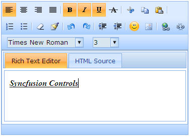

::: {style="DISPLAY: none"}
{#d2h_url_template}{#d2h_package_url style="WIDTH: 0px; DISPLAY: none; HEIGHT: 0px"}
:::

:::: {.d2h_secondary_topic style="PADDING-BOTTOM: 10pt; MARGIN: 0pt; PADDING-LEFT: 0pt; PADDING-RIGHT: 0pt; PADDING-TOP: 0pt"}
#### Defining the dimensions {#defining-the-dimensions style="tab-stops: 0pt"}

 

Rich text editor support customizing the dimensions to make it fit under any scenario.

**[]{style="FONT-FAMILY: 'Calibri','sans-serif'"}** 

Properties

 

::: {align="center"}
  -------- --------------------------------------------------- ------------------ -------------------------------- ------------
  Name     Description                                         Type of property   Value it accepts                 Dependency
  Height   Sets the height of the rich text editor in pixels   Unit               numeric                          NA
  Width    Sets the width of the rich text editor in pixels    Unit               numeric[]{style="COLOR: blue"}   NA
  -------- --------------------------------------------------- ------------------ -------------------------------- ------------
:::

*[[]{style="TEXT-DECORATION: none"}]{.underline}* 

Using Builder

 

The following steps explain how to set the dimensions through properties model.

1.   In **View**, call the rich text editor helper, enabling the **Height** and **Width** methods passing the desired dimensions as arguments.

**[]{style="FONT-FAMILY: 'Calibri','sans-serif'"}** 

+-------------------------------------------------------------------------------------------------------------------------------------------------------------------------------------------------------------------------------+
| **View\[ASPX\]**                                                                                                                                                                                                              |
|                                                                                                                                                                                                                               |
| [\<%]{style="FONT-FAMILY: Consolas; BACKGROUND: yellow; FONT-SIZE: 9.5pt"}[=]{style="FONT-FAMILY: Consolas; COLOR: blue; FONT-SIZE: 9.5pt"}[Html.Syncfusion().RichTextEditor([\"myRichtextEditor\"]{style="COLOR: #a31515"})\ |
|        .**Height(100)**]{style="FONT-FAMILY: Consolas; FONT-SIZE: 9.5pt"}                                                                                                                                                     |
|                                                                                                                                                                                                                               |
| [              .**Width(370)**[%\>]{style="BACKGROUND: yellow"}]{style="FONT-FAMILY: Consolas; FONT-SIZE: 9.5pt"}                                                                                                             |
|                                                                                                                                                                                                                               |
| []{style="FONT-FAMILY: Consolas; BACKGROUND: yellow; FONT-SIZE: 9.5pt"}                                                                                                                                                       |
+-------------------------------------------------------------------------------------------------------------------------------------------------------------------------------------------------------------------------------+

[]{style="FONT-FAMILY: Consolas; BACKGROUND: yellow; FONT-SIZE: 9.5pt"} 

**[]{style="FONT-FAMILY: 'Calibri','sans-serif'"}** 

+------------------------------------------------------------------------------------------------------------------------------------------------------------------------------------------------------------------+
| **View\[cshtml\]**                                                                                                                                                                                               |
|                                                                                                                                                                                                                  |
|                                                                                                                                                                                                                  |
|                                                                                                                                                                                                                  |
| [\@{]{style="FONT-FAMILY: Consolas; BACKGROUND: yellow; FONT-SIZE: 9.5pt"}[ ]{style="FONT-FAMILY: Consolas; FONT-SIZE: 9.5pt"}[Html.Syncfusion().RichTextEditor([\"myRichtextEditor\"]{style="COLOR: #a31515"})\ |
|        .**Height(100)**]{style="FONT-FAMILY: Consolas; FONT-SIZE: 9.5pt"}                                                                                                                                        |
|                                                                                                                                                                                                                  |
| [              .**Width(370)**]{style="FONT-FAMILY: Consolas; FONT-SIZE: 9.5pt"}[]{style="FONT-FAMILY: Consolas; FONT-SIZE: 9.5pt"}                                                                              |
|                                                                                                                                                                                                                  |
| [      .Render();[}]{style="BACKGROUND: yellow"}]{style="FONT-FAMILY: Consolas; FONT-SIZE: 9.5pt"}                                                                                                               |
|                                                                                                                                                                                                                  |
| []{style="FONT-FAMILY: Consolas; BACKGROUND: yellow; FONT-SIZE: 9.5pt"}                                                                                                                                          |
+------------------------------------------------------------------------------------------------------------------------------------------------------------------------------------------------------------------+

[]{style="FONT-FAMILY: Consolas; BACKGROUND: yellow; FONT-SIZE: 9.5pt"} 

[]{style="FONT-FAMILY: Consolas; BACKGROUND: yellow; FONT-SIZE: 9.5pt"} 

[]{style="FONT-FAMILY: Consolas; BACKGROUND: yellow; FONT-SIZE: 9.5pt"} 

2.   Buid and run the application

**[]{style="FONT-FAMILY: 'Calibri','sans-serif'; FONT-SIZE: 12pt"}** 

Using Properties Model

 

1.   In the Controller, create an instance of RichTextEditorModel, define the **Height** and **Width** properties and pass the instance through view-specific data to the view as below.

 

+---------------------------------------------------------------------------------------------------------------------------------------------------------------------------------------------------------------------------------+
| **\[Controller\]**                                                                                                                                                                                                              |
|                                                                                                                                                                                                                                 |
| [public]{style="FONT-FAMILY: Consolas; COLOR: blue; FONT-SIZE: 9.5pt"}[ [ActionResult]{style="COLOR: #2b91af"} Index()]{style="FONT-FAMILY: Consolas; FONT-SIZE: 9.5pt"}                                                        |
|                                                                                                                                                                                                                                 |
| [{]{style="FONT-FAMILY: Consolas; FONT-SIZE: 9.5pt"}                                                                                                                                                                            |
|                                                                                                                                                                                                                                 |
| [RichTextEditorModel]{style="FONT-FAMILY: Consolas; COLOR: #2b91af; FONT-SIZE: 9.5pt"}[ myModel = [new]{style="COLOR: blue"} [RichTextEditorModel]{style="COLOR: #2b91af"}();]{style="FONT-FAMILY: Consolas; FONT-SIZE: 9.5pt"} |
|                                                                                                                                                                                                                                 |
| **[myModel.Height = 100;]{style="FONT-FAMILY: Consolas; FONT-SIZE: 9.5pt"}**                                                                                                                                                    |
|                                                                                                                                                                                                                                 |
| **[myModel.Width = 370;]{style="FONT-FAMILY: Consolas; FONT-SIZE: 9.5pt"}**                                                                                                                                                     |
|                                                                                                                                                                                                                                 |
| []{style="FONT-FAMILY: Consolas; FONT-SIZE: 9.5pt"}                                                                                                                                                                             |
|                                                                                                                                                                                                                                 |
| [//pass the model through view data to the view]{style="FONT-FAMILY: Consolas; COLOR: green; FONT-SIZE: 9.5pt"}[]{style="FONT-FAMILY: Consolas; FONT-SIZE: 9.5pt"}                                                              |
|                                                                                                                                                                                                                                 |
| [ViewData\[[\"myRichtextEditor\"]{style="COLOR: #a31515"}\] = myModel;]{style="FONT-FAMILY: Consolas; FONT-SIZE: 9.5pt"}                                                                                                        |
|                                                                                                                                                                                                                                 |
| [return]{style="FONT-FAMILY: Consolas; COLOR: blue; FONT-SIZE: 9.5pt"}[ View();]{style="FONT-FAMILY: Consolas; FONT-SIZE: 9.5pt"}                                                                                               |
|                                                                                                                                                                                                                                 |
| [}]{style="FONT-FAMILY: Consolas; FONT-SIZE: 9.5pt"}                                                                                                                                                                            |
|                                                                                                                                                                                                                                 |
| []{style="FONT-FAMILY: Consolas; BACKGROUND: yellow; FONT-SIZE: 9.5pt"}                                                                                                                                                         |
+---------------------------------------------------------------------------------------------------------------------------------------------------------------------------------------------------------------------------------+

[]{style="FONT-FAMILY: Consolas; FONT-SIZE: 9.5pt"} 

2.   In **View**, call the rich text editor helper passing the view data key as control id.

**[]{style="FONT-FAMILY: 'Calibri','sans-serif'"}** 

+-----------------------------------------------------------------------------------------------------------------------------------------------------------------------------------------------------------------------------------------------------------------------------------------------------------------+
| **View\[ASPX\]**                                                                                                                                                                                                                                                                                                |
|                                                                                                                                                                                                                                                                                                                 |
| [\<%]{style="FONT-FAMILY: Consolas; BACKGROUND: yellow; FONT-SIZE: 9.5pt"}[=]{style="FONT-FAMILY: Consolas; COLOR: blue; FONT-SIZE: 9.5pt"}[Html.Syncfusion().RichTextEditor([\"myRichtextEditor\"]{style="COLOR: #a31515"})[%\>]{style="BACKGROUND: yellow"}]{style="FONT-FAMILY: Consolas; FONT-SIZE: 9.5pt"} |
|                                                                                                                                                                                                                                                                                                                 |
| []{style="FONT-FAMILY: Consolas; BACKGROUND: yellow; FONT-SIZE: 9.5pt"}                                                                                                                                                                                                                                         |
+-----------------------------------------------------------------------------------------------------------------------------------------------------------------------------------------------------------------------------------------------------------------------------------------------------------------+

[]{style="FONT-FAMILY: Consolas; BACKGROUND: yellow; FONT-SIZE: 9.5pt"} 

**[]{style="FONT-FAMILY: 'Calibri','sans-serif'"}** 

+---------------------------------------------------------------------------------------------------------------------------------------------------------------------------------------------------------------------------------------------------------+
| **View\[cshtml\]**                                                                                                                                                                                                                                      |
|                                                                                                                                                                                                                                                         |
| [\@{]{style="FONT-FAMILY: Consolas; BACKGROUND: yellow; FONT-SIZE: 9.5pt"}[ Html.Syncfusion().RichTextEditor([\"myRichtextEditor\"]{style="COLOR: #a31515"}).Render();[}]{style="BACKGROUND: yellow"}]{style="FONT-FAMILY: Consolas; FONT-SIZE: 9.5pt"} |
|                                                                                                                                                                                                                                                         |
| []{style="FONT-FAMILY: Consolas; BACKGROUND: yellow; FONT-SIZE: 9.5pt"}                                                                                                                                                                                 |
+---------------------------------------------------------------------------------------------------------------------------------------------------------------------------------------------------------------------------------------------------------+

[]{style="FONT-FAMILY: Consolas; BACKGROUND: yellow; FONT-SIZE: 9.5pt"} 

[]{style="FONT-FAMILY: Consolas; BACKGROUND: yellow; FONT-SIZE: 9.5pt"} 

3.   Build and run the application.

The output is shown in the following screenshot.

 

{border="0"}

Figure 204:  Rich text editor with customized dimensions

[]{#related-topics}
::::
