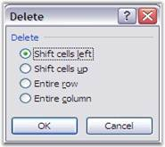
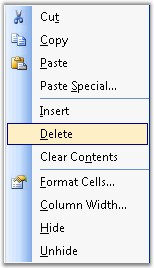

::: {style="DISPLAY: none"}
{#d2h_url_template}{#d2h_package_url style="WIDTH: 0px; DISPLAY: none; HEIGHT: 0px"}
:::

:::: {.d2h_secondary_topic style="PADDING-BOTTOM: 10pt; MARGIN: 0pt; PADDING-LEFT: 0pt; PADDING-RIGHT: 0pt; PADDING-TOP: 0pt"}
#### Delete {#delete style="tab-stops: 0pt"}

**[]{style="FONT-FAMILY: 'Segoe UI','sans-serif'; COLOR: black"}** 

It is often necessary to delete unwanted cells, rows and columns in a spreadsheet, when you want to manipulate cells. MS Excel provides various options to delete cells, rows and columns. You can delete a cell by right-clicking on it, and selecting the **Delete** option from the context menu. On selecting the Delete option, the **Delete** dialog box prompts for an option to be selected as shown in the following screen shot.

[]{style="FONT-FAMILY: 'Trebuchet MS','sans-serif'; COLOR: #15428b; FONT-SIZE: 9pt"} 

{border="0"}

Figure 59: Delete Dialog Box in Excel[]{style="FONT-FAMILY: 'Trebuchet MS','sans-serif'; COLOR: #15428b"}

 

To delete a cell in XlsIO, you can make use of the **Clear** method. Following code example demonstrates this.

 

+------------------------------------------------------------------------------------------------------+
| **[\[C#\]]{style="FONT-FAMILY: 'Courier New'"}**                                                     |
|                                                                                                      |
| **[]{style="FONT-FAMILY: 'Courier New'"}**                                                           |
|                                                                                                      |
| [// Shifts cell left after deletion.]{style="FONT-FAMILY: 'Courier New'; COLOR: green"}              |
|                                                                                                      |
| [mySheet.Range\[\"A1:E1\"\].Clear(ExcelMoveDirection.MoveLeft);]{style="FONT-FAMILY: 'Courier New'"} |
|                                                                                                      |
| []{style="FONT-FAMILY: 'Courier New'"}                                                               |
|                                                                                                      |
| [// Shifts cell up after deletion.]{style="FONT-FAMILY: 'Courier New'; COLOR: green"}                |
|                                                                                                      |
| [mySheet.Range\[\"A1:A6\"\].Clear(ExcelMoveDirection.MoveUp);]{style="FONT-FAMILY: 'Courier New'"}   |
+------------------------------------------------------------------------------------------------------+

[]{style="FONT-FAMILY: 'Trebuchet MS','sans-serif'; COLOR: #15428b; FONT-SIZE: 9pt"} 

+---------------------------------------------------------------------------------------------------+
| **[\[VB.NET\]]{style="FONT-FAMILY: 'Courier New'"}**                                              |
|                                                                                                   |
| **[]{style="FONT-FAMILY: 'Courier New'"}**                                                        |
|                                                                                                   |
| [\' Shifts cell left after deletion.]{style="FONT-FAMILY: 'Courier New'; COLOR: green"}           |
|                                                                                                   |
| [mySheet.Range(\"A1:E1\").Clear(ExcelMoveDirection.MoveLeft)]{style="FONT-FAMILY: 'Courier New'"} |
|                                                                                                   |
| [  ]{style="FONT-FAMILY: 'Courier New'"}                                                          |
|                                                                                                   |
| [\' Shifts cell up after deletion.]{style="FONT-FAMILY: 'Courier New'; COLOR: green"}             |
|                                                                                                   |
| [mySheet.Range(\"A1:A6\").Clear(ExcelMoveDirection.MoveUp)]{style="FONT-FAMILY: 'Courier New'"}   |
+---------------------------------------------------------------------------------------------------+

 

Delete Rows and Columns

 

MS Excel allows to delete rows and columns in a spreadsheet, by selecting and deleting the rows, through the context menu that appears on right-clicking.

[]{style="FONT-FAMILY: 'Trebuchet MS','sans-serif'; COLOR: #15428b; FONT-SIZE: 9pt"} 

{border="0"}

Figure 60: Context menu on right-clicking the cell[]{style="FONT-FAMILY: 'Trebuchet MS','sans-serif'; COLOR: #15428b"}

 

Deleting a row, will move the below rows one step up and deleting a column, will move the columns to the right, one step to the left respectively.

 

XlsIO allows deleting rows and columns by using the **IWorksheet.DeleteRow** and **IWorksheet.DeleteColumn** methods. Following code example illustrates how to delete rows and columns.

 

+-------------------------------------------------------------------------+
| **[\[C#\]]{style="FONT-FAMILY: 'Courier New'"}**                        |
|                                                                         |
| **[]{style="FONT-FAMILY: 'Courier New'"}**                              |
|                                                                         |
| [// Deleting Row.]{style="FONT-FAMILY: 'Courier New'; COLOR: green"}    |
|                                                                         |
| [sheet.DeleteRow(3);]{style="FONT-FAMILY: 'Courier New'"}               |
|                                                                         |
| []{style="FONT-FAMILY: 'Courier New'"}                                  |
|                                                                         |
| [// Deleting Column.]{style="FONT-FAMILY: 'Courier New'; COLOR: green"} |
|                                                                         |
| [sheet.DeleteColumn(2);]{style="FONT-FAMILY: 'Courier New'"}            |
+-------------------------------------------------------------------------+

[]{style="FONT-FAMILY: 'Trebuchet MS','sans-serif'; COLOR: #15428b; FONT-SIZE: 9pt"} 

+---------------------------------------------------------------------------+
| **[\[VB.NET\]]{style="FONT-FAMILY: 'Courier New'"}**                      |
|                                                                           |
| **[]{style="FONT-FAMILY: 'Courier New'"}**                                |
|                                                                           |
| [\' Deleting Rows.]{style="FONT-FAMILY: 'Courier New'; COLOR: green"}     |
|                                                                           |
| [sheet.DeleteRow(3)]{style="FONT-FAMILY: 'Courier New'; COLOR: black"}    |
|                                                                           |
| []{style="FONT-FAMILY: 'Courier New'"}                                    |
|                                                                           |
| [\' Deleting Columns.]{style="FONT-FAMILY: 'Courier New'; COLOR: green"}  |
|                                                                           |
| [sheet.DeleteColumn(2)]{style="FONT-FAMILY: 'Courier New'; COLOR: black"} |
+---------------------------------------------------------------------------+

 

You can also delete multiple rows as follows.

 

+----------------------------------------------------------------------------------------------------+
| **[\[C#\]]{style="FONT-FAMILY: 'Courier New'"}**                                                   |
|                                                                                                    |
| **[]{style="FONT-FAMILY: 'Courier New'"}**                                                         |
|                                                                                                    |
| [// Deleting Rows.]{style="FONT-FAMILY: 'Courier New'; COLOR: green"}                              |
|                                                                                                    |
| [sheet.DeleteRow(startRow, NoOfRows);]{style="FONT-FAMILY: 'Courier New'; COLOR: #001554"}         |
|                                                                                                    |
| []{style="FONT-FAMILY: 'Courier New'"}                                                             |
|                                                                                                    |
| [// Deleting Columns.]{style="FONT-FAMILY: 'Courier New'; COLOR: green"}                           |
|                                                                                                    |
| [sheet.DeleteColumn(startColumn, NoOfColumn);]{style="FONT-FAMILY: 'Courier New'; COLOR: #001554"} |
+----------------------------------------------------------------------------------------------------+

[]{style="FONT-FAMILY: 'Trebuchet MS','sans-serif'; COLOR: #15428b; FONT-SIZE: 9pt"} 

+---------------------------------------------------------------------------------------------------+
| **[\[VB.NET\]]{style="FONT-FAMILY: 'Courier New'"}**                                              |
|                                                                                                   |
| **[]{style="FONT-FAMILY: 'Courier New'"}**                                                        |
|                                                                                                   |
| [\' Deleting Rows.]{style="FONT-FAMILY: 'Courier New'; COLOR: green"}                             |
|                                                                                                   |
| [sheet.DeleteRow(startRow, NoOfRows)]{style="FONT-FAMILY: 'Courier New'; COLOR: #001554"}         |
|                                                                                                   |
| []{style="FONT-FAMILY: 'Courier New'"}                                                            |
|                                                                                                   |
| [\' Deleting Columns.]{style="FONT-FAMILY: 'Courier New'; COLOR: green"}                          |
|                                                                                                   |
| [sheet.DeleteColumn(startColumn, NoOfColumn)]{style="FONT-FAMILY: 'Courier New'; COLOR: #001554"} |
+---------------------------------------------------------------------------------------------------+

::: {style="BORDER-BOTTOM: windowtext 1pt solid; BORDER-LEFT: medium none; PADDING-BOTTOM: 1pt; MARGIN-TOP: 9pt; PADDING-LEFT: 0pt; PADDING-RIGHT: 0pt; MARGIN-BOTTOM: 9pt; BORDER-TOP: windowtext 1pt solid; BORDER-RIGHT: medium none; PADDING-TOP: 1pt"}
 

{border="0"}Note: Deletion by using above method is more efficient than looping.

 

{border="0"}Note: Row/Column index of these methods are \"one based\".

 
:::

 

[]{#related-topics}
::::
