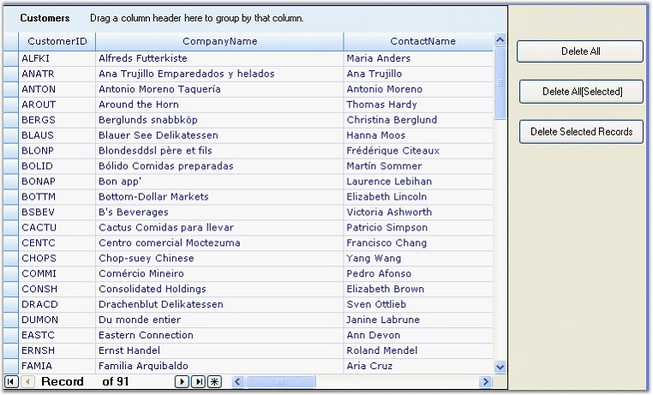

::: {style="DISPLAY: none"}
{#d2h_url_template}{#d2h_package_url style="WIDTH: 0px; DISPLAY: none; HEIGHT: 0px"}
:::

::: {.d2h_secondary_topic style="PADDING-BOTTOM: 10pt; MARGIN: 0pt; PADDING-LEFT: 0pt; PADDING-RIGHT: 0pt; PADDING-TOP: 0pt"}
#### Delete Collection of Records in GridGroupingControl {#delete-collection-of-records-in-gridgroupingcontrol style="tab-stops: 0pt"}

[]{style="FONT-FAMILY: 'Trebuchet MS','sans-serif'; COLOR: #15428b; FONT-SIZE: 9pt"} 

Essential **GridGroupingControl** now supports deletion of collection of Records from the **GridGroupingControl** instead of deleting records one by one.

**GridGroupingControl** supports three methods of deleting records.

 

[·      ]{style="FONT-FAMILY: Symbol"}**DeleteAll -** Deletes all the records

[·      ]{style="FONT-FAMILY: Symbol"}**Delete All\[Selected\] -** Delect selected records

[·      ]{style="FONT-FAMILY: Symbol"}**Delete Selected Records -** Deletes Specified records

 

**[]{style="FONT-FAMILY: 'Trebuchet MS','sans-serif'; COLOR: #15428b; FONT-SIZE: 9pt"}** 

For these methods **DeleteAll** have been implemented to support delete all the records,**Delete All\[Selected\]** deletes selected records, and **Delete Selected Records** delete specified records from the **GridGroupingControl**.

 

 

**Deleting All**

 

The following code illustrates deleting all the records.

[]{style="FONT-FAMILY: 'Trebuchet MS','sans-serif'; COLOR: #15428b; FONT-SIZE: 9pt"} 

+-----------------------------------------------------------------------------------------------+
| **[\[C#\]]{style="FONT-FAMILY: 'Courier New'"}**                                              |
|                                                                                               |
| **[]{style="FONT-FAMILY: 'Courier New'"}**                                                    |
|                                                                                               |
| [//This will delete all the records from the grid table.]{style="FONT-FAMILY: 'Courier New'"} |
|                                                                                               |
| [this.gridGroupingControl1.Table.Records.DeleteAll();]{style="FONT-FAMILY: 'Courier New'"}    |
+-----------------------------------------------------------------------------------------------+

[]{style="FONT-FAMILY: 'Trebuchet MS','sans-serif'; COLOR: #15428b; FONT-SIZE: 9pt"} 

When the code runs, Deleting all records is bound to **Delete All** button.

 

**Deleting Selected Records**

The following code illustrates deleting records manually selected. 

[]{style="FONT-FAMILY: 'Trebuchet MS','sans-serif'; COLOR: #15428b; FONT-SIZE: 9pt"} 

+----------------------------------------------------------------------------------------------------+
| **[\[C#\]]{style="FONT-FAMILY: 'Courier New'"}**                                                   |
|                                                                                                    |
| **[]{style="FONT-FAMILY: 'Courier New'"}**                                                         |
|                                                                                                    |
| [// this will delete selected records from the grid table. ]{style="FONT-FAMILY: 'Courier New'"}   |
|                                                                                                    |
| [this.gridGroupingControl1.Table.SelectedRecords.DeleteAll();]{style="FONT-FAMILY: 'Courier New'"} |
+----------------------------------------------------------------------------------------------------+

 

When the code runs,  Deleting manually selected record is bound to **Delete All\[Selected\]** button 

 

**Deleting Specified Records**

The following code illustrates deleting Specified records.

{border="0"}***Note***: Parameter -- Specify the collection of records need to be deleted.

[]{style="FONT-FAMILY: 'Trebuchet MS','sans-serif'; COLOR: #15428b; FONT-SIZE: 9pt"} 

+----------------------------------------------------------------------------------------------------+
| **[\[C#\]]{style="FONT-FAMILY: 'Courier New'"}**                                                   |
|                                                                                                    |
| **[]{style="FONT-FAMILY: 'Courier New'"}**                                                         |
|                                                                                                    |
| [//Delete the specified records from the table ]{style="FONT-FAMILY: 'Courier New'"}               |
|                                                                                                    |
| [ this.gridGroupingControl1.Table.Records.DeleteRecords(rec);]{style="FONT-FAMILY: 'Courier New'"} |
+----------------------------------------------------------------------------------------------------+

[]{style="FONT-FAMILY: 'Trebuchet MS','sans-serif'; COLOR: #15428b; FONT-SIZE: 9pt"} 

When the code runs,  Deleting specified records are bound to **Delete Selected Records** button.

[]{style="FONT-FAMILY: 'Trebuchet MS','sans-serif'; COLOR: #15428b; FONT-SIZE: 9pt"} 

{border="0"}

 

*[Figure ]{style="FONT-SIZE: 9pt"}[416]{style="FONT-SIZE: 9pt"}[: Delete Collection of Records in GridGroupingControl]{style="FONT-SIZE: 9pt"}*

***[]{style="FONT-FAMILY: 'Trebuchet MS','sans-serif'; COLOR: #15428b; FONT-SIZE: 9pt"}*** 

[]{style="FONT-FAMILY: 'Times New Roman','serif'; FONT-SIZE: 12pt"} 

 

[]{#p515} 

 

[]{#related-topics}
:::
