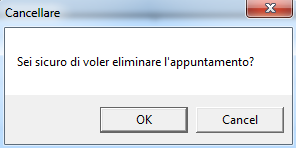

::: {style="DISPLAY: none"}
{#d2h_url_template}{#d2h_package_url style="WIDTH: 0px; DISPLAY: none; HEIGHT: 0px"}
:::

:::: {.d2h_secondary_topic style="PADDING-BOTTOM: 10pt; MARGIN: 0pt; PADDING-LEFT: 0pt; PADDING-RIGHT: 0pt; PADDING-TOP: 0pt"}
##### "Delete" Message Box {#delete-message-box style="tab-stops: 0pt"}

 

Table 7: Delete

::: {align="center"}
  ------------------------------------ --------------------------------------------------
  lNames in Resource File              Values
  AppointmentDeleteMessageBoxContent   Are you sure you want to delete the Appointment?
  AppointmentDeleteMessageBoxHeader    Delete
  ------------------------------------ --------------------------------------------------
:::

 

{border="0"}

Figure 33: Delete

 

[]{#related-topics}
::::
