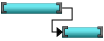
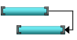
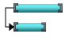
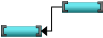
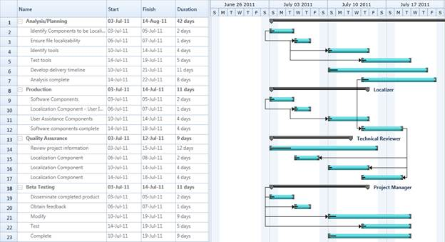

::: {style="DISPLAY: none"}
{#d2h_url_template}{#d2h_package_url style="WIDTH: 0px; DISPLAY: none; HEIGHT: 0px"}
:::

::::: {#nsbanner .d2h_main_nsbanner style="BORDER-BOTTOM: #999999 1px solid; POSITION: relative; PADDING-BOTTOM: 0px; BACKGROUND-COLOR: transparent; PADDING-LEFT: 0px; PADDING-RIGHT: 0px; DISPLAY: none; BORDER-TOP: #999999 1px solid; PADDING-TOP: 0px; LEFT: 0px"}
:::: {#TitleRow .d2h_main_titlerow style="PADDING-BOTTOM: 4px; BACKGROUND-COLOR: transparent; PADDING-LEFT: 22px; WIDTH: 100%; PADDING-RIGHT: 10px; DISPLAY: none; PADDING-TOP: 4px"}
::: {#ienav .d2h_main_ienav style="DISPLAY: none"}
{#D2HPrevious .D2HPreviousEnabled}  {#D2HNext .D2HNextEnabled}
:::
::::
:::::

::::: {#nstext .d2h_main_nstext style="PADDING-BOTTOM: 10px; BACKGROUND-COLOR: transparent; PADDING-LEFT: 22px; PADDING-RIGHT: 10px; HEIGHT: 100%; OVERFLOW: auto; PADDING-TOP: 5px" hasuserbackground="true" valign="bottom"}
::: {#d2h_breadcrumbs .d2h_breadcrumbs}
[Essential Studio User Guide Documentation](ms-xhelp:///?Id=12457748-09e3-4d74-a240-8e049cedf030){.d2h_breadcrumbsNormal}[ \> ]{.d2h_breadcrumbsLinkSeparator}[User Interface Edition](ms-xhelp:///?Id=c29296b7-531c-413b-a0ec-488ca1f7f669){.d2h_breadcrumbsNormal}[ \> ]{.d2h_breadcrumbsLinkSeparator}[Essential Silverlight](ms-xhelp:///?Id=66221bd1-ba2e-43c2-94a7-618f50e01d24){.d2h_breadcrumbsNormal}[ \> ]{.d2h_breadcrumbsLinkSeparator}[Essential Gantt]{.d2h_breadcrumbsContentsOnly}[ \> ]{.d2h_breadcrumbsLinkSeparator}[Concepts and Features](ms-xhelp:///?Id=00182e64-b79e-45a4-817a-bc3646aff2c1){.d2h_breadcrumbsNormal}
:::

## Dependency Relationship {#dependency-relationship style="tab-stops: 0pt"}

Dependency relationship is  the relationship between two tasks. These relationship has been caterogrised into four types based on the start and finish date of the task. They are:

[·      ]{style="FONT-FAMILY: Symbol"}FinishToStart

[·      ]{style="FONT-FAMILY: Symbol"}FinishToFinish

[·      ]{style="FONT-FAMILY: Symbol"}StartToStart

[·      ]{style="FONT-FAMILY: Symbol"}StartToFinish

 

**Finish-to-start** -- You cannot start a task until the other task is completed.

{border="0"}

Figure 18: Finish-to-start[]{style="COLOR: black"}

[]{style="COLOR: black"} 

**Finish-to-finish -**  You cannot finish a task until the other task is completed.

[]{style="COLOR: black"} 

{border="0"}

Figure 19: Finish-to-finish[]{style="COLOR: black"}

[]{style="COLOR: black"} 

**Start-to-start** -- You cannot start a task until the other task is also started.

[]{style="COLOR: black"} 

{border="0"}

Figure 20: Start-to-start[]{style="COLOR: black"}

[]{style="COLOR: black"} 

**Start-to-Finish --** You cannot finish a task until another the other task is started.

[]{style="COLOR: black"} 

{border="0"}

Figure 21: Start-to-Finish[]{style="COLOR: black"}

[]{style="FONT-SIZE: 11pt"} 

Properties

[]{style="FONT-STYLE: normal"} 

::: {align="center"}
+-----------------------+--------------------------------------------------------------------------------+-----------------+-------------+-----------------+
| Property              | Description                                                                    | Type            | Data Type   | Reference links |
+-----------------------+--------------------------------------------------------------------------------+-----------------+-------------+-----------------+
| Prodecessor           | This enables you to set the relationship between the task.                     | **Object**      | Object      | NA              |
+-----------------------+--------------------------------------------------------------------------------+-----------------+-------------+-----------------+
| GanttTaskRelationship | This contains four relationships. They are:                                    | **Predecessor** | Enum        | NA              |
|                       |                                                                                |                 |             |                 |
|                       | StartToStart                                                                   |                 |             |                 |
|                       |                                                                                |                 |             |                 |
|                       | StartToFinish                                                                  |                 |             |                 |
|                       |                                                                                |                 |             |                 |
|                       | FinishToFinish                                                                 |                 |             |                 |
|                       |                                                                                |                 |             |                 |
|                       | FinishToStart                                                                  |                 |             |                 |
|                       |                                                                                |                 |             |                 |
|                       | You can asign this to the *TaskDetails* to set the relationship between tasks. |                 |             |                 |
+-----------------------+--------------------------------------------------------------------------------+-----------------+-------------+-----------------+
:::

[]{style="FONT-FAMILY: 'Calibri','sans-serif'; COLOR: black"} 

Specifing the Relationship between Tasks

[]{style="COLOR: #c00000"} 

The following code illustrates how to add the Dependency Relationship between tasks:

 

+--------------------------------------------------------------------------------------------------------------------------------------------------------------------------------------------------------------------------------+
| **[\[C#\]]{style="FONT-FAMILY: 'Courier New'"}**                                                                                                                                                                               |
|                                                                                                                                                                                                                                |
| [GanttItemSource]{style="FONT-FAMILY: 'Courier New'"}[ = [new]{style="COLOR: blue"} [ObservableCollection]{style="COLOR: #2b91af"}\<[TaskDetails]{style="COLOR: #2b91af"}\>();]{style="FONT-FAMILY: 'Courier New'"}            |
|                                                                                                                                                                                                                                |
| [GanttItemSource = ]{style="FONT-FAMILY: 'Courier New'"}[GetDataSourceStartToStart();]{style="FONT-FAMILY: 'Courier New'"}                                                                                                     |
|                                                                                                                                                                                                                                |
| []{style="FONT-FAMILY: 'Courier New'; COLOR: blue"}                                                                                                                                                                            |
|                                                                                                                                                                                                                                |
| [ObservableCollection]{style="FONT-FAMILY: 'Courier New'; COLOR: #2b91af"}[\<[TaskDetails]{style="COLOR: #2b91af"}\> GetDataSourceStartToStart()\                                                                              |
| {\                                                                                                                                                                                                                             |
| [ObservableCollection]{style="COLOR: #2b91af"}\<[TaskDetails]{style="COLOR: #2b91af"}\> task = [ObservableCollection]{style="COLOR: #2b91af"}\<[TaskDetails]{style="COLOR: #2b91af"}\>();]{style="FONT-FAMILY: 'Courier New'"} |
|                                                                                                                                                                                                                                |
| [\                                                                                                                                                                                                                             |
| task.Add([new]{style="COLOR: blue"} [TaskDetails]{style="COLOR: #2b91af"} { TaskId = 1, ]{style="FONT-FAMILY: 'Courier New'"}                                                                                                  |
|                                                                                                                                                                                                                                |
| [                           TaskName = [\"Scope\"]{style="COLOR: #a31515"}, ]{style="FONT-FAMILY: 'Courier New'"}                                                                                                              |
|                                                                                                                                                                                                                                |
| [                           StartDate = [new]{style="COLOR: blue"} [DateTime]{style="COLOR: #2b91af"}(2011, 1, 3), ]{style="FONT-FAMILY: 'Courier New'"}                                                                       |
|                                                                                                                                                                                                                                |
| [                           FinishDate = [new]{style="COLOR: blue"} [DateTime]{style="COLOR: #2b91af"}(2011, 1, 14),  ]{style="FONT-FAMILY: 'Courier New'"}                                                                    |
|                                                                                                                                                                                                                                |
| [                           Progress = 40d });\                                                                                                                                                                                |
| task\[0\].Child.Add([new]{style="COLOR: blue"} [TaskDetails]{style="COLOR: #2b91af"} { TaskId = 2, ]{style="FONT-FAMILY: 'Courier New'"}                                                                                       |
|                                                                                                                                                                                                                                |
| [                    TaskName = [\"Determine project office scope\"]{style="COLOR: #a31515"}, ]{style="FONT-FAMILY: 'Courier New'"}                                                                                            |
|                                                                                                                                                                                                                                |
| [                    StartDate = [new]{style="COLOR: blue"} [DateTime]{style="COLOR: #2b91af"}(2011, 1, 3), ]{style="FONT-FAMILY: 'Courier New'"}                                                                              |
|                                                                                                                                                                                                                                |
| [                    FinishDate = [new]{style="COLOR: blue"} [DateTime]{style="COLOR: #2b91af"}(2011, 1, 5), ]{style="FONT-FAMILY: 'Courier New'"}                                                                             |
|                                                                                                                                                                                                                                |
| [                    Progress = 20d });\                                                                                                                                                                                       |
| task\[0\].Child.Add([new]{style="COLOR: blue"} [TaskDetails]{style="COLOR: #2b91af"} { TaskId = 3, ]{style="FONT-FAMILY: 'Courier New'"}                                                                                       |
|                                                                                                                                                                                                                                |
| [                    TaskName = [\"Justify Project Offfice via business model\"]{style="COLOR: #a31515"}, ]{style="FONT-FAMILY: 'Courier New'"}                                                                                |
|                                                                                                                                                                                                                                |
| [                    StartDate = [new]{style="COLOR: blue"} [DateTime]{style="COLOR: #2b91af"}(2011, 1, 6), ]{style="FONT-FAMILY: 'Courier New'"}                                                                              |
|                                                                                                                                                                                                                                |
| [                    FinishDate = [new]{style="COLOR: blue"} [DateTime]{style="COLOR: #2b91af"}(2011, 1, 7), ]{style="FONT-FAMILY: 'Courier New'"}                                                                             |
|                                                                                                                                                                                                                                |
| [                    Progress = 20d });\                                                                                                                                                                                       |
| task\[0\].Child.Add([new]{style="COLOR: blue"} [TaskDetails]{style="COLOR: #2b91af"} { TaskId = 4, ]{style="FONT-FAMILY: 'Courier New'"}                                                                                       |
|                                                                                                                                                                                                                                |
| [                    TaskName = [\"Secure executive sponsorship\"]{style="COLOR: #a31515"}, ]{style="FONT-FAMILY: 'Courier New'"}                                                                                              |
|                                                                                                                                                                                                                                |
| [                    StartDate = [new]{style="COLOR: blue"} [DateTime]{style="COLOR: #2b91af"}(2011, 1, 10), ]{style="FONT-FAMILY: 'Courier New'"}                                                                             |
|                                                                                                                                                                                                                                |
| [                    FinishDate = [new]{style="COLOR: blue"} [DateTime]{style="COLOR: #2b91af"}(2011, 1, 14), ]{style="FONT-FAMILY: 'Courier New'"}                                                                            |
|                                                                                                                                                                                                                                |
| [                    Progress = 20d });]{style="FONT-FAMILY: 'Courier New'"}                                                                                                                                                   |
|                                                                                                                                                                                                                                |
| [task\[0\].Child.Add([new]{style="COLOR: blue"} [TaskDetails]{style="COLOR: #2b91af"} { TaskId = 5, ]{style="FONT-FAMILY: 'Courier New'"}                                                                                      |
|                                                                                                                                                                                                                                |
| [                    TaskName = [\"Secure complete\"]{style="COLOR: #a31515"}, ]{style="FONT-FAMILY: 'Courier New'"}                                                                                                           |
|                                                                                                                                                                                                                                |
| [                    StartDate = [new]{style="COLOR: blue"} [DateTime]{style="COLOR: #2b91af"}(2011, 1, 14), ]{style="FONT-FAMILY: 'Courier New'"}                                                                             |
|                                                                                                                                                                                                                                |
| [                    FinishDate = [new]{style="COLOR: blue"} [DateTime]{style="COLOR: #2b91af"}(2011, 1, 14), ]{style="FONT-FAMILY: 'Courier New'"}                                                                            |
|                                                                                                                                                                                                                                |
| [                    Progress = 20d });]{style="FONT-FAMILY: 'Courier New'"}                                                                                                                                                   |
|                                                                                                                                                                                                                                |
| []{style="FONT-FAMILY: 'Courier New'"}                                                                                                                                                                                         |
|                                                                                                                                                                                                                                |
| [//Adding dependency relationShip ]{style="FONT-FAMILY: 'Courier New'; COLOR: green"}[\                                                                                                                                        |
| task\[0\].Child\[1\].Predecessor.Add([new]{style="COLOR: blue"} [Predecessor]{style="COLOR: #2b91af"}() { GanttTaskIndex = 2, ]{style="FONT-FAMILY: 'Courier New'"}                                                            |
|                                                                                                                                                                                                                                |
| [             GanttTaskRelationship = [GanttTaskRelationship]{style="COLOR: #2b91af"}.StartToStart });\                                                                                                                        |
| \                                                                                                                                                                                                                              |
| ]{style="FONT-FAMILY: 'Courier New'"}                                                                                                                                                                                          |
|                                                                                                                                                                                                                                |
| [task\[0\].Child\[2\].Predecessor.Add([new]{style="COLOR: blue"} [Predecessor]{style="COLOR: #2b91af"}() { GanttTaskIndex = 3, ]{style="FONT-FAMILY: 'Courier New'"}                                                           |
|                                                                                                                                                                                                                                |
| [             GanttTaskRelationship = [GanttTaskRelationship]{style="COLOR: #2b91af"}.StartToFinish });]{style="FONT-FAMILY: 'Courier New'"}                                                                                   |
|                                                                                                                                                                                                                                |
| [\                                                                                                                                                                                                                             |
| task\[0\].Child\[3\].Predecessor.Add([new]{style="COLOR: blue"} [Predecessor]{style="COLOR: #2b91af"}() { GanttTaskIndex = 3, ]{style="FONT-FAMILY: 'Courier New'"}                                                            |
|                                                                                                                                                                                                                                |
| [             GanttTaskRelationship = [GanttTaskRelationship]{style="COLOR: #2b91af"}.FinishToFinish });]{style="FONT-FAMILY: 'Courier New'"}                                                                                  |
|                                                                                                                                                                                                                                |
| [return ]{style="FONT-FAMILY: 'Courier New'; COLOR: blue"}[task;]{style="FONT-FAMILY: 'Courier New'"}                                                                                                                          |
|                                                                                                                                                                                                                                |
| [}\                                                                                                                                                                                                                            |
| \                                                                                                                                                                                                                              |
| ]{style="FONT-FAMILY: 'Courier New'"}[]{style="FONT-FAMILY: 'Courier New'"}                                                                                                                                                    |
+--------------------------------------------------------------------------------------------------------------------------------------------------------------------------------------------------------------------------------+

 

{border="0"}

Figure 22: Dependency Relationship  

[]{style="COLOR: #c00000"} 

Samples Link

To view samples:

1.   Select Start -\> Programs -\> Syncfusion -\> Essential Studio x.x.xx -\> Dashboard.

2.   Click **Run Samples** for Silverlight under User Interface Edition panel .

3.   Select **Gantt**.

4.   Expand the Connectors Features item in the Sample Browser.

5.   Choose the Predecessor samples to launch.

 

More:

[ ]{#related-topics}

[{border="0" align="absMiddle"}Dynamic Predecessors and Resources](ms-xhelp:///?Id=ecff4c9c-4613-4e3a-83d0-6bd99d5c9caa){style="TEXT-DECORATION: none"}
:::::
