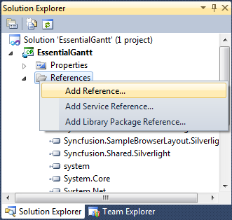
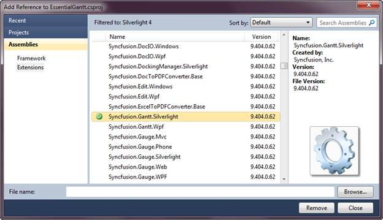

::: {style="DISPLAY: none"}
{#d2h_url_template}{#d2h_package_url style="WIDTH: 0px; DISPLAY: none; HEIGHT: 0px"}
:::

::::: {#nsbanner .d2h_main_nsbanner style="BORDER-BOTTOM: #999999 1px solid; POSITION: relative; PADDING-BOTTOM: 0px; BACKGROUND-COLOR: transparent; PADDING-LEFT: 0px; PADDING-RIGHT: 0px; DISPLAY: none; BORDER-TOP: #999999 1px solid; PADDING-TOP: 0px; LEFT: 0px"}
:::: {#TitleRow .d2h_main_titlerow style="PADDING-BOTTOM: 4px; BACKGROUND-COLOR: transparent; PADDING-LEFT: 22px; WIDTH: 100%; PADDING-RIGHT: 10px; DISPLAY: none; PADDING-TOP: 4px"}
::: {#ienav .d2h_main_ienav style="DISPLAY: none"}
{#D2HPrevious .D2HPreviousEnabled}  {#D2HNext .D2HNextEnabled}
:::
::::
:::::

:::: {#nstext .d2h_main_nstext style="PADDING-BOTTOM: 10px; BACKGROUND-COLOR: transparent; PADDING-LEFT: 22px; PADDING-RIGHT: 10px; HEIGHT: 100%; OVERFLOW: auto; PADDING-TOP: 5px" hasuserbackground="true" valign="bottom"}
::: {#d2h_breadcrumbs .d2h_breadcrumbs}
[Essential Studio User Guide Documentation](ms-xhelp:///?Id=12457748-09e3-4d74-a240-8e049cedf030){.d2h_breadcrumbsNormal}[ \> ]{.d2h_breadcrumbsLinkSeparator}[User Interface Edition](ms-xhelp:///?Id=c29296b7-531c-413b-a0ec-488ca1f7f669){.d2h_breadcrumbsNormal}[ \> ]{.d2h_breadcrumbsLinkSeparator}[Essential Silverlight](ms-xhelp:///?Id=66221bd1-ba2e-43c2-94a7-618f50e01d24){.d2h_breadcrumbsNormal}[ \> ]{.d2h_breadcrumbsLinkSeparator}[Essential Gantt]{.d2h_breadcrumbsContentsOnly}[ \> ]{.d2h_breadcrumbsLinkSeparator}[Installation and Deployment](ms-xhelp:///?Id=5a69ecae-457d-48a6-8774-294952384d80){.d2h_breadcrumbsNormal}
:::

## Deployment Procedures {#deployment-procedures style="tab-stops: 0pt"}

Deployment Requirements

While deploying an application that references Syncfusion Essential Gantt Silverlight assembly, the following dependencies must be included in the distribution.

 

[·      ]{style="FONT-FAMILY: Symbol"}Syncfusion.Core.dll

[·      ]{style="FONT-FAMILY: Symbol"}Syncfusion.Gantt.Silverlight.dll

[·      ]{style="FONT-FAMILY: Symbol"}Syncfusion.Grid.Silverlight.dll

[·      ]{style="FONT-FAMILY: Symbol"}Syncfusion.GridCommon.Silverlight.dll

[·      ]{style="FONT-FAMILY: Symbol"}Syncfusion.Linq.Silverlight.dll

[·      ]{style="FONT-FAMILY: Symbol"}Syncfusion.Shared.Silverlight.dll

 

[]{style="FONT-SIZE: 11pt"} 

Default Deployment Pattern

The following are the steps to deploy the Essential Gantt for Silverlight:

1.   In **Visual Studio**,  **Solution Explorer**, right click on the **References** and select **Add Reference**.

 

{border="0"}

Figure 5: Solution Explorer

 

2.   The **Add Reference** window opens.

 

{border="0"}

Figure 6: Add Reference

 

 

3.   Add the following assembly to the project **References** folder.

 

[·      ]{style="FONT-FAMILY: Symbol; COLOR: black"}Syncfusion.Gantt.Silverlight.dll[]{style="COLOR: black"}

[·      ]{style="FONT-FAMILY: Symbol; COLOR: black"}Syncfusion.Grid.Silverlight.dll[]{style="COLOR: black"}

[·      ]{style="FONT-FAMILY: Symbol; COLOR: black"}Syncfusion.GridCommon.Silverlight.dll[]{style="COLOR: black"}

[·      ]{style="FONT-FAMILY: Symbol; COLOR: black"}Syncfusion.Linq.Silverlight.dll[]{style="COLOR: black"}

[·      ]{style="FONT-FAMILY: Symbol; COLOR: black"}Syncfusion.Shared.Silverlight.dll[]{style="COLOR: black"}

 

 

 

[]{style="COLOR: #c00000"} 

Fast Deployment Pattern

In **Visual Studio Integrated Development Environment (IDE)**, **Solution Explorer**, right click  the **bin**folder and add the following assemplies:

 

[·      ]{style="FONT-FAMILY: Symbol"}Syncfusion.Gantt.Silverlight.dll

[·      ]{style="FONT-FAMILY: Symbol"}Syncfusion.Grid.Silverlight.dll

[·      ]{style="FONT-FAMILY: Symbol"}Syncfusion.GridCommon.Silverlight.dll

[·      ]{style="FONT-FAMILY: Symbol"}Syncfusion.Linq.Silverlight.dll

[·      ]{style="FONT-FAMILY: Symbol"}Syncfusion.Shared.Silverlight.dll  

 

These assemblies will be available in the following loction:

*** \[Root Folder\]:\\Program Files\\Syncfusion\\Essential Studio\\\[Version number\]\\Assemblies\\4.0***

***                              ***

[]{#related-topics}
::::
