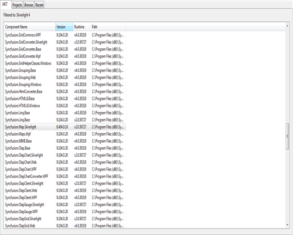

::: {style="DISPLAY: none"}
{#d2h_url_template}{#d2h_package_url style="WIDTH: 0px; DISPLAY: none; HEIGHT: 0px"}
:::

::::: {#nsbanner .d2h_main_nsbanner style="BORDER-BOTTOM: #999999 1px solid; POSITION: relative; PADDING-BOTTOM: 0px; BACKGROUND-COLOR: transparent; PADDING-LEFT: 0px; PADDING-RIGHT: 0px; DISPLAY: none; BORDER-TOP: #999999 1px solid; PADDING-TOP: 0px; LEFT: 0px"}
:::: {#TitleRow .d2h_main_titlerow style="PADDING-BOTTOM: 4px; BACKGROUND-COLOR: transparent; PADDING-LEFT: 22px; WIDTH: 100%; PADDING-RIGHT: 10px; DISPLAY: none; PADDING-TOP: 4px"}
::: {#ienav .d2h_main_ienav style="DISPLAY: none"}
{#D2HPrevious .D2HPreviousEnabled}  {#D2HNext .D2HNextEnabled}
:::
::::
:::::

:::: {#nstext .d2h_main_nstext style="PADDING-BOTTOM: 10px; BACKGROUND-COLOR: transparent; PADDING-LEFT: 22px; PADDING-RIGHT: 10px; HEIGHT: 100%; OVERFLOW: auto; PADDING-TOP: 5px" hasuserbackground="true" valign="bottom"}
::: {#d2h_breadcrumbs .d2h_breadcrumbs}
[Essential Studio User Guide Documentation](ms-xhelp:///?Id=12457748-09e3-4d74-a240-8e049cedf030){.d2h_breadcrumbsNormal}[ \> ]{.d2h_breadcrumbsLinkSeparator}[User Interface Edition](ms-xhelp:///?Id=c29296b7-531c-413b-a0ec-488ca1f7f669){.d2h_breadcrumbsNormal}[ \> ]{.d2h_breadcrumbsLinkSeparator}[Essential Silverlight](ms-xhelp:///?Id=66221bd1-ba2e-43c2-94a7-618f50e01d24){.d2h_breadcrumbsNormal}[ \> ]{.d2h_breadcrumbsLinkSeparator}[Essential Maps]{.d2h_breadcrumbsContentsOnly}[ \> ]{.d2h_breadcrumbsLinkSeparator}[Installation and Deployment](ms-xhelp:///?Id=c330ba1c-3288-4c13-acad-62446ef3fa47){.d2h_breadcrumbsNormal}
:::

## Deployment Procedures {#deployment-procedures style="tab-stops: 0pt"}

 

Deployment Requirements

 

When deploying an application that references Syncfusion Essential Maps Silverlight assembly, the following dependencies must be included in the distribution:

[·      ]{style="FONT-FAMILY: Symbol"}Syncfusion.Maps.Silverlight.dll

 

Default Deployment Pattern

 

The following steps are involved to deploy Essential Maps for Silverlight from Global Assembly Cache (GAC).

 

1.   In Visual Studio, on Solution Explorer, right-click References and select Add Reference.

 

{border="0"}

Figure 5: Adding Reference in Visual Studio

[]{style="FONT-SIZE: 9pt"} 

2.   The **Add Reference** window will open.

3.   Select the **.Net Components** tab. Now a list of assemblies will be displayed, which is available in GAC.

4.   Then select **Syncfusion.Maps.Silverlight.dll**.

{border="0"}

Figure 6: Adding Syncfusion.Maps.Silverlight.dll

 

Fast Deployment Pattern

 

In Visual Studio Integrated Development Environment (IDE), at Solution Explorer, right click the "bin" folder and add the Syncfusion.Maps.Silverlight from the following location.

\[Root Folder\]:\\Program Files\\Syncfusion\\Essential Studio\\\[Version number\]\\Assemblies\\4.0

Then, add the reference of Syncfusion.Maps.Silverlight.dlll from the bin folder.

 

Partial/Medium Trust Support

 

Partial Deployment was not supported.

 

[]{#related-topics}
::::
