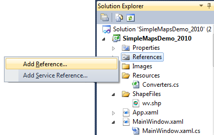
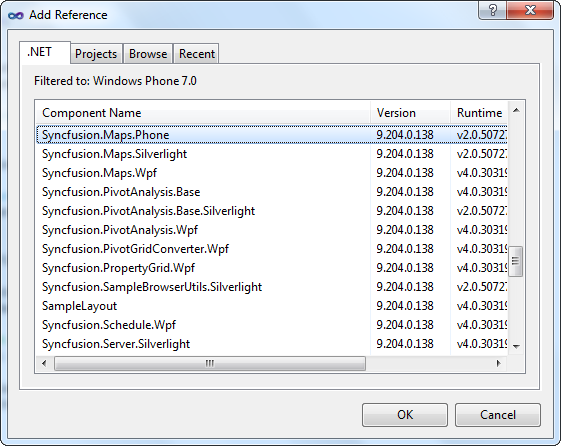

::: {style="DISPLAY: none"}
{#d2h_url_template}{#d2h_package_url style="WIDTH: 0px; DISPLAY: none; HEIGHT: 0px"}
:::

::::: {#nsbanner .d2h_main_nsbanner style="BORDER-BOTTOM: #999999 1px solid; POSITION: relative; PADDING-BOTTOM: 0px; BACKGROUND-COLOR: transparent; PADDING-LEFT: 0px; PADDING-RIGHT: 0px; DISPLAY: none; BORDER-TOP: #999999 1px solid; PADDING-TOP: 0px; LEFT: 0px"}
:::: {#TitleRow .d2h_main_titlerow style="PADDING-BOTTOM: 4px; BACKGROUND-COLOR: transparent; PADDING-LEFT: 22px; WIDTH: 100%; PADDING-RIGHT: 10px; DISPLAY: none; PADDING-TOP: 4px"}
::: {#ienav .d2h_main_ienav style="DISPLAY: none"}
{#D2HPrevious .D2HPreviousEnabled}  {#D2HNext .D2HNextEnabled}
:::
::::
:::::

:::: {#nstext .d2h_main_nstext style="PADDING-BOTTOM: 10px; BACKGROUND-COLOR: transparent; PADDING-LEFT: 22px; PADDING-RIGHT: 10px; HEIGHT: 100%; OVERFLOW: auto; PADDING-TOP: 5px" hasuserbackground="true" valign="bottom"}
::: {#d2h_breadcrumbs .d2h_breadcrumbs}
[Essential Studio User Guide Documentation](ms-xhelp:///?Id=12457748-09e3-4d74-a240-8e049cedf030){.d2h_breadcrumbsNormal}[ \> ]{.d2h_breadcrumbsLinkSeparator}[User Interface Edition](ms-xhelp:///?Id=c29296b7-531c-413b-a0ec-488ca1f7f669){.d2h_breadcrumbsNormal}[ \> ]{.d2h_breadcrumbsLinkSeparator}[Essential Windows Phone](ms-xhelp:///?Id=5ea1999c-4eff-4775-b84e-407dc825f555){.d2h_breadcrumbsNormal}[ \> ]{.d2h_breadcrumbsLinkSeparator}[Essential Maps]{.d2h_breadcrumbsContentsOnly}[ \> ]{.d2h_breadcrumbsLinkSeparator}[Installation and Deployment](ms-xhelp:///?Id=0f10cd79-9036-4b0a-8346-a5e6f3dd0c16){.d2h_breadcrumbsNormal}
:::

## Deployment Procedures {#deployment-procedures style="tab-stops: 0pt"}

 

Deployment Requirements

 

When deploying an application that references Syncfusion Essential Maps for Phone assembly, the following dependencies must be included in the distribution:

[·      ]{style="FONT-FAMILY: Symbol"}Syncfusion.Maps.Phone.dll

[·      ]{style="FONT-FAMILY: Symbol"}Microsoft.Phone.dll

 

Default Deployment Pattern

 

The following steps are involved to deploy Essential Maps for Windows Phone from GlobalAssemblyCache (GAC).

 

9.   In Visual Studio, on Solution Explorer, right-click References and select Add Reference.

 

{border="0"}

Figure 7: Adding Reference in Visual Studio

 

[]{style="FONT-SIZE: 9pt"} 

10.  The **Add Reference** window will open.

 

 

{border="0"}

Figure 8: The Add Reference Window

 

11.  Select the **.Net** tab.  Now a list of assemblies will be displayed, which is available in GAC.

12.  Then select **Syncfusion.Maps.Phone.dll**.

 

Fast Deployment Pattern

 

In Visual Studio Integrated Development Environment (IDE), at Solution Explorer, right click the *bin* folder and add the *Syncfusion.Maps.Phone* from the following location:

***\[Root Folder\]:\\Program Files\\Syncfusion\\Essential Studio\\\[Version number\]\\Assemblies\\4.0***

Then, add the reference of *Syncfusion.Maps.Phone.dll* from the bin folder.

 

Partial/Medium Trust Support

 

Partial deployment is not supported.

 

[]{#related-topics}
::::
