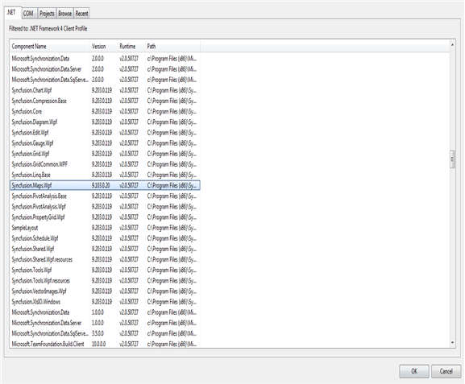

::: {style="DISPLAY: none"}
{#d2h_url_template}{#d2h_package_url style="WIDTH: 0px; DISPLAY: none; HEIGHT: 0px"}
:::

::::: {#nsbanner .d2h_main_nsbanner style="BORDER-BOTTOM: #999999 1px solid; POSITION: relative; PADDING-BOTTOM: 0px; BACKGROUND-COLOR: transparent; PADDING-LEFT: 0px; PADDING-RIGHT: 0px; DISPLAY: none; BORDER-TOP: #999999 1px solid; PADDING-TOP: 0px; LEFT: 0px"}
:::: {#TitleRow .d2h_main_titlerow style="PADDING-BOTTOM: 4px; BACKGROUND-COLOR: transparent; PADDING-LEFT: 22px; WIDTH: 100%; PADDING-RIGHT: 10px; DISPLAY: none; PADDING-TOP: 4px"}
::: {#ienav .d2h_main_ienav style="DISPLAY: none"}
{#D2HPrevious .D2HPreviousEnabled}  {#D2HNext .D2HNextEnabled}
:::
::::
:::::

:::: {#nstext .d2h_main_nstext style="PADDING-BOTTOM: 10px; BACKGROUND-COLOR: transparent; PADDING-LEFT: 22px; PADDING-RIGHT: 10px; HEIGHT: 100%; OVERFLOW: auto; PADDING-TOP: 5px" hasuserbackground="true" valign="bottom"}
::: {#d2h_breadcrumbs .d2h_breadcrumbs}
[Essential Studio User Guide Documentation](ms-xhelp:///?Id=12457748-09e3-4d74-a240-8e049cedf030){.d2h_breadcrumbsNormal}[ \> ]{.d2h_breadcrumbsLinkSeparator}[User Interface Edition](ms-xhelp:///?Id=c29296b7-531c-413b-a0ec-488ca1f7f669){.d2h_breadcrumbsNormal}[ \> ]{.d2h_breadcrumbsLinkSeparator}[Essential WPF](ms-xhelp:///?Id=7f4f82c5-151c-4262-94d0-75c4626c77bc){.d2h_breadcrumbsNormal}[ \> ]{.d2h_breadcrumbsLinkSeparator}[Essential Maps]{.d2h_breadcrumbsContentsOnly}[ \> ]{.d2h_breadcrumbsLinkSeparator}[Installation and Deployment](ms-xhelp:///?Id=e7e409ba-7ec5-4ae2-b082-a689cbe91396){.d2h_breadcrumbsNormal}
:::

## Deployment Procedures {#deployment-procedures style="tab-stops: 0pt"}

Deployment Requirements

When deploying an application that references Syncfusion Essential Maps WPF assembly, the following dependencies must be included in the distribution:

[·      ]{style="FONT-FAMILY: Symbol"}Syncfusion.Maps.Wpf.dll

 

Default Deployment Pattern

The steps involved to deploy the Essential Maps for WPF from GAC are as follows:

 

1.   In Visual Studio, Solution Explorer, right click on the References and select Add Reference.

 

{border="0"}

Figure 5: [Adding Reference in Visual Studio]{style="COLOR: black"}

[]{style="COLOR: black; FONT-SIZE: 9pt"} 

2.   The **Add Reference** window will open.

3.   Select the .Net Components Tab, a list of assemblies will be displayed which will be available in GAC. Finally select **Syncfusion.Maps.Wpf.dll**.

 

{border="0"}[]{style="COLOR: #c00000"}

Figure 6: Adding Syncfusion.Maps.Wpf.dll

 

Fast Deployment Pattern

In Visual Studio Integrated Development Environment (IDE), Solution Explorer, right click  the "bin" folder and add the Syncfusion.Maps.Wpf from the following location.

\[Root Folder\]:\\Program Files\\Syncfusion\\Essential Studio\\\[Version number\]\\Assemblies\\4.0

Then add the reference of Syncfusion.Maps.Wpf.dlll from the bin folder.

 

Partial/Medium Trust Support

[Partial Deployment was not supported.]{style="COLOR: black"}

[]{style="COLOR: #c00000"} 

[]{style="COLOR: #c00000"} 

[]{#related-topics}
::::
