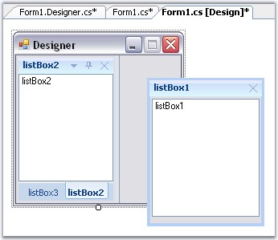
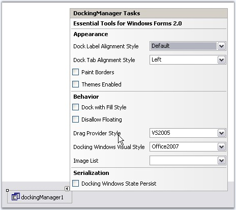

::: {style="DISPLAY: none"}
{#d2h_url_template}{#d2h_package_url style="WIDTH: 0px; DISPLAY: none; HEIGHT: 0px"}
:::

::: {.d2h_secondary_topic style="PADDING-BOTTOM: 10pt; MARGIN: 0pt; PADDING-LEFT: 0pt; PADDING-RIGHT: 0pt; PADDING-TOP: 0pt"}
#### DesignTime Features {#designtime-features style="tab-stops: 0pt"}

[]{style="COLOR: #15428b"} 

Dragging and Docking at DesignTime

[]{style="COLOR: #15428b"} 

DockingManager supports dragging and docking of the dockable controls at the design time itself. It also lets you float the controls.

[]{style="COLOR: #15428b"} 

{border="0"}

[]{style="COLOR: #15428b"} 

Figure 63: DesignTime Tabbing and Floating of the Docked Controls

**[]{style="COLOR: #15428b"}** 

Property Settings using Task Window

[]{style="COLOR: #15428b"} 

The Task Window of the DockingManager at design time lets you apply certain Appearance and behavior settings.

[]{style="COLOR: #15428b"} 

{border="0"}

[]{style="COLOR: #15428b"} 

Figure 64: Docking Manager Tasks Window

[]{#related-topics}
:::
