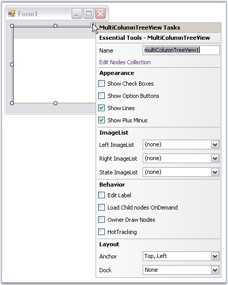

::: {style="DISPLAY: none"}
{#d2h_url_template}{#d2h_package_url style="WIDTH: 0px; DISPLAY: none; HEIGHT: 0px"}
:::

::: {.d2h_secondary_topic style="PADDING-BOTTOM: 10pt; MARGIN: 0pt; PADDING-LEFT: 0pt; PADDING-RIGHT: 0pt; PADDING-TOP: 0pt"}
#### DesignTime Features {#designtime-features style="MARGIN-LEFT: 18pt; tab-stops: 18.0pt"}

[]{style="COLOR: #15428b"} 

MultiColumnTreeView provides the shortcuts to access various properties.

 

TaskWindow can be accessed using smart tag as follows.

[]{style="COLOR: #15428b"} 

{border="0"}

[]{style="COLOR: #15428b"} 

Figure 1184: MultiColumnTreeView Tasks Window

[]{style="COLOR: #15428b"} 

The above window lets you open the NodeCollection Editor, modify the appearance settings, assign imagelists, enable options like editing the node text, load on demand, owner draw nodes and HotTracking properties. It also lets you set the layout settings for the control.

 

 

 

 

More:

[ ]{#related-topics}

[{border="0" align="absMiddle"}Context Menu at DesignTime](ms-xhelp:///?Id=8a4b289b-66eb-4d3f-986f-0a6cec8375ef){style="TEXT-DECORATION: none"}

[{border="0" align="absMiddle"}Editors for the MultiColumnTreeView](ms-xhelp:///?Id=a487a2fc-8834-406c-94f4-81e634f05afa){style="TEXT-DECORATION: none"}
:::
