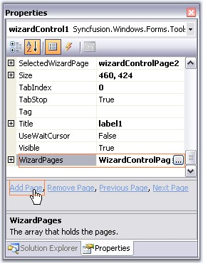
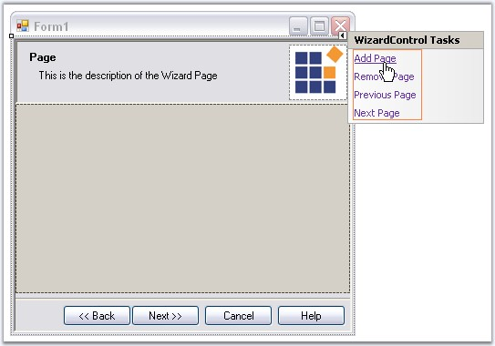
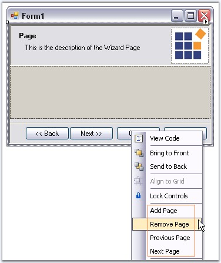
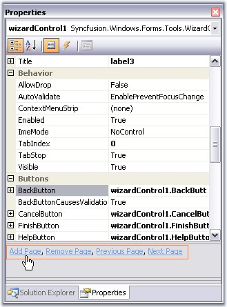
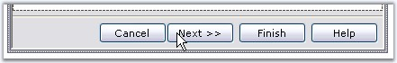
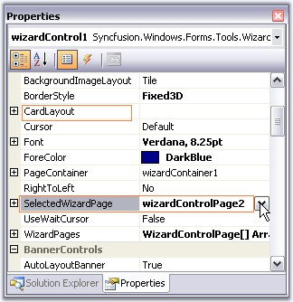

::: {style="DISPLAY: none"}
{#d2h_url_template}{#d2h_package_url style="WIDTH: 0px; DISPLAY: none; HEIGHT: 0px"}
:::

::: {.d2h_secondary_topic style="PADDING-BOTTOM: 10pt; MARGIN: 0pt; PADDING-LEFT: 0pt; PADDING-RIGHT: 0pt; PADDING-TOP: 0pt"}
##### DesignTime Features {#designtime-features style="MARGIN-LEFT: 18pt; tab-stops: 18.0pt"}

 

The below topics are discussed in this particular section.

 

 

###### []{#_Options_to_Add}3.13.1.4.4.1    Options to Add Page, Remove Page, Previous page and Next Page {#options-to-add-page-remove-page-previous-page-and-next-page style="MARGIN-LEFT: 18pt; tab-stops: 18.0pt"}

[]{style="COLOR: #15428b"} 

This section will guide you with various options available in the designer to add page, remove page, go to previous page and next page.

 

**Using Property Grid**

**[]{style="COLOR: #15428b"}** 

{border="0"}

 

Figure 1226: Adding Page Using \"WizardPages\" Property and \"Add Page\" Command

**[]{style="COLOR: #15428b"}** 

Using Smart Tag

[]{style="COLOR: #15428b"} 

{border="0"}

 

Figure 1227: Pages Options Using Smart Tag

**[]{style="COLOR: #15428b"}** 

Using Context menu

**[]{style="COLOR: #15428b"}** 

{border="0"}

**[]{style="COLOR: #15428b"}** 

Figure 1228: Pages Options by using Context Menu**[]{style="FONT-FAMILY: 'Trebuchet MS','sans-serif'; COLOR: #15428b"}**

**[]{style="COLOR: #15428b"}** 

Property Grid Commands

**[]{style="COLOR: #15428b"}** 

{border="0"}

**[]{style="COLOR: #15428b"}** 

Figure 1229: Page Options using Properties Grid Command**[]{style="FONT-FAMILY: 'Trebuchet MS','sans-serif'; COLOR: #15428b"}**

 

###### []{#_Page_Selection_at}3.13.1.4.4.2    Page Selection at Design time {#page-selection-at-design-time style="MARGIN-LEFT: 18pt; tab-stops: 18.0pt"}

[]{style="COLOR: #15428b"} 

This section will guide you with page selection options at design time.

[]{style="COLOR: #15428b"} 

[·      ]{style="FONT-FAMILY: Symbol"}We can easily navigate between the Wizard pages using the Next and Back buttons in the designer. These buttons are selectable at design time.

[]{style="COLOR: #15428b"} 

{border="0"}

[]{style="COLOR: #15428b"} 

Figure 1230: Going to Next Page in the Designer**[]{style="FONT-FAMILY: 'Trebuchet MS','sans-serif'; COLOR: #15428b"}**

[]{style="COLOR: #15428b"} 

[·      ]{style="FONT-FAMILY: Symbol"}Another way to navigate is to access the Next Page or Previous Page option in the context menu or Smart Tag of the Wizard control.

[]{style="COLOR: #15428b"} 

See[ ]{style="COLOR: #15428b"}[[Options to Add Page, Remove Page, Previous page and Next Page]{.UGHyperlink}](../../../../../../../../Documents%20and%20Settings/sylviap/Desktop/Tools%20-%20Part%202.docx#_Options_to_Add) topic, to see the Next page and Previous page options in smart tag and context menu.

[]{style="COLOR: #15428b"} 

[·      ]{style="FONT-FAMILY: Symbol"}You can also do the page selection using **SelectedWizardPage** or **CardLayout** property.

[]{style="COLOR: #15428b"} 

{border="0"}

[]{style="COLOR: #15428b"} 

Figure 1231: Selecting Wizard Page Through SelectedWizardPage Property

**[]{style="COLOR: #15428b"}** 

See Also

[]{style="COLOR: #15428b"} 

[[Wizard Page Settings]{.UGHyperlink}](../../../../../../../../Documents%20and%20Settings/sylviap/Desktop/Tools%20-%20Part%202.docx#_Wizard_Page_Settings)[]{.UGHyperlink}

 

 

[]{#related-topics}
:::
