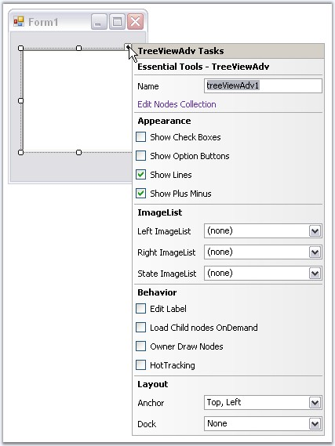

::: {style="DISPLAY: none"}
{#d2h_url_template}{#d2h_package_url style="WIDTH: 0px; DISPLAY: none; HEIGHT: 0px"}
:::

::: {.d2h_secondary_topic style="PADDING-BOTTOM: 10pt; MARGIN: 0pt; PADDING-LEFT: 0pt; PADDING-RIGHT: 0pt; PADDING-TOP: 0pt"}
#### DesignTime Features {#designtime-features style="MARGIN-LEFT: 18pt; tab-stops: 18.0pt"}

[]{style="COLOR: #15428b"} 

TreeView provides the shortcuts to access various properties of the control.

 

TaskWindow can be accessed using smart tag.

[]{style="COLOR: #15428b"} 

{border="0"}

[]{style="COLOR: #15428b"} 

Figure 1143: TreeViewAdv Tasks Window

[]{style="COLOR: #15428b"} 

The above window lets you open the NodeCollection Editor, modify the appearance settings, assign imagelists, enable options like editing the node text, load on demand, owner draw nodes and HotTracking properties. It also lets you set the layout settings for the control.

[]{style="COLOR: #15428b"} 

Context Menu at Design time

 

It provides shortcuts to access the NodeCollection Editor using the context menu at design time.

 

You can also add nodes using the \"Add Node\" option in the context menu.

[]{style="COLOR: #15428b"} 

{border="0"}

***[]{style="COLOR: #15428b"}*** 

Figure 1144: \"Add Node\" Design-Time Verb

 

 

 

 

[]{#related-topics}
:::
