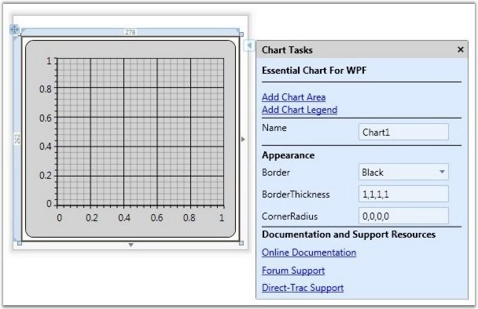
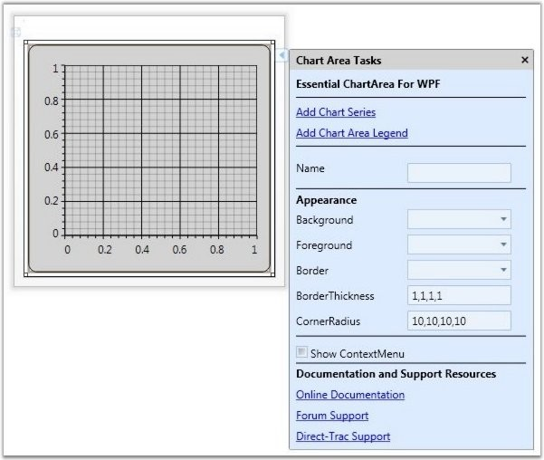
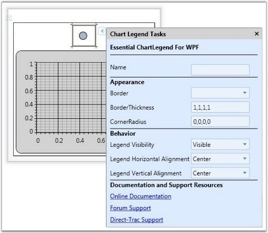

::: {style="DISPLAY: none"}
{#d2h_url_template}{#d2h_package_url style="WIDTH: 0px; DISPLAY: none; HEIGHT: 0px"}
:::

::: {.d2h_secondary_topic style="PADDING-BOTTOM: 10pt; MARGIN: 0pt; PADDING-LEFT: 0pt; PADDING-RIGHT: 0pt; PADDING-TOP: 0pt"}
#### Design-Time Support {#design-time-support style="tab-stops: 0pt"}

Chart Control Smart Tag Support

Smart Tag appears for the Chart, Chart Area and Chart Legend. By using the Smart Tag, you can add Chart Areas, Chart Legends and Chart Series. In addition, you can customize the Chart appearance by using the Smart Tag in the designer.

 

The following screen shot illustrates Smart Tag support in Chart.

 

{border="0"}

Figure 228: Smart Tag for Chart Control

[]{style="FONT-FAMILY: 'Trebuchet MS','sans-serif'; COLOR: #15428b; FONT-SIZE: 9pt"} 

The following screen shot illustrates Smart Tag support in Chart Area.

[]{style="FONT-FAMILY: 'Trebuchet MS','sans-serif'; COLOR: #15428b; FONT-SIZE: 9pt"} 

{border="0"}

Figure 229: Smart Tag for Chart Area

[]{style="FONT-FAMILY: 'Trebuchet MS','sans-serif'; COLOR: #15428b; FONT-SIZE: 9pt"} 

The following screen shot illustrates Smart Tag support in Chart Legend.

[]{style="FONT-FAMILY: 'Trebuchet MS','sans-serif'; COLOR: #15428b; FONT-SIZE: 9pt"} 

[{border="0"}]{style="FONT-FAMILY: 'Trebuchet MS','sans-serif'; COLOR: #15428b; FONT-SIZE: 9pt"}[]{style="FONT-FAMILY: 'Trebuchet MS','sans-serif'; COLOR: #15428b; FONT-SIZE: 9pt"}

Figure 230: Smart Tag for Chart Legend

 

 

[]{#related-topics}
:::
