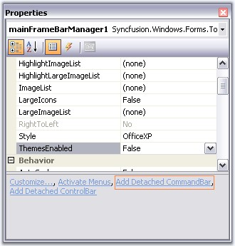
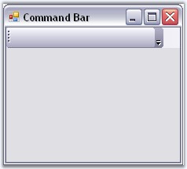
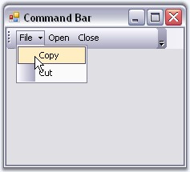
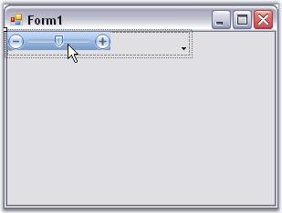
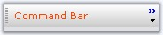
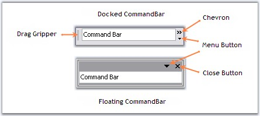

::: {style="DISPLAY: none"}
{#d2h_url_template}{#d2h_package_url style="WIDTH: 0px; DISPLAY: none; HEIGHT: 0px"}
:::

:::::::: {.d2h_secondary_topic style="PADDING-BOTTOM: 10pt; MARGIN: 0pt; PADDING-LEFT: 0pt; PADDING-RIGHT: 0pt; PADDING-TOP: 0pt"}
##### Detached CommandBar {#detached-commandbar style="tab-stops: 0pt"}

[]{style="COLOR: #15428b"} 

The XP Menus framework provides the flexibility to add detached toolbars through **CommandBar** that can host any .NET control. These toolbars are detached from the framework in the sense that they cannot participate in user customization. Otherwise, they are seamless in look-and-feel.

**[]{style="COLOR: #15428b"}** 

Through Designer

[]{style="COLOR: #15428b"} 

Right click on the MainFrameBarManager in the designer and choose the \"Add Detached CommandBar\" option, to add a detached commandbar.

[]{style="COLOR: #15428b"} 

{border="0"}

[]{style="COLOR: #15428b"} 

Figure 787: Adding a Detached CommandBar

**[]{style="COLOR: #15428b"}** 

::: {style="BORDER-BOTTOM: windowtext 1pt solid; BORDER-LEFT: medium none; PADDING-BOTTOM: 1pt; MARGIN-TOP: 9pt; PADDING-LEFT: 0pt; PADDING-RIGHT: 0pt; MARGIN-BOTTOM: 9pt; BORDER-TOP: windowtext 1pt solid; BORDER-RIGHT: medium none; PADDING-TOP: 1pt"}
{border="0"} Note: Command Bar can also be added by clicking the command in the properties window.
:::

[]{style="COLOR: #15428b"} 

{border="0"}

***[]{style="COLOR: #15428b"}*** 

Figure 788: Add Detached CommandBar Verb

[]{style="COLOR: #15428b"} 

The following screen shot shows the CommandBar in the designer.

[]{style="COLOR: #15428b"} 

{border="0"}

[]{style="COLOR: #15428b"} 

Figure 789: CommandBar in the Designer

[]{style="COLOR: #15428b"} 

[·      ]{style="FONT-FAMILY: Symbol"}Drag and drop XPToolBar control on to the CommandBar and add bar items to the XPToolBar through BarItem Collection Editor.

[·      ]{style="FONT-FAMILY: Symbol"}The following screen shot shows the XPToolBar with bar items hosted on CommandBar. This command Bar can be hosted to any target within the form by just dragging and dropping.

[]{style="COLOR: #15428b"} 

{border="0"}

***[]{style="COLOR: #15428b"}*** 

Figure 790: XPToolbar with Bar Items hosted on CommandBar

[]{style="COLOR: #15428b"} 

To associate a bar with the Command Bar use the below code snippet.

[]{style="COLOR: #15428b"} 

+--------------------------------------------------------------------------------------------------------------------------+
| **[\[C#\]]{style="FONT-FAMILY: 'Courier New'; COLOR: black"}**                                                           |
|                                                                                                                          |
| **[]{style="FONT-FAMILY: 'Courier New'; COLOR: black"}**                                                                 |
|                                                                                                                          |
| [//Associate the created Bar with CommandBar.]{style="FONT-FAMILY: 'Courier New'; COLOR: green"}                         |
|                                                                                                                          |
| [CommandBar cmd = this.mainFrameBarManager1.GetBarControl(this.bar1);]{style="FONT-FAMILY: 'Courier New'; COLOR: black"} |
+--------------------------------------------------------------------------------------------------------------------------+

[]{style="COLOR: #15428b"} 

+------------------------------------------------------------------------------------------------------------------------------------------------------------------------------------------------------------------------------------------+
| **[\[VB.NET\]]{style="FONT-FAMILY: 'Courier New'; COLOR: black"}**                                                                                                                                                                       |
|                                                                                                                                                                                                                                          |
| **[]{style="FONT-FAMILY: 'Courier New'; COLOR: black"}**                                                                                                                                                                                 |
|                                                                                                                                                                                                                                          |
| [\'Associate the created Bar with CommandBar.]{style="FONT-FAMILY: 'Courier New'; COLOR: green"}                                                                                                                                         |
|                                                                                                                                                                                                                                          |
| [Private]{style="FONT-FAMILY: 'Courier New'; COLOR: blue"}[ cmd [As]{style="COLOR: blue"} CommandBar = [Me]{style="COLOR: blue"}.mainFrameBarManager1.GetBarControl([Me]{style="COLOR: blue"}.bar1)]{style="FONT-FAMILY: 'Courier New'"} |
+------------------------------------------------------------------------------------------------------------------------------------------------------------------------------------------------------------------------------------------+

**[]{style="COLOR: #15428b"}** 

XPMenus lets you add custom controls to the CommandBar for example TrackBarEx by simple drag and drop.

[]{style="COLOR: #15428b"} 

+------------------------------------------------------------------------------------------------------------------------------------------------------------------+
| **[\[C#\]]{style="FONT-FAMILY: 'Courier New'; COLOR: black"}**                                                                                                   |
|                                                                                                                                                                  |
| **[]{style="FONT-FAMILY: 'Courier New'; COLOR: black"}**                                                                                                         |
|                                                                                                                                                                  |
| [//Adding the control to CommandBar]{style="FONT-FAMILY: 'Courier New'; COLOR: green"}                                                                           |
|                                                                                                                                                                  |
| [this]{style="FONT-FAMILY: 'Courier New'; COLOR: blue"}[.commandBar2.Controls.Add([this]{style="COLOR: blue"}.trackBarEx1);]{style="FONT-FAMILY: 'Courier New'"} |
+------------------------------------------------------------------------------------------------------------------------------------------------------------------+

[]{style="COLOR: #15428b"} 

+-------------------------------------------------------------------------------------------------------------------------------------------------------------+
| **[\[VB.NET\]]{style="FONT-FAMILY: 'Courier New'; COLOR: black"}**                                                                                          |
|                                                                                                                                                             |
| **[]{style="FONT-FAMILY: 'Courier New'; COLOR: black"}**                                                                                                    |
|                                                                                                                                                             |
| [\'Adding the control to CommandBar]{style="FONT-FAMILY: 'Courier New'; COLOR: green"}                                                                      |
|                                                                                                                                                             |
| [Me]{style="FONT-FAMILY: 'Courier New'; COLOR: blue"}[.commandBar2.Controls.Add([Me]{style="COLOR: blue"}.trackBarEx1)]{style="FONT-FAMILY: 'Courier New'"} |
+-------------------------------------------------------------------------------------------------------------------------------------------------------------+

[]{style="COLOR: #15428b"} 

{border="0"}

Figure 791: TrackBarEx added to the CommandBar

[]{style="COLOR: #15428b"} 

See Also

[]{style="COLOR: #15428b"} 

[CommandBar Properties]{.UGHyperlink}[]{.UGHyperlink}

###### []{#_CommandBar_Properties}3.5.4.2.1.1 CommandBar Properties {#commandbar-properties style="tab-stops: 0pt"}

Appearance Properties

**[]{style="COLOR: #15428b"}** 

::: {align="center"}
  ----------------------- ---------------------------------------------------------------------------------------------------------
  CommandBar Property     Description
  BackColor               Sets the back color for the control.
  BackgroundImage         Sets the background image for the control.
  BackgroundImagelayout   Specifies the layout of the image. Title, Center, Stretch, Zoom are the options. Default value is Tile.
  ChevronColor            Sets color of the chevron.
  Font                    Sets the font style for the text.
  ForeColor               Sets the foreground color of the text.
  Text                    Sets the control\'s text.
  ----------------------- ---------------------------------------------------------------------------------------------------------
:::

**[]{style="COLOR: #15428b"}** 

{border="0"}

**[]{style="COLOR: #15428b"}** 

Figure 792: BackgroundImage set; ChevronColor = \"Blue\"; Text Font = \"Verdana 8\"; ForeColor = \"Red\"

**[]{style="COLOR: #15428b"}** 

Behavior Properties

**[]{style="COLOR: #15428b"}** 

::: {align="center"}
  --------------------- --------------------------------------------------------------------------------------------------------------------------------------------------------
  CommandBar Property   Description
  AllowedDockBorders    Specifies dock border sides in which command bar can be docked from floating.
  AlwaysLeadingEdge     Docks the CommandBar permanently to the leading edge of the dock border.
  AlwaysTrailingEdge    Docks the CommandBar permanently to the trailing edge of the dock border.
  DisableDocking        Disables docking ability of the CommandBar.
  DisableFloating       Disables floating ability of the CommandBar.
  DockModeWrapping      Wraps the docked CommandBar when bounds are less than maximum length.
  FloatModeWrapping     Wraps the floating CommandBar when it is resized to less than its maximum length.
  OccupyFullRow         Lets CommandBar occupy the full row in a form.
  ShowDockModeText      Specifies whether the command bar should display the text that is set through **CommandBar.Text** property when the command bar is in docked position.
  --------------------- --------------------------------------------------------------------------------------------------------------------------------------------------------
:::

[]{style="COLOR: #15428b"} 

Hide / Show

[]{style="COLOR: #15428b"} 

::: {align="center"}
  --------------------- -------------------------------------------------------------------
  CommandBar Property   Description
  HideChevron           When set to true hides the chevron for the CommandBar.
  HideCloseButton       Hides Close button for the floating CommandBar, when set to true.
  HideDropDownButton    Shows / Hides the dropdown button.
  HideGripper           Shows / Hides the drag gripper.
  --------------------- -------------------------------------------------------------------
:::

**[]{style="COLOR: #15428b"}** 

{border="0"}

**[]{style="COLOR: #15428b"}** 

Figure 793: CommandBar in Floating and Docked mode illustrating various buttons and Gripper

**[]{style="COLOR: #15428b"}** 

Popup for the DropDown

[]{style="COLOR: #15428b"} 

::: {align="center"}
  --------------------- ---------------------------------------------------------------------------------------------
  CommandBar Property   Description
  PopupContainer        Indicates the PopupContainer control that is displayed when the dropdown button is clicked.
  PopupMenu             Indicates the Popup menu on clicking the dropdown button.
  --------------------- ---------------------------------------------------------------------------------------------
:::

[]{#related-topics}
::::::::
