::: {style="DISPLAY: none"}
{#d2h_url_template}{#d2h_package_url style="WIDTH: 0px; DISPLAY: none; HEIGHT: 0px"}
:::

:::::::: {.d2h_secondary_topic style="PADDING-BOTTOM: 10pt; MARGIN: 0pt; PADDING-LEFT: 0pt; PADDING-RIGHT: 0pt; PADDING-TOP: 0pt"}
##### Detached ControlBars {#detached-controlbars style="tab-stops: 0pt"}

[]{style="COLOR: #15428b"} 

**ControlBars** in Essential Tools XP Menus framework enables application developers to add dockable / floatable controls to their form\'s toolbar layout. A common example of a **ControlBar** is the task pane window found in the Microsoft Office 2003 product suite.

 

A ControlBar is a full-featured docking container that can host any control and be docked along the border of the host form or floated as a top-level window. ControlBars, however, differ from traditional docking windows by adopting the characteristic layout behavior of a toolbar rather than that of a classic dockable control.

 

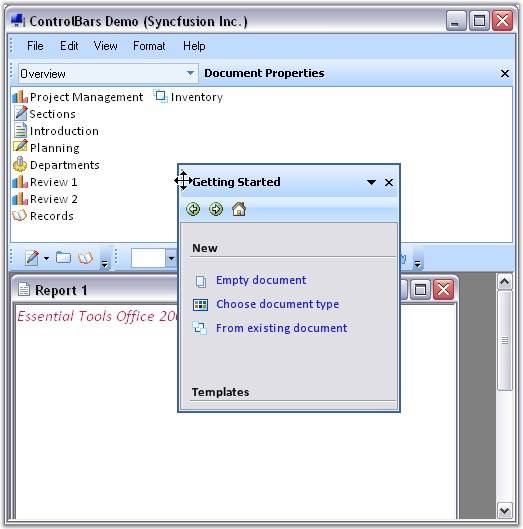{border="0"}

[]{style="COLOR: #15428b"} 

Figure 794: Dockable ControlBar

**[]{style="COLOR: #15428b"}** 

See also

**[]{style="COLOR: #15428b"}** 

[How to dock the ControlBars to any edge of the host form?]{.UGHyperlink}[]{.UGHyperlink}

###### []{#_ControlBar_Client_Controls}3.5.4.2.2.1 ControlBar Client Controls {#controlbar-client-controls style="tab-stops: 0pt"}

[]{style="COLOR: #15428b"} 

A ControlBar is capable of hosting two controls.

[]{style="COLOR: #15428b"} 

[·      ]{style="FONT-FAMILY: Symbol"}A **main control** that occupies the ControlBar\'s client region.

[·      ]{style="FONT-FAMILY: Symbol"}A **CaptionControl** that is displayed within the ControlBar\'s caption region.

[]{style="COLOR: #15428b"} 

While just about any **System.Windows.Forms.Control** instance can be used as the ControlBar\'s main client, the caption control position is normally occupied by single line controls such as a toolbar, text box or combo box.

[]{style="COLOR: #15428b"} 

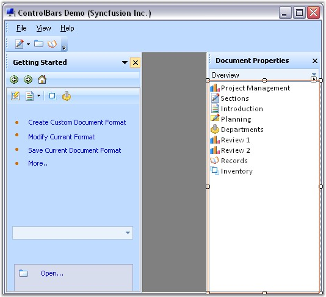{border="0"}

**[]{style="COLOR: #15428b"}** 

Figure 795: ControlBar highlighted with Client Control

**[]{style="COLOR: #15428b"}** 

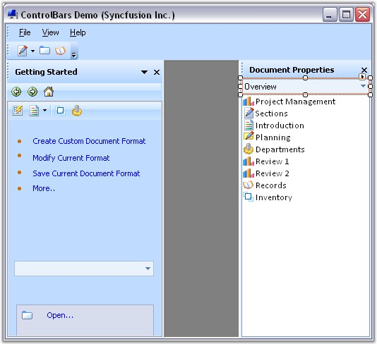{border="0"}

**[]{style="COLOR: #15428b"}** 

Figure 796: ControlBar highlighted with Caption Control

**[]{style="COLOR: #15428b"}** 

Dropping a control onto the ControlBar automatically sets it as the ControlBar\'s main client. To assign the caption control, drop the control onto the ControlBar and using the Properties window, set the bar\'s **CaptionControl** property to refer that control. Doing so will reposition and resize the control to occupy the bar\'s caption region. Height of the ControlBar caption bar can be specified in **ControlBarCaptionHeight** property. Default height is 25.

[]{style="COLOR: #15428b"} 

+--------------------------------------------------------------------------------------------------------------------------------------------------------------------+
| **[\[C#\]]{style="FONT-FAMILY: 'Courier New'; COLOR: black"}**                                                                                                     |
|                                                                                                                                                                    |
| **[]{style="FONT-FAMILY: 'Courier New'; COLOR: black"}**                                                                                                           |
|                                                                                                                                                                    |
| [this]{style="FONT-FAMILY: 'Courier New'; COLOR: blue"}[.controlBar1.CaptionControl = [this]{style="COLOR: blue"}.xpToolBar1;]{style="FONT-FAMILY: 'Courier New'"} |
|                                                                                                                                                                    |
| [this]{style="FONT-FAMILY: 'Courier New'; COLOR: blue"}[.controlBar1.ControlBarCaptionHeight = 30;]{style="FONT-FAMILY: 'Courier New'"}                            |
+--------------------------------------------------------------------------------------------------------------------------------------------------------------------+

[]{style="COLOR: #15428b"} 

+---------------------------------------------------------------------------------------------------------------------------------------------------------------+
| **[\[VB.NET\]]{style="FONT-FAMILY: 'Courier New'; COLOR: black"}**                                                                                            |
|                                                                                                                                                               |
| **[]{style="FONT-FAMILY: 'Courier New'; COLOR: black"}**                                                                                                      |
|                                                                                                                                                               |
| [Me]{style="FONT-FAMILY: 'Courier New'; COLOR: blue"}[.controlBar1.CaptionControl = [Me]{style="COLOR: blue"}.xpToolBar1]{style="FONT-FAMILY: 'Courier New'"} |
|                                                                                                                                                               |
| [Me]{style="FONT-FAMILY: 'Courier New'; COLOR: blue"}[.controlBar1.ControlBarCaptionHeight = 30]{style="FONT-FAMILY: 'Courier New'"}                          |
+---------------------------------------------------------------------------------------------------------------------------------------------------------------+

[]{style="COLOR: #15428b"} 

See Also

[]{style="COLOR: #15428b"} 

[ControlBar Properties]{.UGHyperlink}[]{.UGHyperlink}

[Adding Different Pages To Control Bar]{.UGHyperlink}[]{.UGHyperlink}

[How to dock the ControlBars to any edge of the host form?]{.UGHyperlink}[]{.UGHyperlink}

[]{style="COLOR: black"} 

 

 

###### []{#_ControlBar_Properties}3.5.4.2.2.2 ControlBar Properties {#controlbar-properties style="tab-stops: 0pt"}

**[]{style="COLOR: #15428b"}** 

Appearance Properties

**[]{style="COLOR: #15428b"}** 

::: {align="center"}
+-----------------------------------+---------------------------------------------------------------------+
| ControlBar Property               | Description                                                         |
+-----------------------------------+---------------------------------------------------------------------+
| BackColor                         | Sets the back color for the XPToolbar.                              |
+-----------------------------------+---------------------------------------------------------------------+
| BackgroundImage                   | Sets the background image for the XPToolbar.                        |
+-----------------------------------+---------------------------------------------------------------------+
| BackgroundImagelayout             | Specifies the layout of the image.                                  |
|                                   |                                                                     |
|                                   | Title, Center, Stretch, Zoom are the option. Default value is Tile. |
+-----------------------------------+---------------------------------------------------------------------+
| ChevronColor                      | Sets color of the chevron.                                          |
+-----------------------------------+---------------------------------------------------------------------+
| Font                              | Sets the font style for the text.                                   |
+-----------------------------------+---------------------------------------------------------------------+
| ForeColor                         | Sets the foreground color of the text.                              |
+-----------------------------------+---------------------------------------------------------------------+
| Text                              | Sets the control\'s text.                                           |
+-----------------------------------+---------------------------------------------------------------------+
:::

**[]{style="COLOR: #15428b"}** 

Behavior Properties

**[]{style="COLOR: #15428b"}** 

::: {align="center"}
  --------------------- -------------------------------------------------------------------------------
  ControlBar Property   Description
  AllowedDockBorders    Specifies dock border sides in which command bar can be docked from floating.
  AlwaysLeadingEdge     Docks the CommandBar permanently to the leading edge of the dock border.
  AlwaysTrailingEdge    Docks the CommandBar permanently to the trailing edge of the dock border.
  CaptionControl        Specifies the control that represents the caption of the control bar.
  DisableDocking        Disables docking ability of the CommandBar.
  DisableFloating       Disables floating ability of the CommandBar.
  --------------------- -------------------------------------------------------------------------------
:::

[]{style="COLOR: #15428b"} 

Hide / Show

[]{style="COLOR: #15428b"} 

::: {align="center"}
  --------------------- -------------------------------------------------------------------
  ControlBar Property   Description
  HideCloseButton       Hides Close button for the floating CommandBar, when set to true.
  HideDropDownButton    Shows / Hides the dropdown button.
  HideGripper           Shows / Hides the drag gripper.
  --------------------- -------------------------------------------------------------------
:::

**[]{style="COLOR: #15428b"}** 

Popup for the DropDown

[]{style="COLOR: #15428b"} 

::: {align="center"}
  --------------------- ---------------------------------------------------------------------------------------------
  ControlBar Property   Description
  PopupContainer        Indicates the PopupContainer control that is displayed when the dropdown button is clicked.
  PopupMenu             Indicates the Popup menu on clicking the dropdown button.
  --------------------- ---------------------------------------------------------------------------------------------
:::

[]{style="COLOR: #15428b"} 

See Also

[]{style="COLOR: #15428b"} 

[[ControlBar Client Controls]{.UGHyperlink}]()[, ]{.UGHyperlink}

[Adding Different Pages To Control Bar]{.UGHyperlink}[]{.UGHyperlink}

[How to dock the ControlBars to any edge of the host form?]{.UGHyperlink}[]{.UGHyperlink}

[[]{style="TEXT-DECORATION: none"}]{.UGHyperlink} 

[[]{style="TEXT-DECORATION: none"}]{.UGHyperlink} 

 

###### []{#_Adding_Different_Pages}3.5.4.2.2.3 Adding Different Pages To Control Bar {#adding-different-pages-to-control-bar style="tab-stops: 0pt"}

[]{style="COLOR: #15428b"} 

Adding and Removing ControlBars

**[]{style="COLOR: #4a5c8c"}** 

The MainFrameBarManager\'s **Add Detached ControlBar**[ ]{style="FONT-FAMILY: 'Verdana','sans-serif'; COLOR: black"}design-time verb, available through the Properties window, facilitates the addition of ControlBars to the design form. The XP Menus design-time is fully WYSIWYG and the bar layout can be designed by simply dragging and docking or floating each ControlBar at the desired location. Upon saving the design form, the ControlBar state information is serialized by the BarManager as a part of the form\'s resource file along with the rest of the menu/toolbar layout.

 

Follow the steps below to add different pages to the control bar.

[]{style="COLOR: #15428b"} 

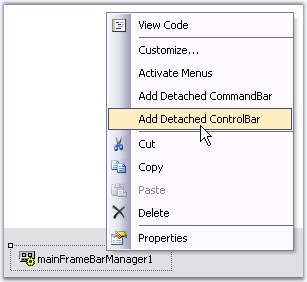{border="0"}

[]{style="COLOR: #15428b"} 

Figure 797: Add Detached ControlBar Design-Time Verb

[]{style="COLOR: #15428b"} 

::: {style="BORDER-BOTTOM: windowtext 1pt solid; BORDER-LEFT: medium none; PADDING-BOTTOM: 1pt; MARGIN-TOP: 9pt; PADDING-LEFT: 0pt; PADDING-RIGHT: 0pt; MARGIN-BOTTOM: 9pt; BORDER-TOP: windowtext 1pt solid; BORDER-RIGHT: medium none; PADDING-TOP: 1pt"}
{border="0"} Note: Control Bar can also be added by clicking the verb in the properties window.
:::

[]{style="COLOR: #15428b"} 

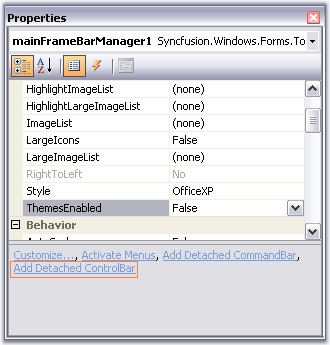{border="0"}

***[]{style="COLOR: #15428b"}*** 

Figure 798: Add Detached ControlBar Verb

[]{style="COLOR: #15428b"} 

 The resulted screen shot displays controlbar in the designer.

[]{style="COLOR: #15428b"} 

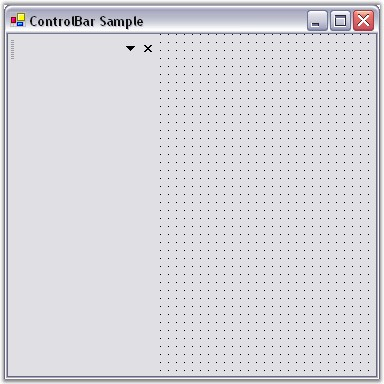{border="0"}

***[]{style="COLOR: #15428b"}*** 

Figure 799: ControlBar displayed in the Designer

[]{style="COLOR: #15428b"} 

[·      ]{style="FONT-FAMILY: Symbol"}Now add **XPToolbar** to the control bar.

[·      ]{style="FONT-FAMILY: Symbol"}Add panel to the control bar.

[·      ]{style="FONT-FAMILY: Symbol"}Add CardLayout over the panel to add different pages.

[]{style="COLOR: #15428b"} 

While dropping out **CardLayout** onto the panel, the layout designer window will open, asking whether to make panel1 as container control. Click \'Yes\' and continue.

[]{style="COLOR: #15428b"} 

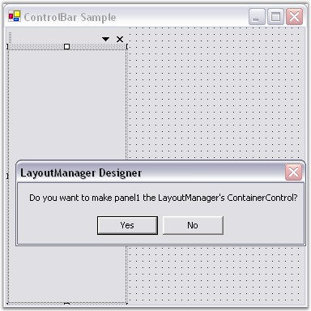{border="0"}

***[]{style="COLOR: #15428b"}*** 

Figure 800: Panel1 set as the Layout Manager\'s Container Control

[]{style="COLOR: #15428b"} 

[·      ]{style="FONT-FAMILY: Symbol"}You can add multiple panels to the control bar.

[·      ]{style="FONT-FAMILY: Symbol"}Select the card using the **SelectedCard** property in the CardLayout Property window.

[]{style="COLOR: #15428b"} 

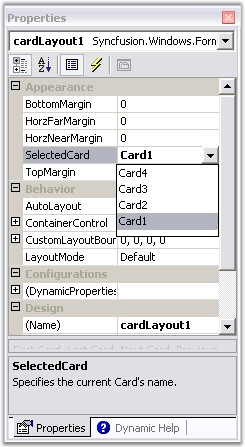{border="0"}

[]{style="COLOR: #15428b"} 

Figure 801: CardLayout property Window

[]{style="COLOR: #15428b"} 

[·      ]{style="FONT-FAMILY: Symbol"}In the selected card, add XPTaskBar to the control bar and right-click it to add XPTaskBarBox to add Items.

[]{style="COLOR: #15428b"} 

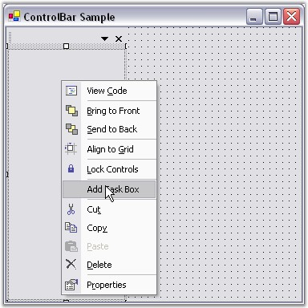{border="0"}

[]{style="COLOR: #15428b"} 

Figure 802: Add TaskBox to the control bar using Verbs

[]{style="COLOR: #15428b"} 

The resultant form is as follows.

[]{style="COLOR: #15428b"} 

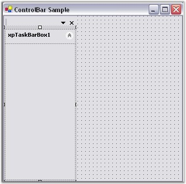{border="0"}

[]{style="COLOR: #15428b"} 

Figure 803: Control bar with TaskBarBox Added

 

[·      ]{style="FONT-FAMILY: Symbol"}Inside XPTaskbarBox, you can insert link labels, ComboBoxAdv controls like in the following screen shot.

[]{style="COLOR: #15428b"} 

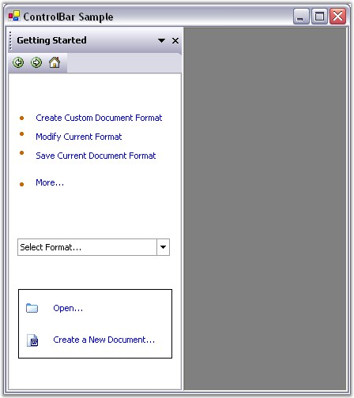{border="0"}

***[]{style="COLOR: #15428b"}*** 

Figure 804: Inserting controls inside the XPTaskBarBox 

[]{style="COLOR: #15428b"} 

At Run Time

**[]{style="COLOR: #15428b"}** 

Include the following code snippet in the Click event of a BarItem to view the next page of a card.

[]{style="COLOR: #15428b"} 

+-----------------------------------------------------------------------------------------------------------------------------------------------------------------------------------------------------------------------------------------------+
| **[\[C#\]]{style="FONT-FAMILY: 'Courier New'; COLOR: black"}**                                                                                                                                                                                |
|                                                                                                                                                                                                                                               |
| **[]{style="FONT-FAMILY: 'Courier New'; COLOR: black"}**                                                                                                                                                                                      |
|                                                                                                                                                                                                                                               |
| [this]{style="FONT-FAMILY: 'Courier New'; COLOR: blue"}[.cardlayoutmanager1.]{style="FONT-FAMILY: 'Courier New'; COLOR: black"}[next]{style="FONT-FAMILY: 'Courier New'; COLOR: blue"}[();]{style="FONT-FAMILY: 'Courier New'; COLOR: black"} |
+-----------------------------------------------------------------------------------------------------------------------------------------------------------------------------------------------------------------------------------------------+

[]{style="COLOR: #15428b"} 

+--------------------------------------------------------------------------------------------------------------------------------------------------------------------------------------------------------------------------------------------+
| **[\[VB.NET\]]{style="FONT-FAMILY: 'Courier New'; COLOR: black"}**                                                                                                                                                                         |
|                                                                                                                                                                                                                                            |
| **[]{style="FONT-FAMILY: 'Courier New'; COLOR: black"}**                                                                                                                                                                                   |
|                                                                                                                                                                                                                                            |
| [Me]{style="FONT-FAMILY: 'Courier New'; COLOR: blue"}[.cardlayoutmanager1.]{style="FONT-FAMILY: 'Courier New'; COLOR: black"}[next]{style="FONT-FAMILY: 'Courier New'; COLOR: blue"}[()]{style="FONT-FAMILY: 'Courier New'; COLOR: black"} |
+--------------------------------------------------------------------------------------------------------------------------------------------------------------------------------------------------------------------------------------------+

[]{style="COLOR: #15428b"} 

A sample which demonstrates adding control bar is available in the below sample installation location.

[]{style="COLOR: #15428b"} 

..\\My Documents\\Syncfusion\\EssentialStudio\\***Version Number***\\Windows\\Tools.Windows\\Samples\\2.0\\Menus Package\\ControlBars

[]{style="COLOR: #15428b"} 

See Also

**[]{style="COLOR: #15428b"}** 

[[ControlBar Client Controls]{.UGHyperlink}]()[, ]{.UGHyperlink}

[[Adding Different Pages To Control Bar]{.UGHyperlink}]()[]{.UGHyperlink}

[How to dock the ControlBars to any edge of the host form]{.UGHyperlink}[]{.UGHyperlink}

[]{style="COLOR: #15428b"} 

 

[]{#related-topics}
::::::::
