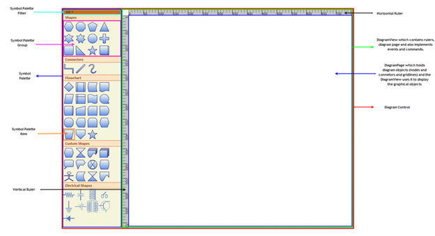

::: {style="DISPLAY: none"}
{#d2h_url_template}{#d2h_package_url style="WIDTH: 0px; DISPLAY: none; HEIGHT: 0px"}
:::

::::: {#nsbanner .d2h_main_nsbanner style="BORDER-BOTTOM: #999999 1px solid; POSITION: relative; PADDING-BOTTOM: 0px; BACKGROUND-COLOR: transparent; PADDING-LEFT: 0px; PADDING-RIGHT: 0px; DISPLAY: none; BORDER-TOP: #999999 1px solid; PADDING-TOP: 0px; LEFT: 0px"}
:::: {#TitleRow .d2h_main_titlerow style="PADDING-BOTTOM: 4px; BACKGROUND-COLOR: transparent; PADDING-LEFT: 22px; WIDTH: 100%; PADDING-RIGHT: 10px; DISPLAY: none; PADDING-TOP: 4px"}
::: {#ienav .d2h_main_ienav style="DISPLAY: none"}
{#D2HPrevious .D2HPreviousEnabled}  {#D2HNext .D2HNextEnabled}
:::
::::
:::::

:::: {#nstext .d2h_main_nstext style="PADDING-BOTTOM: 10px; BACKGROUND-COLOR: transparent; PADDING-LEFT: 22px; PADDING-RIGHT: 10px; HEIGHT: 100%; OVERFLOW: auto; PADDING-TOP: 5px" hasuserbackground="true" valign="bottom"}
::: {#d2h_breadcrumbs .d2h_breadcrumbs}
[Essential Studio User Guide Documentation](ms-xhelp:///?Id=12457748-09e3-4d74-a240-8e049cedf030){.d2h_breadcrumbsNormal}[ \> ]{.d2h_breadcrumbsLinkSeparator}[User Interface Edition](ms-xhelp:///?Id=c29296b7-531c-413b-a0ec-488ca1f7f669){.d2h_breadcrumbsNormal}[ \> ]{.d2h_breadcrumbsLinkSeparator}[Essential Silverlight](ms-xhelp:///?Id=66221bd1-ba2e-43c2-94a7-618f50e01d24){.d2h_breadcrumbsNormal}[ \> ]{.d2h_breadcrumbsLinkSeparator}[Essential Diagram]{.d2h_breadcrumbsContentsOnly}[ \> ]{.d2h_breadcrumbsLinkSeparator}[Getting Started](ms-xhelp:///?Id=77f772a1-15ea-48e9-bd56-21bc587bb944){.d2h_breadcrumbsNormal}
:::

## Diagram Architecture {#diagram-architecture style="tab-stops: 0pt"}

[]{style="FONT-FAMILY: 'Trebuchet MS','sans-serif'; COLOR: #15428b; FONT-SIZE: 9pt"} 

The following is a general description about the important classes of Diagram Silverlight. These classes form the base of the control.

[]{style="FONT-FAMILY: 'Trebuchet MS','sans-serif'; COLOR: #15428b; FONT-SIZE: 9pt"} 

Diagram Control

**\**
The Diagram control is the base class, which contains the view and the model. It receives user input and translates it into actions on the model and view. It also implements symbol palette and scrolling, and enables horizontal and vertical scrollbars when the size of the view exceeds the size of the window.\
\
\

Diagram Model

**\**
A model represents data for an application and contains the logic for adding, accessing, and manipulating the data. Nodes and connectors are added to the Diagram Control using the **Model** property. A predefined layout can be applied using the **LayoutType** property of the DiagramModel, or the position of the nodes can be manually specified.\
\

\
Diagram View

**\**
The view obtains data from the model and presents them to the user. It typically manages the overall layout of the data obtained from the model.\
\
Apart from presenting the data, view also handles navigation between the items, and some aspects of item selection. The views also implements basic user interface features, such as rulers, and drag-and-drop.

\
A view can be constructed without a model, but a model must be provided before it can display useful information. Views can also render additional visual information that does not exist inside the model such as bounding boxes and grids. These additional view-specific objects are referred to as decorators, because they provide additional visual aids and window dressing to the view; but they are not actually a part of the model.\
\
\

Diagram Page

**\**
The DiagramPage is just a container to hold the objects (nodes and connectors) added through the model .The DiagramView uses the page to display the diagram objects. As mentioned before, the view implements several basic user interface features like rulers and grids. Therefore a page is just a container to hold the graphical objects added through the model and the DiagramView uses it to display the objects.

[]{style="FONT-FAMILY: 'Trebuchet MS','sans-serif'; COLOR: #15428b; FONT-SIZE: 9pt"} 

SymbolPalette:

 

The Symbol Palette control displays node shapes and allows a user to drag and drop symbols onto diagrams. It supports grouping and filtering symbols. It allows users to classify items as groups, so they can be navigated easily. Also, custom shapes can be added to the Symbol Palette.

 

SymbolPaletteGroup:

 

A SymbolPalette group is a collection of SymbolPalette items. It is used to group the items in the SymbolPalette control based on classifications provided. The SymbolPalette group can be added to the SymbolPalette using the SymbolGroups property.

 

SymbolPaletteFilter:

**[]{style="FONT-FAMILY: 'Trebuchet MS','sans-serif'; COLOR: #15428b"}** 

A Symbol Palette filter can be added to the Symbol Palette control, using the **SymbolFilters** property, so that only the desired Symbol Palette groups get displayed.

**[]{style="FONT-FAMILY: 'Trebuchet MS','sans-serif'; COLOR: #15428b"}** 

SymbolPaletteItem:

**[]{style="FONT-FAMILY: 'Trebuchet MS','sans-serif'; COLOR: #15428b"}** 

Symbol Palette items are contained in the Symbol Palette group. A Symbol Palette item does not restrict users to the type of content that can be added to it. A Symbol Palette item can be a text box, combo box, image, button, and so on.

**[]{style="FONT-FAMILY: 'Trebuchet MS','sans-serif'; COLOR: #15428b"}** 

[]{style="FONT-FAMILY: 'Trebuchet MS','sans-serif'; COLOR: #15428b; FONT-SIZE: 9pt"} 

Horizontal / Vertical Ruler:

[]{style="FONT-FAMILY: 'Trebuchet MS','sans-serif'; COLOR: #15428b; FONT-SIZE: 9pt"} 

Rulers display the coordinates of elements on the diagram page. At any point, the ruler value always indicates the exact coordinates of the page and its elements.

[]{style="FONT-FAMILY: 'Trebuchet MS','sans-serif'; COLOR: #15428b; FONT-SIZE: 9pt"} 

{border="0"}

Figure 8: Diagram Page[]{style="FONT-FAMILY: 'Trebuchet MS','sans-serif'; COLOR: #15428b"}

[]{style="FONT-FAMILY: 'Trebuchet MS','sans-serif'; COLOR: #15428b; FONT-SIZE: 9pt"} 

[]{#related-topics}
::::
