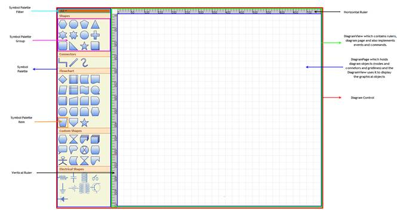

::: {style="DISPLAY: none"}
{#d2h_url_template}{#d2h_package_url style="WIDTH: 0px; DISPLAY: none; HEIGHT: 0px"}
:::

::::: {#nsbanner .d2h_main_nsbanner style="BORDER-BOTTOM: #999999 1px solid; POSITION: relative; PADDING-BOTTOM: 0px; BACKGROUND-COLOR: transparent; PADDING-LEFT: 0px; PADDING-RIGHT: 0px; DISPLAY: none; BORDER-TOP: #999999 1px solid; PADDING-TOP: 0px; LEFT: 0px"}
:::: {#TitleRow .d2h_main_titlerow style="PADDING-BOTTOM: 4px; BACKGROUND-COLOR: transparent; PADDING-LEFT: 22px; WIDTH: 100%; PADDING-RIGHT: 10px; DISPLAY: none; PADDING-TOP: 4px"}
::: {#ienav .d2h_main_ienav style="DISPLAY: none"}
{#D2HPrevious .D2HPreviousEnabled}  {#D2HNext .D2HNextEnabled}
:::
::::
:::::

:::: {#nstext .d2h_main_nstext style="PADDING-BOTTOM: 10px; BACKGROUND-COLOR: transparent; PADDING-LEFT: 22px; PADDING-RIGHT: 10px; HEIGHT: 100%; OVERFLOW: auto; PADDING-TOP: 5px" hasuserbackground="true" valign="bottom"}
::: {#d2h_breadcrumbs .d2h_breadcrumbs}
[Essential Studio User Guide Documentation](ms-xhelp:///?Id=12457748-09e3-4d74-a240-8e049cedf030){.d2h_breadcrumbsNormal}[ \> ]{.d2h_breadcrumbsLinkSeparator}[User Interface Edition](ms-xhelp:///?Id=c29296b7-531c-413b-a0ec-488ca1f7f669){.d2h_breadcrumbsNormal}[ \> ]{.d2h_breadcrumbsLinkSeparator}[Essential WPF](ms-xhelp:///?Id=7f4f82c5-151c-4262-94d0-75c4626c77bc){.d2h_breadcrumbsNormal}[ \> ]{.d2h_breadcrumbsLinkSeparator}[Essential Diagram]{.d2h_breadcrumbsContentsOnly}[ \> ]{.d2h_breadcrumbsLinkSeparator}[Getting Started](ms-xhelp:///?Id=c37538af-02be-40ac-bc8d-eef94f6fd0ed){.d2h_breadcrumbsNormal}
:::

## Diagram Architecture {#diagram-architecture style="tab-stops: 0pt"}

The following is a general description about the important classes of Diagram WPF. These classes form the base of the control.

[]{style="FONT-FAMILY: 'Trebuchet MS','sans-serif'; COLOR: #15428b; FONT-SIZE: 9pt"} 

Diagram Control

The Diagram control is the base class, which contains the view and the model. It receives user input and translates it into actions and commands on the model and view. It also implements SymbolPalette and scrolling, and enables horizontal and vertical scrollbars when the size of the view exceeds the size of the window.\
\
**Diagram Model**

A model represents data for an application and contains the logic for adding, accessing, and manipulating the data. Nodes and connectors are added to the Diagram Control using the **Model** property. A predefined layout can be applied using the **LayoutType** property of the DiagramModel, or the position of the nodes can be manually specified.

[\
]{style="FONT-SIZE: 9pt"}Diagram View

The view obtains data from the model and presents them to the user. It typically manages the overall layout of the data obtained from the model.\
\
Apart from presenting the data, view also handles navigation between the items, and some aspects of item selection. The views also implements basic user interface features, such as rulers, and drag-and-drop. It handles the events, which occur on the objects, obtained from the model. Command mechanism is also implemented by the view.\
\
A view can be constructed without a model, but a model must be provided before it can display useful information. Views can also render additional visual information that do not exist inside the model such as bounding boxes and grids. These additional view-specific objects are referred to as decorators, because they provide additional visual aids and window dressing to the view; but they are not actually a part of the model.

\
Diagram Page

The DiagramPage is just a container to hold the objects(nodes and connectors) added through the model. The DiagramView uses the page to display the diagram objects. As mentioned before, the view implements several basic user interface features like rulers, grids, events and commands. So therefore page is just a container to hold the graphical objects added through the model and the DiagramView uses it to display the objects.

[]{style="FONT-FAMILY: 'Trebuchet MS','sans-serif'; COLOR: #15428b; FONT-SIZE: 9pt"} 

SymbolPalette

The SymbolPalette control displays node shapes and allows a user to drag and drop symbols onto diagrams. It supports grouping and filtering symbols. It allows users to classify items as groups, so they can be navigated easily. Also, custom shapes can be added to the SymbolPalette.

 

SymbolPaletteGroup

A SymbolPalette group is a collection of SymbolPalette items. It is used to group the items in the SymbolPalette control based on classifications provided. The SymbolPalette group can be added to the SymbolPalette using the SymbolGroups property.

 

SymbolPaletteFilter[]{style="FONT-FAMILY: 'Trebuchet MS','sans-serif'; COLOR: #15428b; FONT-WEIGHT: normal"}

A SymbolPalette filter can be added to the SymbolPalette control, using the **SymbolFilters** property, so that only desired SymbolPalette groups get displayed.

**[]{style="FONT-FAMILY: 'Trebuchet MS','sans-serif'; COLOR: #15428b"}** 

SymbolPaletteItem[]{style="FONT-FAMILY: 'Trebuchet MS','sans-serif'; COLOR: #15428b; FONT-WEIGHT: normal"}

SymbolPalette items are contained in the SymbolPalette group. A SymbolPalette item does not restrict users to the type of content that can be added to it. A SymbolPalette item can be a text box, combo box, image, button, and so on.

**[]{style="FONT-FAMILY: 'Trebuchet MS','sans-serif'; COLOR: #15428b"}** 

Horizontal / Vertical Ruler[]{style="FONT-FAMILY: 'Trebuchet MS','sans-serif'; COLOR: #15428b; FONT-SIZE: 9pt"}

Rulers display the coordinates of elements on the diagram page. Negative label values get displayed on the ruler in case the page is panned to the right side. On Zooming, the ruler values get adjusted accordingly, to match with the current Zoom level. At any point, the ruler value always indicates the exact coordinates of the page and its elements. So when the page is zoomed, the interval values get halved or doubled depending upon the zoom level.

[]{style="FONT-FAMILY: 'Trebuchet MS','sans-serif'; COLOR: #15428b; FONT-SIZE: 9pt"} 

{border="0"}

Figure 10: Diagram Page Illustrated[]{style="FONT-FAMILY: 'Trebuchet MS','sans-serif'; COLOR: #15428b"}

[]{style="FONT-FAMILY: 'Trebuchet MS','sans-serif'; COLOR: #15428b; FONT-SIZE: 9pt"} 

[]{#related-topics}
::::
