::: {style="DISPLAY: none"}
{#d2h_url_template}{#d2h_package_url style="WIDTH: 0px; DISPLAY: none; HEIGHT: 0px"}
:::

:::::::::::::::: {.d2h_secondary_topic style="PADDING-BOTTOM: 10pt; MARGIN: 0pt; PADDING-LEFT: 0pt; PADDING-RIGHT: 0pt; PADDING-TOP: 0pt"}
#### Diagram Builder {#diagram-builder style="tab-stops: 0pt"}

[]{style="FONT-FAMILY: 'Trebuchet MS','sans-serif'; COLOR: #15428b; FONT-SIZE: 9pt"} 

Diagram Builder application allows the user to create new diagrams and also modify the existing ones. This application has \*.edd extension. The user can use this diagram in their applications.

[]{style="FONT-FAMILY: 'Trebuchet MS','sans-serif'; COLOR: #15428b; FONT-SIZE: 9pt"} 

The main difference between the diagram builder and symbol palette is as follows:

[]{style="FONT-FAMILY: 'Trebuchet MS','sans-serif'; COLOR: #15428b; FONT-SIZE: 9pt"} 

[·      ]{style="FONT-FAMILY: Symbol"}In Diagram Builder, user creates diagram documents

[·      ]{style="FONT-FAMILY: Symbol"}In Symbol Designer, user creates palettes.

[]{style="FONT-FAMILY: 'Trebuchet MS','sans-serif'; COLOR: #15428b; FONT-SIZE: 9pt"} 

Software Path

[]{style="FONT-FAMILY: 'Trebuchet MS','sans-serif'; COLOR: #15428b; FONT-SIZE: 9pt"} 

**..\\..\\Syncfusion\\Essential Studio\\\<Version Number\>\\utilities\\Diagram\\DiagramBuilder**

[]{style="FONT-FAMILY: 'Trebuchet MS','sans-serif'; COLOR: #15428b; FONT-SIZE: 9pt"} 

[1. ]{style="FONT-SIZE: 9pt"}Overview Control

[]{style="FONT-FAMILY: 'Trebuchet MS','sans-serif'; COLOR: #15428b; FONT-SIZE: 9pt"} 

Overview Control provides a perspective view of a diagram model, and allows users to dynamically pan and zoom the diagrams. The control features a view port window that can be moved and / or resized using the mouse to modify the diagrams\' origin and magnification properties at run-time. The properties of this control is discussed in the [Overview Control]{style="FONT-SIZE: 9pt"} topic.

[]{style="FONT-FAMILY: 'Trebuchet MS','sans-serif'; COLOR: #15428b; FONT-SIZE: 9pt"} 

[2. ]{style="FONT-SIZE: 9pt"}Palette GroupBar and GroupView

[]{style="FONT-FAMILY: 'Trebuchet MS','sans-serif'; COLOR: #15428b; FONT-SIZE: 9pt"} 

The **PaletteGroupBar** control provides a way for users to drag and drop symbols onto a diagram. It is based on the Syncfusion Essential Tools GroupBar control. Each symbol palette loaded in the PaletteGroupBar occupies a panel that can be selected by a bar button. The bar button is labeled with the name of the symbol palette. The symbols in the palette are shown as icons that can be dragged and dropped onto the diagram. This control allows users to add symbols to a palette, and save or load the palette whenever necessary. It provides a way to classify and maintain symbols.

 

The **PaletteGroupView** control provides an easy way to serialize a symbol palette to and from the resource file of a form. At design-time, users can attach a symbol palette to a PaletteGroupView control in the form. Selecting the PaletteGroupView and clicking the **Palette** property in the Visual Studio .NET Properties window will open a standard Open File dialog, which allows the user to select a symbol palette file that has been created with the Symbol Designer.

 

For more details about these diagram controls, refer to the [Palette GroupBar and GroupView]{style="FONT-SIZE: 9pt"} topic.

[]{style="FONT-FAMILY: 'Trebuchet MS','sans-serif'; COLOR: #15428b; FONT-SIZE: 9pt"} 

[3. ]{style="FONT-SIZE: 9pt"}Property Editor

[]{style="FONT-FAMILY: 'Trebuchet MS','sans-serif'; COLOR: #15428b; FONT-SIZE: 9pt"} 

The Property Editor in Essential Diagram displays properties of the currently selected object(s) in the diagram. It is a Windows Forms control that can be added to the Visual Studio .NET Toolbox. It also allows users to set or modify various properties of the objects or the model. The Property Editor provides an easy interface to set and view the various property settings. To know about the control\'s properties see [Property Editor]{style="FONT-SIZE: 9pt"} topic.

[]{style="FONT-FAMILY: 'Trebuchet MS','sans-serif'; COLOR: #15428b; FONT-SIZE: 9pt"} 

[4. ]{style="FONT-SIZE: 9pt"}Document Explorer

**[]{style="FONT-FAMILY: 'Trebuchet MS','sans-serif'; COLOR: #15428b"}** 

[Document Explorer]{style="FONT-SIZE: 9pt"} allows you to visualize the details of the various objects that are added onto the diagram control at run-time. The layers will be listed under the ***Layers*** node and other objects like shapes, links, lines and text editor will be listed under ***Nodes*** node.

[]{style="FONT-FAMILY: 'Trebuchet MS','sans-serif'; COLOR: #15428b; FONT-SIZE: 9pt"} 

[5. ]{style="FONT-SIZE: 9pt"}Diagram Document

[]{style="FONT-FAMILY: 'Trebuchet MS','sans-serif'; COLOR: #15428b; FONT-SIZE: 9pt"} 

The DiagramDocument is a serializable document type that encapsulates the model and view data for the diagram. The grid area of the diagram document is the diagram view object area. The nodes dragged from the PaletteGroupBar will be dropped here.

[]{style="FONT-FAMILY: 'Trebuchet MS','sans-serif'; COLOR: #15428b; FONT-SIZE: 9pt"} 

For more details, see [Diagram Grid]{style="COLOR: windowtext; TEXT-DECORATION: none; text-underline: none"} topic.

**[]{style="FONT-FAMILY: 'Trebuchet MS','sans-serif'; COLOR: #15428b"}** 

Diagram Builder Functionalities

[]{style="FONT-FAMILY: 'Trebuchet MS','sans-serif'; COLOR: #15428b; FONT-SIZE: 9pt"} 

[1. ]{style="FONT-SIZE: 9pt"}How to Open an Existing Diagram Document

[]{style="FONT-FAMILY: 'Trebuchet MS','sans-serif'; COLOR: #15428b; FONT-SIZE: 9pt"} 

Follow the below steps in order to open an existing diagram document

[]{style="FONT-FAMILY: 'Trebuchet MS','sans-serif'; COLOR: #15428b; FONT-SIZE: 9pt"} 

1.   Add OpenFileDialog control to the Form.

2.   Set the **Filter** property of OpenFileDialog as Essential Diagram Palettes\|\*.edp\|Visio Stencils\|\*.vss; \*.vsx\|Visio    Drawings(Shapes only)\|\*.vsd; \*.vdx\|All files\|\*.\*.

3.   Add the below code snippet in your button click event.

[]{style="FONT-FAMILY: 'Trebuchet MS','sans-serif'; COLOR: #15428b; FONT-SIZE: 9pt"} 

+------------------------------------------------------------------------------------------------------------------------------------------------------------------------------------------------------+
| **[\[C#\]]{style="FONT-FAMILY: 'Courier New'; COLOR: black"}**                                                                                                                                       |
|                                                                                                                                                                                                      |
| []{style="FONT-FAMILY: 'Courier New'; COLOR: black"}                                                                                                                                                 |
|                                                                                                                                                                                                      |
| [// Checking whether \"OK\" button is clicked in OpenFileDialog]{style="FONT-FAMILY: 'Courier New'; COLOR: green"}                                                                                   |
|                                                                                                                                                                                                      |
| [if]{style="FONT-FAMILY: 'Courier New'; COLOR: blue"}[ ([this]{style="COLOR: blue"}.openFileDialog1.ShowDialog([this]{style="COLOR: blue"}) == DialogResult.OK)]{style="FONT-FAMILY: 'Courier New'"} |
|                                                                                                                                                                                                      |
| [{]{style="FONT-FAMILY: 'Courier New'"}                                                                                                                                                              |
|                                                                                                                                                                                                      |
| [    [string]{style="COLOR: blue"} FileName = [this]{style="COLOR: blue"}.openFileDialog1.FileName;]{style="FONT-FAMILY: 'Courier New'"}                                                             |
|                                                                                                                                                                                                      |
| [    [this]{style="COLOR: blue"}.diagram1.LoadBinary(FileName);]{style="FONT-FAMILY: 'Courier New'"}                                                                                                 |
|                                                                                                                                                                                                      |
| [    [this]{style="COLOR: blue"}.diagram1.Refresh();]{style="FONT-FAMILY: 'Courier New'"}                                                                                                            |
|                                                                                                                                                                                                      |
| [}]{style="FONT-FAMILY: 'Courier New'"}                                                                                                                                                              |
+------------------------------------------------------------------------------------------------------------------------------------------------------------------------------------------------------+

[]{style="FONT-FAMILY: 'Courier New'"} 

The **diagram1.LoadBinary()** method loads the selected diagram file into diagram document.

[]{style="FONT-FAMILY: 'Trebuchet MS','sans-serif'; COLOR: #15428b; FONT-SIZE: 9pt"} 

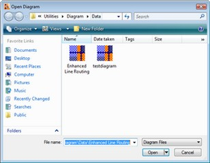{border="0"}

[]{style="FONT-FAMILY: 'Trebuchet MS','sans-serif'; COLOR: #15428b; FONT-SIZE: 9pt"} 

Figure 6: Diagram Open Dialog Box

**[]{style="FONT-FAMILY: 'Trebuchet MS','sans-serif'; COLOR: #15428b; FONT-SIZE: 9pt"}** 

2\. How to Save a Diagram Document

[]{style="FONT-FAMILY: 'Trebuchet MS','sans-serif'; COLOR: #15428b; FONT-SIZE: 9pt"} 

Below are the steps to save a diagram document.

[]{style="FONT-FAMILY: 'Trebuchet MS','sans-serif'; COLOR: #15428b; FONT-SIZE: 9pt"} 

1.   Add SaveFileDialog control to the Form.

2.   Set the Filter property of SaveFileDialog as  Essential Diagram Files\|\*.edd\|All files\|\*.\*.

3.   Add the following code snippet in your button click event.

[]{style="FONT-FAMILY: 'Trebuchet MS','sans-serif'; COLOR: #15428b; FONT-SIZE: 9pt"} 

+------------------------------------------------------------------------------------------------------------------------------------------------------------------------------------------------------+
| **[\[C#\]]{style="FONT-FAMILY: 'Courier New'; COLOR: black"}**                                                                                                                                       |
|                                                                                                                                                                                                      |
| []{style="FONT-FAMILY: 'Courier New'; COLOR: black"}                                                                                                                                                 |
|                                                                                                                                                                                                      |
| [// Checking whether \"OK\" button is clicked in SaveFileDialog]{style="FONT-FAMILY: 'Courier New'; COLOR: green"}                                                                                   |
|                                                                                                                                                                                                      |
| [if]{style="FONT-FAMILY: 'Courier New'; COLOR: blue"}[ ([this]{style="COLOR: blue"}.saveFileDialog1.ShowDialog([this]{style="COLOR: blue"}) == DialogResult.OK)]{style="FONT-FAMILY: 'Courier New'"} |
|                                                                                                                                                                                                      |
| [{]{style="FONT-FAMILY: 'Courier New'"}                                                                                                                                                              |
|                                                                                                                                                                                                      |
| [    [this]{style="COLOR: blue"}.FileName = [this]{style="COLOR: blue"}.saveFileDialog1.FileName;]{style="FONT-FAMILY: 'Courier New'"}                                                               |
|                                                                                                                                                                                                      |
| [    [this]{style="COLOR: blue"}.diagram1.SaveBinary([this]{style="COLOR: blue"}.FileName);]{style="FONT-FAMILY: 'Courier New'"}                                                                     |
|                                                                                                                                                                                                      |
| [}]{style="FONT-FAMILY: 'Courier New'"}                                                                                                                                                              |
+------------------------------------------------------------------------------------------------------------------------------------------------------------------------------------------------------+

[]{style="FONT-FAMILY: 'Trebuchet MS','sans-serif'; COLOR: #15428b; FONT-SIZE: 9pt"} 

The **diagram1.SaveBinary()** method saves the diagram file in the given filename.

[]{style="FONT-FAMILY: 'Trebuchet MS','sans-serif'; COLOR: #15428b; FONT-SIZE: 9pt"} 

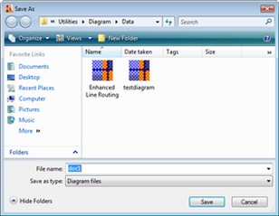{border="0"}

[]{style="FONT-FAMILY: 'Trebuchet MS','sans-serif'; COLOR: #15428b; FONT-SIZE: 9pt"} 

Figure 7: Diagram Save Dialog Box

[]{style="FONT-FAMILY: 'Trebuchet MS','sans-serif'; COLOR: #15428b; FONT-SIZE: 9pt"} 

[3. ]{style="FONT-SIZE: 9pt"}How to print a Diagram Document

[]{style="FONT-FAMILY: 'Trebuchet MS','sans-serif'; COLOR: #15428b; FONT-SIZE: 9pt"} 

Following are the steps to print a diagram document:

[]{style="FONT-FAMILY: 'Trebuchet MS','sans-serif'; COLOR: #15428b; FONT-SIZE: 9pt"} 

1\. Page Setup

[]{style="FONT-FAMILY: 'Trebuchet MS','sans-serif'; COLOR: #15428b; FONT-SIZE: 9pt"} 

The **Page Setup** dialog modifies the Page Settings and Printer Settings information for a given document. The user can enable sections of the dialog to manipulate printing, margins, paper orientation, size, source and to show help and network buttons. MinMargins defines the minimum margins a user can select.

 

The following code snippet can be used for setting the page set up for diagram document.

[]{style="FONT-FAMILY: 'Trebuchet MS','sans-serif'; COLOR: #15428b; FONT-SIZE: 9pt"} 

+------------------------------------------------------------------------------------------------------------------------------------------------------------------------------------------+
| **[\[C#\]]{style="FONT-FAMILY: 'Courier New'; COLOR: black"}**                                                                                                                           |
|                                                                                                                                                                                          |
| []{style="FONT-FAMILY: 'Courier New'; COLOR: black"}                                                                                                                                     |
|                                                                                                                                                                                          |
| [if]{style="FONT-FAMILY: 'Courier New'; COLOR: blue"}[ (diagram1 == [null]{style="COLOR: blue"} \|\| diagram1.Model == [null]{style="COLOR: blue"})]{style="FONT-FAMILY: 'Courier New'"} |
|                                                                                                                                                                                          |
| [    [return]{style="COLOR: blue"};]{style="FONT-FAMILY: 'Courier New'"}                                                                                                                 |
|                                                                                                                                                                                          |
| [using]{style="FONT-FAMILY: 'Courier New'; COLOR: blue"}[ (PageSetupDialog dlgPageSetup = [new]{style="COLOR: blue"}]{style="FONT-FAMILY: 'Courier New'"}                                |
|                                                                                                                                                                                          |
| [        PageSetupDialog(diagram1.View))]{style="FONT-FAMILY: 'Courier New'"}                                                                                                            |
|                                                                                                                                                                                          |
| [{]{style="FONT-FAMILY: 'Courier New'"}                                                                                                                                                  |
|                                                                                                                                                                                          |
| [    [if]{style="COLOR: blue"} (dlgPageSetup.ShowDialog() == DialogResult.OK)]{style="FONT-FAMILY: 'Courier New'"}                                                                       |
|                                                                                                                                                                                          |
| [    {]{style="FONT-FAMILY: 'Courier New'"}                                                                                                                                              |
|                                                                                                                                                                                          |
| [        diagram1.UpdateView();]{style="FONT-FAMILY: 'Courier New'"}                                                                                                                     |
|                                                                                                                                                                                          |
| [    }]{style="FONT-FAMILY: 'Courier New'"}                                                                                                                                              |
|                                                                                                                                                                                          |
| [}]{style="FONT-FAMILY: 'Courier New'"}                                                                                                                                                  |
+------------------------------------------------------------------------------------------------------------------------------------------------------------------------------------------+

[]{style="FONT-FAMILY: 'Trebuchet MS','sans-serif'; COLOR: #15428b; FONT-SIZE: 9pt"} 

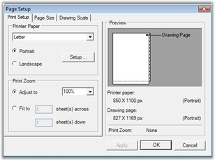{border="0"}

[]{style="FONT-FAMILY: 'Trebuchet MS','sans-serif'; COLOR: #15428b; FONT-SIZE: 9pt"} 

Figure 8: Diagram page Setup Dialog Box

[]{style="FONT-FAMILY: 'Trebuchet MS','sans-serif'; COLOR: #15428b; FONT-SIZE: 9pt"} 

2\. Page Borders

[]{style="FONT-FAMILY: 'Trebuchet MS','sans-serif'; COLOR: #15428b; FONT-SIZE: 9pt"} 

The **Page Borders** dialog provides an interactive form-based interface, for setting the page borders of a diagram, initializing the dialog\'s   Syncfusion.Windows.Forms.Diagram.PageBorderDialog. The **PageBorderStyle** property with the corresponding Syncfusion.Windows.Forms.Diagram.View.PageBorderStyle member of the diagram\'s view, will let the users to configure the page border settings using the dialog controls. 

 

The following code snippet can be used for setting the page border for diagram document.

 

+----------------------------------------------------------------------------------------------------------------------------------------------------------------------------------------+
| **[\[C#\]]{style="FONT-FAMILY: 'Courier New'; COLOR: black"}**                                                                                                                         |
|                                                                                                                                                                                        |
| []{style="FONT-FAMILY: 'Courier New'; COLOR: black"}                                                                                                                                   |
|                                                                                                                                                                                        |
| [if]{style="FONT-FAMILY: 'Courier New'; COLOR: blue"}[ (diagram1 != [null]{style="COLOR: blue"} && diagram1.Model != [null]{style="COLOR: blue"})]{style="FONT-FAMILY: 'Courier New'"} |
|                                                                                                                                                                                        |
| [{]{style="FONT-FAMILY: 'Courier New'"}                                                                                                                                                |
|                                                                                                                                                                                        |
| [    PageBorderDialog borderDialog = [new]{style="COLOR: blue"} PageBorderDialog();]{style="FONT-FAMILY: 'Courier New'"}                                                               |
|                                                                                                                                                                                        |
| [    borderDialog.PageBorderStyle = diagram1.View.PageBorderStyle; [// It will show existing border set up]{style="COLOR: green"}]{style="FONT-FAMILY: 'Courier New'"}                 |
|                                                                                                                                                                                        |
| [    [if]{style="COLOR: blue"} (borderDialog.ShowDialog() == DialogResult.OK)]{style="FONT-FAMILY: 'Courier New'"}                                                                     |
|                                                                                                                                                                                        |
| [    {]{style="FONT-FAMILY: 'Courier New'"}                                                                                                                                            |
|                                                                                                                                                                                        |
| [        diagram1.View.PageBorderStyle = borderDialog.PageBorderStyle; [// It will update the modified set up.]{style="COLOR: green"}]{style="FONT-FAMILY: 'Courier New'"}             |
|                                                                                                                                                                                        |
| [        diagram1.View.RefreshPageSettings();]{style="FONT-FAMILY: 'Courier New'"}                                                                                                     |
|                                                                                                                                                                                        |
| [        diagram1.UpdateView();]{style="FONT-FAMILY: 'Courier New'"}                                                                                                                   |
|                                                                                                                                                                                        |
| [    }]{style="FONT-FAMILY: 'Courier New'"}                                                                                                                                            |
|                                                                                                                                                                                        |
| [}]{style="FONT-FAMILY: 'Courier New'"}                                                                                                                                                |
+----------------------------------------------------------------------------------------------------------------------------------------------------------------------------------------+

[]{style="FONT-FAMILY: 'Trebuchet MS','sans-serif'; COLOR: #15428b; FONT-SIZE: 9pt"} 

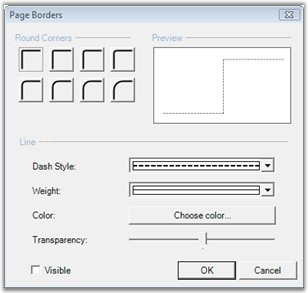{border="0"}

[]{style="FONT-FAMILY: 'Trebuchet MS','sans-serif'; COLOR: #15428b; FONT-SIZE: 9pt"} 

Figure 9: Diagram Page Borders Dialog Box

**[]{style="FONT-FAMILY: 'Trebuchet MS','sans-serif'; COLOR: #15428b; FONT-SIZE: 9pt"}** 

3\. Header and Footers

**[]{style="FONT-FAMILY: 'Trebuchet MS','sans-serif'; COLOR: #15428b; FONT-SIZE: 9pt"}** 

The **Header and Footer** dialog provides an interactive form-based interface for initializing the Header and Footer settings of a diagram.

                       

The following code snippet can be used for creating the Header and Footer dialog.

[]{style="FONT-FAMILY: 'Trebuchet MS','sans-serif'; COLOR: #15428b; FONT-SIZE: 9pt"} 

+----------------------------------------------------------------------------------------------------------------------------------------------------------------------------------------+
| **[\[C#\]]{style="FONT-FAMILY: 'Courier New'; COLOR: black"}**                                                                                                                         |
|                                                                                                                                                                                        |
| []{style="FONT-FAMILY: 'Courier New'; COLOR: black"}                                                                                                                                   |
|                                                                                                                                                                                        |
| [if]{style="FONT-FAMILY: 'Courier New'; COLOR: blue"}[ (diagram1 != [null]{style="COLOR: blue"} && diagram1.Model != [null]{style="COLOR: blue"})]{style="FONT-FAMILY: 'Courier New'"} |
|                                                                                                                                                                                        |
| [{]{style="FONT-FAMILY: 'Courier New'"}                                                                                                                                                |
|                                                                                                                                                                                        |
| [    HeaderFooterDialog dlgHF = [new]{style="COLOR: blue"} HeaderFooterDialog();]{style="FONT-FAMILY: 'Courier New'"}                                                                  |
|                                                                                                                                                                                        |
| [    dlgHF.Header = diagram1.Model.HeaderFooterData.Header;]{style="FONT-FAMILY: 'Courier New'"}                                                                                       |
|                                                                                                                                                                                        |
| [    dlgHF.Footer = diagram1.Model.HeaderFooterData.Footer;]{style="FONT-FAMILY: 'Courier New'"}                                                                                       |
|                                                                                                                                                                                        |
| [    dlgHF.MeasurementUnits = diagram1.Model.MeasurementUnits;]{style="FONT-FAMILY: 'Courier New'"}                                                                                    |
|                                                                                                                                                                                        |
| [    [if]{style="COLOR: blue"} (dlgHF.ShowDialog() == DialogResult.OK)]{style="FONT-FAMILY: 'Courier New'"}                                                                            |
|                                                                                                                                                                                        |
| [    {]{style="FONT-FAMILY: 'Courier New'"}                                                                                                                                            |
|                                                                                                                                                                                        |
| [        diagram1.Model.HeaderFooterData.Header = dlgHF.Header;]{style="FONT-FAMILY: 'Courier New'"}                                                                                   |
|                                                                                                                                                                                        |
| [        diagram1.Model.HeaderFooterData.Footer = dlgHF.Footer;]{style="FONT-FAMILY: 'Courier New'"}                                                                                   |
|                                                                                                                                                                                        |
| [    }]{style="FONT-FAMILY: 'Courier New'"}                                                                                                                                            |
|                                                                                                                                                                                        |
| [}]{style="FONT-FAMILY: 'Courier New'"}                                                                                                                                                |
+----------------------------------------------------------------------------------------------------------------------------------------------------------------------------------------+

[]{style="FONT-FAMILY: 'Trebuchet MS','sans-serif'; COLOR: #15428b; FONT-SIZE: 9pt"} 

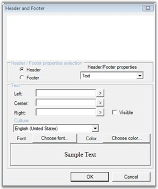{border="0"}

[]{style="FONT-FAMILY: 'Trebuchet MS','sans-serif'; COLOR: #15428b; FONT-SIZE: 9pt"} 

Figure 10: Diagram Header Footer Dialog Box

[]{style="FONT-FAMILY: 'Trebuchet MS','sans-serif'; COLOR: #15428b; FONT-SIZE: 9pt"} 

4\. Print Preview

**[]{style="FONT-FAMILY: 'Trebuchet MS','sans-serif'; COLOR: #15428b; FONT-SIZE: 9pt"}** 

It will show a preview of the page which will appear when printed. The **Print Preview** dialog shows the preview of the page with the following:

[]{style="FONT-FAMILY: 'Trebuchet MS','sans-serif'; COLOR: #15428b; FONT-SIZE: 9pt"} 

[·      ]{style="FONT-FAMILY: Symbol"}Page setup

[·      ]{style="FONT-FAMILY: Symbol"}Page border set up

[·      ]{style="FONT-FAMILY: Symbol"}Header and footers in the page

[]{style="FONT-FAMILY: 'Trebuchet MS','sans-serif'; COLOR: #15428b; FONT-SIZE: 9pt"} 

The following code snippet can be used for creating Print Preview dialog.

[]{style="FONT-FAMILY: 'Trebuchet MS','sans-serif'; COLOR: #15428b; FONT-SIZE: 9pt"} 

+---------------------------------------------------------------------------------------------------------------------------------------+
| **[\[C#\]]{style="FONT-FAMILY: 'Courier New'; COLOR: black"}**                                                                        |
|                                                                                                                                       |
| []{style="FONT-FAMILY: 'Courier New'; COLOR: black"}                                                                                  |
|                                                                                                                                       |
| [if]{style="FONT-FAMILY: 'Courier New'; COLOR: blue"}[ (diagram1 != [null]{style="COLOR: blue"})]{style="FONT-FAMILY: 'Courier New'"} |
|                                                                                                                                       |
| [{]{style="FONT-FAMILY: 'Courier New'"}                                                                                               |
|                                                                                                                                       |
| [    PrintDocument printDoc = diagram1.CreatePrintDocument();]{style="FONT-FAMILY: 'Courier New'"}                                    |
|                                                                                                                                       |
| [    PrintPreviewDialog printPreviewDlg = [new]{style="COLOR: blue"} PrintPreviewDialog();]{style="FONT-FAMILY: 'Courier New'"}       |
|                                                                                                                                       |
| [    printPreviewDlg.StartPosition = FormStartPosition.CenterScreen;]{style="FONT-FAMILY: 'Courier New'"}                             |
|                                                                                                                                       |
| []{style="FONT-FAMILY: 'Courier New'"}                                                                                                |
|                                                                                                                                       |
| [    printDoc.PrinterSettings.FromPage = 0;]{style="FONT-FAMILY: 'Courier New'"}                                                      |
|                                                                                                                                       |
| [    printDoc.PrinterSettings.ToPage = 0;]{style="FONT-FAMILY: 'Courier New'"}                                                        |
|                                                                                                                                       |
| [    printDoc.PrinterSettings.PrintRange = PrintRange.AllPages;]{style="FONT-FAMILY: 'Courier New'"}                                  |
|                                                                                                                                       |
| []{style="FONT-FAMILY: 'Courier New'"}                                                                                                |
|                                                                                                                                       |
| [    printPreviewDlg.Document = printDoc;]{style="FONT-FAMILY: 'Courier New'"}                                                        |
|                                                                                                                                       |
| [    printPreviewDlg.ShowDialog([this]{style="COLOR: blue"});]{style="FONT-FAMILY: 'Courier New'"}                                    |
|                                                                                                                                       |
| [}]{style="FONT-FAMILY: 'Courier New'"}                                                                                               |
+---------------------------------------------------------------------------------------------------------------------------------------+

[]{style="FONT-FAMILY: 'Trebuchet MS','sans-serif'; COLOR: #15428b; FONT-SIZE: 9pt"} 

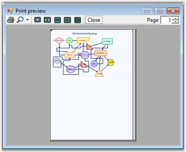{border="0"}

[]{style="FONT-FAMILY: 'Trebuchet MS','sans-serif'; COLOR: #15428b; FONT-SIZE: 9pt"} 

Figure 11: Print Preview Dialog Box

**[]{style="FONT-FAMILY: 'Trebuchet MS','sans-serif'; COLOR: #15428b; FONT-SIZE: 9pt"}** 

5\. Print

 

This option will send the diagram document to the printer.

 

The following code snippet can be used for sending the document for printing.

[]{style="FONT-FAMILY: 'Trebuchet MS','sans-serif'; COLOR: #15428b; FONT-SIZE: 9pt"} 

+-------------------------------------------------------------------------------------------------------------------------------------------+
| **[\[C#\]]{style="FONT-FAMILY: 'Courier New'; COLOR: black"}**                                                                            |
|                                                                                                                                           |
| []{style="FONT-FAMILY: 'Courier New'; COLOR: black"}                                                                                      |
|                                                                                                                                           |
| [if]{style="FONT-FAMILY: 'Courier New'; COLOR: blue"}[ (diagram1 != [null]{style="COLOR: blue"})]{style="FONT-FAMILY: 'Courier New'"}     |
|                                                                                                                                           |
| [{]{style="FONT-FAMILY: 'Courier New'"}                                                                                                   |
|                                                                                                                                           |
| [    PrintDocument printDoc = diagram1.CreatePrintDocument();]{style="FONT-FAMILY: 'Courier New'"}                                        |
|                                                                                                                                           |
| [    PrintDialog printDlg = [new]{style="COLOR: blue"} PrintDialog();]{style="FONT-FAMILY: 'Courier New'"}                                |
|                                                                                                                                           |
| [    printDlg.Document = printDoc;]{style="FONT-FAMILY: 'Courier New'"}                                                                   |
|                                                                                                                                           |
| []{style="FONT-FAMILY: 'Courier New'"}                                                                                                    |
|                                                                                                                                           |
| [    printDlg.AllowSomePages = [true]{style="COLOR: blue"};]{style="FONT-FAMILY: 'Courier New'"}                                          |
|                                                                                                                                           |
| []{style="FONT-FAMILY: 'Courier New'"}                                                                                                    |
|                                                                                                                                           |
| [    [if]{style="COLOR: blue"} (printDlg.ShowDialog([this]{style="COLOR: blue"}) == DialogResult.OK)]{style="FONT-FAMILY: 'Courier New'"} |
|                                                                                                                                           |
| [    {]{style="FONT-FAMILY: 'Courier New'"}                                                                                               |
|                                                                                                                                           |
| [        printDoc.PrinterSettings = printDlg.PrinterSettings;]{style="FONT-FAMILY: 'Courier New'"}                                        |
|                                                                                                                                           |
| [        printDoc.Print();]{style="FONT-FAMILY: 'Courier New'"}                                                                           |
|                                                                                                                                           |
| [    }]{style="FONT-FAMILY: 'Courier New'"}                                                                                               |
|                                                                                                                                           |
| [}]{style="FONT-FAMILY: 'Courier New'"}                                                                                                   |
+-------------------------------------------------------------------------------------------------------------------------------------------+

[]{style="FONT-FAMILY: 'Trebuchet MS','sans-serif'; COLOR: #15428b; FONT-SIZE: 9pt"} 

Diagram Builder Tools

[]{style="FONT-FAMILY: 'Trebuchet MS','sans-serif'; COLOR: #15428b; FONT-SIZE: 9pt"} 

Editing Options

**[]{style="FONT-FAMILY: 'Trebuchet MS','sans-serif'; COLOR: #15428b; FONT-SIZE: 9pt"}** 

::: {align="center"}
  ----------------- ----------------------------------------------------------------------------------------------------------- -------------------------------------------------------------------------------------------
  Edit Menu Items   Description                                                                                                 Code Snippet
  Undo              Reverts the latest modification done.                                                                       [Diagram1.Model.HistoryManager.Undo();]{style="FONT-FAMILY: 'Courier New'; COLOR: black"}
  Redo              Steps forward to operation history records and redoes the last undone task.                                 [Diagram1.Model.HistoryManager.Redo();]{style="FONT-FAMILY: 'Courier New'; COLOR: black"}
  Cut               Removes the currently selected nodes from the diagram and move them to the clipboard.                       [Diagram1.Controller.Cut();]{style="FONT-FAMILY: 'Courier New'; COLOR: black"}
  Copy              Copies the currently selected nodes to the clipboard.                                                       [Diagram1.Controller.Copy();]{style="FONT-FAMILY: 'Courier New'; COLOR: black"}
  Paste             Pastes the contents of the clipboard to the diagram.                                                        [Diagram1.Controller.Paste();]{style="FONT-FAMILY: 'Courier New'; COLOR: black"}
  Select All        Adds all nodes in the diagram  model to the SelectionList[.]{style="FONT-FAMILY: 'Calibri','sans-serif'"}   [Diagram1.Controller.SelectAll();]{style="FONT-FAMILY: 'Courier New'; COLOR: black"}
  ----------------- ----------------------------------------------------------------------------------------------------------- -------------------------------------------------------------------------------------------
:::

[]{style="FONT-FAMILY: 'Trebuchet MS','sans-serif'; COLOR: #15428b; FONT-SIZE: 9pt"} 

Pan & Zoom Tool

**[]{style="FONT-FAMILY: 'Trebuchet MS','sans-serif'; COLOR: #15428b; FONT-SIZE: 9pt"}** 

The following screen shot illustrates the pan and zoom tools.

[]{style="FONT-FAMILY: 'Trebuchet MS','sans-serif'; COLOR: #15428b; FONT-SIZE: 9pt"} 

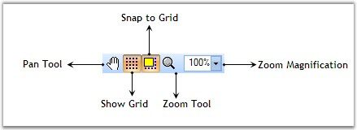{border="0"}

[]{style="FONT-FAMILY: 'Trebuchet MS','sans-serif'; COLOR: #15428b; FONT-SIZE: 9pt"} 

Figure 12: Pan&Zoom Tool

**[]{style="FONT-FAMILY: 'Trebuchet MS','sans-serif'; COLOR: #15428b; FONT-SIZE: 9pt"}** 

::: {align="center"}
+-----------------------+------------------------------------------------------------------------------------------------------------------------------------------------------------------+--------------------------------------------------------------------------------------------------------------------------------------------------------------------------------------------------+
| Tool Name             | Description                                                                                                                                                      | Code Snippet                                                                                                                                                                                     |
+-----------------------+------------------------------------------------------------------------------------------------------------------------------------------------------------------+--------------------------------------------------------------------------------------------------------------------------------------------------------------------------------------------------+
| Pan Tool              | Pan tool allows the user to drag the diagram and hence scroll it in any direction.                                                                               | [diagram1.Controller.ActivateTool(\"PanTool\");]{style="FONT-FAMILY: 'Courier New'; COLOR: black"}                                                                                               |
+-----------------------+------------------------------------------------------------------------------------------------------------------------------------------------------------------+--------------------------------------------------------------------------------------------------------------------------------------------------------------------------------------------------+
| Zoom Tool             | Zoom tool allows the user to zoom the diagram with minimum and maximum magnification.                                                                            | [diagram1.Controller.ActivateTool(\"ZoomTool\");]{style="FONT-FAMILY: 'Courier New'; COLOR: black"}                                                                                              |
+-----------------------+------------------------------------------------------------------------------------------------------------------------------------------------------------------+--------------------------------------------------------------------------------------------------------------------------------------------------------------------------------------------------+
| Magnification         | This value is used to zoom the view in and out. The x and y axes can be scaled independently. Normally, the x and y axes will have the same magnification value. | [int]{style="FONT-FAMILY: 'Courier New'; COLOR: blue"}[ magVal = 30;]{style="FONT-FAMILY: 'Courier New'; COLOR: black"}                                                                          |
|                       |                                                                                                                                                                  |                                                                                                                                                                                                  |
|                       |                                                                                                                                                                  | [diagram1.View.Magnification= magVal;]{style="FONT-FAMILY: 'Courier New'; COLOR: black"}                                                                                                         |
+-----------------------+------------------------------------------------------------------------------------------------------------------------------------------------------------------+--------------------------------------------------------------------------------------------------------------------------------------------------------------------------------------------------+
| ShowGrid              | This will show / hide the diagram view grid.                                                                                                                     | [Diagram1.View.Grid.Visible = ]{style="FONT-FAMILY: 'Courier New'; COLOR: black"}[true]{style="FONT-FAMILY: 'Courier New'; COLOR: blue"}[;]{style="FONT-FAMILY: 'Courier New'; COLOR: black"}    |
+-----------------------+------------------------------------------------------------------------------------------------------------------------------------------------------------------+--------------------------------------------------------------------------------------------------------------------------------------------------------------------------------------------------+
| SnapToGrid            | Specifies whether the snap to grid feature is enabled.                                                                                                           | [Diagram1.View.Grid.SnapToGrid =]{style="FONT-FAMILY: 'Courier New'; COLOR: black"}[true]{style="FONT-FAMILY: 'Courier New'; COLOR: blue"}[; ]{style="FONT-FAMILY: 'Courier New'; COLOR: black"} |
+-----------------------+------------------------------------------------------------------------------------------------------------------------------------------------------------------+--------------------------------------------------------------------------------------------------------------------------------------------------------------------------------------------------+
| Rulers                | Diagram control supports rulers similar to that in Microsoft Word. For details see [Rulers]{style="COLOR: black"}                                                | [Diagram1.ShowRulers=]{style="FONT-FAMILY: 'Courier New'; COLOR: black"}[true]{style="FONT-FAMILY: 'Courier New'; COLOR: blue"}[;]{style="FONT-FAMILY: 'Courier New'; COLOR: black"}             |
+-----------------------+------------------------------------------------------------------------------------------------------------------------------------------------------------------+--------------------------------------------------------------------------------------------------------------------------------------------------------------------------------------------------+
:::

**[]{style="FONT-FAMILY: 'Trebuchet MS','sans-serif'; COLOR: #15428b; FONT-SIZE: 9pt"}** 

Alignment Tool

**[]{style="FONT-FAMILY: 'Trebuchet MS','sans-serif'; COLOR: #15428b; FONT-SIZE: 9pt"}** 

The following screen shot illustrates the Alignment tools.

[]{style="FONT-FAMILY: 'Trebuchet MS','sans-serif'; COLOR: #15428b; FONT-SIZE: 9pt"} 

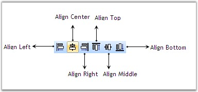{border="0"}

[]{style="FONT-FAMILY: 'Trebuchet MS','sans-serif'; COLOR: #15428b; FONT-SIZE: 9pt"} 

Figure 13:  Alignment Tool

[]{style="FONT-FAMILY: 'Trebuchet MS','sans-serif'; COLOR: #15428b; FONT-SIZE: 9pt"} 

::: {align="center"}
  ------------- -------------------------------------------------------------------------- -----------------------------------------------------------------------------
  Tool Name     Description                                                                Code Snippet
  AlignLeft     Aligns the selected nodes along the left edge of the first node.           [diagram1.AlignLeft();]{style="FONT-FAMILY: 'Courier New'; COLOR: black"}
  AlignCenter   Aligns the selected nodes along the vertical center of the first node.     [diagram1.AlignCenter();]{style="FONT-FAMILY: 'Courier New'; COLOR: black"}
  AlignRight    Aligns the selected nodes along the right edge of the first node.          [diagram1.AlignRight();]{style="FONT-FAMILY: 'Courier New'; COLOR: black"}
  AlignTop      Aligns the selected nodes along the top edge of the first node.            [diagram1.AlignTop();]{style="FONT-FAMILY: 'Courier New'; COLOR: black"}
  AlignMiddle   Aligns the selected nodes along the horizontal center of the first node.   [diagram1.AlignMiddle();]{style="FONT-FAMILY: 'Courier New'; COLOR: black"}
  AlignBottom   Aligns the selected nodes along the bottom edge of the first node.         [diagram1.AlignBottom();]{style="FONT-FAMILY: 'Courier New'; COLOR: black"}
  ------------- -------------------------------------------------------------------------- -----------------------------------------------------------------------------
:::

[]{style="FONT-FAMILY: 'Trebuchet MS','sans-serif'; COLOR: #15428b; FONT-SIZE: 9pt"} 

Rotate Tool

[]{style="FONT-FAMILY: 'Trebuchet MS','sans-serif'; COLOR: #15428b; FONT-SIZE: 9pt"} 

The following screen shot illustrates the Rotate tools.

[]{style="FONT-FAMILY: 'Trebuchet MS','sans-serif'; COLOR: #15428b; FONT-SIZE: 9pt"} 

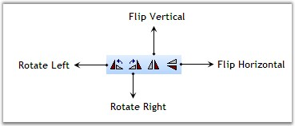{border="0"}

***[]{style="FONT-FAMILY: 'Trebuchet MS','sans-serif'; COLOR: #15428b; FONT-SIZE: 9pt"}*** 

Figure 14:  Rotate Tools

[]{style="FONT-FAMILY: 'Trebuchet MS','sans-serif'; COLOR: #15428b; FONT-SIZE: 9pt"} 

::: {align="center"}
  ---------------- --------------------------------------------------------------------- --------------------------------------------------------------------------------
  Tool Name        Description                                                           Code Snippet
  RotateLeft       Rotates the selected nodes about their local origin by -90 degrees.   [diagram1.Rotate(-90);]{style="FONT-FAMILY: 'Courier New'; COLOR: black"}
  RotateRight      Rotates the selected nodes about their local origin by 90 degrees.    [diagram1.Rotate(90);]{style="FONT-FAMILY: 'Courier New'; COLOR: black"}
  FlipVertical     Flips the selected nodes about their vertical (Y) axis.               [diagram1.FlipVertical();]{style="FONT-FAMILY: 'Courier New'; COLOR: black"}
  FlipHorizontal   Flips the selected nodes about their horizontal (X) axis.             [diagram1.FlipHorizontal();]{style="FONT-FAMILY: 'Courier New'; COLOR: black"}
  ---------------- --------------------------------------------------------------------- --------------------------------------------------------------------------------
:::

[]{style="FONT-FAMILY: 'Trebuchet MS','sans-serif'; COLOR: #15428b; FONT-SIZE: 9pt"} 

Resize Tool

[]{style="FONT-FAMILY: 'Trebuchet MS','sans-serif'; COLOR: #15428b; FONT-SIZE: 9pt"} 

The following screen shot illustrates the Resize tools.

[]{style="FONT-FAMILY: 'Trebuchet MS','sans-serif'; COLOR: #15428b; FONT-SIZE: 9pt"} 

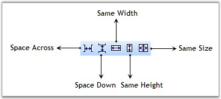{border="0"}

***[]{style="FONT-FAMILY: 'Trebuchet MS','sans-serif'; COLOR: #15428b; FONT-SIZE: 9pt"}*** 

Figure 15: Resize Tools

[]{style="FONT-FAMILY: 'Trebuchet MS','sans-serif'; COLOR: #15428b; FONT-SIZE: 9pt"} 

::: {align="center"}
  ------------- -------------------------------------------------------------- ------------------------------------------------------------------------------
  Tool Name     Description                                                    Code Snippet
  SpaceAcross   Positions the selected nodes for equal horizontal spacing      [diagram1.SpaceAccross();]{style="FONT-FAMILY: 'Courier New'; COLOR: black"}
  SpaceDown     Positions the selected nodes for equal vertical spacing        [diagram1.SpaceDown();]{style="FONT-FAMILY: 'Courier New'; COLOR: black"}
  SameSize      Sets the width and height of the selected nodes to be equal.   [diagram1.SameSize();]{style="FONT-FAMILY: 'Courier New'; COLOR: black"}
  SameHeight    Sets the height of the selected nodes to be equal.             [diagram1.SameHeight();  ]{style="FONT-FAMILY: 'Courier New'; COLOR: black"}
  SameWidth     Sets the width of the selected nodes to be equal.              [diagram1.SameWidth();]{style="FONT-FAMILY: 'Courier New'; COLOR: black"}
  ------------- -------------------------------------------------------------- ------------------------------------------------------------------------------
:::

[]{style="FONT-FAMILY: 'Trebuchet MS','sans-serif'; COLOR: #15428b; FONT-SIZE: 9pt"} 

Nudge Tool

**[]{style="FONT-FAMILY: 'Trebuchet MS','sans-serif'; COLOR: #15428b; FONT-SIZE: 9pt"}** 

The following screen shot illustrates the Nudge tools.

**[]{style="FONT-FAMILY: 'Trebuchet MS','sans-serif'; COLOR: #15428b; FONT-SIZE: 9pt"}** 

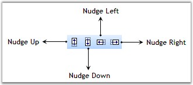{border="0"}

***[]{style="FONT-FAMILY: 'Trebuchet MS','sans-serif'; COLOR: #15428b; FONT-SIZE: 9pt"}*** 

Figure 16: Nudge Tools

**[]{style="FONT-FAMILY: 'Trebuchet MS','sans-serif'; COLOR: #15428b; FONT-SIZE: 9pt"}** 

::: {align="center"}
  ------------ ----------------------------------------------------------------------------------------------------------------------- ----------------------------------------------------------------------------
  Tool Name    Description                                                                                                             Code Snippet
  NudgeUp      Nudge the selected components up by Syncfusion.Windows.Forms.Diagram.Controls.Diagram.NudgeIncrement units.             [diagram1.NudgeUp();]{style="FONT-FAMILY: 'Courier New'; COLOR: black"}
  NudgeDown    Nudge the selected components down by Syncfusion.Windows.Forms.Diagram.Controls.Diagram.NudgeIncrement units.           [diagram1.NudgeDown();]{style="FONT-FAMILY: 'Courier New'; COLOR: black"}
  NudgeLeft    Nudge the selected components to the left by Syncfusion.Windows.Forms.Diagram.Controls.Diagram.NudgeIncrement units.    [diagram1.NudgeLeft();]{style="FONT-FAMILY: 'Courier New'; COLOR: black"}
  NudgeRight   Nudge the selected components to the right by Syncfusion.Windows.Forms.Diagram.Controls.Diagram.NudgeIncrement units.   [diagram1.NudgeRight();]{style="FONT-FAMILY: 'Courier New'; COLOR: black"}
  ------------ ----------------------------------------------------------------------------------------------------------------------- ----------------------------------------------------------------------------
:::

**[]{style="FONT-FAMILY: 'Trebuchet MS','sans-serif'; COLOR: #15428b; FONT-SIZE: 9pt"}** 

**[]{style="FONT-FAMILY: 'Trebuchet MS','sans-serif'; COLOR: #15428b; FONT-SIZE: 9pt"}** 

Text Formatting Tool

**[]{style="FONT-FAMILY: 'Trebuchet MS','sans-serif'; COLOR: #15428b; FONT-SIZE: 9pt"}** 

The following screen shot illustrates the Text Formatting tools.

[]{style="FONT-FAMILY: 'Trebuchet MS','sans-serif'; COLOR: #15428b; FONT-SIZE: 9pt"} 

{border="0"}

***[]{style="FONT-FAMILY: 'Trebuchet MS','sans-serif'; COLOR: #15428b; FONT-SIZE: 9pt"}*** 

Figure 17: Text Formatting Tools

**[]{style="FONT-FAMILY: 'Trebuchet MS','sans-serif'; COLOR: #15428b; FONT-SIZE: 9pt"}** 

::: {align="center"}
+-----------------------+---------------------------------------------------------------------------------------------------------+----------------------------------------------------------------------------------------------------------------------------------------------------------------------------------------------------------------------------------------------------------------------------------------------------------------------------------------------------------------------------------------------------------------------------------------------------------+
| Tool Name             | Description                                                                                             | Code Snippet                                                                                                                                                                                                                                                                                                                                                                                                                                             |
+-----------------------+---------------------------------------------------------------------------------------------------------+----------------------------------------------------------------------------------------------------------------------------------------------------------------------------------------------------------------------------------------------------------------------------------------------------------------------------------------------------------------------------------------------------------------------------------------------------------+
| Font Family           | The **FamilyName** property is used to  get or set the font family name.                                | [string]{style="FONT-FAMILY: 'Courier New'; COLOR: blue"}[ strFamilyName = ]{style="FONT-FAMILY: 'Courier New'; COLOR: black"}[this]{style="FONT-FAMILY: 'Courier New'; COLOR: blue"}[.comboBoxBarItemFontFamily.ListBox.SelectedItem.ToString();]{style="FONT-FAMILY: 'Courier New'; COLOR: black"}                                                                                                                                                     |
|                       |                                                                                                         |                                                                                                                                                                                                                                                                                                                                                                                                                                                          |
|                       |                                                                                                         | []{style="FONT-FAMILY: 'Courier New'; COLOR: black"}                                                                                                                                                                                                                                                                                                                                                                                                     |
|                       |                                                                                                         |                                                                                                                                                                                                                                                                                                                                                                                                                                                          |
|                       |                                                                                                         | [if]{style="FONT-FAMILY: 'Courier New'; COLOR: blue"}[(]{style="FONT-FAMILY: 'Courier New'; COLOR: black"}[this]{style="FONT-FAMILY: 'Courier New'; COLOR: blue"}[.diagram1.Controller.TextEditor.FamilyName != strFamilyName )]{style="FONT-FAMILY: 'Courier New'; COLOR: black"}[this]{style="FONT-FAMILY: 'Courier New'; COLOR: blue"}[.diagram1.Controller.TextEditor.FamilyName = strFamilyName;]{style="FONT-FAMILY: 'Courier New'; COLOR: black"} |
+-----------------------+---------------------------------------------------------------------------------------------------------+----------------------------------------------------------------------------------------------------------------------------------------------------------------------------------------------------------------------------------------------------------------------------------------------------------------------------------------------------------------------------------------------------------------------------------------------------------+
| Font Size             | Gets or sets the size of the point.                                                                     | [int]{style="FONT-FAMILY: 'Courier New'; COLOR: blue"}[ ptSize = 10; ]{style="FONT-FAMILY: 'Courier New'; COLOR: black"}[this]{style="FONT-FAMILY: 'Courier New'; COLOR: blue"}[.diagram1.Controller.TextEditor.PointSize = ptSize;]{style="FONT-FAMILY: 'Courier New'; COLOR: black"}                                                                                                                                                                   |
+-----------------------+---------------------------------------------------------------------------------------------------------+----------------------------------------------------------------------------------------------------------------------------------------------------------------------------------------------------------------------------------------------------------------------------------------------------------------------------------------------------------------------------------------------------------------------------------------------------------+
| Bold                  | Gets or sets a value indicating whether the Syncfusion.Windows.Forms.Diagram.TextEditor is bold.        | [bool]{style="FONT-FAMILY: 'Courier New'; COLOR: blue"}[ newValue = !( ]{style="FONT-FAMILY: 'Courier New'; COLOR: black"}[this]{style="FONT-FAMILY: 'Courier New'; COLOR: blue"}[.diagram1.Controller.TextEditor.Bold );]{style="FONT-FAMILY: 'Courier New'; COLOR: black"}                                                                                                                                                                             |
|                       |                                                                                                         |                                                                                                                                                                                                                                                                                                                                                                                                                                                          |
|                       |                                                                                                         | [this]{style="FONT-FAMILY: 'Courier New'; COLOR: blue"}[.diagram1.Controller.TextEditor.Bold = newValue; ]{style="FONT-FAMILY: 'Courier New'; COLOR: black"}                                                                                                                                                                                                                                                                                             |
+-----------------------+---------------------------------------------------------------------------------------------------------+----------------------------------------------------------------------------------------------------------------------------------------------------------------------------------------------------------------------------------------------------------------------------------------------------------------------------------------------------------------------------------------------------------------------------------------------------------+
| Italic                | Gets or sets a value indicating whether the Syncfusion.Windows.Forms.Diagram.TextEditor is italic.      | [bool]{style="FONT-FAMILY: 'Courier New'; COLOR: blue"}[ newValue = !( ]{style="FONT-FAMILY: 'Courier New'; COLOR: black"}[this]{style="FONT-FAMILY: 'Courier New'; COLOR: blue"}[.diagram1.Controller.TextEditor.Italic );]{style="FONT-FAMILY: 'Courier New'; COLOR: black"}                                                                                                                                                                           |
|                       |                                                                                                         |                                                                                                                                                                                                                                                                                                                                                                                                                                                          |
|                       |                                                                                                         | [this]{style="FONT-FAMILY: 'Courier New'; COLOR: blue"}[.diagram1.Controller.TextEditor.Italic = newValue;]{style="FONT-FAMILY: 'Courier New'; COLOR: black"}                                                                                                                                                                                                                                                                                            |
+-----------------------+---------------------------------------------------------------------------------------------------------+----------------------------------------------------------------------------------------------------------------------------------------------------------------------------------------------------------------------------------------------------------------------------------------------------------------------------------------------------------------------------------------------------------------------------------------------------------+
| Underline             | Gets or sets a value indicating whether the Syncfusion.Windows.Forms.Diagram.TextEditor is underline.   | [bool]{style="FONT-FAMILY: 'Courier New'; COLOR: blue"}[ newValue = !( ]{style="FONT-FAMILY: 'Courier New'; COLOR: black"}[this]{style="FONT-FAMILY: 'Courier New'; COLOR: blue"}[.diagram1.Controller.TextEditor.Underline );]{style="FONT-FAMILY: 'Courier New'; COLOR: black"}                                                                                                                                                                        |
|                       |                                                                                                         |                                                                                                                                                                                                                                                                                                                                                                                                                                                          |
|                       |                                                                                                         | [this]{style="FONT-FAMILY: 'Courier New'; COLOR: blue"}[.diagram1.Controller.TextEditor.Underline = newValue;]{style="FONT-FAMILY: 'Courier New'; COLOR: black"}                                                                                                                                                                                                                                                                                         |
+-----------------------+---------------------------------------------------------------------------------------------------------+----------------------------------------------------------------------------------------------------------------------------------------------------------------------------------------------------------------------------------------------------------------------------------------------------------------------------------------------------------------------------------------------------------------------------------------------------------+
| StrikeOut             | Gets or sets a value indicating whether the Syncfusion.Windows.Forms.Diagram.TextEditor is strikeout.   | [bool]{style="FONT-FAMILY: 'Courier New'; COLOR: blue"}[ newValue = !( ]{style="FONT-FAMILY: 'Courier New'; COLOR: black"}[this]{style="FONT-FAMILY: 'Courier New'; COLOR: blue"}[.diagram1.Controller.TextEditor.Strikeout );]{style="FONT-FAMILY: 'Courier New'; COLOR: black"}                                                                                                                                                                        |
|                       |                                                                                                         |                                                                                                                                                                                                                                                                                                                                                                                                                                                          |
|                       |                                                                                                         | [this]{style="FONT-FAMILY: 'Courier New'; COLOR: blue"}[.diagram1.Controller.TextEditor.Strikeout = newValue;]{style="FONT-FAMILY: 'Courier New'; COLOR: black"}                                                                                                                                                                                                                                                                                         |
+-----------------------+---------------------------------------------------------------------------------------------------------+----------------------------------------------------------------------------------------------------------------------------------------------------------------------------------------------------------------------------------------------------------------------------------------------------------------------------------------------------------------------------------------------------------------------------------------------------------+
| TextColor             | Gets or sets the color of the text.                                                                     | [ColorDialog dlg = ]{style="FONT-FAMILY: 'Courier New'; COLOR: black"}[new]{style="FONT-FAMILY: 'Courier New'; COLOR: blue"}[ ColorDialog( );]{style="FONT-FAMILY: 'Courier New'; COLOR: black"}                                                                                                                                                                                                                                                         |
|                       |                                                                                                         |                                                                                                                                                                                                                                                                                                                                                                                                                                                          |
|                       |                                                                                                         | [dlg.Color ]{style="FONT-FAMILY: 'Courier New'; COLOR: black"}[this]{style="FONT-FAMILY: 'Courier New'; COLOR: blue"}[.diagram1.Controller.TextEditor.TextColor;]{style="FONT-FAMILY: 'Courier New'; COLOR: black"}                                                                                                                                                                                                                                      |
|                       |                                                                                                         |                                                                                                                                                                                                                                                                                                                                                                                                                                                          |
|                       |                                                                                                         | [ ]{style="FONT-FAMILY: 'Courier New'; COLOR: black"}[if]{style="FONT-FAMILY: 'Courier New'; COLOR: blue"}[ ( dlg.ShowDialog( ]{style="FONT-FAMILY: 'Courier New'; COLOR: black"}[this]{style="FONT-FAMILY: 'Courier New'; COLOR: blue"}[ ) == DialogResult.OK )]{style="FONT-FAMILY: 'Courier New'; COLOR: black"}                                                                                                                                      |
|                       |                                                                                                         |                                                                                                                                                                                                                                                                                                                                                                                                                                                          |
|                       |                                                                                                         | [{]{style="FONT-FAMILY: 'Courier New'; COLOR: black"}                                                                                                                                                                                                                                                                                                                                                                                                    |
|                       |                                                                                                         |                                                                                                                                                                                                                                                                                                                                                                                                                                                          |
|                       |                                                                                                         | [this]{style="FONT-FAMILY: 'Courier New'; COLOR: blue"}[.diagram1.Controller.TextEditor.TextColor = dlg.Color;]{style="FONT-FAMILY: 'Courier New'; COLOR: black"}                                                                                                                                                                                                                                                                                        |
|                       |                                                                                                         |                                                                                                                                                                                                                                                                                                                                                                                                                                                          |
|                       |                                                                                                         | [ }]{style="FONT-FAMILY: 'Courier New'; COLOR: black"}                                                                                                                                                                                                                                                                                                                                                                                                   |
+-----------------------+---------------------------------------------------------------------------------------------------------+----------------------------------------------------------------------------------------------------------------------------------------------------------------------------------------------------------------------------------------------------------------------------------------------------------------------------------------------------------------------------------------------------------------------------------------------------------+
| Align Text Left       | Gets or sets the horizontal alignment to Near.                                                          | [this]{style="FONT-FAMILY: 'Courier New'; COLOR: blue"}[.diagram1.Controller.TextEditor.HorizontalAlignment = StringAlignment.Near;]{style="FONT-FAMILY: 'Courier New'; COLOR: black"}                                                                                                                                                                                                                                                                   |
+-----------------------+---------------------------------------------------------------------------------------------------------+----------------------------------------------------------------------------------------------------------------------------------------------------------------------------------------------------------------------------------------------------------------------------------------------------------------------------------------------------------------------------------------------------------------------------------------------------------+
| Align Text Right      | Gets or sets the horizontal alignment to Far.                                                           | [this]{style="FONT-FAMILY: 'Courier New'; COLOR: blue"}[.diagram1.Controller.TextEditor.HorizontalAlignment= StringAlignment.Far;]{style="FONT-FAMILY: 'Courier New'; COLOR: black"}                                                                                                                                                                                                                                                                     |
+-----------------------+---------------------------------------------------------------------------------------------------------+----------------------------------------------------------------------------------------------------------------------------------------------------------------------------------------------------------------------------------------------------------------------------------------------------------------------------------------------------------------------------------------------------------------------------------------------------------+
| Align Text Center     | Gets or sets the horizontal alignment to Center                                                         | [this]{style="FONT-FAMILY: 'Courier New'; COLOR: blue"}[.diagram1.Controller.TextEditor.HorizontalAlignment = StringAlignment.Center;]{style="FONT-FAMILY: 'Courier New'; COLOR: black"}                                                                                                                                                                                                                                                                 |
+-----------------------+---------------------------------------------------------------------------------------------------------+----------------------------------------------------------------------------------------------------------------------------------------------------------------------------------------------------------------------------------------------------------------------------------------------------------------------------------------------------------------------------------------------------------------------------------------------------------+
| Subscript             | Gets or sets a value indicating whether the Syncfusion.Windows.Forms.Diagram.TextEditor is subscript.   | [bool]{style="FONT-FAMILY: 'Courier New'; COLOR: blue"}[ newValue = !( ]{style="FONT-FAMILY: 'Courier New'; COLOR: black"}[this]{style="FONT-FAMILY: 'Courier New'; COLOR: blue"}[.diagram1.Controller.TextEditor.Subscript );]{style="FONT-FAMILY: 'Courier New'; COLOR: black"}                                                                                                                                                                        |
|                       |                                                                                                         |                                                                                                                                                                                                                                                                                                                                                                                                                                                          |
|                       |                                                                                                         | [this]{style="FONT-FAMILY: 'Courier New'; COLOR: blue"}[.diagram1.Controller.TextEditor.Subscript = newValue;]{style="FONT-FAMILY: 'Courier New'; COLOR: black"}                                                                                                                                                                                                                                                                                         |
+-----------------------+---------------------------------------------------------------------------------------------------------+----------------------------------------------------------------------------------------------------------------------------------------------------------------------------------------------------------------------------------------------------------------------------------------------------------------------------------------------------------------------------------------------------------------------------------------------------------+
| Superscript           | Gets or sets a value indicating whether the Syncfusion.Windows.Forms.Diagram.TextEditor is superscript. | [bool]{style="FONT-FAMILY: 'Courier New'; COLOR: blue"}[ nValue = !( ]{style="FONT-FAMILY: 'Courier New'; COLOR: black"}[this]{style="FONT-FAMILY: 'Courier New'; COLOR: blue"}[.diagramComponent.Controller.TextEditor.Superscript );]{style="FONT-FAMILY: 'Courier New'; COLOR: black"}                                                                                                                                                                |
|                       |                                                                                                         |                                                                                                                                                                                                                                                                                                                                                                                                                                                          |
|                       |                                                                                                         | [this]{style="FONT-FAMILY: 'Courier New'; COLOR: blue"}[.diagramComponent.Controller.TextEditor.Superscript = newValue;]{style="FONT-FAMILY: 'Courier New'; COLOR: black"}                                                                                                                                                                                                                                                                               |
+-----------------------+---------------------------------------------------------------------------------------------------------+----------------------------------------------------------------------------------------------------------------------------------------------------------------------------------------------------------------------------------------------------------------------------------------------------------------------------------------------------------------------------------------------------------------------------------------------------------+
| Lower Text            | Decreases the char offset value.                                                                        | [int]{style="FONT-FAMILY: 'Courier New'; COLOR: blue"}[ nCurrentOffset = ]{style="FONT-FAMILY: 'Courier New'; COLOR: black"}[this]{style="FONT-FAMILY: 'Courier New'; COLOR: blue"}[.diagramComponent.Controller.TextEditor.CharOffset;]{style="FONT-FAMILY: 'Courier New'; COLOR: black"}                                                                                                                                                               |
|                       |                                                                                                         |                                                                                                                                                                                                                                                                                                                                                                                                                                                          |
|                       |                                                                                                         | [nCurrentOffset\--;]{style="FONT-FAMILY: 'Courier New'; COLOR: black"}                                                                                                                                                                                                                                                                                                                                                                                   |
|                       |                                                                                                         |                                                                                                                                                                                                                                                                                                                                                                                                                                                          |
|                       |                                                                                                         | [this]{style="FONT-FAMILY: 'Courier New'; COLOR: blue"}[.diagram1.Controller.TextEditor.CharOffset = nCurrentOffset;]{style="FONT-FAMILY: 'Courier New'; COLOR: black"}                                                                                                                                                                                                                                                                                  |
+-----------------------+---------------------------------------------------------------------------------------------------------+----------------------------------------------------------------------------------------------------------------------------------------------------------------------------------------------------------------------------------------------------------------------------------------------------------------------------------------------------------------------------------------------------------------------------------------------------------+
| Upper Text            | Increases the char offset value.                                                                        | [int]{style="FONT-FAMILY: 'Courier New'; COLOR: blue"}[ nCurrentOffset = ]{style="FONT-FAMILY: 'Courier New'; COLOR: black"}[this]{style="FONT-FAMILY: 'Courier New'; COLOR: blue"}[.diagram1.Controller.TextEditor.CharOffset;]{style="FONT-FAMILY: 'Courier New'; COLOR: black"}                                                                                                                                                                       |
|                       |                                                                                                         |                                                                                                                                                                                                                                                                                                                                                                                                                                                          |
|                       |                                                                                                         | [nCurrentOffset++;]{style="FONT-FAMILY: 'Courier New'; COLOR: black"}                                                                                                                                                                                                                                                                                                                                                                                    |
|                       |                                                                                                         |                                                                                                                                                                                                                                                                                                                                                                                                                                                          |
|                       |                                                                                                         | [this]{style="FONT-FAMILY: 'Courier New'; COLOR: blue"}[.diagram1.Controller.TextEditor.CharOffset = nCurrentOffset;]{style="FONT-FAMILY: 'Courier New'; COLOR: black"}                                                                                                                                                                                                                                                                                  |
+-----------------------+---------------------------------------------------------------------------------------------------------+----------------------------------------------------------------------------------------------------------------------------------------------------------------------------------------------------------------------------------------------------------------------------------------------------------------------------------------------------------------------------------------------------------------------------------------------------------+
:::

**[]{style="FONT-FAMILY: 'Trebuchet MS','sans-serif'; COLOR: #15428b; FONT-SIZE: 9pt"}** 

Group & Order Tool

**[]{style="FONT-FAMILY: 'Trebuchet MS','sans-serif'; COLOR: #15428b; FONT-SIZE: 9pt"}** 

The following screen shot illustrates the Group and Order tools.

[]{style="FONT-FAMILY: 'Trebuchet MS','sans-serif'; COLOR: #15428b; FONT-SIZE: 9pt"} 

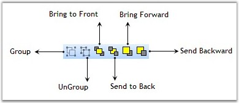{border="0"}

***[]{style="FONT-FAMILY: 'Trebuchet MS','sans-serif'; COLOR: #15428b; FONT-SIZE: 9pt"}*** 

Figure 18: Group & Order Tools

[]{style="FONT-FAMILY: 'Trebuchet MS','sans-serif'; COLOR: #15428b; FONT-SIZE: 9pt"} 

::: {align="center"}
  -------------- ----------------------------------------------------------------------------------- -----------------------------------------------------------------------------------------
  Tool Name      Description                                                                         Code Snippet
  Group          Groups the currently selected nodes in a diagram [Group]{style="FONT-SIZE: 9pt"}.   [diagram1.Controller.Group();]{style="FONT-FAMILY: 'Courier New'; COLOR: black"}
  UnGroup        Ungroups the currently selected group in a diagram.                                 [diagram1.Controller.UnGroup();]{style="FONT-FAMILY: 'Courier New'; COLOR: black"}
  BringToFront   Brings the selected nodes to the front of the Z-order.                              [diagram1.Controller.BringToFront();]{style="FONT-FAMILY: 'Courier New'; COLOR: black"}
  SendToBack     Sends the selected nodes to the back of the Z-order.                                [diagram1.Controller.SendToBack();]{style="FONT-FAMILY: 'Courier New'; COLOR: black"}
  BringForward   Brings the selected nodes forward in the Z-order.                                   [Diagram1.Controller.BringForward();]{style="FONT-FAMILY: 'Courier New'; COLOR: black"}
  SendBackward   Sends the selected nodes backward in the Z-order.                                   [Diagram1.Controller.SendBackward();]{style="FONT-FAMILY: 'Courier New'; COLOR: black"}
  -------------- ----------------------------------------------------------------------------------- -----------------------------------------------------------------------------------------
:::

**[]{style="FONT-FAMILY: 'Trebuchet MS','sans-serif'; COLOR: #15428b; FONT-SIZE: 9pt"}** 

Drawing Tools

**[]{style="FONT-FAMILY: 'Trebuchet MS','sans-serif'; COLOR: #15428b; FONT-SIZE: 9pt"}** 

The following screen shot illustrates the drawing tools.

**[]{style="FONT-FAMILY: 'Trebuchet MS','sans-serif'; COLOR: #15428b; FONT-SIZE: 9pt"}** 

 

{border="0"}***[]{style="FONT-FAMILY: 'Trebuchet MS','sans-serif'; COLOR: #15428b; FONT-SIZE: 9pt"}***

Figure 19: Drawing Tools

**[]{style="FONT-FAMILY: 'Trebuchet MS','sans-serif'; COLOR: #15428b; FONT-SIZE: 9pt"}** 

::: {align="center"}
+-----------------------+---------------------------------------------------------------------------------------------------------------------------------------------------------------------------------------------------------------------------------------------+----------------------------------------------------------------------------------------------------------------+
| Tool Name             | Description                                                                                                                                                                                                                                 | Code Snippet                                                                                                   |
+-----------------------+---------------------------------------------------------------------------------------------------------------------------------------------------------------------------------------------------------------------------------------------+----------------------------------------------------------------------------------------------------------------+
| SelectTool            | Specifies the selection mode.                                                                                                                                                                                                               | [diagram1.Controller.ActivateTool(\"SelectTool\");]{style="FONT-FAMILY: 'Courier New'; COLOR: black"}          |
+-----------------------+---------------------------------------------------------------------------------------------------------------------------------------------------------------------------------------------------------------------------------------------+----------------------------------------------------------------------------------------------------------------+
| LineTool              | Draws straight line with start and end point.                                                                                                                                                                                               | [diagram1.Controller.ActivateTool(\"LineTool\");]{style="FONT-FAMILY: 'Courier New'; COLOR: black"}            |
+-----------------------+---------------------------------------------------------------------------------------------------------------------------------------------------------------------------------------------------------------------------------------------+----------------------------------------------------------------------------------------------------------------+
| PolyLineTool          | Interactive tool for drawing polylines.                                                                                                                                                                                                     | [diagram1.Controller.ActivateTool(\"PolyLineTool\");]{style="FONT-FAMILY: 'Courier New'; COLOR: black"}        |
+-----------------------+---------------------------------------------------------------------------------------------------------------------------------------------------------------------------------------------------------------------------------------------+----------------------------------------------------------------------------------------------------------------+
| RectangleTool         | Interactive tool for drawing rectangles.                                                                                                                                                                                                    | [diagram1.Controller.ActivateTool(\"RectangleTool\");]{style="FONT-FAMILY: 'Courier New'; COLOR: black"}       |
+-----------------------+---------------------------------------------------------------------------------------------------------------------------------------------------------------------------------------------------------------------------------------------+----------------------------------------------------------------------------------------------------------------+
| RectangleTool         | Interactive tool for drawing   rounded rectangles.                                                                                                                                                                                          | [diagram1.Controller.ActivateTool(\"RectangleTool\");]{style="FONT-FAMILY: 'Courier New'; COLOR: black"}       |
+-----------------------+---------------------------------------------------------------------------------------------------------------------------------------------------------------------------------------------------------------------------------------------+----------------------------------------------------------------------------------------------------------------+
| EllipseTool           | Interactive tool for drawing ellipses.                                                                                                                                                                                                      | [diagram1.Controller.ActivateTool(\"EllipseTool\");]{style="FONT-FAMILY: 'Courier New'; COLOR: black"}         |
+-----------------------+---------------------------------------------------------------------------------------------------------------------------------------------------------------------------------------------------------------------------------------------+----------------------------------------------------------------------------------------------------------------+
| PolygonTool           | Interactive tool for drawing polygons.                                                                                                                                                                                                      | [diagram1.Controller.ActivateTool(\"PolygonTool\");]{style="FONT-FAMILY: 'Courier New'; COLOR: black"}         |
+-----------------------+---------------------------------------------------------------------------------------------------------------------------------------------------------------------------------------------------------------------------------------------+----------------------------------------------------------------------------------------------------------------+
| CurveTool             | Interactive tool for drawing curves.                                                                                                                                                                                                        | [diagram1.Controller.ActivateTool(\"CurveTool\");]{style="FONT-FAMILY: 'Courier New'; COLOR: black"}           |
+-----------------------+---------------------------------------------------------------------------------------------------------------------------------------------------------------------------------------------------------------------------------------------+----------------------------------------------------------------------------------------------------------------+
| ClosedCurveTool       | Interactive tool for drawing closed curves.                                                                                                                                                                                                 | [diagram1.Controller.ActivateTool(\"ClosedCurveTool\");]{style="FONT-FAMILY: 'Courier New'; COLOR: black"}     |
+-----------------------+---------------------------------------------------------------------------------------------------------------------------------------------------------------------------------------------------------------------------------------------+----------------------------------------------------------------------------------------------------------------+
| PencilTool            | Draws the user defined shape similar to Microsoft Paint.                                                                                                                                                                                    | [diagram1.Controller.ActivateTool(\"PencilTool\");]{style="FONT-FAMILY: 'Courier New'; COLOR: black"}          |
+-----------------------+---------------------------------------------------------------------------------------------------------------------------------------------------------------------------------------------------------------------------------------------+----------------------------------------------------------------------------------------------------------------+
| SplineTool            | Interactive tool for drawing spline.                                                                                                                                                                                                        | [diagram1.Controller.ActivateTool(\"SplineTool\");]{style="FONT-FAMILY: 'Courier New'; COLOR: black"}          |
+-----------------------+---------------------------------------------------------------------------------------------------------------------------------------------------------------------------------------------------------------------------------------------+----------------------------------------------------------------------------------------------------------------+
| BezierTool            | Interactive tool for drawing bezier.                                                                                                                                                                                                        | [diagram1.Controller.ActivateTool(\"BezierTool\");]{style="FONT-FAMILY: 'Courier New'; COLOR: black"}          |
+-----------------------+---------------------------------------------------------------------------------------------------------------------------------------------------------------------------------------------------------------------------------------------+----------------------------------------------------------------------------------------------------------------+
| TextTool              | Interactive tool for inserting text nodes into a diagram and editing existing text nodes.                                                                                                                                                   | [diagram1.Controller.ActivateTool(\"TextTool\");]{style="FONT-FAMILY: 'Courier New'; COLOR: black"}            |
|                       |                                                                                                                                                                                                                                             |                                                                                                                |
|                       | This tool manages the insertion of new text nodes into a diagram and editing existing ones. Activating this tool causes it to track mouse-down, mouse-move, and mouse-up events and draw a tracking rectangle.                              |                                                                                                                |
|                       |                                                                                                                                                                                                                                             |                                                                                                                |
|                       |                                                                                                                                                                                                                                             |                                                                                                                |
|                       |                                                                                                                                                                                                                                             |                                                                                                                |
|                       | The rectangle drawn is used as the bounds of a new text node, which is inserted into the diagram using an InsertNodesCmd.                                                                                                                   |                                                                                                                |
|                       |                                                                                                                                                                                                                                             |                                                                                                                |
|                       |                                                                                                                                                                                                                                             |                                                                                                                |
|                       |                                                                                                                                                                                                                                             |                                                                                                                |
|                       | This tool also listens to the double-click events. If the user double-clicks a text node, this tool opens a text editor allowing the user to edit the text.                                                                                 |                                                                                                                |
+-----------------------+---------------------------------------------------------------------------------------------------------------------------------------------------------------------------------------------------------------------------------------------+----------------------------------------------------------------------------------------------------------------+
| RichTextTool          | Interactive tool for inserting and editing rich text objects.                                                                                                                                                                               | [  diagram1.Controller.ActivateTool(\"RichTextTool\");]{style="FONT-FAMILY: 'Courier New'; COLOR: black"}      |
|                       |                                                                                                                                                                                                                                             |                                                                                                                |
|                       |                                                                                                                                                                                                                                             |                                                                                                                |
|                       |                                                                                                                                                                                                                                             |                                                                                                                |
|                       | This tool manages the insertion of new rich text nodes into a diagram and editing of existing rich text nodes.                                                                                                                              |                                                                                                                |
|                       |                                                                                                                                                                                                                                             |                                                                                                                |
|                       | Activating this tool causes it to track mouse-down, mouse-move, and mouse-up events and draw a tracking rectangle.                                                                                                                          |                                                                                                                |
|                       |                                                                                                                                                                                                                                             |                                                                                                                |
|                       |                                                                                                                                                                                                                                             |                                                                                                                |
|                       |                                                                                                                                                                                                                                             |                                                                                                                |
|                       | The rectangle drawn is used as the bounds of a new rich text node, which is inserted into the diagram using an InsertNodesCmd command.                                                                                                      |                                                                                                                |
|                       |                                                                                                                                                                                                                                             |                                                                                                                |
|                       |                                                                                                                                                                                                                                             |                                                                                                                |
|                       |                                                                                                                                                                                                                                             |                                                                                                                |
|                       | This tool also listens to the double-click events. If the user double-clicks a rich text node, this tool opens a text editor allowing the user to edit the text.                                                                            |                                                                                                                |
+-----------------------+---------------------------------------------------------------------------------------------------------------------------------------------------------------------------------------------------------------------------------------------+----------------------------------------------------------------------------------------------------------------+
| BitmapTool            | Interactive tool for inserting bitmaps into a diagram.                                                                                                                                                                                      | [diagram1.Controller.ActivateTool(\"BitmapTool\");]{style="FONT-FAMILY: 'Courier New'; COLOR: black"}          |
+-----------------------+---------------------------------------------------------------------------------------------------------------------------------------------------------------------------------------------------------------------------------------------+----------------------------------------------------------------------------------------------------------------+
| ConnectionPointTool   | The connection point tool is an interactive tool for inserting and deleting connection points on diagram nodes. You can insert a connection point by clicking the node and delete a connection point by holding CTRL and clicking the node. | diagram1.Controller.ActivateTool(\"ConnectionPointTool\");[]{style="FONT-FAMILY: 'Courier New'; COLOR: black"} |
+-----------------------+---------------------------------------------------------------------------------------------------------------------------------------------------------------------------------------------------------------------------------------------+----------------------------------------------------------------------------------------------------------------+
:::

**[]{style="FONT-FAMILY: 'Trebuchet MS','sans-serif'; COLOR: #15428b; FONT-SIZE: 9pt"}** 

Diagram Connector Tools

**[]{style="FONT-FAMILY: 'Trebuchet MS','sans-serif'; COLOR: #15428b"}** 

The following screen shot illustrates the Diagram Connector tools.

[]{style="FONT-FAMILY: 'Trebuchet MS','sans-serif'; COLOR: #15428b; FONT-SIZE: 9pt"} 

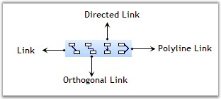{border="0"}

***[]{style="FONT-FAMILY: 'Trebuchet MS','sans-serif'; COLOR: #15428b; FONT-SIZE: 9pt"}*** 

Figure 20: Diagram Connector Tools

[]{style="FONT-FAMILY: 'Trebuchet MS','sans-serif'; COLOR: #15428b; FONT-SIZE: 9pt"} 

LineConnectorTool\
\

Line Connector Tool is used to connect nodes in a straight line. It creates line shape nodes. The name of the LineConnectorTool is **LineLinkTool**.

[]{style="FONT-FAMILY: 'Trebuchet MS','sans-serif'; COLOR: #15428b; FONT-SIZE: 9pt"} 

The below table lists the properties of the tool.

[]{style="FONT-FAMILY: 'Trebuchet MS','sans-serif'; COLOR: #15428b; FONT-SIZE: 9pt"} 

::: {align="center"}
  ---------------- -------------------------------------------------------------------------------------------
  Property         Description
  HeadDecorator    Sets the Head Decorator applied to the created node.
  TailDecorator    Sets the Tail Decorator applied to the created node.
  InAction         Sets the distance from the start of the line to the dash pattern. It accepts Float value.
  Name             Sets the Name for the Tool.
  Preceding Tool   Gets the Preceding Tool.
  ---------------- -------------------------------------------------------------------------------------------
:::

[]{style="FONT-FAMILY: 'Trebuchet MS','sans-serif'; COLOR: #15428b; FONT-SIZE: 9pt"} 

+-----------------------------------------------------------------------------------------------------------------------------------------------------------------------------------------------------+
| **[\[C#\]]{style="FONT-FAMILY: 'Courier New'; COLOR: black"}**                                                                                                                                      |
|                                                                                                                                                                                                     |
| []{style="FONT-FAMILY: 'Courier New'"}                                                                                                                                                              |
|                                                                                                                                                                                                     |
| [diagram1.Controller.ActivateTool([\"LineLinkTool\"]{style="COLOR: #a31515"});]{style="FONT-FAMILY: 'Courier New'"}                                                                                 |
|                                                                                                                                                                                                     |
| []{style="FONT-FAMILY: 'Courier New'"}                                                                                                                                                              |
|                                                                                                                                                                                                     |
| [Tool t = diagram1.Controller.ActiveTool;]{style="FONT-FAMILY: 'Courier New'"}                                                                                                                      |
|                                                                                                                                                                                                     |
| [if]{style="FONT-FAMILY: 'Courier New'; COLOR: blue"}[ (t [is]{style="COLOR: blue"} Syncfusion.Windows.Forms.Diagram.[LineConnectorTool]{style="COLOR: teal"})]{style="FONT-FAMILY: 'Courier New'"} |
|                                                                                                                                                                                                     |
| [{]{style="FONT-FAMILY: 'Courier New'"}                                                                                                                                                             |
|                                                                                                                                                                                                     |
| [    [LineConnectorTool]{style="COLOR: teal"} l = ([LineConnectorTool]{style="COLOR: teal"})t;]{style="FONT-FAMILY: 'Courier New'"}                                                                 |
|                                                                                                                                                                                                     |
| [    l.HeadDecorator.DecoratorShape = DecoratorShape.Filled45Arrow;]{style="FONT-FAMILY: 'Courier New'"}                                                                                            |
|                                                                                                                                                                                                     |
| [    l.TailDecorator.DecoratorShape = DecoratorShape.Filled45Arrow;]{style="FONT-FAMILY: 'Courier New'"}                                                                                            |
|                                                                                                                                                                                                     |
| [}]{style="FONT-FAMILY: 'Courier New'"}                                                                                                                                                             |
+-----------------------------------------------------------------------------------------------------------------------------------------------------------------------------------------------------+

[]{style="FONT-FAMILY: 'Courier New'"} 

Orthogonal Connector Tool

[]{style="FONT-FAMILY: 'Trebuchet MS','sans-serif'; COLOR: #15428b; FONT-SIZE: 9pt"} 

Orthogonal Connector Tool is used to connect nodes in an orthogonal manner by providing its start point and end point. It creates the Orthogonal Line Shape node. The name of the Orthogonal Connector Tool is **OrthogonalLinkTool**. The below table lists the properties of the tool.

[]{style="FONT-FAMILY: 'Trebuchet MS','sans-serif'; COLOR: #15428b; FONT-SIZE: 9pt"} 

::: {align="center"}
  ---------------- -------------------------------------------------------------------------------------------
  Property         Description
  HeadDecorator    Sets the Head Decorator applied to the created node.
  TailDecorator    Sets the Tail Decorator applied to the created node.
  InAction         Sets the distance from the start of the line to the dash pattern. It accepts Float value.
  Name             Sets the Name for the Tool.
  Preceding Tool   Gets the Preceding Tool.
  ---------------- -------------------------------------------------------------------------------------------
:::

**[]{style="FONT-FAMILY: 'Trebuchet MS','sans-serif'; COLOR: #15428b"}** 

+-----------------------------------------------------------------------------------------------------------------------------------------------------------------------------------------------------------+
| **[\[C#\]]{style="FONT-FAMILY: 'Courier New'; COLOR: black"}**                                                                                                                                            |
|                                                                                                                                                                                                           |
| **[]{style="FONT-FAMILY: 'Courier New'; COLOR: black"}**                                                                                                                                                  |
|                                                                                                                                                                                                           |
| [diagram1.Controller.ActivateTool([\"OrthogonalLinkTool\"]{style="COLOR: #a31515"});]{style="FONT-FAMILY: 'Courier New'"}                                                                                 |
|                                                                                                                                                                                                           |
| [Tool t = diagram1.Controller.ActiveTool;]{style="FONT-FAMILY: 'Courier New'"}                                                                                                                            |
|                                                                                                                                                                                                           |
| [if]{style="FONT-FAMILY: 'Courier New'; COLOR: blue"}[ (t [is]{style="COLOR: blue"} Syncfusion.Windows.Forms.Diagram.[OrthogonalConnectorTool]{style="COLOR: teal"})]{style="FONT-FAMILY: 'Courier New'"} |
|                                                                                                                                                                                                           |
| [{]{style="FONT-FAMILY: 'Courier New'"}                                                                                                                                                                   |
|                                                                                                                                                                                                           |
| [    [OrthogonalConnectorTool]{style="COLOR: teal"} l = ([OrthogonalConnectorTool]{style="COLOR: teal"})t;]{style="FONT-FAMILY: 'Courier New'"}                                                           |
|                                                                                                                                                                                                           |
| [    l.HeadDecorator.DecoratorShape = DecoratorShape.Filled45Arrow;]{style="FONT-FAMILY: 'Courier New'"}                                                                                                  |
|                                                                                                                                                                                                           |
| [    l.TailDecorator.DecoratorShape = DecoratorShape.Filled45Arrow;]{style="FONT-FAMILY: 'Courier New'"}                                                                                                  |
|                                                                                                                                                                                                           |
| [}]{style="FONT-FAMILY: 'Courier New'"}                                                                                                                                                                   |
+-----------------------------------------------------------------------------------------------------------------------------------------------------------------------------------------------------------+

[]{style="FONT-FAMILY: 'Courier New'"} 

DirectedLineConnector Tool

[]{style="FONT-FAMILY: 'Trebuchet MS','sans-serif'; COLOR: #15428b; FONT-SIZE: 9pt"} 

DirectedLineConnector Tool is used to connect the nodes in a directed line. It creates the directed line shape node. The name of the DirectedLineConnectorTool is **DirectedLineLinkTool**. The below table lists the properties of the tool.

[]{style="FONT-FAMILY: 'Trebuchet MS','sans-serif'; COLOR: #15428b; FONT-SIZE: 9pt"} 

::: {align="center"}
  ---------------- -------------------------------------------------------------------------------------------
  Property         Description
  HeadDecorator    Sets the Head Decorator applied to the created node.
  TailDecorator    Sets the Tail Decorator applied to the created node.
  InAction         Sets the distance from the start of the line to the dash pattern. It accepts Float value.
  Name             Sets the Name for the Tool.
  Preceding Tool   Gets the Preceding Tool.
  ---------------- -------------------------------------------------------------------------------------------
:::

[]{style="FONT-FAMILY: 'Trebuchet MS','sans-serif'; COLOR: #15428b; FONT-SIZE: 9pt"} 

+-------------------------------------------------------------------------------------------------------------------------------------------------------------------------------------------------------------+
| **[\[C#\]]{style="FONT-FAMILY: 'Courier New'; COLOR: black"}**                                                                                                                                              |
|                                                                                                                                                                                                             |
| []{style="FONT-FAMILY: 'Courier New'"}                                                                                                                                                                      |
|                                                                                                                                                                                                             |
| [diagram1.Controller.ActivateTool([\"DirectedLineLinkTool\"]{style="COLOR: #a31515"});]{style="FONT-FAMILY: 'Courier New'"}                                                                                 |
|                                                                                                                                                                                                             |
| [Tool t = diagram1.Controller.ActiveTool;]{style="FONT-FAMILY: 'Courier New'"}                                                                                                                              |
|                                                                                                                                                                                                             |
| [if]{style="FONT-FAMILY: 'Courier New'; COLOR: blue"}[ (t [is]{style="COLOR: blue"} Syncfusion.Windows.Forms.Diagram.[DirectedLineConnectorTool]{style="COLOR: teal"})]{style="FONT-FAMILY: 'Courier New'"} |
|                                                                                                                                                                                                             |
| [{]{style="FONT-FAMILY: 'Courier New'"}                                                                                                                                                                     |
|                                                                                                                                                                                                             |
| [    [DirectedLineConnectorTool]{style="COLOR: teal"} l = ([DirectedLineConnectorTool]{style="COLOR: teal"})t;]{style="FONT-FAMILY: 'Courier New'"}                                                         |
|                                                                                                                                                                                                             |
| [    l.HeadDecorator.DecoratorShape = DecoratorShape.Filled45Arrow;]{style="FONT-FAMILY: 'Courier New'"}                                                                                                    |
|                                                                                                                                                                                                             |
| [    l.TailDecorator.DecoratorShape = DecoratorShape.Filled45Arrow;]{style="FONT-FAMILY: 'Courier New'"}                                                                                                    |
|                                                                                                                                                                                                             |
| [}]{style="FONT-FAMILY: 'Courier New'"}                                                                                                                                                                     |
+-------------------------------------------------------------------------------------------------------------------------------------------------------------------------------------------------------------+

[]{style="FONT-FAMILY: 'Trebuchet MS','sans-serif'; COLOR: #15428b; FONT-SIZE: 9pt"} 

PolyLineConnector Tool

[         ]{style="FONT-FAMILY: 'Trebuchet MS','sans-serif'; COLOR: #15428b; FONT-SIZE: 9pt"}

This is an interactive tool for drawing Polyline Connector. The name of the tool is \"PolyLineLinkTool\". The below table lists the properties of the PolyLine tool.

[]{style="FONT-FAMILY: 'Trebuchet MS','sans-serif'; COLOR: #15428b; FONT-SIZE: 9pt"} 

::: {align="center"}
  ---------------- -------------------------------------------------------------------------------------------
  Property         Description
  HeadDecorator    Sets the Head Decorator applied to the created node.
  TailDecorator    Sets the Tail Decorator applied to the created node.
  InAction         Sets the distance from the start of the line to the dash pattern. It accepts Float value.
  Name             Sets the Name for the Tool.
  Preceding Tool   Gets the Preceding Tool.
  ---------------- -------------------------------------------------------------------------------------------
:::

[]{style="FONT-FAMILY: 'Courier New'"} 

+---------------------------------------------------------------------------------------------------------------------------------------------------------------------------------------------------------+
| **[\[C#\]]{style="FONT-FAMILY: 'Courier New'; COLOR: black"}**                                                                                                                                          |
|                                                                                                                                                                                                         |
| **[]{style="FONT-FAMILY: 'Courier New'; COLOR: black"}**                                                                                                                                                |
|                                                                                                                                                                                                         |
| [diagram1.Controller.ActivateTool([\"PolyLineLinkTool\"]{style="COLOR: #a31515"});]{style="FONT-FAMILY: 'Courier New'"}                                                                                 |
|                                                                                                                                                                                                         |
| [Tool t = diagram1.Controller.ActiveTool;]{style="FONT-FAMILY: 'Courier New'"}                                                                                                                          |
|                                                                                                                                                                                                         |
| [if]{style="FONT-FAMILY: 'Courier New'; COLOR: blue"}[ (t [is]{style="COLOR: blue"} Syncfusion.Windows.Forms.Diagram.[PolyLineConnectorTool]{style="COLOR: teal"})]{style="FONT-FAMILY: 'Courier New'"} |
|                                                                                                                                                                                                         |
| [{]{style="FONT-FAMILY: 'Courier New'"}                                                                                                                                                                 |
|                                                                                                                                                                                                         |
| [    [PolyLineConnectorTool]{style="COLOR: teal"} l = ([PolyLineConnectorTool]{style="COLOR: teal"})t;]{style="FONT-FAMILY: 'Courier New'"}                                                             |
|                                                                                                                                                                                                         |
| [    l.HeadDecorator.DecoratorShape = DecoratorShape.Filled45Arrow;]{style="FONT-FAMILY: 'Courier New'"}                                                                                                |
|                                                                                                                                                                                                         |
| [    l.TailDecorator.DecoratorShape = DecoratorShape.Filled45Arrow;]{style="FONT-FAMILY: 'Courier New'"}                                                                                                |
|                                                                                                                                                                                                         |
| [}]{style="FONT-FAMILY: 'Courier New'"}                                                                                                                                                                 |
+---------------------------------------------------------------------------------------------------------------------------------------------------------------------------------------------------------+

[]{style="FONT-FAMILY: 'Trebuchet MS','sans-serif'; COLOR: #15428b; FONT-SIZE: 9pt"} 

Creating a Diagram using Diagram Builder

[]{style="FONT-FAMILY: 'Trebuchet MS','sans-serif'; COLOR: #15428b; FONT-SIZE: 9pt"} 

To create your own diagram in the diagram builder, follow the below given procedure.

[]{style="FONT-FAMILY: 'Trebuchet MS','sans-serif'; COLOR: #15428b; FONT-SIZE: 9pt"} 

1.   Go to the **File** menu and click **New**. The new window is displayed as in the following screen shot.

[]{style="FONT-FAMILY: 'Trebuchet MS','sans-serif'; COLOR: #15428b; FONT-SIZE: 9pt"} 

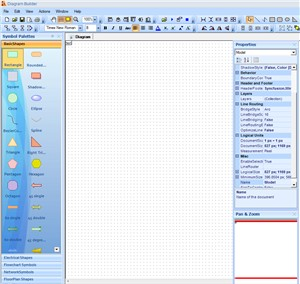{border="0"}

[]{style="FONT-FAMILY: 'Trebuchet MS','sans-serif'; COLOR: #15428b; FONT-SIZE: 9pt"} 

Figure 21: Diagram Builder

[]{style="FONT-FAMILY: 'Trebuchet MS','sans-serif'; COLOR: #15428b; FONT-SIZE: 9pt"} 

2.   To add symbols into the symbol palette, select **Add SymbolPalette** in the **File** menu.

 

3.   Select the symbol palette, which you created previously using symbol designer from the list of Symbol Palettes displayed.

[]{style="FONT-FAMILY: 'Trebuchet MS','sans-serif'; COLOR: #15428b; FONT-SIZE: 9pt"} 

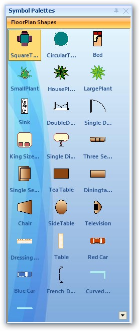{border="0"}

Figure 22: Symbol Palette

[]{style="FONT-FAMILY: 'Trebuchet MS','sans-serif'; COLOR: #15428b; FONT-SIZE: 9pt"} 

4.   On placing the symbol into the diagram area, the Diagram Builder displays a dialog for adding the symbol palette into the Associated Palettes. To add, click **OK**. Click **Cancel** if not required.

 

5.   Place the symbols and change their properties according to the requirements. Finally save the file with .edd extension.

[]{style="FONT-FAMILY: 'Trebuchet MS','sans-serif'; COLOR: #15428b; FONT-SIZE: 9pt"} 

A diagram is created using the Diagram Builder. You can use this diagram (.edd) file for developing your application.

[]{style="FONT-FAMILY: 'Trebuchet MS','sans-serif'; COLOR: #15428b; FONT-SIZE: 9pt"} 

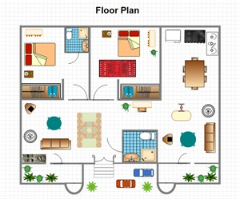{border="0"}

Figure 23: Sample Diagram

 

[]{#p15} 

 

[]{#related-topics}
::::::::::::::::
