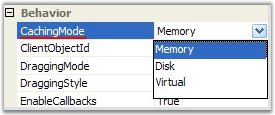

::: {style="DISPLAY: none"}
{#d2h_url_template}{#d2h_package_url style="WIDTH: 0px; DISPLAY: none; HEIGHT: 0px"}
:::

::::: {#nsbanner .d2h_main_nsbanner style="BORDER-BOTTOM: #999999 1px solid; POSITION: relative; PADDING-BOTTOM: 0px; BACKGROUND-COLOR: transparent; PADDING-LEFT: 0px; PADDING-RIGHT: 0px; DISPLAY: none; BORDER-TOP: #999999 1px solid; PADDING-TOP: 0px; LEFT: 0px"}
:::: {#TitleRow .d2h_main_titlerow style="PADDING-BOTTOM: 4px; BACKGROUND-COLOR: transparent; PADDING-LEFT: 22px; WIDTH: 100%; PADDING-RIGHT: 10px; DISPLAY: none; PADDING-TOP: 4px"}
::: {#ienav .d2h_main_ienav style="DISPLAY: none"}
{#D2HPrevious .D2HPreviousEnabled}  {#D2HNext .D2HNextEnabled}
:::
::::
:::::

:::::: {#nstext .d2h_main_nstext style="PADDING-BOTTOM: 10px; BACKGROUND-COLOR: transparent; PADDING-LEFT: 22px; PADDING-RIGHT: 10px; HEIGHT: 100%; OVERFLOW: auto; PADDING-TOP: 5px" hasuserbackground="true" valign="bottom"}
::: {#d2h_breadcrumbs .d2h_breadcrumbs}
[Essential Studio User Guide Documentation](ms-xhelp:///?Id=12457748-09e3-4d74-a240-8e049cedf030){.d2h_breadcrumbsNormal}[ \> ]{.d2h_breadcrumbsLinkSeparator}[User Interface Edition](ms-xhelp:///?Id=c29296b7-531c-413b-a0ec-488ca1f7f669){.d2h_breadcrumbsNormal}[ \> ]{.d2h_breadcrumbsLinkSeparator}[Essential ASP.NET](ms-xhelp:///?Id=25c35330-c127-4dad-9a92-ed79dc7261a6){.d2h_breadcrumbsNormal}[ \> ]{.d2h_breadcrumbsLinkSeparator}[Essential Diagram]{.d2h_breadcrumbsContentsOnly}[ \> ]{.d2h_breadcrumbsLinkSeparator}[Concepts and Features](ms-xhelp:///?Id=f9aa55fb-f8cf-43da-a8be-de231dc0d949){.d2h_breadcrumbsNormal}[ \> ]{.d2h_breadcrumbsLinkSeparator}[Optimization](ms-xhelp:///?Id=b87d4bc7-af66-4e6f-81ff-c63c4bc639b4){.d2h_breadcrumbsNormal}
:::

### Diagram Caching modes[]{style="FONT-SIZE: 10pt"} {#diagram-caching-modes style="tab-stops: 0pt"}

[]{style="FONT-FAMILY: 'Trebuchet MS','sans-serif'; COLOR: #15428b; FONT-SIZE: 9pt"} 

The **CachingMode** public property of the DiagramWebControl takes effect only when the OptimizedBackgroundRendering mode is enabled.

[]{style="FONT-FAMILY: 'Trebuchet MS','sans-serif'; COLOR: #15428b; FONT-SIZE: 9pt"} 

{border="0"}

[]{style="FONT-FAMILY: 'Trebuchet MS','sans-serif'; COLOR: #15428b; FONT-SIZE: 9pt"} 

Figure 39: Caching Mode

**[]{style="FONT-FAMILY: 'Trebuchet MS','sans-serif'; COLOR: #15428b; FONT-SIZE: 9pt"}** 

The following values can be set for the caching mode.

[]{style="FONT-FAMILY: 'Trebuchet MS','sans-serif'; COLOR: #15428b; FONT-SIZE: 9pt"} 

[·      ]{style="FONT-FAMILY: Symbol"}Memory (default value)

[·      ]{style="FONT-FAMILY: Symbol"}Disk

[·      ]{style="FONT-FAMILY: Symbol"}Virtual

[]{style="FONT-FAMILY: 'Trebuchet MS','sans-serif'; COLOR: #15428b; FONT-SIZE: 9pt"} 

This mode reduces the server\'s response time and increases the cut images loading time.

[]{style="FONT-FAMILY: 'Trebuchet MS','sans-serif'; COLOR: #15428b; FONT-SIZE: 9pt"} 

::: {style="BORDER-BOTTOM: windowtext 1pt solid; BORDER-LEFT: medium none; PADDING-BOTTOM: 1pt; MARGIN-TOP: 9pt; PADDING-LEFT: 0pt; PADDING-RIGHT: 0pt; MARGIN-BOTTOM: 9pt; BORDER-TOP: windowtext 1pt solid; BORDER-RIGHT: medium none; PADDING-TOP: 1pt"}
Note 1: Caching mode is applied only for background images and not to the nodes.
:::

[]{style="FONT-FAMILY: 'Trebuchet MS','sans-serif'; COLOR: #15428b; FONT-SIZE: 9pt"} 

::: {style="BORDER-BOTTOM: windowtext 1pt solid; BORDER-LEFT: medium none; PADDING-BOTTOM: 1pt; MARGIN-TOP: 9pt; PADDING-LEFT: 0pt; PADDING-RIGHT: 0pt; MARGIN-BOTTOM: 9pt; BORDER-TOP: windowtext 1pt solid; BORDER-RIGHT: medium none; PADDING-TOP: 1pt"}
Note 2: You must understand that implementing caching mode concerns only to server caching. It does not matter which caching mode is set by your client browser, it will cache the completed images in the temporary directory on your computer.
:::

[]{style="FONT-FAMILY: 'Trebuchet MS','sans-serif'; COLOR: #15428b; FONT-SIZE: 9pt"} 

The following code example illustrates how to enable the Caching mode.

[]{style="FONT-FAMILY: 'Trebuchet MS','sans-serif'; COLOR: #15428b; FONT-SIZE: 9pt"} 

+---------------------------------------------------------------------------------------------------------------------------------------------------------------+
| **[\[C#\]]{style="FONT-FAMILY: 'Courier New'"}**                                                                                                              |
|                                                                                                                                                               |
| **[]{style="FONT-FAMILY: 'Courier New'"}**                                                                                                                    |
|                                                                                                                                                               |
| [DiagramWebControl1.CachingMode = Syncfusion.Web.UI.WebControls.Diagram.[CachingMode]{style="COLOR: #2b91af"}.\[value\];]{style="FONT-FAMILY: 'Courier New'"} |
+---------------------------------------------------------------------------------------------------------------------------------------------------------------+

[]{style="FONT-FAMILY: 'Trebuchet MS','sans-serif'; COLOR: #15428b; FONT-SIZE: 9pt"} 

When CachingMode is set to **Memory**, all cut images are saved (cached) to server\'s RAM (random access memory). This caching type has the highest loading speed, but if the diagram document is very large, the server\'s RAM will be overloaded.

           

When CachingMode is set to **Disk**, the images will be saved to the server\'s hard disk in ASP.NET temporary directory. This caching type is useful when you have to load very large documents and don\'t want to use the server\'s RAM. But DiagramWebControl will work a bit slowly.

 

***[Warning: ]{style="BACKGROUND: white"}***As this caching mode uses the server\'s hard disk, diagram web application must have write permissions on the server.

 

When CachingMode is set to **Virtual**, you can assign your own image to each cut tile. Diagram web application does not cache any images to disk or to memory. All images are rendered on the fly. You can use this caching type when you want to insert your own images to the background. The images can be stored in some application folder or even in a database.

 

Also, for using this type of caching, you must write your own implementation for the ImageGridCellUpdating event handler.

[]{style="FONT-FAMILY: 'Trebuchet MS','sans-serif'; COLOR: #15428b; FONT-SIZE: 9pt"} 

See Also

[]{style="FONT-FAMILY: 'Trebuchet MS','sans-serif'; COLOR: #15428b; FONT-SIZE: 9pt"} 

[Optimization]{.UGHyperlink}[, ]{.UGHyperlink}[Properties and Events for Optimization,]{.UGHyperlink}[ ]{.UGHyperlink}[Optimized Background Rendering Mode]{.UGHyperlink}[, ]{.UGHyperlink}[Optimized Content Rendering Mode]{.UGHyperlink}[, ]{.UGHyperlink}[Diagram Optimization via HTML Elements]{.UGHyperlink}[, ]{.UGHyperlink}[Virtual Caching Type and Image Grid Cell Updating Event,]{.UGHyperlink}[ ]{.UGHyperlink}[Optimization Customization]{.UGHyperlink}[]{.UGHyperlink}

[]{#related-topics}
::::::
