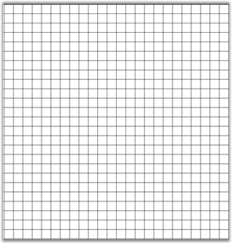

::: {style="DISPLAY: none"}
{#d2h_url_template}{#d2h_package_url style="WIDTH: 0px; DISPLAY: none; HEIGHT: 0px"}
:::

::::: {#nsbanner .d2h_main_nsbanner style="BORDER-BOTTOM: #999999 1px solid; POSITION: relative; PADDING-BOTTOM: 0px; BACKGROUND-COLOR: transparent; PADDING-LEFT: 0px; PADDING-RIGHT: 0px; DISPLAY: none; BORDER-TOP: #999999 1px solid; PADDING-TOP: 0px; LEFT: 0px"}
:::: {#TitleRow .d2h_main_titlerow style="PADDING-BOTTOM: 4px; BACKGROUND-COLOR: transparent; PADDING-LEFT: 22px; WIDTH: 100%; PADDING-RIGHT: 10px; DISPLAY: none; PADDING-TOP: 4px"}
::: {#ienav .d2h_main_ienav style="DISPLAY: none"}
{#D2HPrevious .D2HPreviousEnabled}  {#D2HNext .D2HNextEnabled}
:::
::::
:::::

::::: {#nstext .d2h_main_nstext style="PADDING-BOTTOM: 10px; BACKGROUND-COLOR: transparent; PADDING-LEFT: 22px; PADDING-RIGHT: 10px; HEIGHT: 100%; OVERFLOW: auto; PADDING-TOP: 5px" hasuserbackground="true" valign="bottom"}
::: {#d2h_breadcrumbs .d2h_breadcrumbs}
[Essential Studio User Guide Documentation](ms-xhelp:///?Id=12457748-09e3-4d74-a240-8e049cedf030){.d2h_breadcrumbsNormal}[ \> ]{.d2h_breadcrumbsLinkSeparator}[User Interface Edition](ms-xhelp:///?Id=c29296b7-531c-413b-a0ec-488ca1f7f669){.d2h_breadcrumbsNormal}[ \> ]{.d2h_breadcrumbsLinkSeparator}[Essential Windows](ms-xhelp:///?Id=e60759d8-47a4-4570-9d7a-16a68d63f2ea){.d2h_breadcrumbsNormal}[ \> ]{.d2h_breadcrumbsLinkSeparator}[Essential Diagram]{.d2h_breadcrumbsContentsOnly}[ \> ]{.d2h_breadcrumbsLinkSeparator}[Concepts And Features](ms-xhelp:///?Id=008cec4b-5177-4859-8616-c062751d8fb6){.d2h_breadcrumbsNormal}[ \> ]{.d2h_breadcrumbsLinkSeparator}[Supported Controls](ms-xhelp:///?Id=aa17622e-7642-4f9d-b086-6c705e48f9fa){.d2h_breadcrumbsNormal}
:::

### Diagram Grid {#diagram-grid style="tab-stops: 0pt"}

[]{style="FONT-FAMILY: 'Trebuchet MS','sans-serif'; COLOR: #15428b; FONT-SIZE: 9pt"} 

Diagram Grid is drawn with evenly spaced points that provides a visual guidance to the user. 

[]{style="FONT-FAMILY: 'Trebuchet MS','sans-serif'; COLOR: #15428b; FONT-SIZE: 9pt"} 

Behavior

**[]{style="FONT-FAMILY: 'Trebuchet MS','sans-serif'; COLOR: #15428b; FONT-SIZE: 9pt"}** 

Draws a matrix of evenly spaced points in the view, and provides snap to the grid calculations.

[]{style="FONT-FAMILY: 'Trebuchet MS','sans-serif'; COLOR: #15428b; FONT-SIZE: 9pt"} 

Class Reference

[]{style="FONT-FAMILY: 'Trebuchet MS','sans-serif'; COLOR: #15428b; FONT-SIZE: 9pt"} 

It is a property of **Diagram.View** class and its return type is ***Syncfusion.Windows.Forms.Diagram.LayoutGrid*.**

[]{style="FONT-FAMILY: 'Trebuchet MS','sans-serif'; COLOR: #15428b; FONT-SIZE: 9pt"} 

Properties

[]{style="FONT-FAMILY: 'Trebuchet MS','sans-serif'; COLOR: #15428b; FONT-SIZE: 9pt"} 

::: {align="center"}
  ------------------- -------------------------------------------------------------------------------------------------------------------------------------------
  Properties          Description
  Color               Color used for drawing the grid. It accepts System.Color value.
  ContainerView       Gets or sets the view that this grid is attached to.
  DashOffset          Distance from the start of the line to the dash pattern. It accepts Float value.
  DashStyle           Style used for dashed lines. It accepts System.Drawing.Drawing2D.DashStyle value.
  GridStyle           Gets or sets the appearance of the grid. It is GridStyle enumerator type value.
  HorizontalSpacing   Determines the horizontal distance between grid points. It accepts float value.
  MinPixelSpacing     Indicates minimum spacing between grid points in device units. It accepts Float value.
  SnapToGrid          Adjust the node with nearest grid point. Specifies whether the snap to grid feature is enabled. It accepts Boolean value (true or false).
  VerticalSpacing     Determines the vertical distance between grid points. It accepts Float value.
  Visible             Specifies whether the grid is visible. It accepts Boolean value (true or false).
  ------------------- -------------------------------------------------------------------------------------------------------------------------------------------
:::

[]{style="FONT-FAMILY: 'Trebuchet MS','sans-serif'; COLOR: #15428b; FONT-SIZE: 9pt"} 

+------------------------------------------------------------------------------------------------------------+
| **[\[C#\]]{style="FONT-FAMILY: 'Courier New'; COLOR: black"}**                                             |
|                                                                                                            |
| []{style="FONT-FAMILY: 'Courier New'"}                                                                     |
|                                                                                                            |
| [diagram1.View.Grid.GridStyle = GridStyle.Line;]{style="FONT-FAMILY: 'Courier New'"}                       |
|                                                                                                            |
| [diagram1.View.Grid.DashStyle=System.Drawing.Drawing2D.DashStyle.Dot;]{style="FONT-FAMILY: 'Courier New'"} |
|                                                                                                            |
| [diagram1.View.Grid.Color = Color.LightGray            ]{style="FONT-FAMILY: 'Courier New'"}               |
|                                                                                                            |
| [diagram1.View.Grid.VerticalSpacing = 15;]{style="FONT-FAMILY: 'Courier New'"}                             |
|                                                                                                            |
| [diagram1.View.Grid.HorizontalSpacing = 15;]{style="FONT-FAMILY: 'Courier New'"}                           |
|                                                                                                            |
| [diagram1.View.Grid.Visible = [false]{style="COLOR: blue"};]{style="FONT-FAMILY: 'Courier New'"}           |
|                                                                                                            |
| [diagram1.View.Grid.SnapToGrid = [true]{style="COLOR: blue"};]{style="FONT-FAMILY: 'Courier New'"}         |
+------------------------------------------------------------------------------------------------------------+

[]{style="FONT-FAMILY: 'Trebuchet MS','sans-serif'; COLOR: #15428b; FONT-SIZE: 9pt"} 

{border="0"}

[]{style="FONT-FAMILY: 'Trebuchet MS','sans-serif'; COLOR: #15428b; FONT-SIZE: 9pt"} 

Figure 44: Diagram Grid

[]{#p26} 

[]{#related-topics}
:::::
