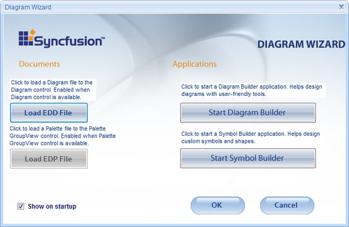
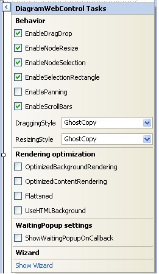
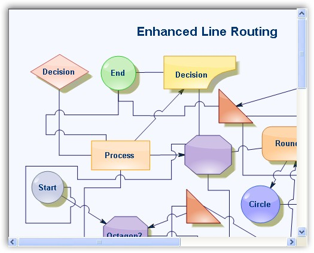

::: {style="DISPLAY: none"}
{#d2h_url_template}{#d2h_package_url style="WIDTH: 0px; DISPLAY: none; HEIGHT: 0px"}
:::

::::: {#nsbanner .d2h_main_nsbanner style="BORDER-BOTTOM: #999999 1px solid; POSITION: relative; PADDING-BOTTOM: 0px; BACKGROUND-COLOR: transparent; PADDING-LEFT: 0px; PADDING-RIGHT: 0px; DISPLAY: none; BORDER-TOP: #999999 1px solid; PADDING-TOP: 0px; LEFT: 0px"}
:::: {#TitleRow .d2h_main_titlerow style="PADDING-BOTTOM: 4px; BACKGROUND-COLOR: transparent; PADDING-LEFT: 22px; WIDTH: 100%; PADDING-RIGHT: 10px; DISPLAY: none; PADDING-TOP: 4px"}
::: {#ienav .d2h_main_ienav style="DISPLAY: none"}
{#D2HPrevious .D2HPreviousEnabled}  {#D2HNext .D2HNextEnabled}
:::
::::
:::::

::::: {#nstext .d2h_main_nstext style="PADDING-BOTTOM: 10px; BACKGROUND-COLOR: transparent; PADDING-LEFT: 22px; PADDING-RIGHT: 10px; HEIGHT: 100%; OVERFLOW: auto; PADDING-TOP: 5px" hasuserbackground="true" valign="bottom"}
::: {#d2h_breadcrumbs .d2h_breadcrumbs}
[Essential Studio User Guide Documentation](ms-xhelp:///?Id=12457748-09e3-4d74-a240-8e049cedf030){.d2h_breadcrumbsNormal}[ \> ]{.d2h_breadcrumbsLinkSeparator}[User Interface Edition](ms-xhelp:///?Id=c29296b7-531c-413b-a0ec-488ca1f7f669){.d2h_breadcrumbsNormal}[ \> ]{.d2h_breadcrumbsLinkSeparator}[Essential ASP.NET](ms-xhelp:///?Id=25c35330-c127-4dad-9a92-ed79dc7261a6){.d2h_breadcrumbsNormal}[ \> ]{.d2h_breadcrumbsLinkSeparator}[Essential Diagram]{.d2h_breadcrumbsContentsOnly}[ \> ]{.d2h_breadcrumbsLinkSeparator}[Concepts and Features](ms-xhelp:///?Id=f9aa55fb-f8cf-43da-a8be-de231dc0d949){.d2h_breadcrumbsNormal}[ \> ]{.d2h_breadcrumbsLinkSeparator}[Supported Controls](ms-xhelp:///?Id=38a5c852-c99d-4230-b3f3-26dc72ca57af){.d2h_breadcrumbsNormal}
:::

### DiagramWebControl[]{style="FONT-FAMILY: 'Calibri','sans-serif'"} {#diagramwebcontrol style="tab-stops: 0pt"}

[]{style="FONT-FAMILY: 'Trebuchet MS','sans-serif'; COLOR: #15428b; FONT-SIZE: 9pt"}[]{style="FONT-FAMILY: 'Trebuchet MS','sans-serif'; COLOR: #15428b; FONT-SIZE: 9pt"} 

The core of the Essential Diagram Web framework is the **Syncfusion.Web.UI.WebControls.Diagram.DiagramWebControl** class. The DiagramWebControl is a subclass of the **System.Web.UI.WebControls.WebControl** type, and implements an ASP.NET DiagramWebControl that allows static and interactive diagrams to be created and rendered to a web page. The DiagramWebControl uses the same base architecture as used by the Windows Diagram Control and can thus avail itself, the rich Essential Diagram object model. This common architecture, in addition to lending the DiagramWebControl, offers higher reliability, ease of use, and the added advantage of allowing developers to harness the comprehensive symbol and diagram building utilities featured in the Windows version of the product. Seamless sharing of the diagram document between the Windows and Web controls, make it possible to develop highly specialized diagramming applications that bridge the two domains.

 

The DiagramWebControl comprises of the **Essential Diagram Model (Syncfusion.Windows.Forms.Diagram.Model)** class that implements the Diagram object model, and the **Essential Diagram View (Syncfusion.Windows.Forms.Diagram.View)** class that manages the visual transformation of the diagram model. The control renders the diagram on the client Web Browser as HTML by using the IMG element for drawing the diagram, augmented with a client-side image map and JavaScript for supporting user interactivity with the diagram.

 

Drag the DiagramWebControl onto the web page. This will open the Diagram Wizard window.

[]{style="FONT-FAMILY: 'Trebuchet MS','sans-serif'; COLOR: #15428b; FONT-SIZE: 9pt"} 

{border="0"}

[]{style="FONT-FAMILY: 'Trebuchet MS','sans-serif'; COLOR: #15428b; FONT-SIZE: 9pt"} 

Figure 10: Diagram Wizard

[]{style="FONT-FAMILY: 'Trebuchet MS','sans-serif'; FONT-SIZE: 9pt"} 

If you have diagram file \*.edd, click the **Load EDD File** button, to find your \*.edd file and run the application. This will display your diagram file in the DiagramWebControl. Also you can start Diagram Builder or Symbol Builder application.

 

Diagram builder is a very powerful application for creating different diagram documents. Symbol Builder enables you to create palettes and save them as \*.edp files. If you do not want to start the diagram wizard after dragging the DiagramWebControl onto the web page every time, select **Show on startup** option displayed in the diagram wizard. Click **Ok**, and then click **Cancel**, to view the DiagramWebControl on your web page.

 

Click on the DiagramWebControl to view the DiagramWebControl properties.

 

Before running the application, you must add the following http handler in the Web.config file.

[]{style="FONT-FAMILY: 'Trebuchet MS','sans-serif'; FONT-SIZE: 9pt"} 

+-------------------------------------------------------------------------------------------------------------------------------------------------------------------------------------------------------------------------------------------------------------------------------------------------------------------------------------------------------------------------------------------------------------------------------------------------------------------------------------------------+
| **[\[ASPX\]]{style="FONT-FAMILY: 'Courier New'"}**                                                                                                                                                                                                                                                                                                                                                                                                                                              |
|                                                                                                                                                                                                                                                                                                                                                                                                                                                                                                 |
| []{style="FONT-FAMILY: 'Courier New'"}                                                                                                                                                                                                                                                                                                                                                                                                                                                          |
|                                                                                                                                                                                                                                                                                                                                                                                                                                                                                                 |
| [\<]{style="FONT-FAMILY: 'Courier New'; COLOR: blue"}[add]{style="FONT-FAMILY: 'Courier New'; COLOR: #a31515"}[ [verb]{style="COLOR: red"}[=\"\*\"]{style="COLOR: blue"} [path]{style="COLOR: red"}[=\"ImgRequest.ashx\"]{style="COLOR: blue"} [type]{style="COLOR: red"}[=\"Syncfusion.Web.UI.WebControls.Diagram.NodeRenderHandler, Syncfusion.Diagram.Web, Version=X.X.X.X, Culture=neutral, PublicKeyToken=3d67ed1f87d44c89\"/\>]{style="COLOR: blue"}]{style="FONT-FAMILY: 'Courier New'"} |
+-------------------------------------------------------------------------------------------------------------------------------------------------------------------------------------------------------------------------------------------------------------------------------------------------------------------------------------------------------------------------------------------------------------------------------------------------------------------------------------------------+

[]{style="FONT-FAMILY: 'Trebuchet MS','sans-serif'; COLOR: #15428b; FONT-SIZE: 9pt"} 

::: {style="BORDER-BOTTOM: windowtext 1pt solid; BORDER-LEFT: medium none; PADDING-BOTTOM: 1pt; MARGIN-TOP: 9pt; PADDING-LEFT: 0pt; PADDING-RIGHT: 0pt; MARGIN-BOTTOM: 9pt; BORDER-TOP: windowtext 1pt solid; BORDER-RIGHT: medium none; PADDING-TOP: 1pt"}
{border="0"}[Note:]{style="BACKGROUND: white"}[ ]{style="FONT-SIZE: 8pt"}X.X.X.X in the above code corresponds to the correct version number of the Essential Studio version that you are currently using.
:::

[]{style="FONT-FAMILY: 'Trebuchet MS','sans-serif'; COLOR: #15428b; FONT-SIZE: 9pt"} 

DiagramWebControl provides standard properties for drag-and-drop, node resize, node selection, selection rectangle, panning and scroll bars.

[]{style="FONT-FAMILY: 'Trebuchet MS','sans-serif'; COLOR: #15428b; FONT-SIZE: 9pt"} 

DiagramWebControl also provides support to change the dragging style and resizing style of nodes. It includes the following options.

[]{style="FONT-FAMILY: 'Trebuchet MS','sans-serif'; COLOR: #15428b; FONT-SIZE: 9pt"} 

[·      ]{style="FONT-FAMILY: Symbol"}GhostCopy

[·      ]{style="FONT-FAMILY: Symbol"}Original

[·      ]{style="FONT-FAMILY: Symbol"}DashedOutline

[·      ]{style="FONT-FAMILY: Symbol"}TransparentRectangle

[·      ]{style="FONT-FAMILY: Symbol"}None

[]{style="FONT-FAMILY: 'Trebuchet MS','sans-serif'; FONT-SIZE: 9pt"} 

{border="0"}

[]{style="FONT-FAMILY: 'Trebuchet MS','sans-serif'; COLOR: #15428b; FONT-SIZE: 9pt"} 

Figure 11: DiagramWebControl Properties

[]{style="FONT-FAMILY: 'Trebuchet MS','sans-serif'; FONT-SIZE: 9pt"} 

{border="0"}

[]{style="FONT-FAMILY: 'Trebuchet MS','sans-serif'; COLOR: #15428b; FONT-SIZE: 9pt"} 

[]{style="FONT-FAMILY: 'Trebuchet MS','sans-serif'; COLOR: #15428b; FONT-SIZE: 9pt"} 

Figure 12: DiagramWebControl

[]{#related-topics}
:::::
