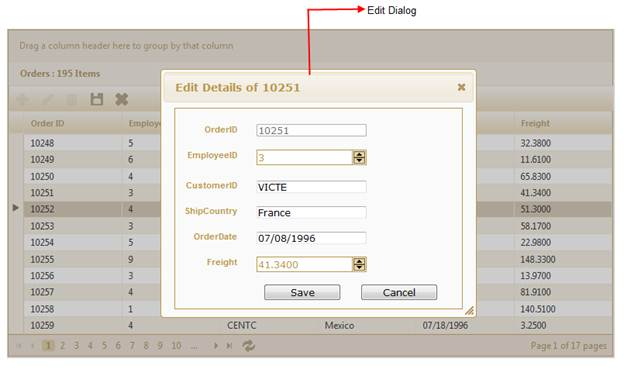

::: {style="DISPLAY: none"}
{#d2h_url_template}{#d2h_package_url style="WIDTH: 0px; DISPLAY: none; HEIGHT: 0px"}
:::

::::: {#nsbanner .d2h_main_nsbanner style="BORDER-BOTTOM: #999999 1px solid; POSITION: relative; PADDING-BOTTOM: 0px; BACKGROUND-COLOR: transparent; PADDING-LEFT: 0px; PADDING-RIGHT: 0px; DISPLAY: none; BORDER-TOP: #999999 1px solid; PADDING-TOP: 0px; LEFT: 0px"}
:::: {#TitleRow .d2h_main_titlerow style="PADDING-BOTTOM: 4px; BACKGROUND-COLOR: transparent; PADDING-LEFT: 22px; WIDTH: 100%; PADDING-RIGHT: 10px; DISPLAY: none; PADDING-TOP: 4px"}
::: {#ienav .d2h_main_ienav style="DISPLAY: none"}
{#D2HPrevious .D2HPreviousEnabled}  {#D2HNext .D2HNextEnabled}
:::
::::
:::::

:::: {#nstext .d2h_main_nstext style="PADDING-BOTTOM: 10px; BACKGROUND-COLOR: transparent; PADDING-LEFT: 22px; PADDING-RIGHT: 10px; HEIGHT: 100%; OVERFLOW: auto; PADDING-TOP: 5px" hasuserbackground="true" valign="bottom"}
::: {#d2h_breadcrumbs .d2h_breadcrumbs}
[Essential Studio User Guide Documentation](ms-xhelp:///?Id=12457748-09e3-4d74-a240-8e049cedf030){.d2h_breadcrumbsNormal}[ \> ]{.d2h_breadcrumbsLinkSeparator}[User Interface Edition](ms-xhelp:///?Id=c29296b7-531c-413b-a0ec-488ca1f7f669){.d2h_breadcrumbsNormal}[ \> ]{.d2h_breadcrumbsLinkSeparator}[Essential ASP.NET MVC](ms-xhelp:///?Id=4b14e7d1-65c4-4f67-b1aa-2c37709905a5){.d2h_breadcrumbsNormal}[ \> ]{.d2h_breadcrumbsLinkSeparator}[Essential Grid]{.d2h_breadcrumbsContentsOnly}[ \> ]{.d2h_breadcrumbsLinkSeparator}[Getting Started](ms-xhelp:///?Id=c7ed3902-b25b-4170-be58-1d3d0b57748a){.d2h_breadcrumbsNormal}[ \> ]{.d2h_breadcrumbsLinkSeparator}[Feature Summary](ms-xhelp:///?Id=1923e679-441a-44e0-9bca-e0e50988a857){.d2h_breadcrumbsNormal}[ \> ]{.d2h_breadcrumbsLinkSeparator}[Concepts and Features](ms-xhelp:///?Id=4a1657fa-4756-42b9-9153-aebf5dcfc503){.d2h_breadcrumbsNormal}[ \> ]{.d2h_breadcrumbsLinkSeparator}[Editing](ms-xhelp:///?Id=51ad902e-b7e5-44e5-ad71-814595e92bf0){.d2h_breadcrumbsNormal}
:::

### Dialog editing in MVC Grid {#dialog-editing-in-mvc-grid style="tab-stops: 0pt"}

This feature allows you to edit various fields of a single record at the same time.

The following figure gives you a basic idea of the structure and appearance of Grid in the Dialog edit mode:

 

{border="0"}

Figure 181: Dialog Editing in Grid**[]{style="FONT-STYLE: normal"}**

 

The Dialog Edit feature allows you to edit data, using a dialog box, which contains fields associated with the data record being edited.

You can edit data in two ways using this feature:

[·      ]{style="FONT-FAMILY: Symbol"}**Using the Dialog mode**---This allows you to edit data of a particular record using the Dialog box. You can only edit the data stored in the fields that you have rendered to be visible.

 

[·      ]{style="FONT-FAMILY: Symbol"}**Using the Dialog Template mode---**This allows you to create a template for the data that you require to be edited using the Dialog Box.

This means you can edit any of the fields pertaining to a single record of data and apply it to a template so that the same format is applied for all the other records that you will edit later.

 

Use Case Scenario

The user can edit fields that are associated with a single data record, using the dialog box that appears.

 

Where do I find Installed samples?

To view the samples:

1.   Click **Dashboard.**

2.   Click the drop-down button of MVC platform. 

3.   Click the **Run Locally Installed Samples** link. The Essential Studio MVC Edition sample browser is displayed.

4.   Select **Grid**.

 {border="0"}

Figure 182: MVC Grid Sample Browser**[]{style="FONT-STYLE: normal"}**

5.   Select any sample from **Dialog editing** under the **Editing** tab and browse through the features.

 

More:

[ ]{#related-topics}

[{border="0" align="absMiddle"}Properties and Events Tables](ms-xhelp:///?Id=46584572-e53b-47b5-b6f3-069031c34582){style="TEXT-DECORATION: none"}

[{border="0" align="absMiddle"}Enabling Dialog Editing in MVC Grid](ms-xhelp:///?Id=b5be6ff3-42a0-430f-bbac-6c4165391f73){style="TEXT-DECORATION: none"}

[{border="0" align="absMiddle"}Edit Mode Configuration](ms-xhelp:///?Id=1b990555-3f3f-465a-8dcb-8a0003bb50ca){style="TEXT-DECORATION: none"}
::::
