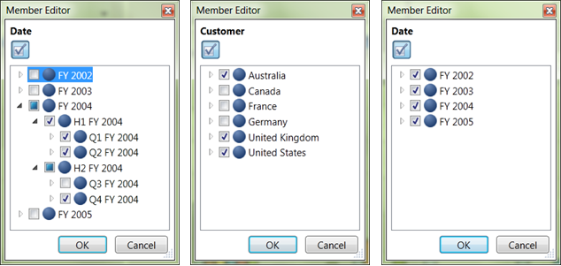

::: {style="DISPLAY: none"}
{#d2h_url_template} {#d2h_package_url style="WIDTH: 0px; DISPLAY: none; HEIGHT: 0px"}
:::

::: {.d2h_secondary_topic style="PADDING-BOTTOM: 10pt; MARGIN: 0pt; PADDING-LEFT: 0pt; PADDING-RIGHT: 0pt; PADDING-TOP: 0pt"}
##### Dice {#dice style="tab-stops: 0pt"}

[]{style="FONT-FAMILY: 'Calibri','sans-serif'"} 

You can put more than one dimension on the rows or on the columns. You will see one row for every combination of the members from each of the dimensions.

[·      ]{style="FONT-FAMILY: Symbol"}By unchecking and checking the selective nodes in a dimension, by placing the dimension in Slicer axis we can perform the slice operation.

[·      ]{style="FONT-FAMILY: Symbol"}When we add more than one dimension to a Column or Row axis and select a particular member by checking and unchecking the node in member editor, it becomes dice.

Take the same report that we used in slice example, we can perform the dice operation in the following way.

[·      ]{style="FONT-FAMILY: Symbol"}Nodes Q1 FY2004, Q2 FY2004 and Q4 FY2004 are checked in Date dimension.

[·      ]{style="FONT-FAMILY: Symbol"}Nodes Australia, United Kingdom and United States are checked in Customer Dimension.

[·      ]{style="FONT-FAMILY: Symbol"}Nodes Bikes and Clothing are checked in Product.

Here, by selecting the particular member of dimensions in the Column and Row axis, the dice operation was achieved.

Volume of sales of products like Bikes and Clothing in Australia, United Kingdom and United States for the three Quarterlies of the year 2004 will be reflect in the result.

[]{style="FONT-FAMILY: 'Calibri','sans-serif'"} 

{border="0"}

Figure 40: Volume of Sales of Product in Australia, United Kingdom and United states for the Quarterlies of year 2004 on Dicing

[]{style="FONT-FAMILY: 'Calibri','sans-serif'"} 

[]{#related-topics}
:::
