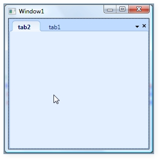
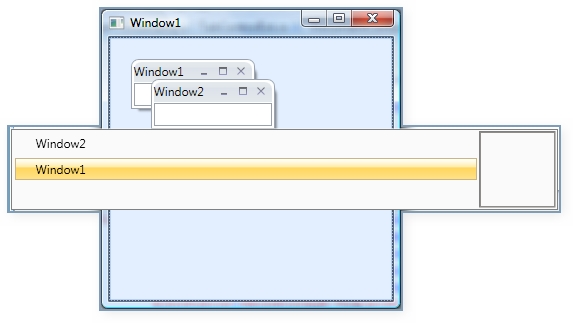
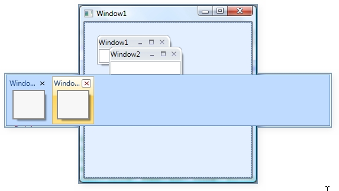
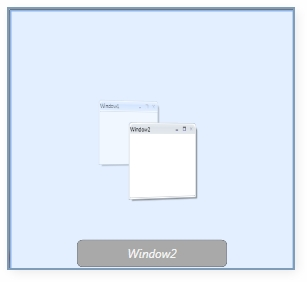
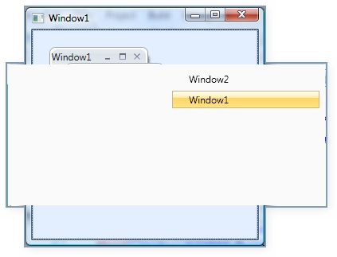

::: {style="DISPLAY: none"}
{#d2h_url_template}{#d2h_package_url style="WIDTH: 0px; DISPLAY: none; HEIGHT: 0px"}
:::

::: {.d2h_secondary_topic style="PADDING-BOTTOM: 10pt; MARGIN: 0pt; PADDING-LEFT: 0pt; PADDING-RIGHT: 0pt; PADDING-TOP: 0pt"}
#### Different Keyboard Navigation Modes {#different-keyboard-navigation-modes style="tab-stops: 0pt"}

**SwitchMode** is a property used to specify the different types of switches while using   ctrl + tab navigation. There are five types of switches available. They are:

[·      ]{style="FONT-FAMILY: Symbol"}Immediate

[·      ]{style="FONT-FAMILY: Symbol"}List

[·      ]{style="FONT-FAMILY: Symbol"}QuickTabs

[·      ]{style="FONT-FAMILY: Symbol"}VistaFlip and

[·      ]{style="FONT-FAMILY: Symbol"}VS2005

**[]{style="FONT-FAMILY: 'Trebuchet MS','sans-serif'; COLOR: #15428b; FONT-SIZE: 9pt"}** 

Immediate Mode:

{border="0"}

Figure 380: Immediate Mode

                                                             

List Mode:

{border="0"}

Figure 381: List Mode

 

QuickTabs:

{border="0"}

Figure 382:QuickTabs Mode

                                                               

Vista Flip:

{border="0"}

Figure 383: Vista Flip

                                                                  

VS2005:

{border="0"}

Figure 384: VS2005 Mode

 

[]{#related-topics}
:::
