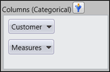
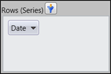
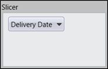

::: {style="DISPLAY: none"}
{#d2h_url_template} {#d2h_package_url style="WIDTH: 0px; DISPLAY: none; HEIGHT: 0px"}
:::

::: {.d2h_secondary_topic style="PADDING-BOTTOM: 10pt; MARGIN: 0pt; PADDING-LEFT: 0pt; PADDING-RIGHT: 0pt; PADDING-TOP: 0pt"}
#### Different Type of Axis Element Builder Available in OLAP Client {#different-type-of-axis-element-builder-available-in-olap-client style="tab-stops: 0pt"}

 

There are three different types of Axis Element Builder available namely:

[]{#_Categorical} **Categorical**

The categorical axis defines one or more dimensions that are displayed along the Chart\'s x-axis as labels and in the columns of Grid. If more than one dimension is on the categorical axis, the Chart/Grid will stack each dimension. The order in which the dimensions are stacked on the Chart/Grid is based on the order that they appear on the categorical axis.

[]{#_Series} **Series**

The series axis defines one or more dimensions that are displayed as a series. If more than one dimension is present on the series axis, each data point will be defined by a unique combination of the dimensions members.

[]{#_Slicer} **Slicer**

The slicer axis is used as a filter to narrow the focus of the multidimensional data displayed in the Chart/Grid. The slicer axis lets you analyse any member of a dimension in-depth. In order to display the member\'s data in Slicer, that member must not be present on either the categorical or series axis.

[]{style="FONT-FAMILY: 'Trebuchet MS','sans-serif'; COLOR: #15428b; FONT-SIZE: 9pt"} 

[]{style="FONT-FAMILY: 'Trebuchet MS','sans-serif'; COLOR: #15428b; FONT-SIZE: 9pt"} 

**[]{style="FONT-FAMILY: 'Calibri','sans-serif'"}**  

[]{style="FONT-FAMILY: 'Calibri','sans-serif'"} 

{border="0"}

[        ]{style="FONT-FAMILY: 'Calibri','sans-serif'"}Figure 29: Categorical Axis Element Builder

 

{border="0"}

Figure 30: Series Axis Element Builder

 

       {border="0"}

Figure 31: Slicer Axis Element Builder

[]{#related-topics}
:::
