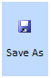
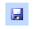
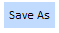

::: {style="DISPLAY: none"}
{#d2h_url_template}{#d2h_package_url style="WIDTH: 0px; DISPLAY: none; HEIGHT: 0px"}
:::

:::::::::::::::: {.d2h_secondary_topic style="PADDING-BOTTOM: 10pt; MARGIN: 0pt; PADDING-LEFT: 0pt; PADDING-RIGHT: 0pt; PADDING-TOP: 0pt"}
##### Different types of button {#different-types-of-button style="tab-stops: 0pt"}

Types of Orientation

The type of the button can be chosen from the options of the DisplayType property. The options provided for the display types are given as follows.

 

::: {align="center"}
+-----------------------------------+-------------------------------------------------------------------------------------------------------------------+
| Property                          | Description                                                                                                       |
+-----------------------------------+-------------------------------------------------------------------------------------------------------------------+
| DisplayType                       | Specifies the orientation of text and image in a button. Default value is ImageBeforeText. The other options are: |
|                                   |                                                                                                                   |
|                                   |                                                                                                                   |
|                                   |                                                                                                                   |
|                                   | [·      ]{style="FONT-FAMILY: Symbol"}ImageBeforeText                                                             |
|                                   |                                                                                                                   |
|                                   | [·      ]{style="FONT-FAMILY: Symbol"}ImageAboveText                                                              |
|                                   |                                                                                                                   |
|                                   | [·      ]{style="FONT-FAMILY: Symbol"}ImageOnly                                                                   |
|                                   |                                                                                                                   |
|                                   | [·      ]{style="FONT-FAMILY: Symbol"}TextOnly                                                                    |
|                                   |                                                                                                                   |
|                                   |                                                                                                                   |
+-----------------------------------+-------------------------------------------------------------------------------------------------------------------+
:::

 

###### 5.1.11.3.1.1        Image before text {#image-before-text style="tab-stops: 0pt"}

To render the button with image before text, set the Display Type property to **Image before text**. The code snippets are given as follows:

 

::: {align="center"}
+--------------------------------------------------------------------------------------------------------------------------------------------------------------------------------------------------------------------------------------------------------------------------------------------------------------------------------------------------------------------------------------------------------------------------------------------------------------------------------------------------------------------------------------------------------------------------------------------------------------------------------------------------------------------------------------------------------------------------------------------------------------------------------------------------------------------------------------------------------------------------------------+
| [\[ASPX\]]{style="FONT-FAMILY: 'Courier New'"}                                                                                                                                                                                                                                                                                                                                                                                                                                                                                                                                                                                                                                                                                                                                                                                                                                       |
|                                                                                                                                                                                                                                                                                                                                                                                                                                                                                                                                                                                                                                                                                                                                                                                                                                                                                      |
| [\<]{style="FONT-FAMILY: 'Courier New'; COLOR: blue"}[syncfusion]{style="FONT-FAMILY: 'Courier New'; COLOR: #a31515"}[:]{style="FONT-FAMILY: 'Courier New'; COLOR: blue"}[ButtonAdv]{style="FONT-FAMILY: 'Courier New'; COLOR: #a31515"}[ [ID]{style="COLOR: red"} [=\"Button1\"]{style="COLOR: blue"} [ImageUrl]{style="COLOR: red"} [=\"Img/Save16.png\"]{style="COLOR: blue"} [runat]{style="COLOR: red"} [=\"server\"]{style="COLOR: blue"} [CustomClass]{style="COLOR: red"} [=\"buttonback\"]{style="COLOR: blue"} [Text]{style="COLOR: red"} [=\"Save the text\"]{style="COLOR: blue"} [DisplayType]{style="COLOR: red"} [=\"ImageBeforeText\"\> \</]{style="COLOR: blue"}[syncfusion]{style="COLOR: #a31515"}[:]{style="COLOR: blue"}[ButtonAdv]{style="COLOR: #a31515"}[\>]{style="COLOR: blue"}]{style="FONT-FAMILY: 'Courier New'"}[]{style="FONT-FAMILY: 'Courier New'"} |
|                                                                                                                                                                                                                                                                                                                                                                                                                                                                                                                                                                                                                                                                                                                                                                                                                                                                                      |
| []{style="FONT-FAMILY: 'Courier New'"}                                                                                                                                                                                                                                                                                                                                                                                                                                                                                                                                                                                                                                                                                                                                                                                                                                               |
+--------------------------------------------------------------------------------------------------------------------------------------------------------------------------------------------------------------------------------------------------------------------------------------------------------------------------------------------------------------------------------------------------------------------------------------------------------------------------------------------------------------------------------------------------------------------------------------------------------------------------------------------------------------------------------------------------------------------------------------------------------------------------------------------------------------------------------------------------------------------------------------+
:::

 

::: {align="center"}
+-----------------------------------------------------------------------------------------------------------------------------------------------------------------------------------------------------+
| [\[C#\]]{style="FONT-FAMILY: 'Courier New'"}                                                                                                                                                        |
|                                                                                                                                                                                                     |
| []{style="FONT-FAMILY: 'Courier New'"}                                                                                                                                                              |
|                                                                                                                                                                                                     |
| [ButtonAdvance.DisplayType = Syncfusion.Web.UI.WebControls.Shared.[DisplayType]{style="COLOR: #2b91af"}.ImageBeforeText;]{style="FONT-FAMILY: 'Courier New'"}[]{style="FONT-FAMILY: 'Courier New'"} |
|                                                                                                                                                                                                     |
| []{style="FONT-FAMILY: 'Courier New'"}                                                                                                                                                              |
+-----------------------------------------------------------------------------------------------------------------------------------------------------------------------------------------------------+
:::

 

::: {align="center"}
+-------------------------------------------------------------------------------------------------------------------------------------------------------------------------+
| [\[VB\]]{style="FONT-FAMILY: 'Courier New'"}                                                                                                                            |
|                                                                                                                                                                         |
| [ButtonAdvance.DisplayType= Syncfusion.Web.UI.WebControls.Shared.DisplayType.ImageBeforeText]{style="FONT-FAMILY: 'Courier New'"}[]{style="FONT-FAMILY: 'Courier New'"} |
|                                                                                                                                                                         |
| []{style="FONT-FAMILY: 'Courier New'"}                                                                                                                                  |
+-------------------------------------------------------------------------------------------------------------------------------------------------------------------------+
:::

 

The following output will be generated:

{border="0"}

Figure 155: Button with the image before the text

 

 

###### 5.1.11.3.1.2        Image above text {#image-above-text style="tab-stops: 0pt"}

To render the button with image above text set the display type property to **Image above text**. The code snippets to be used in this scenario are-

 

::: {align="center"}
+-------------------------------------------------------------------------------------------------------------------------------------------------------------------------------------------------------------------------------------------------------------------------------------------------------------------------------------------------------------------------------------------------------------------------------------------------------------------------------------------------------------------------------------------------------------------------------------------------------------------------------------------------------------------------------------------------------------------------------------------------------------------------------------------------------------------------------------------------------------------------------------+
| [\[ASPX\]]{style="FONT-FAMILY: 'Courier New'"}                                                                                                                                                                                                                                                                                                                                                                                                                                                                                                                                                                                                                                                                                                                                                                                                                                      |
|                                                                                                                                                                                                                                                                                                                                                                                                                                                                                                                                                                                                                                                                                                                                                                                                                                                                                     |
| []{style="FONT-FAMILY: 'Courier New'"}                                                                                                                                                                                                                                                                                                                                                                                                                                                                                                                                                                                                                                                                                                                                                                                                                                              |
|                                                                                                                                                                                                                                                                                                                                                                                                                                                                                                                                                                                                                                                                                                                                                                                                                                                                                     |
| [\<]{style="FONT-FAMILY: 'Courier New'; COLOR: blue"}[syncfusion]{style="FONT-FAMILY: 'Courier New'; COLOR: #a31515"}[:]{style="FONT-FAMILY: 'Courier New'; COLOR: blue"}[ButtonAdv]{style="FONT-FAMILY: 'Courier New'; COLOR: #a31515"}[ [ID]{style="COLOR: red"} [=\"Button1\"]{style="COLOR: blue"} [ImageUrl]{style="COLOR: red"} [=\"Img/Save16.png\"]{style="COLOR: blue"} [runat]{style="COLOR: red"} [=\"server\"]{style="COLOR: blue"} [CustomClass]{style="COLOR: red"} [=\"buttonback\"]{style="COLOR: blue"} [Text]{style="COLOR: red"} [=\"Save the text\"]{style="COLOR: blue"} [DisplayType]{style="COLOR: red"} [=\"ImageAboveText\"\> \</]{style="COLOR: blue"}[syncfusion]{style="COLOR: #a31515"}[:]{style="COLOR: blue"}[ButtonAdv]{style="COLOR: #a31515"}[\>]{style="COLOR: blue"}]{style="FONT-FAMILY: 'Courier New'"}[]{style="FONT-FAMILY: 'Courier New'"} |
+-------------------------------------------------------------------------------------------------------------------------------------------------------------------------------------------------------------------------------------------------------------------------------------------------------------------------------------------------------------------------------------------------------------------------------------------------------------------------------------------------------------------------------------------------------------------------------------------------------------------------------------------------------------------------------------------------------------------------------------------------------------------------------------------------------------------------------------------------------------------------------------+
:::

 

::: {align="center"}
+----------------------------------------------------------------------------------------------------------------------------------------------------------------------------------------------------+
| [\[C#\]]{style="FONT-FAMILY: 'Courier New'"}                                                                                                                                                       |
|                                                                                                                                                                                                    |
| []{style="FONT-FAMILY: 'Courier New'"}                                                                                                                                                             |
|                                                                                                                                                                                                    |
| [ButtonAdvance.DisplayType = Syncfusion.Web.UI.WebControls.Shared.[DisplayType]{style="COLOR: #2b91af"}.ImageAboveText;]{style="FONT-FAMILY: 'Courier New'"}[]{style="FONT-FAMILY: 'Courier New'"} |
+----------------------------------------------------------------------------------------------------------------------------------------------------------------------------------------------------+
:::

 

::: {align="center"}
+------------------------------------------------------------------------------------------------------------------------------------------------------------------------+
| [\[VB\]]{style="FONT-FAMILY: 'Courier New'"}                                                                                                                           |
|                                                                                                                                                                        |
| []{style="FONT-FAMILY: 'Courier New'"}                                                                                                                                 |
|                                                                                                                                                                        |
| [ButtonAdvance.DisplayType= Syncfusion.Web.UI.WebControls.Shared.DisplayType.ImageAboveText]{style="FONT-FAMILY: 'Courier New'"}[]{style="FONT-FAMILY: 'Courier New'"} |
+------------------------------------------------------------------------------------------------------------------------------------------------------------------------+
:::

 

When you build and run the application, the following output will be generated:

{border="0"}

Figure 156: Button with the image above the text

 

###### 5.1.11.3.1.3        Image Only {#image-only style="tab-stops: 0pt"}

To render the button with only an image, you will have to set the Display Type property to **Image only**. The code snippets for this are given as follows:

 

::: {align="center"}
+--------------------------------------------------------------------------------------------------------------------------------------------------------------------------------------------------------------------------------------------------------------------------------------------------------------------------------------------------------------------------------------------------------------------------------------------------------------------------------------------------------------------------------------------------------------------------------------------------------------------------------------------------------------------------------------------------------------------------------------------------------------------------------------------------------------------------------------------------------------------------------+
| [\[ASPX\]]{style="FONT-FAMILY: 'Courier New'"}                                                                                                                                                                                                                                                                                                                                                                                                                                                                                                                                                                                                                                                                                                                                                                                                                                 |
|                                                                                                                                                                                                                                                                                                                                                                                                                                                                                                                                                                                                                                                                                                                                                                                                                                                                                |
| []{style="FONT-FAMILY: 'Courier New'"}                                                                                                                                                                                                                                                                                                                                                                                                                                                                                                                                                                                                                                                                                                                                                                                                                                         |
|                                                                                                                                                                                                                                                                                                                                                                                                                                                                                                                                                                                                                                                                                                                                                                                                                                                                                |
| [\<]{style="FONT-FAMILY: 'Courier New'; COLOR: blue"}[syncfusion]{style="FONT-FAMILY: 'Courier New'; COLOR: #a31515"}[:]{style="FONT-FAMILY: 'Courier New'; COLOR: blue"}[ButtonAdv]{style="FONT-FAMILY: 'Courier New'; COLOR: #a31515"}[ [ID]{style="COLOR: red"} [=\"Button1\"]{style="COLOR: blue"} [ImageUrl]{style="COLOR: red"} [=\"Img/Save16.png\"]{style="COLOR: blue"} [runat]{style="COLOR: red"} [=\"server\"]{style="COLOR: blue"} [CustomClass]{style="COLOR: red"} [=\"buttonback\"]{style="COLOR: blue"} [Text]{style="COLOR: red"} [=\"Save the text\"]{style="COLOR: blue"} [DisplayType]{style="COLOR: red"} [=\"ImageOnly\"\> \</]{style="COLOR: blue"}[syncfusion]{style="COLOR: #a31515"}[:]{style="COLOR: blue"}[ButtonAdv]{style="COLOR: #a31515"}[\>]{style="COLOR: blue"}]{style="FONT-FAMILY: 'Courier New'"}[]{style="FONT-FAMILY: 'Courier New'"} |
+--------------------------------------------------------------------------------------------------------------------------------------------------------------------------------------------------------------------------------------------------------------------------------------------------------------------------------------------------------------------------------------------------------------------------------------------------------------------------------------------------------------------------------------------------------------------------------------------------------------------------------------------------------------------------------------------------------------------------------------------------------------------------------------------------------------------------------------------------------------------------------+
:::

 

::: {align="center"}
+-----------------------------------------------------------------------------------------------------------------------------------------------------------------------------------------------+
| [\[C#\]]{style="FONT-FAMILY: 'Courier New'"}                                                                                                                                                  |
|                                                                                                                                                                                               |
| []{style="FONT-FAMILY: 'Courier New'"}                                                                                                                                                        |
|                                                                                                                                                                                               |
| [ButtonAdvance.DisplayType = Syncfusion.Web.UI.WebControls.Shared.[DisplayType]{style="COLOR: #2b91af"}.ImageOnly;]{style="FONT-FAMILY: 'Courier New'"}[]{style="FONT-FAMILY: 'Courier New'"} |
+-----------------------------------------------------------------------------------------------------------------------------------------------------------------------------------------------+
:::

 

::: {align="center"}
+-------------------------------------------------------------------------------------------------------------------------------------------------------------------+
| [\[VB\]]{style="FONT-FAMILY: 'Courier New'"}                                                                                                                      |
|                                                                                                                                                                   |
| []{style="FONT-FAMILY: 'Courier New'"}                                                                                                                            |
|                                                                                                                                                                   |
| [ButtonAdvance.DisplayType= Syncfusion.Web.UI.WebControls.Shared.DisplayType.ImageOnly]{style="FONT-FAMILY: 'Courier New'"}[]{style="FONT-FAMILY: 'Courier New'"} |
+-------------------------------------------------------------------------------------------------------------------------------------------------------------------+
:::

 

When you run the application, the following output will be generated:

{border="0"}

Figure 157: Button with Image only

###### 5.1.11.3.1.4        Text Only {#text-only style="tab-stops: 0pt"}

To render the button with just the text, set the Display Type property to **Text only**. The code snippets are given as follows:

 

::: {align="center"}
+-------------------------------------------------------------------------------------------------------------------------------------------------------------------------------------------------------------------------------------------------------------------------------------------------------------------------------------------------------------------------------------------------------------------------------------------------------------------------------------------------------------------------------------------------------------------------------------------------------------------------------------------------------------------------------------------------------------------------------------------------------------------------------------------------------------------------------------------------------------------------------+
| [\[ASPX\]]{style="FONT-FAMILY: 'Courier New'"}                                                                                                                                                                                                                                                                                                                                                                                                                                                                                                                                                                                                                                                                                                                                                                                                                                |
|                                                                                                                                                                                                                                                                                                                                                                                                                                                                                                                                                                                                                                                                                                                                                                                                                                                                               |
| []{style="FONT-FAMILY: 'Courier New'"}                                                                                                                                                                                                                                                                                                                                                                                                                                                                                                                                                                                                                                                                                                                                                                                                                                        |
|                                                                                                                                                                                                                                                                                                                                                                                                                                                                                                                                                                                                                                                                                                                                                                                                                                                                               |
| [\<]{style="FONT-FAMILY: 'Courier New'; COLOR: blue"}[syncfusion]{style="FONT-FAMILY: 'Courier New'; COLOR: #a31515"}[:]{style="FONT-FAMILY: 'Courier New'; COLOR: blue"}[ButtonAdv]{style="FONT-FAMILY: 'Courier New'; COLOR: #a31515"}[ [ID]{style="COLOR: red"} [=\"Button1\"]{style="COLOR: blue"} [ImageUrl]{style="COLOR: red"} [=\"Img/Save16.png\"]{style="COLOR: blue"} [runat]{style="COLOR: red"} [=\"server\"]{style="COLOR: blue"} [CustomClass]{style="COLOR: red"} [=\"buttonback\"]{style="COLOR: blue"} [Text]{style="COLOR: red"} [=\"Save the text\"]{style="COLOR: blue"} [DisplayType]{style="COLOR: red"} [=\"TextOnly\"\> \</]{style="COLOR: blue"}[syncfusion]{style="COLOR: #a31515"}[:]{style="COLOR: blue"}[ButtonAdv]{style="COLOR: #a31515"}[\>]{style="COLOR: blue"}]{style="FONT-FAMILY: 'Courier New'"}[]{style="FONT-FAMILY: 'Courier New'"} |
+-------------------------------------------------------------------------------------------------------------------------------------------------------------------------------------------------------------------------------------------------------------------------------------------------------------------------------------------------------------------------------------------------------------------------------------------------------------------------------------------------------------------------------------------------------------------------------------------------------------------------------------------------------------------------------------------------------------------------------------------------------------------------------------------------------------------------------------------------------------------------------+
:::

 

::: {align="center"}
+----------------------------------------------------------------------------------------------------------------------------------------------------------------------------------------------+
| [\[C#\]]{style="FONT-FAMILY: 'Courier New'"}                                                                                                                                                 |
|                                                                                                                                                                                              |
| []{style="FONT-FAMILY: 'Courier New'"}                                                                                                                                                       |
|                                                                                                                                                                                              |
| [ButtonAdvance.DisplayType = Syncfusion.Web.UI.WebControls.Shared.[DisplayType]{style="COLOR: #2b91af"}.TextOnly;]{style="FONT-FAMILY: 'Courier New'"}[]{style="FONT-FAMILY: 'Courier New'"} |
+----------------------------------------------------------------------------------------------------------------------------------------------------------------------------------------------+
:::

 

::: {align="center"}
+------------------------------------------------------------------------------------------------------------------------------------------------------------------+
| [\[VB\]]{style="FONT-FAMILY: 'Courier New'"}                                                                                                                     |
|                                                                                                                                                                  |
| []{style="FONT-FAMILY: 'Courier New'"}                                                                                                                           |
|                                                                                                                                                                  |
| [ButtonAdvance.DisplayType= Syncfusion.Web.UI.WebControls.Shared.DisplayType.TextOnly]{style="FONT-FAMILY: 'Courier New'"}[]{style="FONT-FAMILY: 'Courier New'"} |
+------------------------------------------------------------------------------------------------------------------------------------------------------------------+
:::

 

Run the application, and the following output will be generated-

{border="0"}

Figure 158: Button with text only

[]{#related-topics}
::::::::::::::::
