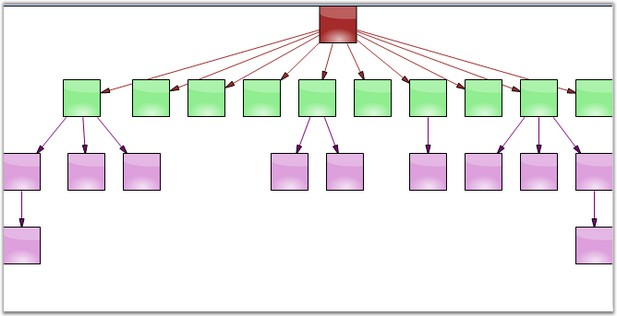
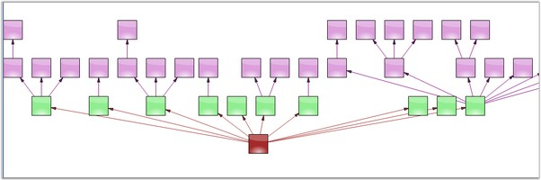

::: {style="DISPLAY: none"}
{#d2h_url_template}{#d2h_package_url style="WIDTH: 0px; DISPLAY: none; HEIGHT: 0px"}
:::

::: {.d2h_secondary_topic style="PADDING-BOTTOM: 10pt; MARGIN: 0pt; PADDING-LEFT: 0pt; PADDING-RIGHT: 0pt; PADDING-TOP: 0pt"}
#### Directed Tree Layout {#directed-tree-layout style="tab-stops: 0pt"}

[]{style="FONT-FAMILY: 'Trebuchet MS','sans-serif'; COLOR: #15428b; FONT-SIZE: 9pt"} 

The **DirectedTreeLayoutManager** implements a layout manager for arranging nodes in a tree-like structure. It includes the following parameters.

[]{style="FONT-FAMILY: 'Trebuchet MS','sans-serif'; COLOR: #15428b; FONT-SIZE: 9pt"} 

[·      ]{style="FONT-FAMILY: Symbol"}**Model**: specifies the Current Model

[·      ]{style="FONT-FAMILY: Symbol"}**RotationDegree**: specifies the angular orientation of the tree

[·      ]{style="FONT-FAMILY: Symbol"}**VerticalOffset**: specifies the vertical distance between adjacent nodes

[·      ]{style="FONT-FAMILY: Symbol"}**HorizontalOffset**: specifies the horizontal distance between adjacent nodes

[]{style="FONT-FAMILY: 'Trebuchet MS','sans-serif'; COLOR: #15428b; FONT-SIZE: 9pt"} 

The following code example illustrates how to create the DirectedTreeLayoutManager programmatically.

[]{style="FONT-FAMILY: 'Trebuchet MS','sans-serif'; COLOR: #15428b; FONT-SIZE: 9pt"} 

+---------------------------------------------------------------------------------------------------------------------------------------------------------------------------------------------------------------------------------------------------------+
| **[\[C#\]]{style="FONT-FAMILY: 'Courier New'"}**                                                                                                                                                                                                        |
|                                                                                                                                                                                                                                                         |
| []{style="FONT-FAMILY: 'Courier New'"}                                                                                                                                                                                                                  |
|                                                                                                                                                                                                                                                         |
| [this]{style="FONT-FAMILY: 'Courier New'; COLOR: blue"}[.DiagramWebControl1.LayoutManager = [new]{style="COLOR: blue"} DirectedTreeLayoutManager([this]{style="COLOR: blue"}.DiagramWebControl1.Model, 0, 20, 20);]{style="FONT-FAMILY: 'Courier New'"} |
+---------------------------------------------------------------------------------------------------------------------------------------------------------------------------------------------------------------------------------------------------------+

[]{style="FONT-FAMILY: 'Trebuchet MS','sans-serif'; COLOR: #15428b; FONT-SIZE: 9pt"} 

{border="0"}

[]{style="FONT-FAMILY: 'Trebuchet MS','sans-serif'; COLOR: #15428b; FONT-SIZE: 9pt"} 

Figure 19: Top-to-Bottom Directed Tree Layout with Rotation Degree set to 0

**[]{style="FONT-FAMILY: 'Calibri','sans-serif'"}** 

{border="0"}

[]{style="FONT-FAMILY: 'Trebuchet MS','sans-serif'; COLOR: #15428b; FONT-SIZE: 9pt"} 

Figure 20: Bottom-to-Top Directed Tree Layout with Rotation Degree set to 180

[]{style="FONT-FAMILY: 'Trebuchet MS','sans-serif'; COLOR: #15428b; FONT-SIZE: 9pt"} 

**[See Also]{style="FONT-FAMILY: 'Trebuchet MS','sans-serif'; COLOR: #15428b"}**

[]{style="FONT-FAMILY: 'Trebuchet MS','sans-serif'; COLOR: #15428b; FONT-SIZE: 9pt"} 

[Table Layout]{.UGHyperlink}[, ]{.UGHyperlink}[Hierarchical Layout]{.UGHyperlink}[, ]{.UGHyperlink}[Graph Layout]{.UGHyperlink}[, ]{.UGHyperlink}[Subgraph Tree Layout]{.UGHyperlink}[, ]{.UGHyperlink}[Radial Tree Layout]{.UGHyperlink}[, ]{.UGHyperlink}[Symmetric Layout]{.UGHyperlink}[, ]{.UGHyperlink}[OrgChart Layout]{.UGHyperlink}[, ]{.UGHyperlink}[Updating the Layout]{.UGHyperlink}[]{.UGHyperlink}

[]{#related-topics}
:::
