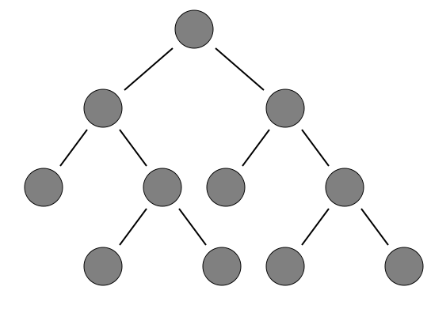

::: {style="DISPLAY: none"}
{#d2h_url_template}{#d2h_package_url style="WIDTH: 0px; DISPLAY: none; HEIGHT: 0px"}
:::

::::: {#nsbanner .d2h_main_nsbanner style="BORDER-BOTTOM: #999999 1px solid; POSITION: relative; PADDING-BOTTOM: 0px; BACKGROUND-COLOR: transparent; PADDING-LEFT: 0px; PADDING-RIGHT: 0px; DISPLAY: none; BORDER-TOP: #999999 1px solid; PADDING-TOP: 0px; LEFT: 0px"}
:::: {#TitleRow .d2h_main_titlerow style="PADDING-BOTTOM: 4px; BACKGROUND-COLOR: transparent; PADDING-LEFT: 22px; WIDTH: 100%; PADDING-RIGHT: 10px; DISPLAY: none; PADDING-TOP: 4px"}
::: {#ienav .d2h_main_ienav style="DISPLAY: none"}
{#D2HPrevious .D2HPreviousEnabled}  {#D2HNext .D2HNextEnabled}
:::
::::
:::::

:::: {#nstext .d2h_main_nstext style="PADDING-BOTTOM: 10px; BACKGROUND-COLOR: transparent; PADDING-LEFT: 22px; PADDING-RIGHT: 10px; HEIGHT: 100%; OVERFLOW: auto; PADDING-TOP: 5px" hasuserbackground="true" valign="bottom"}
::: {#d2h_breadcrumbs .d2h_breadcrumbs}
[Essential Studio User Guide Documentation](ms-xhelp:///?Id=12457748-09e3-4d74-a240-8e049cedf030){.d2h_breadcrumbsNormal}[ \> ]{.d2h_breadcrumbsLinkSeparator}[User Interface Edition](ms-xhelp:///?Id=c29296b7-531c-413b-a0ec-488ca1f7f669){.d2h_breadcrumbsNormal}[ \> ]{.d2h_breadcrumbsLinkSeparator}[Essential ASP.NET MVC](ms-xhelp:///?Id=4b14e7d1-65c4-4f67-b1aa-2c37709905a5){.d2h_breadcrumbsNormal}[ \> ]{.d2h_breadcrumbsLinkSeparator}[Essential Diagram]{.d2h_breadcrumbsContentsOnly}[ \> ]{.d2h_breadcrumbsLinkSeparator}[Concepts and Features](ms-xhelp:///?Id=04839cdf-94fc-4d24-9f6b-119fdbd7bbfb){.d2h_breadcrumbsNormal}[ \> ]{.d2h_breadcrumbsLinkSeparator}[Automatic Layout](ms-xhelp:///?Id=26208920-fb25-4f4d-926a-bd747f7329d7){.d2h_breadcrumbsNormal}
:::

### Directed Tree Layout {#directed-tree-layout style="MARGIN-BOTTOM: 12pt; tab-stops: 0pt"}

The directed tree layout automatically arranges nodes in a tree-like structure. This enables the user to position nodes in a tree-like fashion without specifying the coordinate location for each node.

This layout can be applied to any diagram that comprises a directed tree graph with unique root and child nodes. This makes creating diagrams easier because the node position is determined automatically, based on the connections. However, it is necessary to specify a layout root for the tree layout. The directed tree layout will position the nodes based on the layout root. 

Orientation

The layout manager lets you orient the tree in many directions and create sophisticated arrangements. The **Orientation** property of the **Diagram** model can be used to specify the tree orientation. 

[·      ]{style="FONT-FAMILY: Symbol"}**TopBottom**---Places the root node at the top and the child nodes are arranged below the root node.

[·      ]{style="FONT-FAMILY: Symbol"}**BottomTop**---Places the root node at the bottom and the child nodes are arranged above the root node.

[·      ]{style="FONT-FAMILY: Symbol"}**LeftRight**---Places the root node at the left and the child nodes are arranged on the right side of the root node.

[·      ]{style="FONT-FAMILY: Symbol"}**RightLeft**---Places the root node at the right and the child nodes are arranged on the left side of the root node.

The **RootOffsetX** and **RootOffsetY** properties can be used to specify the position of the root node based on which the entire tree gets generated. 

The following code shows how the automatic layout can be generated. 

 

1.   The **LayoutType** should be set to **DirectedTreeLayout**.

 

+----------------------------------------------------------------------------------------------------------------------------------------------------------------------------------------------------------------------------------------------------------------------------------------------------------------------------------------------------------------------+
| **[View]{style="FONT-FAMILY: 'Courier New'; FONT-SIZE: 11pt"}**                                                                                                                                                                                                                                                                                                      |
|                                                                                                                                                                                                                                                                                                                                                                      |
| [\<%]{style="FONT-FAMILY: 'Courier New'; BACKGROUND: yellow; FONT-SIZE: 11pt"}[{]{style="FONT-FAMILY: 'Courier New'; FONT-SIZE: 11pt"}                                                                                                                                                                                                                               |
|                                                                                                                                                                                                                                                                                                                                                                      |
| [      Html.Syncfusion().Diagram([\"DirectedTreeLayout\"]{style="COLOR: #a31515"})]{style="FONT-FAMILY: 'Courier New'; FONT-SIZE: 11pt"}                                                                                                                                                                                                                             |
|                                                                                                                                                                                                                                                                                                                                                                      |
| [          .LayoutType([LayoutType]{style="COLOR: #2b91af"}.DirectedTreeLayout)]{style="FONT-FAMILY: 'Courier New'; FONT-SIZE: 11pt"}                                                                                                                                                                                                                                |
|                                                                                                                                                                                                                                                                                                                                                                      |
| [          .Orientation([TreeOrientation]{style="COLOR: #2b91af"}.TopBottom)]{style="FONT-FAMILY: 'Courier New'; FONT-SIZE: 11pt"}                                                                                                                                                                                                                                   |
|                                                                                                                                                                                                                                                                                                                                                                      |
| [          .HorizontalSpacing(100)]{style="FONT-FAMILY: 'Courier New'; FONT-SIZE: 11pt"}                                                                                                                                                                                                                                                                             |
|                                                                                                                                                                                                                                                                                                                                                                      |
| [          .VerticalSpacing(50)]{style="FONT-FAMILY: 'Courier New'; FONT-SIZE: 11pt"}                                                                                                                                                                                                                                                                                |
|                                                                                                                                                                                                                                                                                                                                                                      |
| [          .SpaceBetweenSubTrees(30)]{style="FONT-FAMILY: 'Courier New'; FONT-SIZE: 11pt"}                                                                                                                                                                                                                                                                           |
|                                                                                                                                                                                                                                                                                                                                                                      |
| [          .RootOffsetX(400)]{style="FONT-FAMILY: 'Courier New'; FONT-SIZE: 11pt"}                                                                                                                                                                                                                                                                                   |
|                                                                                                                                                                                                                                                                                                                                                                      |
| [          .RootOffsetY(50)]{style="FONT-FAMILY: 'Courier New'; FONT-SIZE: 11pt"}                                                                                                                                                                                                                                                                                    |
|                                                                                                                                                                                                                                                                                                                                                                      |
| [           ]{style="FONT-FAMILY: 'Courier New'; COLOR: black"}[.DiagramMode(]{style="FONT-FAMILY: 'Courier New'; COLOR: black; FONT-SIZE: 11pt"}[DiagramMode]{style="FONT-FAMILY: 'Courier New'; COLOR: #2b91af; FONT-SIZE: 11pt"}[.SVG)]{style="FONT-FAMILY: 'Courier New'; COLOR: black; FONT-SIZE: 11pt"}[]{style="FONT-FAMILY: 'Courier New'; FONT-SIZE: 11pt"} |
|                                                                                                                                                                                                                                                                                                                                                                      |
| [          .Render();]{style="FONT-FAMILY: 'Courier New'; FONT-SIZE: 11pt"}                                                                                                                                                                                                                                                                                          |
|                                                                                                                                                                                                                                                                                                                                                                      |
| [  }]{style="FONT-FAMILY: 'Courier New'; FONT-SIZE: 11pt"}                                                                                                                                                                                                                                                                                                           |
|                                                                                                                                                                                                                                                                                                                                                                      |
| [%\>]{style="FONT-FAMILY: 'Courier New'; BACKGROUND: yellow; FONT-SIZE: 11pt"}[]{style="FONT-FAMILY: 'Courier New'; FONT-SIZE: 11pt"}                                                                                                                                                                                                                                |
+----------------------------------------------------------------------------------------------------------------------------------------------------------------------------------------------------------------------------------------------------------------------------------------------------------------------------------------------------------------------+

**Note:** If you want to create the diagram in the Canvas mode, change the **DiagramMode** to **Canvas**. By default the diagram is rendered in the SVG mode. 

 

2.   Then, the nodes are defined and the connections are made. 

 

+-------------------------------------------------------------------------------------------------------------------------------------------------------------------------------------------------------------------------------------------------------------------------+
| **[Controller]{style="FONT-FAMILY: 'Courier New'; FONT-SIZE: 11pt"}**[ ]{style="FONT-FAMILY: 'Courier New'; FONT-SIZE: 11pt"}                                                                                                                                           |
|                                                                                                                                                                                                                                                                         |
| [        DiagramPropertiesModel]{style="FONT-FAMILY: 'Courier New'; COLOR: #2b91af; FONT-SIZE: 11pt"}[ diagramModel = [new]{style="COLOR: blue"} [DiagramPropertiesModel]{style="COLOR: #2b91af"}() { };]{style="FONT-FAMILY: 'Courier New'; FONT-SIZE: 11pt"}          |
|                                                                                                                                                                                                                                                                         |
| [        [public]{style="COLOR: blue"} [ActionResult]{style="COLOR: #2b91af"} DirectedTreeLayout()]{style="FONT-FAMILY: 'Courier New'; FONT-SIZE: 11pt"}                                                                                                                |
|                                                                                                                                                                                                                                                                         |
| [        {]{style="FONT-FAMILY: 'Courier New'; FONT-SIZE: 11pt"}                                                                                                                                                                                                        |
|                                                                                                                                                                                                                                                                         |
| [            GetNodesConnectors(diagramModel);]{style="FONT-FAMILY: 'Courier New'; FONT-SIZE: 11pt"}                                                                                                                                                                    |
|                                                                                                                                                                                                                                                                         |
| [            diagramModel.Width = [Unit]{style="COLOR: #2b91af"}.Pixel(950);]{style="FONT-FAMILY: 'Courier New'; FONT-SIZE: 11pt"}                                                                                                                                      |
|                                                                                                                                                                                                                                                                         |
| [            diagramModel.Height = [Unit]{style="COLOR: #2b91af"}.Pixel(600);]{style="FONT-FAMILY: 'Courier New'; FONT-SIZE: 11pt"}                                                                                                                                     |
|                                                                                                                                                                                                                                                                         |
| [            ViewData\[[\"DirectedTreeLayout\"]{style="COLOR: #a31515"}\] = diagramModel;]{style="FONT-FAMILY: 'Courier New'; FONT-SIZE: 11pt"}                                                                                                                         |
|                                                                                                                                                                                                                                                                         |
| [            [return]{style="COLOR: blue"} View();]{style="FONT-FAMILY: 'Courier New'; FONT-SIZE: 11pt"}                                                                                                                                                                |
|                                                                                                                                                                                                                                                                         |
| [        }]{style="FONT-FAMILY: 'Courier New'; FONT-SIZE: 11pt"}                                                                                                                                                                                                        |
|                                                                                                                                                                                                                                                                         |
| [        \[[AcceptVerbs]{style="COLOR: #2b91af"}([HttpVerbs]{style="COLOR: #2b91af"}.Post)\]]{style="FONT-FAMILY: 'Courier New'; FONT-SIZE: 11pt"}                                                                                                                      |
|                                                                                                                                                                                                                                                                         |
| [        [public]{style="COLOR: blue"} [ActionResult]{style="COLOR: #2b91af"} DirectedTreeLayout([string]{style="COLOR: blue"} s)]{style="FONT-FAMILY: 'Courier New'; FONT-SIZE: 11pt"}                                                                                 |
|                                                                                                                                                                                                                                                                         |
| [        {]{style="FONT-FAMILY: 'Courier New'; FONT-SIZE: 11pt"}                                                                                                                                                                                                        |
|                                                                                                                                                                                                                                                                         |
| [            [return]{style="COLOR: blue"} null;]{style="FONT-FAMILY: 'Courier New'; FONT-SIZE: 11pt"}                                                                                                                                                                  |
|                                                                                                                                                                                                                                                                         |
| [        }]{style="FONT-FAMILY: 'Courier New'; FONT-SIZE: 11pt"}                                                                                                                                                                                                        |
|                                                                                                                                                                                                                                                                         |
| [        [private]{style="COLOR: blue"} [void]{style="COLOR: blue"} GetNodesConnectors([DiagramPropertiesModel]{style="COLOR: #2b91af"} diagramModel)]{style="FONT-FAMILY: 'Courier New'; FONT-SIZE: 11pt"}                                                             |
|                                                                                                                                                                                                                                                                         |
| [        {]{style="FONT-FAMILY: 'Courier New'; FONT-SIZE: 11pt"}                                                                                                                                                                                                        |
|                                                                                                                                                                                                                                                                         |
| [            [Node]{style="COLOR: #2b91af"} node1 = AddNode([\"Node1\"]{style="COLOR: #a31515"});]{style="FONT-FAMILY: 'Courier New'; FONT-SIZE: 11pt"}                                                                                                                 |
|                                                                                                                                                                                                                                                                         |
| [            [Node]{style="COLOR: #2b91af"} node2 = AddNode([\"Node2\"]{style="COLOR: #a31515"});]{style="FONT-FAMILY: 'Courier New'; FONT-SIZE: 11pt"}                                                                                                                 |
|                                                                                                                                                                                                                                                                         |
| [            [Node]{style="COLOR: #2b91af"} node3 = AddNode([\"Node3\"]{style="COLOR: #a31515"});]{style="FONT-FAMILY: 'Courier New'; FONT-SIZE: 11pt"}                                                                                                                 |
|                                                                                                                                                                                                                                                                         |
| [            [Node]{style="COLOR: #2b91af"} node4 = AddNode([\"Node4\"]{style="COLOR: #a31515"});]{style="FONT-FAMILY: 'Courier New'; FONT-SIZE: 11pt"}                                                                                                                 |
|                                                                                                                                                                                                                                                                         |
| [            [Node]{style="COLOR: #2b91af"} node5 = AddNode([\"Node5\"]{style="COLOR: #a31515"});]{style="FONT-FAMILY: 'Courier New'; FONT-SIZE: 11pt"}                                                                                                                 |
|                                                                                                                                                                                                                                                                         |
| [            [Node]{style="COLOR: #2b91af"} node6 = AddNode([\"Node6\"]{style="COLOR: #a31515"});]{style="FONT-FAMILY: 'Courier New'; FONT-SIZE: 11pt"}                                                                                                                 |
|                                                                                                                                                                                                                                                                         |
| [            [Node]{style="COLOR: #2b91af"} node7 = AddNode([\"Node7\"]{style="COLOR: #a31515"});]{style="FONT-FAMILY: 'Courier New'; FONT-SIZE: 11pt"}                                                                                                                 |
|                                                                                                                                                                                                                                                                         |
| [            [Node]{style="COLOR: #2b91af"} node8 = AddNode([\"Node8\"]{style="COLOR: #a31515"});]{style="FONT-FAMILY: 'Courier New'; FONT-SIZE: 11pt"}                                                                                                                 |
|                                                                                                                                                                                                                                                                         |
| [            [Node]{style="COLOR: #2b91af"} node9 = AddNode([\"Node9\"]{style="COLOR: #a31515"});]{style="FONT-FAMILY: 'Courier New'; FONT-SIZE: 11pt"}                                                                                                                 |
|                                                                                                                                                                                                                                                                         |
| [            [Node]{style="COLOR: #2b91af"} node10 = AddNode([\"Node10\"]{style="COLOR: #a31515"});]{style="FONT-FAMILY: 'Courier New'; FONT-SIZE: 11pt"}                                                                                                               |
|                                                                                                                                                                                                                                                                         |
| [            [Node]{style="COLOR: #2b91af"} node11 = AddNode([\"Node11\"]{style="COLOR: #a31515"});]{style="FONT-FAMILY: 'Courier New'; FONT-SIZE: 11pt"}                                                                                                               |
|                                                                                                                                                                                                                                                                         |
| []{style="FONT-FAMILY: 'Courier New'; FONT-SIZE: 11pt"}                                                                                                                                                                                                                 |
|                                                                                                                                                                                                                                                                         |
| [            [LineConnector]{style="COLOR: #2b91af"} line1 = AddConnector(node1, node2,[\"line1\"]{style="COLOR: #a31515"});]{style="FONT-FAMILY: 'Courier New'; FONT-SIZE: 11pt"}                                                                                      |
|                                                                                                                                                                                                                                                                         |
| [            [LineConnector]{style="COLOR: #2b91af"} line2 = AddConnector(node1, node3,[\"line2\"]{style="COLOR: #a31515"});]{style="FONT-FAMILY: 'Courier New'; FONT-SIZE: 11pt"}                                                                                      |
|                                                                                                                                                                                                                                                                         |
| [            [LineConnector]{style="COLOR: #2b91af"} line3 = AddConnector(node2, node4,[\"line3\"]{style="COLOR: #a31515"});]{style="FONT-FAMILY: 'Courier New'; FONT-SIZE: 11pt"}                                                                                      |
|                                                                                                                                                                                                                                                                         |
| [            [LineConnector]{style="COLOR: #2b91af"} line4 = AddConnector(node2, node5,[\"line4\"]{style="COLOR: #a31515"});]{style="FONT-FAMILY: 'Courier New'; FONT-SIZE: 11pt"}                                                                                      |
|                                                                                                                                                                                                                                                                         |
| [            [LineConnector]{style="COLOR: #2b91af"} line5 = AddConnector(node3, node6,[\"line5\"]{style="COLOR: #a31515"});]{style="FONT-FAMILY: 'Courier New'; FONT-SIZE: 11pt"}                                                                                      |
|                                                                                                                                                                                                                                                                         |
| [            [LineConnector]{style="COLOR: #2b91af"} line6 = AddConnector(node3, node7,[\"line6\"]{style="COLOR: #a31515"});]{style="FONT-FAMILY: 'Courier New'; FONT-SIZE: 11pt"}                                                                                      |
|                                                                                                                                                                                                                                                                         |
| [            [LineConnector]{style="COLOR: #2b91af"} line7 = AddConnector(node5, node8,[\"line7\"]{style="COLOR: #a31515"});]{style="FONT-FAMILY: 'Courier New'; FONT-SIZE: 11pt"}                                                                                      |
|                                                                                                                                                                                                                                                                         |
| [            [LineConnector]{style="COLOR: #2b91af"} line8 = AddConnector(node5, node9,[\"line8\"]{style="COLOR: #a31515"});]{style="FONT-FAMILY: 'Courier New'; FONT-SIZE: 11pt"}                                                                                      |
|                                                                                                                                                                                                                                                                         |
| [            [LineConnector]{style="COLOR: #2b91af"} line9 = AddConnector(node7, node10,[\"line9\"]{style="COLOR: #a31515"});]{style="FONT-FAMILY: 'Courier New'; FONT-SIZE: 11pt"}                                                                                     |
|                                                                                                                                                                                                                                                                         |
| [            [LineConnector]{style="COLOR: #2b91af"} line10 = AddConnector(node7, node11,[\"line10\"]{style="COLOR: #a31515"});]{style="FONT-FAMILY: 'Courier New'; FONT-SIZE: 11pt"}                                                                                   |
|                                                                                                                                                                                                                                                                         |
| [            diagramModel.Nodes = [new NodesCollection()]{style="COLOR: blue"}]{style="FONT-FAMILY: 'Courier New'; FONT-SIZE: 11pt"}                                                                                                                                    |
|                                                                                                                                                                                                                                                                         |
| [            {]{style="FONT-FAMILY: 'Courier New'; FONT-SIZE: 11pt"}                                                                                                                                                                                                    |
|                                                                                                                                                                                                                                                                         |
| [                node1,node2,node3,node4,node5,node6,node7,node8,node9,node10,node11]{style="FONT-FAMILY: 'Courier New'; FONT-SIZE: 11pt"}                                                                                                                              |
|                                                                                                                                                                                                                                                                         |
| [            };]{style="FONT-FAMILY: 'Courier New'; FONT-SIZE: 11pt"}                                                                                                                                                                                                   |
|                                                                                                                                                                                                                                                                         |
| [            diagramModel.Connectors = [new LinesCollection()]{style="COLOR: blue"}]{style="FONT-FAMILY: 'Courier New'; FONT-SIZE: 11pt"}                                                                                                                               |
|                                                                                                                                                                                                                                                                         |
| [            {]{style="FONT-FAMILY: 'Courier New'; FONT-SIZE: 11pt"}                                                                                                                                                                                                    |
|                                                                                                                                                                                                                                                                         |
| [                line1, line2, line3, line4, line5, line6,line7,line8,line9,line10]{style="FONT-FAMILY: 'Courier New'; FONT-SIZE: 11pt"}                                                                                                                                |
|                                                                                                                                                                                                                                                                         |
| [            };]{style="FONT-FAMILY: 'Courier New'; FONT-SIZE: 11pt"}                                                                                                                                                                                                   |
|                                                                                                                                                                                                                                                                         |
| [        }]{style="FONT-FAMILY: 'Courier New'; FONT-SIZE: 11pt"}                                                                                                                                                                                                        |
|                                                                                                                                                                                                                                                                         |
| [        [public]{style="COLOR: blue"} [Node]{style="COLOR: #2b91af"} AddNode([string]{style="COLOR: blue"} name)]{style="FONT-FAMILY: 'Courier New'; FONT-SIZE: 11pt"}                                                                                                 |
|                                                                                                                                                                                                                                                                         |
| [        {]{style="FONT-FAMILY: 'Courier New'; FONT-SIZE: 11pt"}                                                                                                                                                                                                        |
|                                                                                                                                                                                                                                                                         |
| [            [Node]{style="COLOR: #2b91af"} node = [new]{style="COLOR: blue"} [Node]{style="COLOR: #2b91af"}()]{style="FONT-FAMILY: 'Courier New'; FONT-SIZE: 11pt"}                                                                                                    |
|                                                                                                                                                                                                                                                                         |
| [            {]{style="FONT-FAMILY: 'Courier New'; FONT-SIZE: 11pt"}                                                                                                                                                                                                    |
|                                                                                                                                                                                                                                                                         |
| [                Name = name,]{style="FONT-FAMILY: 'Courier New'; FONT-SIZE: 11pt"}                                                                                                                                                                                     |
|                                                                                                                                                                                                                                                                         |
| [                LabelHorizontalAlignment = [Horizontal]{style="COLOR: #2b91af"}.Center,]{style="FONT-FAMILY: 'Courier New'; FONT-SIZE: 11pt"}                                                                                                                          |
|                                                                                                                                                                                                                                                                         |
| [                LabelVerticalAlignment = [Vertical]{style="COLOR: #2b91af"}.Middle,]{style="FONT-FAMILY: 'Courier New'; FONT-SIZE: 11pt"}                                                                                                                              |
|                                                                                                                                                                                                                                                                         |
| [                Shape = [Shapes]{style="COLOR: #2b91af"}.Ellipse,]{style="FONT-FAMILY: 'Courier New'; FONT-SIZE: 11pt"}                                                                                                                                                |
|                                                                                                                                                                                                                                                                         |
| [                Height = 50,]{style="FONT-FAMILY: 'Courier New'; FONT-SIZE: 11pt"}                                                                                                                                                                                     |
|                                                                                                                                                                                                                                                                         |
| [                Width = 50,]{style="FONT-FAMILY: 'Courier New'; FONT-SIZE: 11pt"}                                                                                                                                                                                      |
|                                                                                                                                                                                                                                                                         |
| [                BackgroundColor = [\"gray\"]{style="COLOR: #a31515"},]{style="FONT-FAMILY: 'Courier New'; FONT-SIZE: 11pt"}                                                                                                                                            |
|                                                                                                                                                                                                                                                                         |
| [                BorderColor = [\"black\"]{style="COLOR: #a31515"},]{style="FONT-FAMILY: 'Courier New'; FONT-SIZE: 11pt"}                                                                                                                                               |
|                                                                                                                                                                                                                                                                         |
| [                BorderWidth = 1,]{style="FONT-FAMILY: 'Courier New'; FONT-SIZE: 11pt"}                                                                                                                                                                                 |
|                                                                                                                                                                                                                                                                         |
| [            };]{style="FONT-FAMILY: 'Courier New'; FONT-SIZE: 11pt"}                                                                                                                                                                                                   |
|                                                                                                                                                                                                                                                                         |
| [            [return]{style="COLOR: blue"} node;]{style="FONT-FAMILY: 'Courier New'; FONT-SIZE: 11pt"}                                                                                                                                                                  |
|                                                                                                                                                                                                                                                                         |
| [        }]{style="FONT-FAMILY: 'Courier New'; FONT-SIZE: 11pt"}                                                                                                                                                                                                        |
|                                                                                                                                                                                                                                                                         |
| [        [public]{style="COLOR: blue"} [LineConnector]{style="COLOR: #2b91af"} AddConnector([Node]{style="COLOR: #2b91af"} headNode, [Node]{style="COLOR: #2b91af"} TailNode,[ string]{style="COLOR: blue"} name)]{style="FONT-FAMILY: 'Courier New'; FONT-SIZE: 11pt"} |
|                                                                                                                                                                                                                                                                         |
| [        {]{style="FONT-FAMILY: 'Courier New'; FONT-SIZE: 11pt"}                                                                                                                                                                                                        |
|                                                                                                                                                                                                                                                                         |
| [            [LineConnector]{style="COLOR: #2b91af"} lineConnector = [new]{style="COLOR: blue"} [LineConnector]{style="COLOR: #2b91af"}()]{style="FONT-FAMILY: 'Courier New'; FONT-SIZE: 11pt"}                                                                         |
|                                                                                                                                                                                                                                                                         |
| [            {]{style="FONT-FAMILY: 'Courier New'; FONT-SIZE: 11pt"}                                                                                                                                                                                                    |
|                                                                                                                                                                                                                                                                         |
| [                Name=name,]{style="FONT-FAMILY: 'Courier New'; FONT-SIZE: 11pt"}                                                                                                                                                                                       |
|                                                                                                                                                                                                                                                                         |
| [                HeadNode = headNode,]{style="FONT-FAMILY: 'Courier New'; FONT-SIZE: 11pt"}                                                                                                                                                                             |
|                                                                                                                                                                                                                                                                         |
| [                TailNode = tailNode,]{style="FONT-FAMILY: 'Courier New'; FONT-SIZE: 11pt"}                                                                                                                                                                             |
|                                                                                                                                                                                                                                                                         |
| [                ConnectorType = [ConnectorType]{style="COLOR: #2b91af"}.Straight,]{style="FONT-FAMILY: 'Courier New'; FONT-SIZE: 11pt"}                                                                                                                                |
|                                                                                                                                                                                                                                                                         |
| [                LineColor = [\"black\"]{style="COLOR: #a31515"},]{style="FONT-FAMILY: 'Courier New'; FONT-SIZE: 11pt"}                                                                                                                                                 |
|                                                                                                                                                                                                                                                                         |
| [                LineWidth = 2]{style="FONT-FAMILY: 'Courier New'; FONT-SIZE: 11pt"}                                                                                                                                                                                    |
|                                                                                                                                                                                                                                                                         |
| [            };]{style="FONT-FAMILY: 'Courier New'; FONT-SIZE: 11pt"}                                                                                                                                                                                                   |
|                                                                                                                                                                                                                                                                         |
| [            [return]{style="COLOR: blue"} lineConnector;]{style="FONT-FAMILY: 'Courier New'; FONT-SIZE: 11pt"}                                                                                                                                                         |
|                                                                                                                                                                                                                                                                         |
| [        }]{style="FONT-FAMILY: 'Courier New'; FONT-SIZE: 11pt"}                                                                                                                                                                                                        |
+-------------------------------------------------------------------------------------------------------------------------------------------------------------------------------------------------------------------------------------------------------------------------+

 

{border="0"}

Figure 118: Directed-Tree Layout

          * *

[]{#related-topics}
::::
