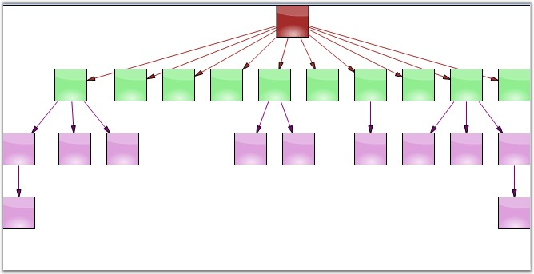
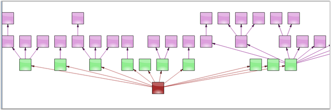
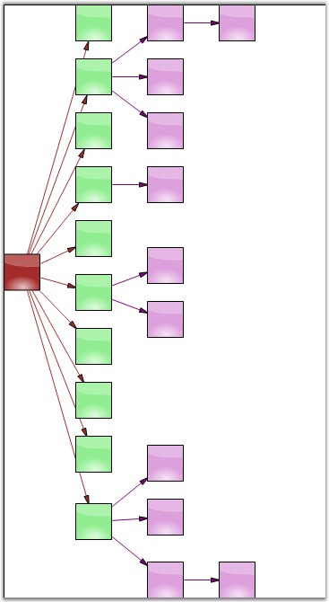
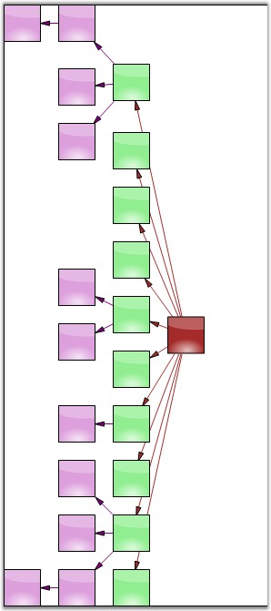

::: {style="DISPLAY: none"}
{#d2h_url_template}{#d2h_package_url style="WIDTH: 0px; DISPLAY: none; HEIGHT: 0px"}
:::

:::: {.d2h_secondary_topic style="PADDING-BOTTOM: 10pt; MARGIN: 0pt; PADDING-LEFT: 0pt; PADDING-RIGHT: 0pt; PADDING-TOP: 0pt"}
#### Directed Tree Layout Manager {#directed-tree-layout-manager style="tab-stops: 0pt"}

[]{style="FONT-FAMILY: 'Trebuchet MS','sans-serif'; COLOR: #15428b; FONT-SIZE: 9pt"} 

The Directed Tree Layout Manager implements a layout manager for arranging nodes in a tree-like structure. This Layout manager can be applied to any diagram that is composed of a directed tree graph with unique root and child nodes. The layout manager lets you orient the tree in any direction around the root and can be used for creating arrangements such as top-to-bottom vertical trees, bottom-to-top vertical trees, right-to-left horizontal trees, left-to-right horizontal trees, angular trees etc.

 

The **DirectedTreeLayoutManager** class is a subclass of the **GraphLayoutManager** and implements a layout manager for arranging nodes in a tree-like structure. The tree layout can be applied to any diagram that is composed as a directed tree graph with a unique root and child nodes. The layout manager lets you orient the tree in just about any direction around the root and can be used for creating arrangements such as top-to-bottom vertical trees, bottom-to-top vertical trees, right-to-left horizontal trees, left-to-right horizontal trees, angular trees and so on.

 

Graph orientation is determined by the rotation degree parameter while initializing the layout manager. A rotation degree of 0° specifies a top-to-bottom vertical tree while a rotation degree of 270° will result in a left-to-right horizontal tree layout.

 

The parameters to be defined for the DirectedTreeLayoutManager class are listed in the below table.

[]{style="FONT-FAMILY: 'Trebuchet MS','sans-serif'; COLOR: #15428b; FONT-SIZE: 9pt"} 

::: {align="center"}
  ------------------- ----------------------------------------------------------------------------------------------
  Property            Description
  Model               Represents the model of the diagram, which has to be displayed out as a directed tree.
  RotationAngle       Gets or sets the rotation angle for the graph. It accepts only integer values between 0-360.
  HorizontalSpacing   Holds the value for the horizontal offset between adjacent nodes (float value).
  VerticalSpacing     Holds the value for the vertical offset between adjacent nodes (float value).
  ------------------- ----------------------------------------------------------------------------------------------
:::

[]{style="FONT-FAMILY: 'Trebuchet MS','sans-serif'; COLOR: #15428b; FONT-SIZE: 9pt"} 

Programmatically, the directed tree layout manager instance is created with the respective arguments, assigned to the Layout Manager and updated as follows.

[]{style="FONT-FAMILY: 'Trebuchet MS','sans-serif'; COLOR: #15428b; FONT-SIZE: 9pt"} 

+-------------------------------------------------------------------------------------------------------------------------------------------------------------------+
| **[\[C#\]]{style="FONT-FAMILY: 'Courier New'; COLOR: black"}**                                                                                                    |
|                                                                                                                                                                   |
| []{style="FONT-FAMILY: 'Courier New'"}                                                                                                                            |
|                                                                                                                                                                   |
| [DirectedTreeLayoutManager directedLayout = [new]{style="COLOR: blue"}  DirectedTreeLayoutManager(diagram1.Model,0, 20, 20);]{style="FONT-FAMILY: 'Courier New'"} |
|                                                                                                                                                                   |
| [diagram1.LayoutManager = directedLayout;]{style="FONT-FAMILY: 'Courier New'"}                                                                                    |
|                                                                                                                                                                   |
| [diagram1.LayoutManager.UpdateLayout([null]{style="COLOR: blue"});]{style="FONT-FAMILY: 'Courier New'"}                                                           |
+-------------------------------------------------------------------------------------------------------------------------------------------------------------------+

[]{style="FONT-FAMILY: 'Courier New'"} 

+-------------------------------------------------------------------------------------------------------------------------------------------------------------------+
| **[\[VB\]]{style="FONT-FAMILY: 'Courier New'; COLOR: black"}**                                                                                                    |
|                                                                                                                                                                   |
| **[]{style="FONT-FAMILY: 'Courier New'; COLOR: black"}**                                                                                                          |
|                                                                                                                                                                   |
| [DirectedTreeLayoutManager directedLayout = [new]{style="COLOR: blue"}  DirectedTreeLayoutManager(diagram1.Model,0, 20, 20);]{style="FONT-FAMILY: 'Courier New'"} |
|                                                                                                                                                                   |
| [diagram1.LayoutManager = directedLayout;]{style="FONT-FAMILY: 'Courier New'"}                                                                                    |
|                                                                                                                                                                   |
| [diagram1.LayoutManager.UpdateLayout(null);]{style="FONT-FAMILY: 'Courier New'"}                                                                                  |
+-------------------------------------------------------------------------------------------------------------------------------------------------------------------+

**[]{style="FONT-FAMILY: 'Trebuchet MS','sans-serif'; COLOR: #15428b; FONT-SIZE: 9pt"}** 

Sample Diagrams are as follows.

**[]{style="FONT-FAMILY: 'Trebuchet MS','sans-serif'; COLOR: #15428b; FONT-SIZE: 9pt"}** 

{border="0"}

 

Figure 50: Top-to-Bottom Directed Tree Layout with 0 degree Rotation Angle

**[]{style="FONT-FAMILY: 'Trebuchet MS','sans-serif'; COLOR: #15428b; FONT-SIZE: 9pt"}** 

{border="0"}

**[]{style="FONT-FAMILY: 'Trebuchet MS','sans-serif'; COLOR: #15428b; FONT-SIZE: 9pt"}** 

Figure 51: Bottom-to-Top Directed Tree Layout with 180 degree Rotation Angle

**[]{style="FONT-FAMILY: 'Trebuchet MS','sans-serif'; COLOR: #15428b; FONT-SIZE: 9pt"}** 

{border="0"}

**[]{style="FONT-FAMILY: 'Trebuchet MS','sans-serif'; COLOR: #15428b; FONT-SIZE: 9pt"}** 

Figure 52: Left-to-Right with 270 degree Rotation Angle

**[]{style="FONT-FAMILY: 'Trebuchet MS','sans-serif'; COLOR: #15428b; FONT-SIZE: 9pt"}** 

{border="0"}

**[]{style="FONT-FAMILY: 'Trebuchet MS','sans-serif'; COLOR: #15428b; FONT-SIZE: 9pt"}** 

Figure 53: Right-to- Left with 90 degree Rotation Angle

 

[]{#p34} 

 

[]{#related-topics}
::::
