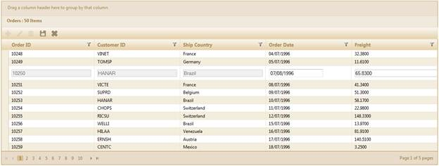

::: {style="DISPLAY: none"}
{#d2h_url_template}{#d2h_package_url style="WIDTH: 0px; DISPLAY: none; HEIGHT: 0px"}
:::

:::: {.d2h_secondary_topic style="PADDING-BOTTOM: 10pt; MARGIN: 0pt; PADDING-LEFT: 0pt; PADDING-RIGHT: 0pt; PADDING-TOP: 0pt"}
##### Disable Editing in Specified Columns {#disable-editing-in-specified-columns style="tab-stops: 0pt"}

 

Essential Grid provides support for restricting the editing operations in a column. This can be done by setting the **AllowEditing** property of particular columns to **False**.

[]{style="FONT-SIZE: 12pt"} 

1.   [Create a model in the application (Refer to]{.NumberedListChar} [Getting Started\>Adding a Model to the Application](http://help.syncfusion.com/ug_91/User%20Interface/ASP.NET%20MVC/Grid/Documents/addingamodeltotheapplication.htm)).

2.   [Create a strongly typed view (Refer to]{.NumberedListChar} [How to\>Strongly Typed View](http://help.syncfusion.com/ug_91/User%20Interface/ASP.NET%20MVC/Grid/Documents/stronglytypedview.htm)).

3.   Create the Grid control in the view and configure its properties.

4.   Set the **AllowEditing** property of a particular column to **False**.

[]{style="FONT-FAMILY: 'Times New Roman','serif'; FONT-SIZE: 12pt"} 

+--------------------------------------------------------------------------------------------------------------------------------------------------------------------------------------------------------------------------------------------------+
| **[View \[ASPX\]]{style="FONT-FAMILY: 'Courier New'"}**[ ]{style="FONT-FAMILY: 'Courier New'"}                                                                                                                                                   |
|                                                                                                                                                                                                                                                  |
| []{style="FONT-FAMILY: 'Courier New'; BACKGROUND: yellow"}                                                                                                                                                                                       |
|                                                                                                                                                                                                                                                  |
| [\<%]{style="FONT-FAMILY: 'Courier New'; BACKGROUND: yellow"}[=]{style="FONT-FAMILY: 'Courier New'; COLOR: blue"}[Html.Grid\<[EditableOrder]{style="COLOR: #2b91af"}\>([\"Grid1\"]{style="COLOR: #a31515"})]{style="FONT-FAMILY: 'Courier New'"} |
|                                                                                                                                                                                                                                                  |
| [    .Datasource(Model)]{style="FONT-FAMILY: 'Courier New'"}                                                                                                                                                                                     |
|                                                                                                                                                                                                                                                  |
| [    .Caption([\"Orders\"]{style="COLOR: #a31515"})]{style="FONT-FAMILY: 'Courier New'"}                                                                                                                                                         |
|                                                                                                                                                                                                                                                  |
| [    .Column(column =\>]{style="FONT-FAMILY: 'Courier New'"}                                                                                                                                                                                     |
|                                                                                                                                                                                                                                                  |
| [    {]{style="FONT-FAMILY: 'Courier New'"}                                                                                                                                                                                                      |
|                                                                                                                                                                                                                                                  |
| [      column.Add(p =\> p.OrderID).HeaderText([\"Order ID\"]{style="COLOR: #a31515"});]{style="FONT-FAMILY: 'Courier New'"}                                                                                                                      |
|                                                                                                                                                                                                                                                  |
| [      column.Add(p =\> p.CustomerID).HeaderText([\"Customer ID\"]{style="COLOR: #a31515"})**.AllowEditing([false]{style="COLOR: blue"})**;]{style="FONT-FAMILY: 'Courier New'"}                                                                 |
|                                                                                                                                                                                                                                                  |
| [      column.Add(p =\> p.ShipCountry).HeaderText([\"Ship Country\"]{style="COLOR: #a31515"})**.AllowEditing([false]{style="COLOR: blue"})**;]{style="FONT-FAMILY: 'Courier New'"}                                                               |
|                                                                                                                                                                                                                                                  |
| [      column.Add(p =\> p.OrderDate).HeaderText([\"Order Date\"]{style="COLOR: #a31515"}).Format([\"{OrderDate:dd/MM/yyyy}\"]{style="COLOR: #a31515"});]{style="FONT-FAMILY: 'Courier New'"}                                                     |
|                                                                                                                                                                                                                                                  |
| [      column.Add(p =\> p.Freight).HeaderText([\"Freight\"]{style="COLOR: #a31515"});]{style="FONT-FAMILY: 'Courier New'"}                                                                                                                       |
|                                                                                                                                                                                                                                                  |
| [                          ]{style="FONT-FAMILY: 'Courier New'"}                                                                                                                                                                                 |
|                                                                                                                                                                                                                                                  |
| [                            ]{style="FONT-FAMILY: 'Courier New'"}                                                                                                                                                                               |
|                                                                                                                                                                                                                                                  |
| [                         })]{style="FONT-FAMILY: 'Courier New'"}                                                                                                                                                                                |
|                                                                                                                                                                                                                                                  |
| [    [%\>]{style="BACKGROUND: yellow"}]{style="FONT-FAMILY: 'Courier New'"}[]{style="FONT-FAMILY: 'Times New Roman','serif'; FONT-SIZE: 12pt"}                                                                                                   |
+--------------------------------------------------------------------------------------------------------------------------------------------------------------------------------------------------------------------------------------------------+

[   ]{style="FONT-FAMILY: 'Times New Roman','serif'; FONT-SIZE: 12pt"}

+-----------------------------------------------------------------------------------------------------------------------------------------------------------------------------------------------+
| **[View \[cshtml\]]{style="FONT-FAMILY: 'Courier New'"}**[ ]{style="FONT-FAMILY: 'Courier New'"}                                                                                              |
|                                                                                                                                                                                               |
| [\@{]{style="FONT-FAMILY: 'Courier New'; BACKGROUND: yellow"}[ Html.Grid\<[EditableOrder]{style="COLOR: #2b91af"}\>([\"Grid1\"]{style="COLOR: #a31515"})]{style="FONT-FAMILY: 'Courier New'"} |
|                                                                                                                                                                                               |
| [    .Datasource(Model)]{style="FONT-FAMILY: 'Courier New'"}                                                                                                                                  |
|                                                                                                                                                                                               |
| [    .Caption([\"Orders\"]{style="COLOR: #a31515"})]{style="FONT-FAMILY: 'Courier New'"}                                                                                                      |
|                                                                                                                                                                                               |
| [    .Column(column =\>]{style="FONT-FAMILY: 'Courier New'"}                                                                                                                                  |
|                                                                                                                                                                                               |
| [    {]{style="FONT-FAMILY: 'Courier New'"}                                                                                                                                                   |
|                                                                                                                                                                                               |
| [      column.Add(p =\> p.OrderID).HeaderText([\"Order ID\"]{style="COLOR: #a31515"});]{style="FONT-FAMILY: 'Courier New'"}                                                                   |
|                                                                                                                                                                                               |
| [      column.Add(p =\> p.CustomerID).HeaderText([\"Customer ID\"]{style="COLOR: #a31515"})**.AllowEditing([false]{style="COLOR: blue"})**;]{style="FONT-FAMILY: 'Courier New'"}              |
|                                                                                                                                                                                               |
| [      column.Add(p =\> p.ShipCountry).HeaderText([\"Ship Country\"]{style="COLOR: #a31515"})**.AllowEditing([false]{style="COLOR: blue"})**;]{style="FONT-FAMILY: 'Courier New'"}            |
|                                                                                                                                                                                               |
| [      column.Add(p =\> p.OrderDate).HeaderText([\"Order Date\"]{style="COLOR: #a31515"}).Format([\"{OrderDate:dd/MM/yyyy}\"]{style="COLOR: #a31515"});]{style="FONT-FAMILY: 'Courier New'"}  |
|                                                                                                                                                                                               |
| [      column.Add(p =\> p.Freight).HeaderText([\"Freight\"]{style="COLOR: #a31515"})**;**]{style="FONT-FAMILY: 'Courier New'"}                                                                |
|                                                                                                                                                                                               |
| [                          ]{style="FONT-FAMILY: 'Courier New'"}                                                                                                                              |
|                                                                                                                                                                                               |
| [                            ]{style="FONT-FAMILY: 'Courier New'"}                                                                                                                            |
|                                                                                                                                                                                               |
| [                         })]{style="FONT-FAMILY: 'Courier New'"}                                                                                                                             |
|                                                                                                                                                                                               |
| []{style="FONT-FAMILY: 'Courier New'"}                                                                                                                                                        |
|                                                                                                                                                                                               |
| [                        .Render();]{style="FONT-FAMILY: 'Courier New'"}                                                                                                                      |
|                                                                                                                                                                                               |
| [}]{style="FONT-FAMILY: 'Courier New'; BACKGROUND: yellow"}[]{style="FONT-FAMILY: 'Courier New'"}                                                                                             |
|                                                                                                                                                                                               |
| **[]{style="FONT-FAMILY: 'Times New Roman','serif'; FONT-SIZE: 12pt"}**[]{style="FONT-FAMILY: Consolas; BACKGROUND: yellow; FONT-SIZE: 9.5pt"}                                                |
+-----------------------------------------------------------------------------------------------------------------------------------------------------------------------------------------------+

::: {style="BORDER-BOTTOM: windowtext 1pt solid; BORDER-LEFT: medium none; PADDING-BOTTOM: 1pt; MARGIN-TOP: 9pt; PADDING-LEFT: 0pt; PADDING-RIGHT: 0pt; MARGIN-BOTTOM: 9pt; BORDER-TOP: windowtext 1pt solid; BORDER-RIGHT: medium none; PADDING-TOP: 1pt"}
{border="0"}Note: In the code snippets, the "Customer ID" and "Ship Country" columns cannot be editable.
:::

5.   Render the view.

[]{style="FONT-FAMILY: 'Times New Roman','serif'; FONT-SIZE: 12pt"} 

+--------------------------------------------------------------------------------------------------------------------------------------------------------------------------------------------------------------------------------------------------------------------------------+
| **[Controller]{style="FONT-FAMILY: 'Courier New'"}**[]{style="FONT-FAMILY: 'Courier New'"}                                                                                                                                                                                     |
|                                                                                                                                                                                                                                                                                |
| [ ]{style="FONT-FAMILY: 'Times New Roman','serif'; FONT-SIZE: 12pt"}[        [public]{style="COLOR: blue"} [ActionResult]{style="COLOR: #2b91af"} Index()]{style="FONT-FAMILY: Consolas; FONT-SIZE: 9.5pt"}[]{style="FONT-FAMILY: 'Times New Roman','serif'; FONT-SIZE: 12pt"} |
|                                                                                                                                                                                                                                                                                |
| [        {]{style="FONT-FAMILY: Consolas; FONT-SIZE: 9.5pt"}[]{style="FONT-FAMILY: 'Times New Roman','serif'; FONT-SIZE: 12pt"}                                                                                                                                                |
|                                                                                                                                                                                                                                                                                |
| [           [var]{style="COLOR: blue"} data = [new]{style="COLOR: blue"} [NorthwindDataContext]{style="COLOR: #2b91af"}().Orders;]{style="FONT-FAMILY: Consolas; FONT-SIZE: 9.5pt"}                                                                                            |
|                                                                                                                                                                                                                                                                                |
| [            [return]{style="COLOR: blue"} View(data);]{style="FONT-FAMILY: Consolas; FONT-SIZE: 9.5pt"}[]{style="FONT-FAMILY: 'Times New Roman','serif'; FONT-SIZE: 9.5pt"}                                                                                                   |
|                                                                                                                                                                                                                                                                                |
| [        }]{style="FONT-FAMILY: Consolas; FONT-SIZE: 9.5pt"}[]{style="FONT-FAMILY: 'Times New Roman','serif'; FONT-SIZE: 12pt"}                                                                                                                                                |
+--------------------------------------------------------------------------------------------------------------------------------------------------------------------------------------------------------------------------------------------------------------------------------+

 

6.   Run the application and edit the particular record. The grid will appear as shown below.

 

{border="0"}

Figure 145: Grid Columns with Editing Disabled

 

[]{#related-topics}
::::
