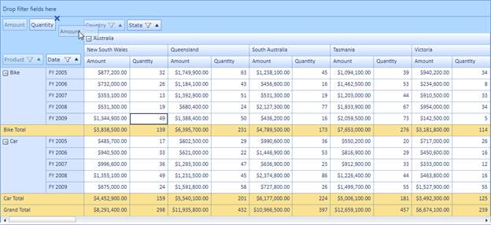

::: {style="DISPLAY: none"}
{#d2h_url_template}{#d2h_package_url style="WIDTH: 0px; DISPLAY: none; HEIGHT: 0px"}
:::

::::: {#nsbanner .d2h_main_nsbanner style="BORDER-BOTTOM: #999999 1px solid; POSITION: relative; PADDING-BOTTOM: 0px; BACKGROUND-COLOR: transparent; PADDING-LEFT: 0px; PADDING-RIGHT: 0px; DISPLAY: none; BORDER-TOP: #999999 1px solid; PADDING-TOP: 0px; LEFT: 0px"}
:::: {#TitleRow .d2h_main_titlerow style="PADDING-BOTTOM: 4px; BACKGROUND-COLOR: transparent; PADDING-LEFT: 22px; WIDTH: 100%; PADDING-RIGHT: 10px; DISPLAY: none; PADDING-TOP: 4px"}
::: {#ienav .d2h_main_ienav style="DISPLAY: none"}
{#D2HPrevious .D2HPreviousEnabled}  {#D2HNext .D2HNextEnabled}
:::
::::
:::::

::::: {#nstext .d2h_main_nstext style="PADDING-BOTTOM: 10px; BACKGROUND-COLOR: transparent; PADDING-LEFT: 22px; PADDING-RIGHT: 10px; HEIGHT: 100%; OVERFLOW: auto; PADDING-TOP: 5px" hasuserbackground="true" valign="bottom"}
::: {#d2h_breadcrumbs .d2h_breadcrumbs}
[Essential Studio User Guide Documentation](ms-xhelp:///?Id=12457748-09e3-4d74-a240-8e049cedf030){.d2h_breadcrumbsNormal}[ \> ]{.d2h_breadcrumbsLinkSeparator}[Business Intelligence Edition](ms-xhelp:///?Id=fdf33dd8-62b2-47b9-ad7b-fc50e590bca5){.d2h_breadcrumbsNormal}[ \> ]{.d2h_breadcrumbsLinkSeparator}[Essential BI Silverlight](ms-xhelp:///?Id=c006b39c-6aa2-4637-b7de-3e7b6cb3f9f9){.d2h_breadcrumbsNormal}[ \> ]{.d2h_breadcrumbsLinkSeparator}[Essential Pivot Grid]{.d2h_breadcrumbsContentsOnly}[ \> ]{.d2h_breadcrumbsLinkSeparator}[Features](ms-xhelp:///?Id=9d7968f1-d52c-4e79-a6ae-fb01305e9f98){.d2h_breadcrumbsNormal}[ \> ]{.d2h_breadcrumbsLinkSeparator}[Grouping Bar](ms-xhelp:///?Id=be44799a-6bdc-4871-82be-98807cc7faa0){.d2h_breadcrumbsNormal}
:::

### Disable Grouping by Specific Fields {#disable-grouping-by-specific-fields style="tab-stops: 0pt"}

This feature enables the user to restrict the drop of certain pivot items that has been dragged either from PivotSchemaDesigner or within pivot grid to the grouping bar at runtime.

Use Case Scenarios

This feature enables the user to restrict grouping for any specific field at runtime.

 

{border="0"}

Figure 23 Showing Disabled Background Color and Cross Icon for Grouping Disabled Items

Properties

Table 3: Properties Table

::: {align="center"}
+-----------------------------+-----------------------------------------------------------------------------------------------+-------------+-------------+------------------------------+
| Property                    | Description                                                                                   | Type        | Data Type   | Reference links              |
+-----------------------------+-----------------------------------------------------------------------------------------------+-------------+-------------+------------------------------+
| AllowRunTimeGroupByField    | Gets or sets the value to enable/disable grouping for PivotItem. The default value is true.   | CLR         | bool        | [- ]{style="COLOR: #c00000"} |
|                             |                                                                                               |             |             |                              |
|                             |                                                                                               |             |             |                              |
+-----------------------------+-----------------------------------------------------------------------------------------------+-------------+-------------+------------------------------+
| ShowDisabledGroupBackground | Enable/Disable Background color for the grouping disabled fields. The default value is false. | Dependency  | Bool        | [-]{style="COLOR: #c00000"}  |
|                             |                                                                                               |             |             |                              |
|                             |                                                                                               |             |             |                              |
+-----------------------------+-----------------------------------------------------------------------------------------------+-------------+-------------+------------------------------+
:::

[]{style="FONT-FAMILY: 'Calibri','sans-serif'; COLOR: black"} 

Sample Link

A sample has been provided in the following location:

***{InstalledLoction}:\\Users\\{User}AppData\\Local\\Syncfusion\\EssentialStudio\\{InstalledVersion}\\BI\\Silverlight\\PivotGrid.SL\\ProductShowcase\\GroupingBarDemo***

[]{style="BORDER-BOTTOM: black 1pt; BORDER-LEFT: black 1pt; PADDING-BOTTOM: 0pt; PADDING-LEFT: 0pt; LAYOUT-GRID-MODE: line; PADDING-RIGHT: 0pt; BACKGROUND: black; BORDER-TOP: black 1pt; BORDER-RIGHT: black 1pt; PADDING-TOP: 0pt"}[]{style="BORDER-BOTTOM: black 1pt; BORDER-LEFT: black 1pt; PADDING-BOTTOM: 0pt; PADDING-LEFT: 0pt; LAYOUT-GRID-MODE: line; PADDING-RIGHT: 0pt; BACKGROUND: black; BORDER-TOP: black 1pt; BORDER-RIGHT: black 1pt; PADDING-TOP: 0pt"} 

More:

[ ]{#related-topics}

[{border="0" align="absMiddle"}Adding Disable Grouping by Specific Fields to an Application](ms-xhelp:///?Id=30564526-c359-42d7-8080-8ca2cc0257a8){style="TEXT-DECORATION: none"}
:::::
