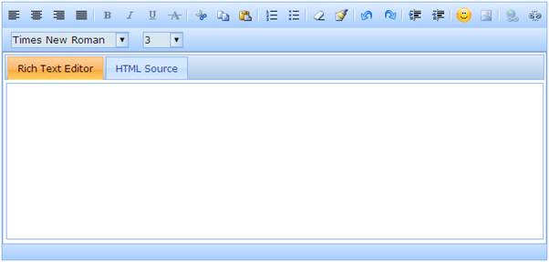

::: {style="DISPLAY: none"}
{#d2h_url_template}{#d2h_package_url style="WIDTH: 0px; DISPLAY: none; HEIGHT: 0px"}
:::

::: {.d2h_secondary_topic style="PADDING-BOTTOM: 10pt; MARGIN: 0pt; PADDING-LEFT: 0pt; PADDING-RIGHT: 0pt; PADDING-TOP: 0pt"}
#### Disabling toolbar items {#disabling-toolbar-items style="tab-stops: 0pt"}

 

Rich text editor supports disabling individual toolbar items so as to prevent the end-user to use the respective options.

 

Properties

 

+---------------------+----------------------------------------------------------------------------------------------------+------------------------------------------------------------------------------------------------------------------------+------------------------+----------------------------------+
| Name                | Description                                                                                        | Type of property                                                                                                       | Value it accepts       | Dependency                       |
+---------------------+----------------------------------------------------------------------------------------------------+------------------------------------------------------------------------------------------------------------------------+------------------------+----------------------------------+
| DisableToolbarItems | Sets the path of the folder within the application from which the image files has to be retrieved. | [List]{style="COLOR: #2b91af; FONT-SIZE: 9.5pt"}[\<[ToolbarItems]{style="COLOR: #2b91af"}\>]{style="FONT-SIZE: 9.5pt"} | List of toolbar items. | Requires ShowToolbar set to true |
|                     |                                                                                                    |                                                                                                                        |                        |                                  |
|                     |                                                                                                    |                                                                                                                        |                        |                                  |
+---------------------+----------------------------------------------------------------------------------------------------+------------------------------------------------------------------------------------------------------------------------+------------------------+----------------------------------+

 

Using Builder

 

The following steps explain how to disable individual toolbar items of the rich text editor through builder.

1.   In **View**, call the rich text editor helper, followed by the **DisableToolbarItem** method with list of toolbar items as:

**[]{style="FONT-FAMILY: 'Calibri','sans-serif'"}** 

+--------------------------------------------------------------------------------------------------------------------------------------------------------------------------------------------------------------------------------------------------------------------------------+
| **View\[ASPX\]**                                                                                                                                                                                                                                                               |
|                                                                                                                                                                                                                                                                                |
| [\<%]{style="FONT-FAMILY: Consolas; BACKGROUND: yellow; FONT-SIZE: 9.5pt"}[=]{style="FONT-FAMILY: Consolas; COLOR: blue; FONT-SIZE: 9.5pt"}[Html.Syncfusion().RichTextEditor([\"myRichtextEditor\"]{style="COLOR: #a31515"})]{style="FONT-FAMILY: Consolas; FONT-SIZE: 9.5pt"} |
|                                                                                                                                                                                                                                                                                |
| [.**DisableToolbarItems([new]{style="COLOR: blue"} [List]{style="COLOR: #2b91af"}\<[ToolbarItems]{style="COLOR: #2b91af"}\>{**]{style="FONT-FAMILY: Consolas; FONT-SIZE: 9.5pt"}                                                                                               |
|                                                                                                                                                                                                                                                                                |
| **[ToolbarItems]{style="FONT-FAMILY: Consolas; COLOR: #2b91af; FONT-SIZE: 9.5pt"}[.Bold,]{style="FONT-FAMILY: Consolas; FONT-SIZE: 9.5pt"}**                                                                                                                                   |
|                                                                                                                                                                                                                                                                                |
| **[ToolbarItems]{style="FONT-FAMILY: Consolas; COLOR: #2b91af; FONT-SIZE: 9.5pt"}[.Italic,]{style="FONT-FAMILY: Consolas; FONT-SIZE: 9.5pt"}**                                                                                                                                 |
|                                                                                                                                                                                                                                                                                |
| **[ToolbarItems]{style="FONT-FAMILY: Consolas; COLOR: #2b91af; FONT-SIZE: 9.5pt"}[.Underline,]{style="FONT-FAMILY: Consolas; FONT-SIZE: 9.5pt"}**                                                                                                                              |
|                                                                                                                                                                                                                                                                                |
| **[ToolbarItems]{style="FONT-FAMILY: Consolas; COLOR: #2b91af; FONT-SIZE: 9.5pt"}[.StrikeThrough })]{style="FONT-FAMILY: Consolas; FONT-SIZE: 9.5pt"}**[%\>]{style="FONT-FAMILY: Consolas; BACKGROUND: yellow; FONT-SIZE: 9.5pt"}                                              |
|                                                                                                                                                                                                                                                                                |
| []{style="FONT-FAMILY: Consolas; BACKGROUND: yellow; FONT-SIZE: 9.5pt"}                                                                                                                                                                                                        |
+--------------------------------------------------------------------------------------------------------------------------------------------------------------------------------------------------------------------------------------------------------------------------------+

 

**[]{style="FONT-FAMILY: 'Calibri','sans-serif'"}** 

+----------------------------------------------------------------------------------------------------------------------------------------------------------------------------------------------------------------------------------------------------------------------------------------------+
| **View\[cshtml\]**                                                                                                                                                                                                                                                                           |
|                                                                                                                                                                                                                                                                                              |
| [\@{]{style="FONT-FAMILY: Consolas; BACKGROUND: yellow; FONT-SIZE: 9.5pt"}[ Html.Syncfusion().RichTextEditor([\"myRichtextEditor\"]{style="COLOR: #a31515"})]{style="FONT-FAMILY: Consolas; FONT-SIZE: 9.5pt"}                                                                               |
|                                                                                                                                                                                                                                                                                              |
| [.**DisableToolbarItems([new]{style="COLOR: blue"} [List]{style="COLOR: #2b91af"}\<[ToolbarItems]{style="COLOR: #2b91af"}\>{**]{style="FONT-FAMILY: Consolas; FONT-SIZE: 9.5pt"}                                                                                                             |
|                                                                                                                                                                                                                                                                                              |
| **[ToolbarItems]{style="FONT-FAMILY: Consolas; COLOR: #2b91af; FONT-SIZE: 9.5pt"}[.Bold,]{style="FONT-FAMILY: Consolas; FONT-SIZE: 9.5pt"}**                                                                                                                                                 |
|                                                                                                                                                                                                                                                                                              |
| **[ToolbarItems]{style="FONT-FAMILY: Consolas; COLOR: #2b91af; FONT-SIZE: 9.5pt"}[.Italic,]{style="FONT-FAMILY: Consolas; FONT-SIZE: 9.5pt"}**                                                                                                                                               |
|                                                                                                                                                                                                                                                                                              |
| **[ToolbarItems]{style="FONT-FAMILY: Consolas; COLOR: #2b91af; FONT-SIZE: 9.5pt"}[.Underline,]{style="FONT-FAMILY: Consolas; FONT-SIZE: 9.5pt"}**                                                                                                                                            |
|                                                                                                                                                                                                                                                                                              |
| **[ToolbarItems]{style="FONT-FAMILY: Consolas; COLOR: #2b91af; FONT-SIZE: 9.5pt"}[.StrikeThrough })]{style="FONT-FAMILY: Consolas; FONT-SIZE: 9.5pt"}**[.Render();]{style="FONT-FAMILY: Consolas; FONT-SIZE: 9.5pt"}[}]{style="FONT-FAMILY: Consolas; BACKGROUND: yellow; FONT-SIZE: 9.5pt"} |
|                                                                                                                                                                                                                                                                                              |
| []{style="FONT-FAMILY: Consolas; BACKGROUND: yellow; FONT-SIZE: 9.5pt"}                                                                                                                                                                                                                      |
+----------------------------------------------------------------------------------------------------------------------------------------------------------------------------------------------------------------------------------------------------------------------------------------------+

 

2.   Build and run the application.

**[]{style="FONT-FAMILY: 'Calibri','sans-serif'; FONT-SIZE: 12pt"}** 

Using Properties Model

 

The following steps explain how to disable individual toolbar items of the rich text editor through properties model.

1.   In the Controller, create an instance of RichTextEditorModel, define the **DisableToolbarItems** property and pass the instance through **view-specific data** to the **view** as shown below:

**[]{style="FONT-FAMILY: 'Calibri','sans-serif'"}** 

+-----------------------------------------------------------------------------------------------------------------------------------------------------------------------------------------------------------------------------------------+
| **\[Controller\]**                                                                                                                                                                                                                      |
|                                                                                                                                                                                                                                         |
| [public]{style="FONT-FAMILY: Consolas; COLOR: blue; FONT-SIZE: 9.5pt"}[ [ActionResult]{style="COLOR: #2b91af"} Index()]{style="FONT-FAMILY: Consolas; FONT-SIZE: 9.5pt"}                                                                |
|                                                                                                                                                                                                                                         |
| [        {]{style="FONT-FAMILY: Consolas; FONT-SIZE: 9.5pt"}                                                                                                                                                                            |
|                                                                                                                                                                                                                                         |
| [            [RichTextEditorModel]{style="COLOR: #2b91af"} myModel = [new]{style="COLOR: blue"} [RichTextEditorModel]{style="COLOR: #2b91af"}();]{style="FONT-FAMILY: Consolas; FONT-SIZE: 9.5pt"}                                      |
|                                                                                                                                                                                                                                         |
| [            **myModel.DisableToolbarItems = [new]{style="COLOR: blue"} [List]{style="COLOR: #2b91af"}\<[ToolbarItems]{style="COLOR: #2b91af"}\> {** ]{style="FONT-FAMILY: Consolas; FONT-SIZE: 9.5pt"}                                 |
|                                                                                                                                                                                                                                         |
| **[                                                [ToolbarItems]{style="COLOR: #2b91af"}.Bold, ]{style="FONT-FAMILY: Consolas; FONT-SIZE: 9.5pt"}**                                                                                    |
|                                                                                                                                                                                                                                         |
| **[ToolbarItems]{style="FONT-FAMILY: Consolas; COLOR: #2b91af; FONT-SIZE: 9.5pt"}[.Italic,                                        [ToolbarItems]{style="COLOR: #2b91af"}.Underline,]{style="FONT-FAMILY: Consolas; FONT-SIZE: 9.5pt"}** |
|                                                                                                                                                                                                                                         |
| **[ToolbarItems]{style="FONT-FAMILY: Consolas; COLOR: #2b91af; FONT-SIZE: 9.5pt"}[.StrikeThrough };]{style="FONT-FAMILY: Consolas; FONT-SIZE: 9.5pt"}**                                                                                 |
|                                                                                                                                                                                                                                         |
| []{style="FONT-FAMILY: Consolas; FONT-SIZE: 9.5pt"}                                                                                                                                                                                     |
|                                                                                                                                                                                                                                         |
| [            [//pass the model through view data to the view]{style="COLOR: green"}]{style="FONT-FAMILY: Consolas; FONT-SIZE: 9.5pt"}                                                                                                   |
|                                                                                                                                                                                                                                         |
| [            ViewData\[[\"myRichTextEditor\"]{style="COLOR: #a31515"}\] = myModel; [return]{style="COLOR: blue"} View();]{style="FONT-FAMILY: Consolas; FONT-SIZE: 9.5pt"}                                                              |
|                                                                                                                                                                                                                                         |
| [        }]{style="FONT-FAMILY: Consolas; FONT-SIZE: 9.5pt"}                                                                                                                                                                            |
|                                                                                                                                                                                                                                         |
| []{style="FONT-FAMILY: Consolas; BACKGROUND: yellow; FONT-SIZE: 9.5pt"}                                                                                                                                                                 |
+-----------------------------------------------------------------------------------------------------------------------------------------------------------------------------------------------------------------------------------------+

[]{style="FONT-FAMILY: Consolas; FONT-SIZE: 9.5pt"} 

2.   In **View**, call the rich text editor helper passing the **view data** key as control id.

 

+-----------------------------------------------------------------------------------------------------------------------------------------------------------------------------------------------------------------------------------------------------------------------------------------------------------------+
| **View\[ASPX\]**                                                                                                                                                                                                                                                                                                |
|                                                                                                                                                                                                                                                                                                                 |
| [\<%]{style="FONT-FAMILY: Consolas; BACKGROUND: yellow; FONT-SIZE: 9.5pt"}[=]{style="FONT-FAMILY: Consolas; COLOR: blue; FONT-SIZE: 9.5pt"}[Html.Syncfusion().RichTextEditor([\"myRichtextEditor\"]{style="COLOR: #a31515"})[%\>]{style="BACKGROUND: yellow"}]{style="FONT-FAMILY: Consolas; FONT-SIZE: 9.5pt"} |
|                                                                                                                                                                                                                                                                                                                 |
| []{style="FONT-FAMILY: Consolas; BACKGROUND: yellow; FONT-SIZE: 9.5pt"}                                                                                                                                                                                                                                         |
+-----------------------------------------------------------------------------------------------------------------------------------------------------------------------------------------------------------------------------------------------------------------------------------------------------------------+

 

+---------------------------------------------------------------------------------------------------------------------------------------------------------------------------------------------------------------------------------------------------------+
| **View\[cshtml\]**                                                                                                                                                                                                                                      |
|                                                                                                                                                                                                                                                         |
| [\@{]{style="FONT-FAMILY: Consolas; BACKGROUND: yellow; FONT-SIZE: 9.5pt"}[ Html.Syncfusion().RichTextEditor([\"myRichtextEditor\"]{style="COLOR: #a31515"}).Render();[}]{style="BACKGROUND: yellow"}]{style="FONT-FAMILY: Consolas; FONT-SIZE: 9.5pt"} |
|                                                                                                                                                                                                                                                         |
| []{style="FONT-FAMILY: Consolas; BACKGROUND: yellow; FONT-SIZE: 9.5pt"}                                                                                                                                                                                 |
+---------------------------------------------------------------------------------------------------------------------------------------------------------------------------------------------------------------------------------------------------------+

[]{style="FONT-FAMILY: Consolas; BACKGROUND: yellow; FONT-SIZE: 9.5pt"} 

3.   Build and run the application.

The output is shown in the following screen shot.

 

{border="0"}

Figure 222: Rich text editor with font-style tools disabled

 

 

[]{#related-topics}
:::
