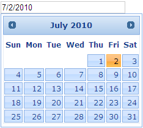

::: {style="DISPLAY: none"}
{#d2h_url_template}{#d2h_package_url style="WIDTH: 0px; DISPLAY: none; HEIGHT: 0px"}
:::

::: {.d2h_secondary_topic style="PADDING-BOTTOM: 10pt; MARGIN: 0pt; PADDING-LEFT: 0pt; PADDING-RIGHT: 0pt; PADDING-TOP: 0pt"}
#### Display conditions {#display-conditions style="tab-stops: 0pt"}

The following section guides you in defining the display conditions for the Date Picker.

 

Properties

+--------------------------+------------------------------------------------------------------+------------------------------------------------------------------------------------------------------+-------------------------------------------------------------+-------------+
| Name                     | Description                                                      | Type of property                                                                                     | Value it accepts                                            | Dependency  |
+==========================+==================================================================+======================================================================================================+=============================================================+=============+
| DefaultDate              | Used to define the selected date of the calendar on load         | [[struct]{style="COLOR: windowtext; TEXT-DECORATION: none; text-underline: none"}]{.UGHyperlink}     | [DateTime]{style="COLOR: #2b91af"}.MinValue                 | NA          |
|                          |                                                                  |                                                                                                      |                                                             |             |
|                          |                                                                  |                                                                                                      |  To [DateTime]{style="COLOR: #2b91af"}.MaxValue             |             |
|                          |                                                                  |                                                                                                      |                                                             |             |
|                          |                                                                  |                                                                                                      |                                                             |             |
+--------------------------+------------------------------------------------------------------+------------------------------------------------------------------------------------------------------+-------------------------------------------------------------+-------------+
| DisplayDefaultDateOnLoad | Used to define the minimum date, the calendar can navigate       | [[bool]{style="COLOR: windowtext; TEXT-DECORATION: none; text-underline: none"}]{.UGHyperlink}       | true/false                                                  | NA          |
|                          |                                                                  |                                                                                                      |                                                             |             |
|                          |                                                                  |                                                                                                      |                                                             |             |
+--------------------------+------------------------------------------------------------------+------------------------------------------------------------------------------------------------------+-------------------------------------------------------------+-------------+
| MonthNames               | Used to customize the name of the months displayed in the header | [[string]{style="COLOR: windowtext; TEXT-DECORATION: none; text-underline: none"}]{.UGHyperlink}\[\] | Array of strings of array length 12.[]{style="COLOR: blue"} | NA          |
|                          |                                                                  |                                                                                                      |                                                             |             |
|                          |                                                                  |                                                                                                      |                                                             |             |
+--------------------------+------------------------------------------------------------------+------------------------------------------------------------------------------------------------------+-------------------------------------------------------------+-------------+
| FirstDay                 | Used to define the first day of the week header to start with    | [[enum]{style="COLOR: windowtext; TEXT-DECORATION: none; text-underline: none"}]{.UGHyperlink}       | [DayOfWeek]{style="COLOR: #2b91af"}.Sunday,                 | NA          |
|                          |                                                                  |                                                                                                      |                                                             |             |
|                          |                                                                  |                                                                                                      | [DayOfWeek]{style="COLOR: #2b91af"}.Monday,                 |             |
|                          |                                                                  |                                                                                                      |                                                             |             |
|                          |                                                                  |                                                                                                      | [DayOfWeek]{style="COLOR: #2b91af"}.Tuesday,                |             |
|                          |                                                                  |                                                                                                      |                                                             |             |
|                          |                                                                  |                                                                                                      | [DayOfWeek]{style="COLOR: #2b91af"}.Wednesday,              |             |
|                          |                                                                  |                                                                                                      |                                                             |             |
|                          |                                                                  |                                                                                                      | [DayOfWeek]{style="COLOR: #2b91af"}.Thursday,               |             |
|                          |                                                                  |                                                                                                      |                                                             |             |
|                          |                                                                  |                                                                                                      | [DayOfWeek]{style="COLOR: #2b91af"}.Friday,                 |             |
|                          |                                                                  |                                                                                                      |                                                             |             |
|                          |                                                                  |                                                                                                      | [DayOfWeek]{style="COLOR: #2b91af"}.Saturday                |             |
+--------------------------+------------------------------------------------------------------+------------------------------------------------------------------------------------------------------+-------------------------------------------------------------+-------------+

*[[]{style="TEXT-DECORATION: none"}]{.underline}* 

Using Builder

The following section explains the seting of the default date for the Date Picker using Builder.

1.   In **View**, invoke the date picker helper followed by the the **DefaultDate** and **DispalyDefautlDateOnLoad** methods with the desired options as arguments.

[]{style="FONT-FAMILY: 'Calibri','sans-serif'"} 

+--------------------------------------------------------------------------------------------------------------------------------------------------------------------------------------------------------------------------------+
| **[View\[aspx\]]{style="FONT-FAMILY: 'Courier New'"}**                                                                                                                                                                         |
|                                                                                                                                                                                                                                |
| **[]{style="FONT-FAMILY: 'Courier New'"}**                                                                                                                                                                                     |
|                                                                                                                                                                                                                                |
| [\<%]{style="FONT-FAMILY: 'Courier New'; BACKGROUND: yellow"}[=]{style="FONT-FAMILY: 'Courier New'; COLOR: blue"}[Html.Syncfusion().DatePicker([\"myDatPicker\"]{style="COLOR: #a31515"})]{style="FONT-FAMILY: 'Courier New'"} |
|                                                                                                                                                                                                                                |
| [.**DefaultDate([DateTime]{style="COLOR: #2b91af"}.Now.AddDays(7))**]{style="FONT-FAMILY: 'Courier New'"}                                                                                                                      |
|                                                                                                                                                                                                                                |
| **[.DisplayDefaultDateOnLoad([true]{style="COLOR: blue"})]{style="FONT-FAMILY: 'Courier New'"}**[%\>]{style="FONT-FAMILY: 'Courier New'; BACKGROUND: yellow"}                                                                  |
|                                                                                                                                                                                                                                |
| []{style="FONT-FAMILY: 'Courier New'"}                                                                                                                                                                                         |
+--------------------------------------------------------------------------------------------------------------------------------------------------------------------------------------------------------------------------------+

 

[]{style="FONT-FAMILY: 'Calibri','sans-serif'"} 

+-----------------------------------------------------------------------------------------------------------------------------------------------------------------------------+
| **[View\[cshtml\]]{style="FONT-FAMILY: 'Courier New'"}**                                                                                                                    |
|                                                                                                                                                                             |
| **[]{style="FONT-FAMILY: 'Courier New'"}**                                                                                                                                  |
|                                                                                                                                                                             |
| [\@{]{style="FONT-FAMILY: 'Courier New'; BACKGROUND: yellow"}[ Html.Syncfusion().DatePicker([\"myDatPicker\"]{style="COLOR: #a31515"})]{style="FONT-FAMILY: 'Courier New'"} |
|                                                                                                                                                                             |
| [.**DefaultDate([DateTime]{style="COLOR: #2b91af"}.Now.AddDays(7))**]{style="FONT-FAMILY: 'Courier New'"}                                                                   |
|                                                                                                                                                                             |
| **[.DisplayDefaultDateOnLoad([true]{style="COLOR: blue"}).Render();]{style="FONT-FAMILY: 'Courier New'"}**[}]{style="FONT-FAMILY: 'Courier New'; BACKGROUND: yellow"}       |
|                                                                                                                                                                             |
| []{style="FONT-FAMILY: 'Courier New'"}                                                                                                                                      |
+-----------------------------------------------------------------------------------------------------------------------------------------------------------------------------+

 

 

 

2.   Build and run the application.

**[]{style="FONT-FAMILY: 'Calibri','sans-serif'; FONT-SIZE: 12pt"}** 

Using Properties Model

The following section explains the setting of the default date for the Date Picker using the Properties model.

1.   In the **Controller**, create an instance of the DatePickerModel, set the **DefaultDate** and **DispalyDefautlDateOnLoad** properties and pass the instance through **View Specific Data** to **View**, as shown below.**

*[[]{style="TEXT-DECORATION: none"}]{.underline}* 

+-------------------------------------------------------------------------------------------------------------------------------------------------------------------------------+
| **[\[Controller\]]{style="FONT-FAMILY: 'Courier New'"}**                                                                                                                      |
|                                                                                                                                                                               |
| [public]{style="FONT-FAMILY: 'Courier New'; COLOR: blue"}[ [ActionResult]{style="COLOR: #2b91af"} Index()]{style="FONT-FAMILY: 'Courier New'"}                                |
|                                                                                                                                                                               |
| [        {]{style="FONT-FAMILY: 'Courier New'"}                                                                                                                               |
|                                                                                                                                                                               |
| [            [//create an instance of DatePickerModel]{style="COLOR: green"}]{style="FONT-FAMILY: 'Courier New'"}                                                             |
|                                                                                                                                                                               |
| [            [DatePickerModel]{style="COLOR: #2b91af"} myModel = [new]{style="COLOR: blue"} [DatePickerModel]{style="COLOR: #2b91af"}();]{style="FONT-FAMILY: 'Courier New'"} |
|                                                                                                                                                                               |
| [            **myModel.DefaultDate = [DateTime]{style="COLOR: #2b91af"}.Now.AddDays(7);**]{style="FONT-FAMILY: 'Courier New'"}                                                |
|                                                                                                                                                                               |
| **[            myModel.DisplayDefaultDateOnLoad = [true]{style="COLOR: blue"};]{style="FONT-FAMILY: 'Courier New'"}**                                                         |
|                                                                                                                                                                               |
| []{style="FONT-FAMILY: 'Courier New'"}                                                                                                                                        |
|                                                                                                                                                                               |
| [            [//pass the instance through view data to the view]{style="COLOR: green"}]{style="FONT-FAMILY: 'Courier New'"}                                                   |
|                                                                                                                                                                               |
| [            ViewData\[[\"myDatePicker\"]{style="COLOR: #a31515"}\] = myModel;]{style="FONT-FAMILY: 'Courier New'"}                                                           |
|                                                                                                                                                                               |
| [            [return]{style="COLOR: blue"} View();]{style="FONT-FAMILY: 'Courier New'"}                                                                                       |
|                                                                                                                                                                               |
| [        }]{style="FONT-FAMILY: 'Courier New'"}                                                                                                                               |
|                                                                                                                                                                               |
| []{style="FONT-FAMILY: 'Courier New'"}                                                                                                                                        |
+-------------------------------------------------------------------------------------------------------------------------------------------------------------------------------+

*[[[]{style="TEXT-DECORATION: none"}]{style="FONT-FAMILY: 'Calibri','sans-serif'"}]{.underline}* 

[]{style="FONT-FAMILY: Consolas; FONT-SIZE: 9.5pt"} 

2.   In **View**, invoke the Date Picker helper with the **view data key** as the control ID.

 

+-------------------------------------------------------------------------------------------------------------------------------------------------------------------------------------------------------------------------------------------------------------------+
| **[View\[aspx\]]{style="FONT-FAMILY: 'Courier New'"}**                                                                                                                                                                                                            |
|                                                                                                                                                                                                                                                                   |
| **[]{style="FONT-FAMILY: 'Courier New'"}**                                                                                                                                                                                                                        |
|                                                                                                                                                                                                                                                                   |
| [\<%]{style="FONT-FAMILY: 'Courier New'; BACKGROUND: yellow"}[=]{style="FONT-FAMILY: 'Courier New'; COLOR: blue"}[Html.Syncfusion().DatePicker([\"myDatePicker\"]{style="COLOR: #a31515"}) [%\>]{style="BACKGROUND: yellow"}]{style="FONT-FAMILY: 'Courier New'"} |
|                                                                                                                                                                                                                                                                   |
| []{style="FONT-FAMILY: 'Courier New'"}                                                                                                                                                                                                                            |
+-------------------------------------------------------------------------------------------------------------------------------------------------------------------------------------------------------------------------------------------------------------------+

 

 

+---------------------------------------------------------------------------------------------------------------------------------------------------------------------------------------------------------------------------------------------------------------------------+
| **[View\[cshtml\]]{style="FONT-FAMILY: 'Courier New'"}**                                                                                                                                                                                                                  |
|                                                                                                                                                                                                                                                                           |
| **[]{style="FONT-FAMILY: 'Courier New'"}**                                                                                                                                                                                                                                |
|                                                                                                                                                                                                                                                                           |
| [\@{]{style="FONT-FAMILY: 'Courier New'; BACKGROUND: yellow"}[ ]{style="FONT-FAMILY: 'Courier New'; COLOR: blue"}[Html.Syncfusion().DatePicker([\"myDatePicker\"]{style="COLOR: #a31515"}).Render(); [}]{style="BACKGROUND: yellow"}]{style="FONT-FAMILY: 'Courier New'"} |
|                                                                                                                                                                                                                                                                           |
| []{style="FONT-FAMILY: 'Courier New'"}                                                                                                                                                                                                                                    |
+---------------------------------------------------------------------------------------------------------------------------------------------------------------------------------------------------------------------------------------------------------------------------+

 

[]{style="FONT-FAMILY: Consolas; FONT-SIZE: 9.5pt"} 

3.   Build and run the application.

 The Date Picker now renders the text box and the calendar is loaded with the defined date. The output is shown in the following screen shot.

 

{border="0"}

Figure 107: Date Picker with Default Date loaded

 

[]{#related-topics}
:::
