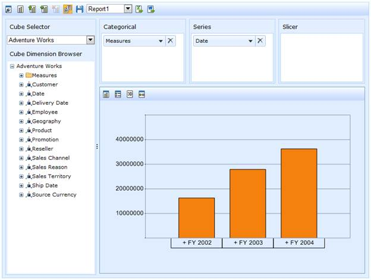
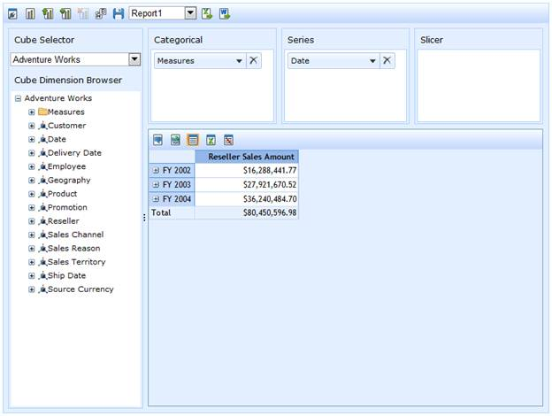
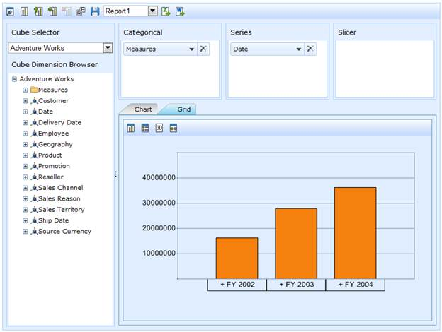

::: {style="DISPLAY: none"}
{#d2h_url_template}{#d2h_package_url style="WIDTH: 0px; DISPLAY: none; HEIGHT: 0px"}
:::

::::: {#nsbanner .d2h_main_nsbanner style="BORDER-BOTTOM: #999999 1px solid; POSITION: relative; PADDING-BOTTOM: 0px; BACKGROUND-COLOR: transparent; PADDING-LEFT: 0px; PADDING-RIGHT: 0px; DISPLAY: none; BORDER-TOP: #999999 1px solid; PADDING-TOP: 0px; LEFT: 0px"}
:::: {#TitleRow .d2h_main_titlerow style="PADDING-BOTTOM: 4px; BACKGROUND-COLOR: transparent; PADDING-LEFT: 22px; WIDTH: 100%; PADDING-RIGHT: 10px; DISPLAY: none; PADDING-TOP: 4px"}
::: {#ienav .d2h_main_ienav style="DISPLAY: none"}
{#D2HPrevious .D2HPreviousEnabled}  {#D2HNext .D2HNextEnabled}
:::
::::
:::::

::::: {#nstext .d2h_main_nstext style="PADDING-BOTTOM: 10px; BACKGROUND-COLOR: transparent; PADDING-LEFT: 22px; PADDING-RIGHT: 10px; HEIGHT: 100%; OVERFLOW: auto; PADDING-TOP: 5px" hasuserbackground="true" valign="bottom"}
::: {#d2h_breadcrumbs .d2h_breadcrumbs}
[Essential Studio User Guide Documentation](ms-xhelp:///?Id=12457748-09e3-4d74-a240-8e049cedf030){.d2h_breadcrumbsNormal}[ \> ]{.d2h_breadcrumbsLinkSeparator}[Business Intelligence Edition](ms-xhelp:///?Id=fdf33dd8-62b2-47b9-ad7b-fc50e590bca5){.d2h_breadcrumbsNormal}[ \> ]{.d2h_breadcrumbsLinkSeparator}[Essential BI ASP.NET](ms-xhelp:///?Id=99c6694e-59c3-4c59-abb5-ce9ce9a948bc){.d2h_breadcrumbsNormal}[ \> ]{.d2h_breadcrumbsLinkSeparator}[Essential BI Client]{.d2h_breadcrumbsContentsOnly}[ \> ]{.d2h_breadcrumbsLinkSeparator}[Concepts and Features](ms-xhelp:///?Id=01073408-6fb5-4943-a653-da9fd3358a53){.d2h_breadcrumbsNormal}
:::

## Display Mode {#display-mode style="tab-stops: 0pt"}

The display mode property enables the user to set only chart control or only grid control or both. The toolbar is altered according to the selection of the control.

Chart Only

The **ChartOnly** option displays only the chart control in OLAP Client along with its toolbar items.

+--------------------------------------------------------------------------------------------------------------------------------------------------------------------------+
| **[\[C#\]]{style="FONT-FAMILY: 'Courier New'"}**                                                                                                                         |
|                                                                                                                                                                          |
| [this]{style="FONT-FAMILY: 'Courier New'; COLOR: blue"}[.OlapClient1.DisplayMode = [DisplayMode]{style="COLOR: #2b91af"}.ChartOnly;]{style="FONT-FAMILY: 'Courier New'"} |
|                                                                                                                                                                          |
| [this]{style="FONT-FAMILY: 'Courier New'; COLOR: blue"}[.OlapClient1.DataBind();]{style="FONT-FAMILY: 'Courier New'"}                                                    |
+--------------------------------------------------------------------------------------------------------------------------------------------------------------------------+

 

+---------------------------------------------------------------------------------------------------------------------------------------------------------------------------------------------------------------------------------------------------------------------------------------------------------------------+
| **[\[VB\]]{style="FONT-FAMILY: 'Courier New'"}**                                                                                                                                                                                                                                                                    |
|                                                                                                                                                                                                                                                                                                                     |
| [Me]{style="FONT-FAMILY: 'Courier New'; COLOR: blue"}[.OlapClient1.DisplayMode = ]{style="FONT-FAMILY: 'Courier New'"}[DisplayMode]{style="FONT-FAMILY: 'Courier New'; COLOR: #2b91af"}[.]{style="FONT-FAMILY: 'Courier New'"}[ChartOnly]{style="FONT-FAMILY: 'Courier New'"}[]{style="FONT-FAMILY: 'Courier New'"} |
|                                                                                                                                                                                                                                                                                                                     |
| [Me]{style="FONT-FAMILY: 'Courier New'; COLOR: blue"}[.OlapClient1.DataBind()]{style="FONT-FAMILY: 'Courier New'"}**[]{style="FONT-FAMILY: 'Courier New'"}**                                                                                                                                                        |
+---------------------------------------------------------------------------------------------------------------------------------------------------------------------------------------------------------------------------------------------------------------------------------------------------------------------+

 

{border="0"}

 

Figure 41: Chart Only

Grid Only

The **GridOnly** option displays only the Grid control in OLAP Client along with its toolbar items.

+-------------------------------------------------------------------------------------------------------------------------------------------------------------------------+
| **[\[C#\]]{style="FONT-FAMILY: 'Courier New'"}**                                                                                                                        |
|                                                                                                                                                                         |
| [this]{style="FONT-FAMILY: 'Courier New'; COLOR: blue"}[.OlapClient1.DisplayMode = [DisplayMode]{style="COLOR: #2b91af"}.GridOnly;]{style="FONT-FAMILY: 'Courier New'"} |
|                                                                                                                                                                         |
| [this]{style="FONT-FAMILY: 'Courier New'; COLOR: blue"}[.OlapClient1.DataBind();]{style="FONT-FAMILY: 'Courier New'"}                                                   |
+-------------------------------------------------------------------------------------------------------------------------------------------------------------------------+

 

+--------------------------------------------------------------------------------------------------------------------------------------------------------------------------------------------------------------------------------------------------------------------------------------------------------------------+
| **[\[VB\]]{style="FONT-FAMILY: 'Courier New'"}**                                                                                                                                                                                                                                                                   |
|                                                                                                                                                                                                                                                                                                                    |
| [Me]{style="FONT-FAMILY: 'Courier New'; COLOR: blue"}[.OlapClient1.DisplayMode = ]{style="FONT-FAMILY: 'Courier New'"}[DisplayMode]{style="FONT-FAMILY: 'Courier New'; COLOR: #2b91af"}[.]{style="FONT-FAMILY: 'Courier New'"}[GridOnly]{style="FONT-FAMILY: 'Courier New'"}[]{style="FONT-FAMILY: 'Courier New'"} |
|                                                                                                                                                                                                                                                                                                                    |
| [Me]{style="FONT-FAMILY: 'Courier New'; COLOR: blue"}[.OlapClient1.DataBind()]{style="FONT-FAMILY: 'Courier New'"}**[]{style="FONT-FAMILY: 'Courier New'"}**                                                                                                                                                       |
+--------------------------------------------------------------------------------------------------------------------------------------------------------------------------------------------------------------------------------------------------------------------------------------------------------------------+

 

{border="0"}

 

Figure 42: Grid Only

ChartAndGrid

The **ChartAndGrid** option displays both chart and grid controls along with its toolbar items. In order to switch between the two controls, the appropriate tab is selected.

+-----------------------------------------------------------------------------------------------------------------------------------------------------------------------------+
| **[\[C#\]]{style="FONT-FAMILY: 'Courier New'"}**                                                                                                                            |
|                                                                                                                                                                             |
| [this]{style="FONT-FAMILY: 'Courier New'; COLOR: blue"}[.OlapClient1.DisplayMode = [DisplayMode]{style="COLOR: #2b91af"}.ChartAndGrid;]{style="FONT-FAMILY: 'Courier New'"} |
|                                                                                                                                                                             |
| [this]{style="FONT-FAMILY: 'Courier New'; COLOR: blue"}[.OlapClient1.DataBind();]{style="FONT-FAMILY: 'Courier New'"}                                                       |
+-----------------------------------------------------------------------------------------------------------------------------------------------------------------------------+

 

+------------------------------------------------------------------------------------------------------------------------------------------------------------------------------------------------------------------------------------------------------------------------------------------------------------------------+
| **[\[VB\]]{style="FONT-FAMILY: 'Courier New'"}**                                                                                                                                                                                                                                                                       |
|                                                                                                                                                                                                                                                                                                                        |
| [Me]{style="FONT-FAMILY: 'Courier New'; COLOR: blue"}[.OlapClient1.DisplayMode = ]{style="FONT-FAMILY: 'Courier New'"}[DisplayMode]{style="FONT-FAMILY: 'Courier New'; COLOR: #2b91af"}[.]{style="FONT-FAMILY: 'Courier New'"}[ChartAndGrid]{style="FONT-FAMILY: 'Courier New'"}[]{style="FONT-FAMILY: 'Courier New'"} |
|                                                                                                                                                                                                                                                                                                                        |
| [Me]{style="FONT-FAMILY: 'Courier New'; COLOR: blue"}[.OlapClient1.DataBind()]{style="FONT-FAMILY: 'Courier New'"}**[]{style="FONT-FAMILY: 'Courier New'"}**                                                                                                                                                           |
+------------------------------------------------------------------------------------------------------------------------------------------------------------------------------------------------------------------------------------------------------------------------------------------------------------------------+

 

{border="0"}

 

Figure 43: ChartAndGrid

 

Table 14: DisplayMode Property

::: {align="center"}
  ------------- -------------------------------------------------------------------------------------------------------------------------------------------------------------------------------------------------------------- ------------- ----------- ----------------
  Property      Description                                                                                                                                                                                                    Type          Data type   Reference link
  DisplayMode   The display mode consists of three options, namely ChartOnly, GridOnly and ChartAndGrid. These options would present OLAP Client with only a chart control or with only a grid control or both respectively.   Server side   enum        \-
  ------------- -------------------------------------------------------------------------------------------------------------------------------------------------------------------------------------------------------------- ------------- ----------- ----------------
:::

 

[]{#related-topics}
:::::
