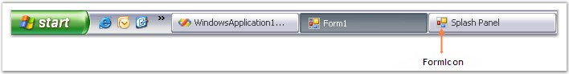

::: {style="DISPLAY: none"}
{#d2h_url_template}{#d2h_package_url style="WIDTH: 0px; DISPLAY: none; HEIGHT: 0px"}
:::

:::::::::: {.d2h_secondary_topic style="PADDING-BOTTOM: 10pt; MARGIN: 0pt; PADDING-LEFT: 0pt; PADDING-RIGHT: 0pt; PADDING-TOP: 0pt"}
##### Display Settings {#display-settings style="MARGIN-LEFT: 18pt; tab-stops: 18.0pt"}

[]{style="FONT-SIZE: 8pt"} 

The section illustrates the display settings available for the SplashPanel control.

[]{style="FONT-FAMILY: 'Verdana','sans-serif'; FONT-SIZE: 8pt"} 

The SplashPanel can be displayed or hidden according to the needs of the user. It can be displayed at any specified location. The display settings of the SplashPanel control are illustrated through the following methods.

[]{style="COLOR: #15428b"} 

::: {align="center"}
  ------------------ ------------------------------------------------------
  Methods            Description
  ShowSplash         Displays the SplashPanel.
  HideSplash         Hides the SplashPanel.
  ShowDialogSplash   Displays the SplashPanel as a modal dialog.
  IsShowing          Indicates whether the splash is currently displayed.
  ------------------ ------------------------------------------------------
:::

[]{style="COLOR: #4a5c8c; FONT-SIZE: 8pt"} 

::: {style="BORDER-BOTTOM: windowtext 1pt solid; BORDER-LEFT: medium none; PADDING-BOTTOM: 1pt; MARGIN: 9pt 0pt 9pt 18pt; PADDING-LEFT: 0pt; PADDING-RIGHT: 0pt; BORDER-TOP: windowtext 1pt solid; BORDER-RIGHT: medium none; PADDING-TOP: 1pt"}
[{border="0"}]{style="COLOR: #4a5c8c; FONT-SIZE: 8pt"} Note:[ ]{style="COLOR: black; FONT-SIZE: 8pt"}The time interval for which the SplashPanel is displayed can be customized using the [Time Interval]{.UGHyperlink} settings provided in the SplashPanel control.
:::

[]{style="COLOR: #15428b"} 

The above methods are explained below in detail.

 

**ShowSplash()** - This method is used to display the SplashPanel at run time.

 

The parameters discussed for the ShowSplash() method are as follows.

[]{style="COLOR: #15428b"} 

::: {align="center"}
  -------------- ------------------------------------------------------------------------------
  Parameters     Description
  Location       Indicates the point in screen coordinates. The value can be \'Point.Empty\'.
  OwnerForm      Indicates the form that will embed the splash form.
  DisableOwner   Indicates whether the owner form is to be disabled.
  -------------- ------------------------------------------------------------------------------
:::

 

When the SplashPanel is getting displayed, the owner form will be disabled when the DisableOwner parameter is passed as \'True\'. You can assign any form as the owner form.

 

The below code snippet will display the SplashPanel at the specified location with the owner form being disabled. The location will be effective only when the **DesktopAlignment** property is set as \'Custom\'.

[]{style="COLOR: #ff6600; FONT-SIZE: 8pt"} 

+----------------------------------------------------------------------------------------------------------------------------------------------------------------------------------------------------------------------------+
| **[\[C#\]]{style="FONT-FAMILY: 'Courier New'; COLOR: black"}**                                                                                                                                                             |
|                                                                                                                                                                                                                            |
| []{style="FONT-FAMILY: 'Courier New'; COLOR: #ff6600"}                                                                                                                                                                     |
|                                                                                                                                                                                                                            |
| [Form2]{style="FONT-FAMILY: 'Courier New'; COLOR: teal"}[ f2 = [new]{style="COLOR: blue"} [Form2]{style="COLOR: teal"}();]{style="FONT-FAMILY: 'Courier New'"}                                                             |
|                                                                                                                                                                                                                            |
| []{style="FONT-FAMILY: 'Courier New'"}                                                                                                                                                                                     |
|                                                                                                                                                                                                                            |
| [// To display the SplashPanel call the ShowSplash() method.]{style="FONT-FAMILY: 'Courier New'; COLOR: green"}                                                                                                            |
|                                                                                                                                                                                                                            |
| [this]{style="FONT-FAMILY: 'Courier New'; COLOR: blue"}[.splashPanel1.ShowSplash([new]{style="COLOR: blue"} [Point]{style="COLOR: teal"}(100, 100), f2, [true]{style="COLOR: blue"});]{style="FONT-FAMILY: 'Courier New'"} |
+----------------------------------------------------------------------------------------------------------------------------------------------------------------------------------------------------------------------------+

[]{style="COLOR: #ff6600; FONT-SIZE: 8pt"} 

+-------------------------------------------------------------------------------------------------------------------------------------------------------------------------------------------------+
| **[\[VB.NET\]]{style="FONT-FAMILY: 'Courier New'; COLOR: black"}**                                                                                                                              |
|                                                                                                                                                                                                 |
| []{style="FONT-FAMILY: 'Courier New'; COLOR: green"}                                                                                                                                            |
|                                                                                                                                                                                                 |
| [Private]{style="FONT-FAMILY: 'Courier New'; COLOR: blue"}[ f2 [As]{style="COLOR: blue"} Form2 = [New]{style="COLOR: blue"} Form2]{style="FONT-FAMILY: 'Courier New'"}                          |
|                                                                                                                                                                                                 |
| []{style="FONT-FAMILY: 'Courier New'"}                                                                                                                                                          |
|                                                                                                                                                                                                 |
| [\' To display the SplashPanel call the ShowSplash() method.]{style="FONT-FAMILY: 'Courier New'; COLOR: green"}                                                                                 |
|                                                                                                                                                                                                 |
| [Me]{style="FONT-FAMILY: 'Courier New'; COLOR: blue"}[.splashPanel1.ShowSplash([New]{style="COLOR: blue"} Point(100,100), f2, [True]{style="COLOR: blue"})]{style="FONT-FAMILY: 'Courier New'"} |
+-------------------------------------------------------------------------------------------------------------------------------------------------------------------------------------------------+

[]{style="COLOR: #15428b"} 

[·      ]{style="FONT-FAMILY: Symbol"}**HideSplash()** - The SplashPanel can be hidden by calling this method at run time.

[]{style="COLOR: #ff6600; FONT-SIZE: 8pt"} 

+--------------------------------------------------------------------------------------------------------------------------+
| **[\[C#\]]{style="FONT-FAMILY: 'Courier New'; COLOR: black"}**                                                           |
|                                                                                                                          |
| **[]{style="FONT-FAMILY: 'Courier New'; COLOR: #ff6600"}**                                                               |
|                                                                                                                          |
| [// To hide the SplashPanel call the HideSplash() method.]{style="FONT-FAMILY: 'Courier New'; COLOR: green"}             |
|                                                                                                                          |
| [this]{style="FONT-FAMILY: 'Courier New'; COLOR: blue"}[.splashPanel1.HideSplash();]{style="FONT-FAMILY: 'Courier New'"} |
+--------------------------------------------------------------------------------------------------------------------------+

[]{style="COLOR: #ff6600; FONT-SIZE: 8pt"} 

+-----------------------------------------------------------------------------------------------------------------------+
| **[\[VB.NET\]]{style="FONT-FAMILY: 'Courier New'; COLOR: black"}**                                                    |
|                                                                                                                       |
| **[]{style="FONT-FAMILY: 'Courier New'; COLOR: #ff6600"}**                                                            |
|                                                                                                                       |
| [\' To hide the SplashPanel call the HideSplash() method.]{style="FONT-FAMILY: 'Courier New'; COLOR: green"}          |
|                                                                                                                       |
| [Me]{style="FONT-FAMILY: 'Courier New'; COLOR: blue"}[.splashPanel1.HideSplash()]{style="FONT-FAMILY: 'Courier New'"} |
+-----------------------------------------------------------------------------------------------------------------------+

[]{style="COLOR: #15428b"} 

[·      ]{style="FONT-FAMILY: Symbol"}**ShowSplashDialog()** - The method is used to display the SplashPanel as a modal dialog during run time.

 

When this method is called, the user will not be able to interact with the application until the SplashPanel is closed. This is the only difference between the ShowSplash() method and this method.

[]{style="COLOR: #15428b"} 

The parameters discussed for the method are as follows.

[]{style="COLOR: #15428b"} 

::: {align="center"}
  ------------ --------------------------------------------------------------------
  Parameters   Description
  OwnerForm    Represents the owner form.
  Location     Specifies the location at which the SplashPanel will be displayed.
  ------------ --------------------------------------------------------------------
:::

 

The SplashPanel will be displayed at the position / location specified in this method. By passing a new instance of the owner form to this method, we can display the SplashPanel as a modal dialog.

 

The below example uses a button click event to call this method. This method is overloaded.

[]{style="COLOR: #15428b"} 

+------------------------------------------------------------------------------------------------------------------------------------------------------------------------------------------------------------------------------------------------------------+
| **[\[C#\]]{style="FONT-FAMILY: 'Courier New'; COLOR: black"}**                                                                                                                                                                                             |
|                                                                                                                                                                                                                                                            |
| []{style="FONT-FAMILY: 'Courier New'; COLOR: #ff6600"}                                                                                                                                                                                                     |
|                                                                                                                                                                                                                                                            |
| [private]{style="FONT-FAMILY: 'Courier New'; COLOR: blue"}[ [void]{style="COLOR: blue"} button1_Click([object]{style="COLOR: blue"} sender, [EventArgs]{style="COLOR: teal"} e)]{style="FONT-FAMILY: 'Courier New'"}                                       |
|                                                                                                                                                                                                                                                            |
| [{]{style="FONT-FAMILY: 'Courier New'"}                                                                                                                                                                                                                    |
|                                                                                                                                                                                                                                                            |
| [this]{style="FONT-FAMILY: 'Courier New'; COLOR: blue"}[.splashPanel1.ShowDialogSplash([new]{style="COLOR: blue"} [Point]{style="COLOR: teal"}(700, 700), [new]{style="COLOR: blue"} [Form1]{style="COLOR: teal"}());]{style="FONT-FAMILY: 'Courier New'"} |
|                                                                                                                                                                                                                                                            |
| [}]{style="FONT-FAMILY: 'Courier New'"}                                                                                                                                                                                                                    |
+------------------------------------------------------------------------------------------------------------------------------------------------------------------------------------------------------------------------------------------------------------+

[]{style="COLOR: #ff6600; FONT-SIZE: 8pt"} 

+------------------------------------------------------------------------------------------------------------------------------------------------------------------------------------------------------------------------------------------------------------------------------------------------------------+
| **[\[VB.NET\]]{style="FONT-FAMILY: 'Courier New'; COLOR: black"}**                                                                                                                                                                                                                                         |
|                                                                                                                                                                                                                                                                                                            |
| []{style="FONT-FAMILY: 'Courier New'; COLOR: #ff6600"}                                                                                                                                                                                                                                                     |
|                                                                                                                                                                                                                                                                                                            |
| [Private]{style="FONT-FAMILY: 'Courier New'; COLOR: blue"}[ [Sub]{style="COLOR: blue"} button1_Click([ByVal]{style="COLOR: blue"} sender [As]{style="COLOR: blue"} [Object]{style="COLOR: blue"}, [ByVal]{style="COLOR: blue"} e [As]{style="COLOR: blue"} EventArgs)]{style="FONT-FAMILY: 'Courier New'"} |
|                                                                                                                                                                                                                                                                                                            |
| [Me]{style="FONT-FAMILY: 'Courier New'; COLOR: blue"}[.splashPanel1.ShowDialogSplash([New]{style="COLOR: blue"} Point(700, 700), [New]{style="COLOR: blue"} Form1())]{style="FONT-FAMILY: 'Courier New'"}                                                                                                  |
|                                                                                                                                                                                                                                                                                                            |
| [End]{style="FONT-FAMILY: 'Courier New'; COLOR: blue"}[ [Sub]{style="COLOR: blue"}]{style="FONT-FAMILY: 'Courier New'"}                                                                                                                                                                                    |
+------------------------------------------------------------------------------------------------------------------------------------------------------------------------------------------------------------------------------------------------------------------------------------------------------------+

 

This overloaded method passes the owner form as a parameter to this method.

[]{style="COLOR: #ff6600; FONT-SIZE: 8pt"} 

+----------------------------------------------------------------------------------------------------------------------------------------------------------------------------------------------------------------------+
| **[\[C#\]]{style="FONT-FAMILY: 'Courier New'; COLOR: black"}**                                                                                                                                                       |
|                                                                                                                                                                                                                      |
| []{style="FONT-FAMILY: 'Courier New'; COLOR: #ff6600"}                                                                                                                                                               |
|                                                                                                                                                                                                                      |
| [private]{style="FONT-FAMILY: 'Courier New'; COLOR: blue"}[ [void]{style="COLOR: blue"} button1_Click([object]{style="COLOR: blue"} sender, [EventArgs]{style="COLOR: teal"} e)]{style="FONT-FAMILY: 'Courier New'"} |
|                                                                                                                                                                                                                      |
| [{]{style="FONT-FAMILY: 'Courier New'"}                                                                                                                                                                              |
|                                                                                                                                                                                                                      |
| [this]{style="FONT-FAMILY: 'Courier New'; COLOR: blue"}[.splashPanel1.ShowDialogSplash([new]{style="COLOR: blue"} [Form1]{style="COLOR: teal"}());]{style="FONT-FAMILY: 'Courier New'"}                              |
|                                                                                                                                                                                                                      |
| [}]{style="FONT-FAMILY: 'Courier New'"}                                                                                                                                                                              |
+----------------------------------------------------------------------------------------------------------------------------------------------------------------------------------------------------------------------+

[]{style="COLOR: #ff6600; FONT-SIZE: 8pt"} 

+------------------------------------------------------------------------------------------------------------------------------------------------------------------------------------------------------------------------------------------------------------------------------------------------------------+
| **[\[VB.NET\]]{style="FONT-FAMILY: 'Courier New'; COLOR: black"}**                                                                                                                                                                                                                                         |
|                                                                                                                                                                                                                                                                                                            |
| []{style="FONT-FAMILY: 'Courier New'; COLOR: #ff6600"}                                                                                                                                                                                                                                                     |
|                                                                                                                                                                                                                                                                                                            |
| [Private]{style="FONT-FAMILY: 'Courier New'; COLOR: blue"}[ [Sub]{style="COLOR: blue"} button1_Click([ByVal]{style="COLOR: blue"} sender [As]{style="COLOR: blue"} [Object]{style="COLOR: blue"}, [ByVal]{style="COLOR: blue"} e [As]{style="COLOR: blue"} EventArgs)]{style="FONT-FAMILY: 'Courier New'"} |
|                                                                                                                                                                                                                                                                                                            |
| [Me]{style="FONT-FAMILY: 'Courier New'; COLOR: blue"}[.splashPanel1.ShowDialogSplash([New]{style="COLOR: blue"} Form1())]{style="FONT-FAMILY: 'Courier New'"}                                                                                                                                              |
|                                                                                                                                                                                                                                                                                                            |
| [End]{style="FONT-FAMILY: 'Courier New'; COLOR: blue"}[ [Sub]{style="COLOR: blue"}]{style="FONT-FAMILY: 'Courier New'"}                                                                                                                                                                                    |
+------------------------------------------------------------------------------------------------------------------------------------------------------------------------------------------------------------------------------------------------------------------------------------------------------------+

**[]{style="COLOR: #15428b"}** 

[·      ]{style="FONT-FAMILY: Symbol"}**IsShowing()** - This method will tell you whether the SplashPanel is currently displayed or not. This method returns \'True\' if the SplashPanel is displayed and \'False\' if it is not displayed.

 

You can call this method in a button click event and view the result in the output window as given below.

[]{style="COLOR: #15428b"} 

+------------------------------------------------------------------------------------------------------------------------------------------------------------------------------------------------------------------------+
| **[\[C#\]]{style="FONT-FAMILY: 'Courier New'; COLOR: black"}**                                                                                                                                                         |
|                                                                                                                                                                                                                        |
| []{style="FONT-FAMILY: 'Courier New'; COLOR: black"}                                                                                                                                                                   |
|                                                                                                                                                                                                                        |
| [// To know whether splash screen is showing]{style="FONT-FAMILY: 'Courier New'; COLOR: green"}                                                                                                                        |
|                                                                                                                                                                                                                        |
| [private]{style="FONT-FAMILY: 'Courier New'; COLOR: blue"}[ [void]{style="COLOR: blue"} button1_Click_1([object]{style="COLOR: blue"} sender, [EventArgs]{style="COLOR: teal"} e)]{style="FONT-FAMILY: 'Courier New'"} |
|                                                                                                                                                                                                                        |
| [{]{style="FONT-FAMILY: 'Courier New'"}                                                                                                                                                                                |
|                                                                                                                                                                                                                        |
| [this]{style="FONT-FAMILY: 'Courier New'; COLOR: blue"}[.splashPanel1.IsShowing();]{style="FONT-FAMILY: 'Courier New'"}                                                                                                |
|                                                                                                                                                                                                                        |
| [Console]{style="FONT-FAMILY: 'Courier New'; COLOR: teal"}[.Write([this]{style="COLOR: blue"}.splashPanel1.IsShowing());]{style="FONT-FAMILY: 'Courier New'"}                                                          |
|                                                                                                                                                                                                                        |
| [}]{style="FONT-FAMILY: 'Courier New'"}                                                                                                                                                                                |
+------------------------------------------------------------------------------------------------------------------------------------------------------------------------------------------------------------------------+

[]{style="COLOR: #ff6600; FONT-SIZE: 8pt"} 

+------------------------------------------------------------------------------------------------------------------------------------------------------------------------------------------------------------------------------------------------------------------------------------------------------------+
| **[\[VB.NET\]]{style="FONT-FAMILY: 'Courier New'; COLOR: black"}**                                                                                                                                                                                                                                         |
|                                                                                                                                                                                                                                                                                                            |
| []{style="FONT-FAMILY: 'Courier New'; COLOR: #ff6600"}                                                                                                                                                                                                                                                     |
|                                                                                                                                                                                                                                                                                                            |
| [\' To know whether splash screen is showing]{style="FONT-FAMILY: 'Courier New'; COLOR: green"}                                                                                                                                                                                                            |
|                                                                                                                                                                                                                                                                                                            |
| [Private]{style="FONT-FAMILY: 'Courier New'; COLOR: blue"}[ [Sub]{style="COLOR: blue"} button1_Click([ByVal]{style="COLOR: blue"} sender [As]{style="COLOR: blue"} [Object]{style="COLOR: blue"}, [ByVal]{style="COLOR: blue"} e [As]{style="COLOR: blue"} EventArgs)]{style="FONT-FAMILY: 'Courier New'"} |
|                                                                                                                                                                                                                                                                                                            |
| [Me]{style="FONT-FAMILY: 'Courier New'; COLOR: blue"}[.splashPanel1.IsShowing()]{style="FONT-FAMILY: 'Courier New'"}                                                                                                                                                                                       |
|                                                                                                                                                                                                                                                                                                            |
| [Console.Write([Me]{style="COLOR: blue"}.splashPanel1.IsShowing())]{style="FONT-FAMILY: 'Courier New'"}                                                                                                                                                                                                    |
|                                                                                                                                                                                                                                                                                                            |
| [End]{style="FONT-FAMILY: 'Courier New'; COLOR: blue"}[ [Sub]{style="COLOR: blue"}]{style="FONT-FAMILY: 'Courier New'"}                                                                                                                                                                                    |
+------------------------------------------------------------------------------------------------------------------------------------------------------------------------------------------------------------------------------------------------------------------------------------------------------------+

[]{style="FONT-SIZE: 8pt"} 

Location

[]{style="COLOR: #4a5c8c; FONT-SIZE: 8pt"} 

The location for displaying the splash window is specified using the property given below.

[]{style="COLOR: #15428b"} 

::: {align="center"}
  ---------------------- --------------------------------------------------------
  SplashPanel Property   Description
  DiscreetLocation       Gets / sets the location to display the splash window.
  ---------------------- --------------------------------------------------------
:::

 

A Sample which demonstrates the ShowSplash() and ShowSplashDialog() methods is available in the below sample installation path.

 

***..My Documents\\Syncfusion\\EssentialStudio\\Version Number\\Windows\\Tools.Windows\\Samples\\2.0\\Notification Package\\SplashPanel***

[]{style="COLOR: #15428b"} 

 

 

 

 

###### []{#_SplashPanel_in_TaskBar}3.7.3.3.1.1      SplashPanel in TaskBar {#splashpanel-in-taskbar style="MARGIN-LEFT: 18pt; tab-stops: 18.0pt"}

**[]{style="COLOR: #15428b"}** 

The SplashPanel can be displayed in the taskbar and it\'s appearance can be customized using the properties given below.

 

::: {align="center"}
  ---------------------- -------------------------------------------------------------
  SplashPanel Property   Description
  ShowInTaskBar          Specifies if the SplashPanel is to be shown in the taskbar.
  FormIcon               Gets / sets the icon for the SplashPanel.
  Text                   Specifies the text when displayed in the taskbar.
  ---------------------- -------------------------------------------------------------
:::

[]{style="COLOR: #15428b"} 

+----------------------------------------------------------------------------------------------------------------------------------------------------------------------------------------------------------------------------------------------------+
| **[\[C#\]]{style="FONT-FAMILY: 'Courier New'; COLOR: black"}**                                                                                                                                                                                     |
|                                                                                                                                                                                                                                                    |
| []{style="FONT-FAMILY: 'Courier New'; COLOR: black"}                                                                                                                                                                                               |
|                                                                                                                                                                                                                                                    |
| [this]{style="FONT-FAMILY: 'Courier New'; COLOR: blue"}[.splashPanel1.ShowInTaskbar = [true]{style="COLOR: blue"};]{style="FONT-FAMILY: 'Courier New'"}                                                                                            |
|                                                                                                                                                                                                                                                    |
| [this]{style="FONT-FAMILY: 'Courier New'; COLOR: blue"}[.splashControl1.FormIcon = ((System.Drawing.[Icon]{style="COLOR: teal"})(resources.GetObject([\"splashControl1.FormIcon\"]{style="COLOR: maroon"})));]{style="FONT-FAMILY: 'Courier New'"} |
|                                                                                                                                                                                                                                                    |
| [this]{style="FONT-FAMILY: 'Courier New'; COLOR: blue"}[.splashPanel1.Text = [\"Splash Panel\"]{style="COLOR: maroon"};]{style="FONT-FAMILY: 'Courier New'"}                                                                                       |
+----------------------------------------------------------------------------------------------------------------------------------------------------------------------------------------------------------------------------------------------------+

[]{style="COLOR: #15428b"} 

+-----------------------------------------------------------------------------------------------------------------------------------------------------------------------------------------------------------------------------------------------------------+
| **[\[VB.NET\]]{style="FONT-FAMILY: 'Courier New'; COLOR: black"}**                                                                                                                                                                                        |
|                                                                                                                                                                                                                                                           |
| []{style="FONT-FAMILY: 'Courier New'; COLOR: black"}                                                                                                                                                                                                      |
|                                                                                                                                                                                                                                                           |
| [Me]{style="FONT-FAMILY: 'Courier New'; COLOR: blue"}[.splashPanel1.ShowInTaskbar = [true]{style="COLOR: blue"}]{style="FONT-FAMILY: 'Courier New'"}                                                                                                      |
|                                                                                                                                                                                                                                                           |
| [Me]{style="FONT-FAMILY: 'Courier New'; COLOR: blue"}[.splashControl1.FormIcon = [DirectCast]{style="COLOR: blue"}((resources.GetObject([\"splashControl1.FormIcon\"]{style="COLOR: maroon"})), System.Drawing.Icon)]{style="FONT-FAMILY: 'Courier New'"} |
|                                                                                                                                                                                                                                                           |
| [Me]{style="FONT-FAMILY: 'Courier New'; COLOR: blue"}[.splashPanel1.Text = [\"Splash Panel\"]{style="COLOR: maroon"}]{style="FONT-FAMILY: 'Courier New'"}                                                                                                 |
+-----------------------------------------------------------------------------------------------------------------------------------------------------------------------------------------------------------------------------------------------------------+

[]{style="COLOR: #15428b"} 

{border="0"}

[]{style="COLOR: #15428b"} 

Figure 998: SplashPanel displayed in the TaskBar

 

 

 

 

###### 3.7.3.3.1.2      Time Interval {#time-interval style="MARGIN-LEFT: 18pt; tab-stops: 18.0pt"}

[]{style="FONT-SIZE: 8pt"} 

The SplashPanel is, by default, a timed display splash screen. The SplashPanel uses internally, a System.Windows.Forms.Timer, to automatically close the splash screen after the set interval is elapsed. This behavior can be changed by setting the TimerInterval property to -1.

[]{style="COLOR: #15428b"} 

::: {align="center"}
  ---------------------- --------------------------------------------------------------------------------------
  SplashPanel Property   Description
  TimerInterval          The time interval for which the splash screen should be displayed (in milliseconds).
  ---------------------- --------------------------------------------------------------------------------------
:::

[]{style="FONT-SIZE: 8pt"} 

The splash screen will be displayed for a specific time period and will then be closed.

[]{style="FONT-SIZE: 8pt"} 

+----------------------------------------------------------------------------------------------------------------------------------+
| **[\[C#\]]{style="FONT-FAMILY: 'Courier New'; COLOR: black"}**                                                                   |
|                                                                                                                                  |
| []{style="FONT-FAMILY: 'Courier New'; COLOR: black"}                                                                             |
|                                                                                                                                  |
| [this]{style="FONT-FAMILY: 'Courier New'; COLOR: blue"}[.splashPanel1.TimerInterval = 7000;]{style="FONT-FAMILY: 'Courier New'"} |
+----------------------------------------------------------------------------------------------------------------------------------+

[]{style="COLOR: #15428b"} 

+-------------------------------------------------------------------------------------------------------------------------------+
| **[\[VB.NET\]]{style="FONT-FAMILY: 'Courier New'; COLOR: black"}**                                                            |
|                                                                                                                               |
| []{style="FONT-FAMILY: 'Courier New'; COLOR: black"}                                                                          |
|                                                                                                                               |
| [Me]{style="FONT-FAMILY: 'Courier New'; COLOR: blue"}[.splashPanel1.TimerInterval = 7000]{style="FONT-FAMILY: 'Courier New'"} |
+-------------------------------------------------------------------------------------------------------------------------------+

 

 

 

 

[]{#related-topics}
::::::::::
